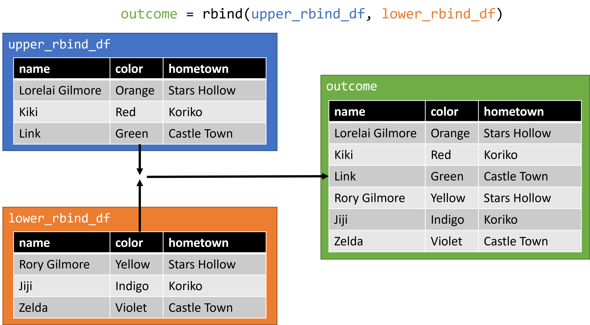
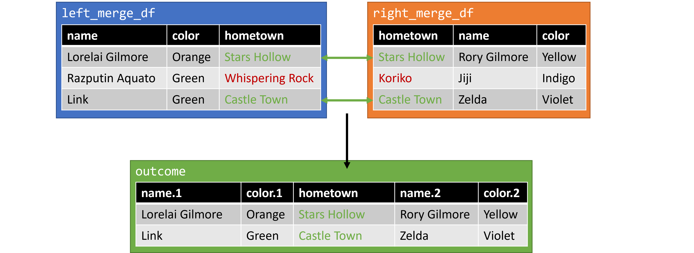
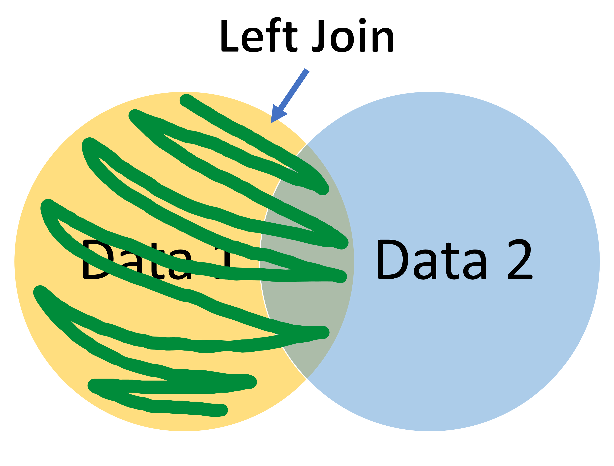
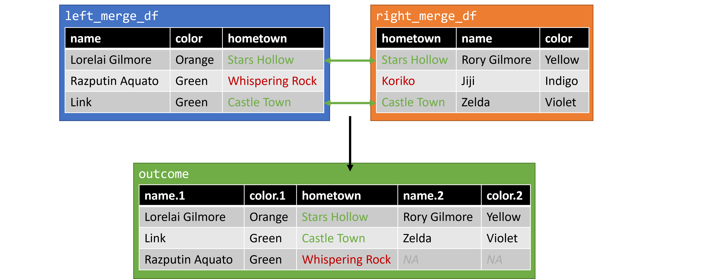

-   [Overview][]
-   [Problem Sets][]
    -   [1. Aggregation using `group_by()` and `summarise()`][]
    -   [2. Binding Dataframes][]
    -   [3. Merging Dataframes][]

## Overview

Aside from sub-setting, aggregating and merging data many be the most common task of a data scientist.

## Problem Sets

### 1. Aggregation using `group_by()` and `summarise()`

Often times we want to know how different categories in our data compare to each other. This comparison let's us get a sense if one group is in some way different than others, and potentially make decisions based on that difference. For a simple example, lets look at our class survey data.

``` r
survey = read.csv("https://raw.githubusercontent.com/Intro-to-Data-Science-Template/intro_to_data_science_reader/main/content/class_worksheets/4_r_rstudio/data/survey_data.csv")
```

If we `skim()` our data, we have quite a few variables we could group our cases by to make comparisons.

``` r
library(skimr)

skim(survey)
```

|                                                  |        |
|:-------------------------------------------------|:-------|
| Name                                             | survey |
| Number of rows                                   | 15     |
| Number of columns                                | 23     |
| \_\_\_\_\_\_\_\_\_\_\_\_\_\_\_\_\_\_\_\_\_\_\_   |        |
| Column type frequency:                           |        |
| character                                        | 14     |
| logical                                          | 6      |
| numeric                                          | 3      |
| \_\_\_\_\_\_\_\_\_\_\_\_\_\_\_\_\_\_\_\_\_\_\_\_ |        |
| Group variables                                  | None   |

Data summary

**Variable type: character**

| skim_variable | n_missing | complete_rate | min |  max | empty | n_unique | whitespace |
|:--------------|----------:|--------------:|----:|-----:|------:|---------:|-----------:|
| fav_char      |         0 |          1.00 |   4 |   39 |     0 |       15 |          0 |
| fav_color     |         1 |          0.93 |   3 |   50 |     0 |       10 |          0 |
| b_month       |         0 |          1.00 |   3 |    9 |     0 |        9 |          0 |
| pets          |         0 |          1.00 |   3 |   17 |     0 |        8 |          0 |
| fav_art       |         3 |          0.80 |  17 | 1158 |     0 |       12 |          0 |
| coffee_days   |         7 |          0.53 |   6 |   62 |     0 |        7 |          0 |
| tea_days      |        10 |          0.33 |   6 |   17 |     0 |        5 |          0 |
| soda.pop_days |         9 |          0.40 |   7 |   62 |     0 |        5 |          0 |
| juice_days    |         4 |          0.73 |   6 |   62 |     0 |        8 |          0 |
| none_days     |        10 |          0.33 |  17 |   45 |     0 |        5 |          0 |
| lt_location   |         3 |          0.80 |   7 |   47 |     0 |       12 |          0 |
| fict          |         0 |          1.00 |   7 |   11 |     0 |        2 |          0 |
| recreation    |         0 |          1.00 |  51 |  232 |     0 |       15 |          0 |
| key           |         0 |          1.00 |   6 |   41 |     0 |       15 |          0 |

**Variable type: logical**

| skim_variable   | n_missing | complete_rate | mean | count           |
|:----------------|----------:|--------------:|-----:|:----------------|
| major           |        15 |             0 |  NaN | :               |
| other_classes   |        15 |             0 |  NaN | :               |
| car             |         0 |             1 | 0.33 | FAL: 10, TRU: 5 |
| pineapple_pizza |         0 |             1 | 0.67 | TRU: 10, FAL: 5 |
| nerd            |         0 |             1 | 0.73 | TRU: 11, FAL: 4 |
| hotdog          |         0 |             1 | 0.47 | FAL: 8, TRU: 7  |

**Variable type: numeric**

| skim_variable | n_missing | complete_rate |  mean |    sd |  p0 | p25 | p50 |  p75 | p100 | hist  |
|:--------------|----------:|--------------:|------:|------:|----:|----:|----:|-----:|-----:|:------|
| fav_num       |         0 |             1 | 15.60 | 14.92 |   3 |   7 |   9 | 20.5 |   56 | ▇▁▂▁▁ |
| mint_choc     |         0 |             1 |  3.60 |  1.72 |   1 |   2 |   4 |  5.0 |    5 | ▅▁▁▃▇ |
| hours_sleep   |         0 |             1 |  6.87 |  0.74 |   6 |   6 |   7 |  7.0 |    8 | ▆▁▇▁▃ |

For now, let us explore if there is any difference between those that do and do not categorize a hot dog as a sandwich, given it nearly evenly splits the class. We ca do this using the `group_by()` function. In essence, we want to group our data by `TRUE` and `FALSE` in our `hotdog` column, and then perform some other analysis. We can direct that analysis using the `summarise()` function. For example:

``` r
library(dplyr)
```


    Attaching package: 'dplyr'

    The following objects are masked from 'package:stats':

        filter, lag

    The following objects are masked from 'package:base':

        intersect, setdiff, setequal, union

``` r
survey |>
  group_by(hotdog) |>
  summarise(sleep = mean(hours_sleep))
```

    # A tibble: 2 × 2
      hotdog sleep
      <lgl>  <dbl>
    1 FALSE   7.12
    2 TRUE    6.57

In this example, we take our `survey` data, pipe it to `group_by()` where we specific we want to group by hotdog status, then pipe that grouped data to `summarize()` where we say we want the mean of our `hours_sleep` column in an output called `sleep`. We can see in our example that those that do not consider a hot dog a sandwich, at least in our class, manage to get slightly more sleep on average.

<div class="question">

Try copying the format from our example, but group by birthday month, and get both the mean of `hours_sleep` and a table of `nerd`. Do you see any concerns with the output?

</div>

### 2. Binding Dataframes

To start, let's load in some data to practice our merging. Execute the following to create several dataframes we will use to practice.

``` r
source("https://raw.githubusercontent.com/Epsian/table_join_lecture/main/src/2_merge_examples.R")
```

#### Join Vertically using `rbind`

If you have two dataframes and want to combine them, you need to decide what direction you want to combine them in. If you would like to combine them vertically, or stack the rows on top of each other, you can use `rbind` or *row bind*. `rbind` is helpful if you have two dataframes with the same columns, and you want to combine the cases (rows). However, it will not work if the columns are different. `rbind` accepts an arbitrary number of dataframes, here we use two: `upper_rbind_df` and `lower_rbind_df`.

``` r
rbind_outcome = rbind(upper_rbind_df, lower_rbind_df) 
```

<figure>

<figcaption aria-hidden="true"><code>rbind</code> example 1</figcaption>
</figure>

<div class="question">

Try using `rbind` to combine our new `outcome` dataframe with `upper_rbind_df` again. Why does this work?

</div>

#### Join Horizontally using `cbind`

If you would like to combine two dataframes horizontally, so that you add more columns on to a dataframe, you can use `cbind` or *column bind*. The `cbind` function takes an arbitrary number of dataframes as it's arguments.

``` r
cbind_outcome = cbind(left_cbind_df, right_cbind_df) 
```

<figure>

<figcaption aria-hidden="true"><code>cbind</code> example 1</figcaption>
</figure>

We can see out new `outcome` dataframe was created as expected. This method can work, but you must be very confident about the structure of your data.

<div class="question">

Try using `cbind` to combine `left_cbind_df` with our `rbind_outcome` dataframe from above. What happens? Why is the result bad?

</div>

### 3. Merging Dataframes

`cbind` may work in some situations, but is very "brittle" -- or easy to break -- with any changes to the data. A more reliable method of merging makes use of a common *key* between two sources of data. Think of a *key* like a luggage tag on a suitcase: it's a small bit of information that clearly links to things, even if they are separated. In terms of data, a *key* can be anything, like a numerical ID or a string, but they must always be unique. Joins that use the key method will be familiar to anyone who has used SQL in the past, as they follow the same naming convention as in that language.

#### Inner Join

An *inner join* tries to join two sets of data using a common *key*, keeping only the data that exists in both of the original data sets. This is commonly illustrated using a venn diagram similar to the one below. Only the area highlighted with green will be included in the output.

<figure>

<figcaption aria-hidden="true">Inner Join - Venn Diagram</figcaption>
</figure>

In the context of our data, it might look something like the following if we use hometown as our key. We can use the following code to do an *inner merge* using dplyr's `inner_join()` function. `inner_join()` requires three arguments, `x` and `y`, which are the dataframes we would like to merge, and `by` which is the key we would like to join by. We will be using `left_merge_df` and `right_merge_df`, and asking R to use `hometown` as the key to join by.

``` r
library(dplyr)

inner_outcome = inner_join(x = left_merge_df, y = right_merge_df, by = "hometown") 
```

<figure>

<figcaption aria-hidden="true">Inner Join - Example Data</figcaption>
</figure>

Everything seems in order. We can see that when using an *inner join*, cases where **both** dataframes have a single row with our key will be matched and joined into a single output dataframe. However, if there are rows in **either** data frame without a match, those rows will be dropped from our data.

<div class="question">

Create a new dataframe using `rbind()` called `double_left` which binds two copies of `left_merge_df` on top of each other. Then perform an inner join with this new `double_left` and `right_merge_df`. What happens? What was the problem here?

</div>

#### Outer Join

An *Outer Join* is the opposite of an *inner join*. Rather than just looking for those rows which have a *key* in common, it will join every row, regardless of the *keys*, inserting blank values where there is no match. You can get a sense of this merge with the venn diagram below, where the green indicates good matches, while the orange indicates partial matches.

<figure>

<figcaption aria-hidden="true">Outer Join - Venn Diagram</figcaption>
</figure>

In the context of our data, an *outer join* may look something like the following, again using hometown as our key. The code for an *outer join* using dplyr is `full_join()`.

``` r
full_outcome = full_join(x = left_merge_df, y = right_merge_df, by = "hometown")
```

<figure>

<figcaption aria-hidden="true">Outer Join - Example Data</figcaption>
</figure>

In this example, we see that an *outer join* will keep all available cases, but we introduce `NA` values into the resulting dataframe where no match could be made. This may or may not be an issue depending on what your next steps are.

#### Left Join

A *left join* allows you to pick one of the two dataframes you are joining and prioritize it. It essentially takes all of the cases in the dataframe on the 'left' side, and searches in 'right' dataframe to join what it can. Keeping with the venn diagram representations, it would look like the following:

<figure>

<figcaption aria-hidden="true">Left Join - Venn Diagram</figcaption>
</figure>

Using our example data, a *left join* would look like this. The R code is similar to the previous examples, in this case it is `left_join()`. Recall that in the function call, `x` is the first dataframe, or the "left" one.

``` r
left_outcome = left_join(x = left_merge_df, y = right_merge_df, by = "hometown") 
```

<figure>

<figcaption aria-hidden="true">Left Join - Example Data</figcaption>
</figure>

We can see that while all of the data from our 'left' side is preserved, unmatched data on the 'right' is discarded. You can also technically do a *right join* using `right_join()`, which will do the same thing with sides reversed, but moving your prioritized data set to the left is more common.

<div class="question">

Try performing a right merge which creates the same outcome as our left merge above. Describe the differences. Why are these differences present?

</div>

  [Overview]: #overview
  [Problem Sets]: #problem-sets
  [1. Aggregation using `group_by()` and `summarise()`]: #aggregation-using-group_by-and-summarise
  [2. Binding Dataframes]: #binding-dataframes
  [3. Merging Dataframes]: #merging-dataframes
