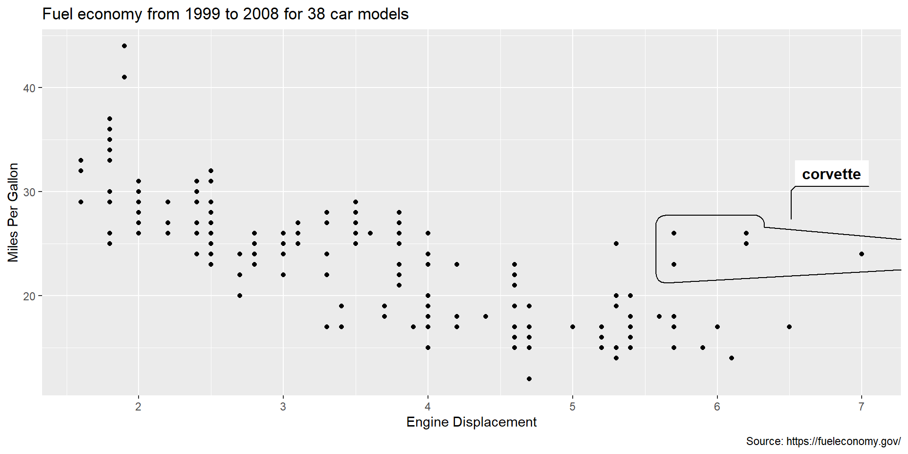

<script src="13_dyn_plot_files/libs/htmlwidgets-1.5.4/htmlwidgets.js"></script>
<script src="13_dyn_plot_files/libs/plotly-binding-4.10.0/plotly.js"></script>
<script src="13_dyn_plot_files/libs/typedarray-0.1/typedarray.min.js"></script>
<script src="13_dyn_plot_files/libs/jquery-3.5.1/jquery.min.js"></script>
<link href="13_dyn_plot_files/libs/crosstalk-1.2.0/css/crosstalk.min.css" rel="stylesheet" />
<script src="13_dyn_plot_files/libs/crosstalk-1.2.0/js/crosstalk.min.js"></script>
<link href="13_dyn_plot_files/libs/plotly-htmlwidgets-css-2.5.1/plotly-htmlwidgets.css" rel="stylesheet" />
<script src="13_dyn_plot_files/libs/plotly-main-2.5.1/plotly-latest.min.js"></script>


-   [Overview][]
-   [The Data][]
-   [Problem Sets][]
    -   [0. Make a Plot][]
    -   [1. Adding Labels to a ggplot][]
    -   [2. Isolating Elements][]
    -   [3. Make it Interactive][]
    -   [4. Make it Accessible][]

## Overview

We have now learned how to make some nicer looking plots, but there is still room for improvement. All plots should tell a story, and you can use specific elements to really draw a viewers attention to that story. Today I'll be showing a few tools to do that. You won't need everything you see today for every plot, but they are important tools to have in your toolbox. Note that while I will be using a scatter plot throughout the worksheet today, the same tricks can be applied to any kind of plot.

## The Data

Today we will be using data from the Environmental Protection Agency (EPA) [Fuel Economy data][]. It comes with the `ggplot2` package, and we can load it into the environment using the following (only *after* you have loaded `ggplot2`):

``` r
library(ggplot2)

mpg = data.frame(mpg)
```

Here is a rundown of what the variables are:

manufacturer
:   manufacturer name

model
:   model name

displ
:   engine displacement, in liters

year
:   year of manufacture

cyl
:   number of cylinders

trans
:   type of transmission

drv
:   the type of drive train, where f = front-wheel drive, r = rear wheel drive, 4 = 4wd

cty
:   city miles per gallon

hwy
:   highway miles per gallon

fl
:   fuel type

class
:   "type" of car

## Problem Sets

### 0. Make a Plot

Before we start making a fancy plot, we need a basic plot. I will provide the code for one here so everyone is starting from the same place.

``` r
ggplot(mpg) +
  aes(x = displ, y = hwy) +
  geom_point(size = 1.5) +
  labs(
    x = "Engine Displacement",
    y = "Highway MPG",
    title = "Highway MPG by Engine Size",
    caption = "Source: https://fueleconomy.gov/"
  ) +
  theme_minimal() +
  theme(plot.title = element_text(face = "bold"))
```


<div class="question">

We will be modifying this plot for the remainder of the worksheet. Make sure you understand all the parts!

</div>

### 1. Adding Labels to a ggplot

In plot terminology, labels are text we add to a plot to explain some element; we add labels to the axes for example. We can also add labels to the data itself if it will help us tell our story. It's easy to go too far though, so this is often used sparingly.

There are several methods to add labels, but I'm going to show you the most general one. We start by adding a new column to our dataframe, which we'll call `labels`.

<div class="question">

Add a new `labels` column to our `mpg` dataframe. For now, just copy the `model` column.

</div>

Let's see how we can incorporate these labels.

<div class="question">

Modify the plot above by adding a new argument to the `aes()` function called `label`, and provide it our new `labels` column. Then, add a new gemom, `geom_label()`, to the ggplot code. In the text geom, include the argument `vjust = -1` to move the labels a bit so they aren't right on top of our points (which makes them hard to read).

</div>

If all went according to plan, we should have labels! Not the nicest to look at though. We need to be selective about where we add our labels. Let's cut back a bit.

<div class="question">

Fill the `lables` column with `NA`s. Then, use sub-setting to add a label only for rows where the `class` is "midsize."

</div>

### 2. Isolating Elements

We're getting closer. Adding text to a plot can he helpful, but only for a small handful of points. If we want to highlight a whole group of points, some other method is typically more helpful. Let's try using color to highlight our midsize cars. We can do this by adding another layer on top of our current points, but only for those we want to highlight.

First we need to remove the `label` argument and text geom we added in the last section. Next, I add a new `geom_point()` below the one we already have. I'm going to highlight the cars in the data where the model is a "corvette" (a famous sports car). I also added a subtitle to explain the highlights. You can see the results below:

``` r
ggplot(mpg) +
  aes(x = displ, y = hwy) +
  geom_point(size = 1.5) +
  # This geom is new, and let's us highlight specific points
  geom_point(data = mpg[mpg$model == "corvette",], aes(x = displ, y = hwy), color = "red", size = 3) +
  labs(
    x = "Engine Displacement",
    y = "Highway MPG",
    title = "Highway MPG by Engine Size",
    # add subtitle to explain highlights
    subtitle = "Corvettes Highlighted in Red",
    caption = "Source: https://fueleconomy.gov/"
  ) +
  theme_minimal() +
  theme(plot.title = element_text(face = "bold"))
```


Now our plot highlights the corvettes in our data with a specific color! Let's go one step further and add a call-out for those highlights. Where before we were adding labels to specific data points, we can also arbitrarily add text as a new layer in ggplot using the `annotate()` function like the following:

``` r
ggplot(mpg) +
  aes(x = displ, y = hwy) +
  geom_point(size = 1.5) +
  # This geom is new, and let's us highlight specific points
  geom_point(data = mpg[mpg$model == "corvette",], aes(x = displ, y = hwy), color = "red", size = 3) +
  labs(
    x = "Engine Displacement",
    y = "Highway MPG",
    title = "Highway MPG by Engine Size",
    # add subtitle to explain highlights
    subtitle = "Corvettes Highlighted in Red",
    caption = "Source: https://fueleconomy.gov/"
  ) +
  # add annotation
  annotate(geom = "label", x = 6.25, y = 28, label = "Corvettes", color = "red") +
  theme_minimal() +
  theme(plot.title = element_text(face = "bold"))
```


Such call-outs can be a great way to help tell the story in your data. In this case we are showing how most cars follow a common trend, except these very high powered and unusual sports cars.

<div class="question">

Modify the code above to highlight and annotate another model of car.

</div>

### 3. Make it Interactive

Making an interactive plot can be a complex task, and often requires a mix of data science and web development skills. We are going to be taking the easier route and relying on our new-found ggplot capabilities. Using the `plotly` package in R, we can quickly turn ggplots into interactive versions of themselves.

First we will need to install `plotly`:

``` r
install.packages("plotly")
```

After that we can load in in using `library()`:

``` r
library(plotly)
```


    Attaching package: 'plotly'

    The following object is masked from 'package:ggplot2':

        last_plot

    The following object is masked from 'package:stats':

        filter

    The following object is masked from 'package:graphics':

        layout

`plotly` relies on the same layer-based logic as ggplot, but is slightly different. It is completely possible to build a `plotly` plot from scratch like a `ggplot`. For example:

``` r
plot_ly(mpg, type = "scatter", mode = "markers") |>
  add_markers(x = mpg$displ, y = mpg$hwy) |>
  layout(title = "Highway MPG by Engine Size",
         xaxis = list(title = "Engine Displacement"),
         yaxis = list(title = "Highway MPG"))
```

<div id="htmlwidget-5559a2a7e53786dac01c" style="width:768px;height:480px;" class="plotly html-widget"></div>
<script type="application/json" data-for="htmlwidget-5559a2a7e53786dac01c">{"x":{"visdat":{"157c4c992654":["function () ","plotlyVisDat"]},"cur_data":"157c4c992654","attrs":{"157c4c992654":{"mode":"markers","alpha_stroke":1,"sizes":[10,100],"spans":[1,20],"type":"scatter"},"157c4c992654.1":{"mode":"markers","alpha_stroke":1,"sizes":[10,100],"spans":[1,20],"type":"scatter","x":[1.8,1.8,2,2,2.8,2.8,3.1,1.8,1.8,2,2,2.8,2.8,3.1,3.1,2.8,3.1,4.2,5.3,5.3,5.3,5.7,6,5.7,5.7,6.2,6.2,7,5.3,5.3,5.7,6.5,2.4,2.4,3.1,3.5,3.6,2.4,3,3.3,3.3,3.3,3.3,3.3,3.8,3.8,3.8,4,3.7,3.7,3.9,3.9,4.7,4.7,4.7,5.2,5.2,3.9,4.7,4.7,4.7,5.2,5.7,5.9,4.7,4.7,4.7,4.7,4.7,4.7,5.2,5.2,5.7,5.9,4.6,5.4,5.4,4,4,4,4,4.6,5,4.2,4.2,4.6,4.6,4.6,5.4,5.4,3.8,3.8,4,4,4.6,4.6,4.6,4.6,5.4,1.6,1.6,1.6,1.6,1.6,1.8,1.8,1.8,2,2.4,2.4,2.4,2.4,2.5,2.5,3.3,2,2,2,2,2.7,2.7,2.7,3,3.7,4,4.7,4.7,4.7,5.7,6.1,4,4.2,4.4,4.6,5.4,5.4,5.4,4,4,4.6,5,2.4,2.4,2.5,2.5,3.5,3.5,3,3,3.5,3.3,3.3,4,5.6,3.1,3.8,3.8,3.8,5.3,2.5,2.5,2.5,2.5,2.5,2.5,2.2,2.2,2.5,2.5,2.5,2.5,2.5,2.5,2.7,2.7,3.4,3.4,4,4.7,2.2,2.2,2.4,2.4,3,3,3.5,2.2,2.2,2.4,2.4,3,3,3.3,1.8,1.8,1.8,1.8,1.8,4.7,5.7,2.7,2.7,2.7,3.4,3.4,4,4,2,2,2,2,2.8,1.9,2,2,2,2,2.5,2.5,2.8,2.8,1.9,1.9,2,2,2.5,2.5,1.8,1.8,2,2,2.8,2.8,3.6],"y":[29,29,31,30,26,26,27,26,25,28,27,25,25,25,25,24,25,23,20,15,20,17,17,26,23,26,25,24,19,14,15,17,27,30,26,29,26,24,24,22,22,24,24,17,22,21,23,23,19,18,17,17,19,19,12,17,15,17,17,12,17,16,18,15,16,12,17,17,16,12,15,16,17,15,17,17,18,17,19,17,19,19,17,17,17,16,16,17,15,17,26,25,26,24,21,22,23,22,20,33,32,32,29,32,34,36,36,29,26,27,30,31,26,26,28,26,29,28,27,24,24,24,22,19,20,17,12,19,18,14,15,18,18,15,17,16,18,17,19,19,17,29,27,31,32,27,26,26,25,25,17,17,20,18,26,26,27,28,25,25,24,27,25,26,23,26,26,26,26,25,27,25,27,20,20,19,17,20,17,29,27,31,31,26,26,28,27,29,31,31,26,26,27,30,33,35,37,35,15,18,20,20,22,17,19,18,20,29,26,29,29,24,44,29,26,29,29,29,29,23,24,44,41,29,26,28,29,29,29,28,29,26,26,26],"inherit":true}},"layout":{"margin":{"b":40,"l":60,"t":25,"r":10},"title":"Highway MPG by Engine Size","xaxis":{"domain":[0,1],"automargin":true,"title":"Engine Displacement"},"yaxis":{"domain":[0,1],"automargin":true,"title":"Highway MPG"},"hovermode":"closest","showlegend":true},"source":"A","config":{"modeBarButtonsToAdd":["hoverclosest","hovercompare"],"showSendToCloud":false},"data":[{"mode":"markers","type":"scatter","marker":{"color":"rgba(31,119,180,1)","line":{"color":"rgba(31,119,180,1)"}},"error_y":{"color":"rgba(31,119,180,1)"},"error_x":{"color":"rgba(31,119,180,1)"},"line":{"color":"rgba(31,119,180,1)"},"xaxis":"x","yaxis":"y","frame":null},{"mode":"markers","type":"scatter","x":[1.8,1.8,2,2,2.8,2.8,3.1,1.8,1.8,2,2,2.8,2.8,3.1,3.1,2.8,3.1,4.2,5.3,5.3,5.3,5.7,6,5.7,5.7,6.2,6.2,7,5.3,5.3,5.7,6.5,2.4,2.4,3.1,3.5,3.6,2.4,3,3.3,3.3,3.3,3.3,3.3,3.8,3.8,3.8,4,3.7,3.7,3.9,3.9,4.7,4.7,4.7,5.2,5.2,3.9,4.7,4.7,4.7,5.2,5.7,5.9,4.7,4.7,4.7,4.7,4.7,4.7,5.2,5.2,5.7,5.9,4.6,5.4,5.4,4,4,4,4,4.6,5,4.2,4.2,4.6,4.6,4.6,5.4,5.4,3.8,3.8,4,4,4.6,4.6,4.6,4.6,5.4,1.6,1.6,1.6,1.6,1.6,1.8,1.8,1.8,2,2.4,2.4,2.4,2.4,2.5,2.5,3.3,2,2,2,2,2.7,2.7,2.7,3,3.7,4,4.7,4.7,4.7,5.7,6.1,4,4.2,4.4,4.6,5.4,5.4,5.4,4,4,4.6,5,2.4,2.4,2.5,2.5,3.5,3.5,3,3,3.5,3.3,3.3,4,5.6,3.1,3.8,3.8,3.8,5.3,2.5,2.5,2.5,2.5,2.5,2.5,2.2,2.2,2.5,2.5,2.5,2.5,2.5,2.5,2.7,2.7,3.4,3.4,4,4.7,2.2,2.2,2.4,2.4,3,3,3.5,2.2,2.2,2.4,2.4,3,3,3.3,1.8,1.8,1.8,1.8,1.8,4.7,5.7,2.7,2.7,2.7,3.4,3.4,4,4,2,2,2,2,2.8,1.9,2,2,2,2,2.5,2.5,2.8,2.8,1.9,1.9,2,2,2.5,2.5,1.8,1.8,2,2,2.8,2.8,3.6],"y":[29,29,31,30,26,26,27,26,25,28,27,25,25,25,25,24,25,23,20,15,20,17,17,26,23,26,25,24,19,14,15,17,27,30,26,29,26,24,24,22,22,24,24,17,22,21,23,23,19,18,17,17,19,19,12,17,15,17,17,12,17,16,18,15,16,12,17,17,16,12,15,16,17,15,17,17,18,17,19,17,19,19,17,17,17,16,16,17,15,17,26,25,26,24,21,22,23,22,20,33,32,32,29,32,34,36,36,29,26,27,30,31,26,26,28,26,29,28,27,24,24,24,22,19,20,17,12,19,18,14,15,18,18,15,17,16,18,17,19,19,17,29,27,31,32,27,26,26,25,25,17,17,20,18,26,26,27,28,25,25,24,27,25,26,23,26,26,26,26,25,27,25,27,20,20,19,17,20,17,29,27,31,31,26,26,28,27,29,31,31,26,26,27,30,33,35,37,35,15,18,20,20,22,17,19,18,20,29,26,29,29,24,44,29,26,29,29,29,29,23,24,44,41,29,26,28,29,29,29,28,29,26,26,26],"marker":{"color":"rgba(255,127,14,1)","line":{"color":"rgba(255,127,14,1)"}},"error_y":{"color":"rgba(255,127,14,1)"},"error_x":{"color":"rgba(255,127,14,1)"},"line":{"color":"rgba(255,127,14,1)"},"xaxis":"x","yaxis":"y","frame":null}],"highlight":{"on":"plotly_click","persistent":false,"dynamic":false,"selectize":false,"opacityDim":0.2,"selected":{"opacity":1},"debounce":0},"shinyEvents":["plotly_hover","plotly_click","plotly_selected","plotly_relayout","plotly_brushed","plotly_brushing","plotly_clickannotation","plotly_doubleclick","plotly_deselect","plotly_afterplot","plotly_sunburstclick"],"base_url":"https://plot.ly"},"evals":[],"jsHooks":[]}</script>

However, it also has a very helpful function called `ggplotly()` which we can wrap around our ggplot to convert it automatically:

``` r
mpg_ggplot = ggplot(mpg) +
  aes(x = displ, y = hwy) +
  geom_point(size = 1.5) +
  labs(
    x = "Engine Displacement",
    y = "Highway MPG",
    title = "Highway MPG by Engine Size",
    caption = "Source: https://fueleconomy.gov/"
  ) +
  theme_minimal() +
  theme(plot.title = element_text(face = "bold"))

ggplotly(mpg_ggplot)
```

<div id="htmlwidget-a0e889a908c7a3bee24a" style="width:768px;height:480px;" class="plotly html-widget"></div>
<script type="application/json" data-for="htmlwidget-a0e889a908c7a3bee24a">{"x":{"data":[{"x":[1.8,1.8,2,2,2.8,2.8,3.1,1.8,1.8,2,2,2.8,2.8,3.1,3.1,2.8,3.1,4.2,5.3,5.3,5.3,5.7,6,5.7,5.7,6.2,6.2,7,5.3,5.3,5.7,6.5,2.4,2.4,3.1,3.5,3.6,2.4,3,3.3,3.3,3.3,3.3,3.3,3.8,3.8,3.8,4,3.7,3.7,3.9,3.9,4.7,4.7,4.7,5.2,5.2,3.9,4.7,4.7,4.7,5.2,5.7,5.9,4.7,4.7,4.7,4.7,4.7,4.7,5.2,5.2,5.7,5.9,4.6,5.4,5.4,4,4,4,4,4.6,5,4.2,4.2,4.6,4.6,4.6,5.4,5.4,3.8,3.8,4,4,4.6,4.6,4.6,4.6,5.4,1.6,1.6,1.6,1.6,1.6,1.8,1.8,1.8,2,2.4,2.4,2.4,2.4,2.5,2.5,3.3,2,2,2,2,2.7,2.7,2.7,3,3.7,4,4.7,4.7,4.7,5.7,6.1,4,4.2,4.4,4.6,5.4,5.4,5.4,4,4,4.6,5,2.4,2.4,2.5,2.5,3.5,3.5,3,3,3.5,3.3,3.3,4,5.6,3.1,3.8,3.8,3.8,5.3,2.5,2.5,2.5,2.5,2.5,2.5,2.2,2.2,2.5,2.5,2.5,2.5,2.5,2.5,2.7,2.7,3.4,3.4,4,4.7,2.2,2.2,2.4,2.4,3,3,3.5,2.2,2.2,2.4,2.4,3,3,3.3,1.8,1.8,1.8,1.8,1.8,4.7,5.7,2.7,2.7,2.7,3.4,3.4,4,4,2,2,2,2,2.8,1.9,2,2,2,2,2.5,2.5,2.8,2.8,1.9,1.9,2,2,2.5,2.5,1.8,1.8,2,2,2.8,2.8,3.6],"y":[29,29,31,30,26,26,27,26,25,28,27,25,25,25,25,24,25,23,20,15,20,17,17,26,23,26,25,24,19,14,15,17,27,30,26,29,26,24,24,22,22,24,24,17,22,21,23,23,19,18,17,17,19,19,12,17,15,17,17,12,17,16,18,15,16,12,17,17,16,12,15,16,17,15,17,17,18,17,19,17,19,19,17,17,17,16,16,17,15,17,26,25,26,24,21,22,23,22,20,33,32,32,29,32,34,36,36,29,26,27,30,31,26,26,28,26,29,28,27,24,24,24,22,19,20,17,12,19,18,14,15,18,18,15,17,16,18,17,19,19,17,29,27,31,32,27,26,26,25,25,17,17,20,18,26,26,27,28,25,25,24,27,25,26,23,26,26,26,26,25,27,25,27,20,20,19,17,20,17,29,27,31,31,26,26,28,27,29,31,31,26,26,27,30,33,35,37,35,15,18,20,20,22,17,19,18,20,29,26,29,29,24,44,29,26,29,29,29,29,23,24,44,41,29,26,28,29,29,29,28,29,26,26,26],"text":["displ: 1.8<br />hwy: 29","displ: 1.8<br />hwy: 29","displ: 2.0<br />hwy: 31","displ: 2.0<br />hwy: 30","displ: 2.8<br />hwy: 26","displ: 2.8<br />hwy: 26","displ: 3.1<br />hwy: 27","displ: 1.8<br />hwy: 26","displ: 1.8<br />hwy: 25","displ: 2.0<br />hwy: 28","displ: 2.0<br />hwy: 27","displ: 2.8<br />hwy: 25","displ: 2.8<br />hwy: 25","displ: 3.1<br />hwy: 25","displ: 3.1<br />hwy: 25","displ: 2.8<br />hwy: 24","displ: 3.1<br />hwy: 25","displ: 4.2<br />hwy: 23","displ: 5.3<br />hwy: 20","displ: 5.3<br />hwy: 15","displ: 5.3<br />hwy: 20","displ: 5.7<br />hwy: 17","displ: 6.0<br />hwy: 17","displ: 5.7<br />hwy: 26","displ: 5.7<br />hwy: 23","displ: 6.2<br />hwy: 26","displ: 6.2<br />hwy: 25","displ: 7.0<br />hwy: 24","displ: 5.3<br />hwy: 19","displ: 5.3<br />hwy: 14","displ: 5.7<br />hwy: 15","displ: 6.5<br />hwy: 17","displ: 2.4<br />hwy: 27","displ: 2.4<br />hwy: 30","displ: 3.1<br />hwy: 26","displ: 3.5<br />hwy: 29","displ: 3.6<br />hwy: 26","displ: 2.4<br />hwy: 24","displ: 3.0<br />hwy: 24","displ: 3.3<br />hwy: 22","displ: 3.3<br />hwy: 22","displ: 3.3<br />hwy: 24","displ: 3.3<br />hwy: 24","displ: 3.3<br />hwy: 17","displ: 3.8<br />hwy: 22","displ: 3.8<br />hwy: 21","displ: 3.8<br />hwy: 23","displ: 4.0<br />hwy: 23","displ: 3.7<br />hwy: 19","displ: 3.7<br />hwy: 18","displ: 3.9<br />hwy: 17","displ: 3.9<br />hwy: 17","displ: 4.7<br />hwy: 19","displ: 4.7<br />hwy: 19","displ: 4.7<br />hwy: 12","displ: 5.2<br />hwy: 17","displ: 5.2<br />hwy: 15","displ: 3.9<br />hwy: 17","displ: 4.7<br />hwy: 17","displ: 4.7<br />hwy: 12","displ: 4.7<br />hwy: 17","displ: 5.2<br />hwy: 16","displ: 5.7<br />hwy: 18","displ: 5.9<br />hwy: 15","displ: 4.7<br />hwy: 16","displ: 4.7<br />hwy: 12","displ: 4.7<br />hwy: 17","displ: 4.7<br />hwy: 17","displ: 4.7<br />hwy: 16","displ: 4.7<br />hwy: 12","displ: 5.2<br />hwy: 15","displ: 5.2<br />hwy: 16","displ: 5.7<br />hwy: 17","displ: 5.9<br />hwy: 15","displ: 4.6<br />hwy: 17","displ: 5.4<br />hwy: 17","displ: 5.4<br />hwy: 18","displ: 4.0<br />hwy: 17","displ: 4.0<br />hwy: 19","displ: 4.0<br />hwy: 17","displ: 4.0<br />hwy: 19","displ: 4.6<br />hwy: 19","displ: 5.0<br />hwy: 17","displ: 4.2<br />hwy: 17","displ: 4.2<br />hwy: 17","displ: 4.6<br />hwy: 16","displ: 4.6<br />hwy: 16","displ: 4.6<br />hwy: 17","displ: 5.4<br />hwy: 15","displ: 5.4<br />hwy: 17","displ: 3.8<br />hwy: 26","displ: 3.8<br />hwy: 25","displ: 4.0<br />hwy: 26","displ: 4.0<br />hwy: 24","displ: 4.6<br />hwy: 21","displ: 4.6<br />hwy: 22","displ: 4.6<br />hwy: 23","displ: 4.6<br />hwy: 22","displ: 5.4<br />hwy: 20","displ: 1.6<br />hwy: 33","displ: 1.6<br />hwy: 32","displ: 1.6<br />hwy: 32","displ: 1.6<br />hwy: 29","displ: 1.6<br />hwy: 32","displ: 1.8<br />hwy: 34","displ: 1.8<br />hwy: 36","displ: 1.8<br />hwy: 36","displ: 2.0<br />hwy: 29","displ: 2.4<br />hwy: 26","displ: 2.4<br />hwy: 27","displ: 2.4<br />hwy: 30","displ: 2.4<br />hwy: 31","displ: 2.5<br />hwy: 26","displ: 2.5<br />hwy: 26","displ: 3.3<br />hwy: 28","displ: 2.0<br />hwy: 26","displ: 2.0<br />hwy: 29","displ: 2.0<br />hwy: 28","displ: 2.0<br />hwy: 27","displ: 2.7<br />hwy: 24","displ: 2.7<br />hwy: 24","displ: 2.7<br />hwy: 24","displ: 3.0<br />hwy: 22","displ: 3.7<br />hwy: 19","displ: 4.0<br />hwy: 20","displ: 4.7<br />hwy: 17","displ: 4.7<br />hwy: 12","displ: 4.7<br />hwy: 19","displ: 5.7<br />hwy: 18","displ: 6.1<br />hwy: 14","displ: 4.0<br />hwy: 15","displ: 4.2<br />hwy: 18","displ: 4.4<br />hwy: 18","displ: 4.6<br />hwy: 15","displ: 5.4<br />hwy: 17","displ: 5.4<br />hwy: 16","displ: 5.4<br />hwy: 18","displ: 4.0<br />hwy: 17","displ: 4.0<br />hwy: 19","displ: 4.6<br />hwy: 19","displ: 5.0<br />hwy: 17","displ: 2.4<br />hwy: 29","displ: 2.4<br />hwy: 27","displ: 2.5<br />hwy: 31","displ: 2.5<br />hwy: 32","displ: 3.5<br />hwy: 27","displ: 3.5<br />hwy: 26","displ: 3.0<br />hwy: 26","displ: 3.0<br />hwy: 25","displ: 3.5<br />hwy: 25","displ: 3.3<br />hwy: 17","displ: 3.3<br />hwy: 17","displ: 4.0<br />hwy: 20","displ: 5.6<br />hwy: 18","displ: 3.1<br />hwy: 26","displ: 3.8<br />hwy: 26","displ: 3.8<br />hwy: 27","displ: 3.8<br />hwy: 28","displ: 5.3<br />hwy: 25","displ: 2.5<br />hwy: 25","displ: 2.5<br />hwy: 24","displ: 2.5<br />hwy: 27","displ: 2.5<br />hwy: 25","displ: 2.5<br />hwy: 26","displ: 2.5<br />hwy: 23","displ: 2.2<br />hwy: 26","displ: 2.2<br />hwy: 26","displ: 2.5<br />hwy: 26","displ: 2.5<br />hwy: 26","displ: 2.5<br />hwy: 25","displ: 2.5<br />hwy: 27","displ: 2.5<br />hwy: 25","displ: 2.5<br />hwy: 27","displ: 2.7<br />hwy: 20","displ: 2.7<br />hwy: 20","displ: 3.4<br />hwy: 19","displ: 3.4<br />hwy: 17","displ: 4.0<br />hwy: 20","displ: 4.7<br />hwy: 17","displ: 2.2<br />hwy: 29","displ: 2.2<br />hwy: 27","displ: 2.4<br />hwy: 31","displ: 2.4<br />hwy: 31","displ: 3.0<br />hwy: 26","displ: 3.0<br />hwy: 26","displ: 3.5<br />hwy: 28","displ: 2.2<br />hwy: 27","displ: 2.2<br />hwy: 29","displ: 2.4<br />hwy: 31","displ: 2.4<br />hwy: 31","displ: 3.0<br />hwy: 26","displ: 3.0<br />hwy: 26","displ: 3.3<br />hwy: 27","displ: 1.8<br />hwy: 30","displ: 1.8<br />hwy: 33","displ: 1.8<br />hwy: 35","displ: 1.8<br />hwy: 37","displ: 1.8<br />hwy: 35","displ: 4.7<br />hwy: 15","displ: 5.7<br />hwy: 18","displ: 2.7<br />hwy: 20","displ: 2.7<br />hwy: 20","displ: 2.7<br />hwy: 22","displ: 3.4<br />hwy: 17","displ: 3.4<br />hwy: 19","displ: 4.0<br />hwy: 18","displ: 4.0<br />hwy: 20","displ: 2.0<br />hwy: 29","displ: 2.0<br />hwy: 26","displ: 2.0<br />hwy: 29","displ: 2.0<br />hwy: 29","displ: 2.8<br />hwy: 24","displ: 1.9<br />hwy: 44","displ: 2.0<br />hwy: 29","displ: 2.0<br />hwy: 26","displ: 2.0<br />hwy: 29","displ: 2.0<br />hwy: 29","displ: 2.5<br />hwy: 29","displ: 2.5<br />hwy: 29","displ: 2.8<br />hwy: 23","displ: 2.8<br />hwy: 24","displ: 1.9<br />hwy: 44","displ: 1.9<br />hwy: 41","displ: 2.0<br />hwy: 29","displ: 2.0<br />hwy: 26","displ: 2.5<br />hwy: 28","displ: 2.5<br />hwy: 29","displ: 1.8<br />hwy: 29","displ: 1.8<br />hwy: 29","displ: 2.0<br />hwy: 28","displ: 2.0<br />hwy: 29","displ: 2.8<br />hwy: 26","displ: 2.8<br />hwy: 26","displ: 3.6<br />hwy: 26"],"type":"scatter","mode":"markers","marker":{"autocolorscale":false,"color":"rgba(0,0,0,1)","opacity":1,"size":5.66929133858268,"symbol":"circle","line":{"width":1.88976377952756,"color":"rgba(0,0,0,1)"}},"hoveron":"points","showlegend":false,"xaxis":"x","yaxis":"y","hoverinfo":"text","frame":null}],"layout":{"margin":{"t":45.2237442922374,"r":7.30593607305936,"b":41.6438356164384,"l":37.2602739726027},"font":{"color":"rgba(0,0,0,1)","family":"","size":14.6118721461187},"title":{"text":"<b> Highway MPG by Engine Size <\/b>","font":{"color":"rgba(0,0,0,1)","family":"","size":17.5342465753425},"x":0,"xref":"paper"},"xaxis":{"domain":[0,1],"automargin":true,"type":"linear","autorange":false,"range":[1.33,7.27],"tickmode":"array","ticktext":["2","3","4","5","6","7"],"tickvals":[2,3,4,5,6,7],"categoryorder":"array","categoryarray":["2","3","4","5","6","7"],"nticks":null,"ticks":"","tickcolor":null,"ticklen":3.65296803652968,"tickwidth":0,"showticklabels":true,"tickfont":{"color":"rgba(77,77,77,1)","family":"","size":11.689497716895},"tickangle":-0,"showline":false,"linecolor":null,"linewidth":0,"showgrid":true,"gridcolor":"rgba(235,235,235,1)","gridwidth":0.66417600664176,"zeroline":false,"anchor":"y","title":{"text":"Engine Displacement","font":{"color":"rgba(0,0,0,1)","family":"","size":14.6118721461187}},"hoverformat":".2f"},"yaxis":{"domain":[0,1],"automargin":true,"type":"linear","autorange":false,"range":[10.4,45.6],"tickmode":"array","ticktext":["20","30","40"],"tickvals":[20,30,40],"categoryorder":"array","categoryarray":["20","30","40"],"nticks":null,"ticks":"","tickcolor":null,"ticklen":3.65296803652968,"tickwidth":0,"showticklabels":true,"tickfont":{"color":"rgba(77,77,77,1)","family":"","size":11.689497716895},"tickangle":-0,"showline":false,"linecolor":null,"linewidth":0,"showgrid":true,"gridcolor":"rgba(235,235,235,1)","gridwidth":0.66417600664176,"zeroline":false,"anchor":"x","title":{"text":"Highway MPG","font":{"color":"rgba(0,0,0,1)","family":"","size":14.6118721461187}},"hoverformat":".2f"},"shapes":[{"type":"rect","fillcolor":null,"line":{"color":null,"width":0,"linetype":[]},"yref":"paper","xref":"paper","x0":0,"x1":1,"y0":0,"y1":1}],"showlegend":false,"legend":{"bgcolor":null,"bordercolor":null,"borderwidth":0,"font":{"color":"rgba(0,0,0,1)","family":"","size":11.689497716895}},"hovermode":"closest","barmode":"relative"},"config":{"doubleClick":"reset","modeBarButtonsToAdd":["hoverclosest","hovercompare"],"showSendToCloud":false},"source":"A","attrs":{"157c174c683c":{"x":{},"y":{},"type":"scatter"}},"cur_data":"157c174c683c","visdat":{"157c174c683c":["function (y) ","x"]},"highlight":{"on":"plotly_click","persistent":false,"dynamic":false,"selectize":false,"opacityDim":0.2,"selected":{"opacity":1},"debounce":0},"shinyEvents":["plotly_hover","plotly_click","plotly_selected","plotly_relayout","plotly_brushed","plotly_brushing","plotly_clickannotation","plotly_doubleclick","plotly_deselect","plotly_afterplot","plotly_sunburstclick"],"base_url":"https://plot.ly"},"evals":[],"jsHooks":[]}</script>

Ta-Da! Quick and easy interactive plot. By default we can hover over the data points to get a readout of where the points sit on our X and Y axis. We can also add custom information using a little trickery. We can add a fake aesthetic in our `aes()` call to "text" and write a custom message for our pop-ups. This will rely on some information about working with text and HTML that we won't cover until later, but I want you to know it is possible.

``` r
mpg_ggplot = ggplot(mpg) +
  aes(x = displ, y = hwy,
      text = paste0("CAR INFO:</br></br>",
                    "Engine Displacement: ", displ,
                    "</br>Highway MPG: ", hwy,
                    "</br>Model: ", model)
      ) +
  geom_point(size = 1.5) +
  labs(
    x = "Engine Displacement",
    y = "Highway MPG",
    title = "Highway MPG by Engine Size",
    caption = "Source: https://fueleconomy.gov/"
  ) +
  theme_minimal() +
  theme(plot.title = element_text(face = "bold"))

ggplotly(mpg_ggplot, tooltip = "text")
```

<div id="htmlwidget-a22d632133b4d3299af9" style="width:768px;height:480px;" class="plotly html-widget"></div>
<script type="application/json" data-for="htmlwidget-a22d632133b4d3299af9">{"x":{"data":[{"x":[1.8,1.8,2,2,2.8,2.8,3.1,1.8,1.8,2,2,2.8,2.8,3.1,3.1,2.8,3.1,4.2,5.3,5.3,5.3,5.7,6,5.7,5.7,6.2,6.2,7,5.3,5.3,5.7,6.5,2.4,2.4,3.1,3.5,3.6,2.4,3,3.3,3.3,3.3,3.3,3.3,3.8,3.8,3.8,4,3.7,3.7,3.9,3.9,4.7,4.7,4.7,5.2,5.2,3.9,4.7,4.7,4.7,5.2,5.7,5.9,4.7,4.7,4.7,4.7,4.7,4.7,5.2,5.2,5.7,5.9,4.6,5.4,5.4,4,4,4,4,4.6,5,4.2,4.2,4.6,4.6,4.6,5.4,5.4,3.8,3.8,4,4,4.6,4.6,4.6,4.6,5.4,1.6,1.6,1.6,1.6,1.6,1.8,1.8,1.8,2,2.4,2.4,2.4,2.4,2.5,2.5,3.3,2,2,2,2,2.7,2.7,2.7,3,3.7,4,4.7,4.7,4.7,5.7,6.1,4,4.2,4.4,4.6,5.4,5.4,5.4,4,4,4.6,5,2.4,2.4,2.5,2.5,3.5,3.5,3,3,3.5,3.3,3.3,4,5.6,3.1,3.8,3.8,3.8,5.3,2.5,2.5,2.5,2.5,2.5,2.5,2.2,2.2,2.5,2.5,2.5,2.5,2.5,2.5,2.7,2.7,3.4,3.4,4,4.7,2.2,2.2,2.4,2.4,3,3,3.5,2.2,2.2,2.4,2.4,3,3,3.3,1.8,1.8,1.8,1.8,1.8,4.7,5.7,2.7,2.7,2.7,3.4,3.4,4,4,2,2,2,2,2.8,1.9,2,2,2,2,2.5,2.5,2.8,2.8,1.9,1.9,2,2,2.5,2.5,1.8,1.8,2,2,2.8,2.8,3.6],"y":[29,29,31,30,26,26,27,26,25,28,27,25,25,25,25,24,25,23,20,15,20,17,17,26,23,26,25,24,19,14,15,17,27,30,26,29,26,24,24,22,22,24,24,17,22,21,23,23,19,18,17,17,19,19,12,17,15,17,17,12,17,16,18,15,16,12,17,17,16,12,15,16,17,15,17,17,18,17,19,17,19,19,17,17,17,16,16,17,15,17,26,25,26,24,21,22,23,22,20,33,32,32,29,32,34,36,36,29,26,27,30,31,26,26,28,26,29,28,27,24,24,24,22,19,20,17,12,19,18,14,15,18,18,15,17,16,18,17,19,19,17,29,27,31,32,27,26,26,25,25,17,17,20,18,26,26,27,28,25,25,24,27,25,26,23,26,26,26,26,25,27,25,27,20,20,19,17,20,17,29,27,31,31,26,26,28,27,29,31,31,26,26,27,30,33,35,37,35,15,18,20,20,22,17,19,18,20,29,26,29,29,24,44,29,26,29,29,29,29,23,24,44,41,29,26,28,29,29,29,28,29,26,26,26],"text":["CAR INFO:<\/br><\/br>Engine Displacement: 1.8<\/br>Highway MPG: 29<\/br>Model: a4","CAR INFO:<\/br><\/br>Engine Displacement: 1.8<\/br>Highway MPG: 29<\/br>Model: a4","CAR INFO:<\/br><\/br>Engine Displacement: 2<\/br>Highway MPG: 31<\/br>Model: a4","CAR INFO:<\/br><\/br>Engine Displacement: 2<\/br>Highway MPG: 30<\/br>Model: a4","CAR INFO:<\/br><\/br>Engine Displacement: 2.8<\/br>Highway MPG: 26<\/br>Model: a4","CAR INFO:<\/br><\/br>Engine Displacement: 2.8<\/br>Highway MPG: 26<\/br>Model: a4","CAR INFO:<\/br><\/br>Engine Displacement: 3.1<\/br>Highway MPG: 27<\/br>Model: a4","CAR INFO:<\/br><\/br>Engine Displacement: 1.8<\/br>Highway MPG: 26<\/br>Model: a4 quattro","CAR INFO:<\/br><\/br>Engine Displacement: 1.8<\/br>Highway MPG: 25<\/br>Model: a4 quattro","CAR INFO:<\/br><\/br>Engine Displacement: 2<\/br>Highway MPG: 28<\/br>Model: a4 quattro","CAR INFO:<\/br><\/br>Engine Displacement: 2<\/br>Highway MPG: 27<\/br>Model: a4 quattro","CAR INFO:<\/br><\/br>Engine Displacement: 2.8<\/br>Highway MPG: 25<\/br>Model: a4 quattro","CAR INFO:<\/br><\/br>Engine Displacement: 2.8<\/br>Highway MPG: 25<\/br>Model: a4 quattro","CAR INFO:<\/br><\/br>Engine Displacement: 3.1<\/br>Highway MPG: 25<\/br>Model: a4 quattro","CAR INFO:<\/br><\/br>Engine Displacement: 3.1<\/br>Highway MPG: 25<\/br>Model: a4 quattro","CAR INFO:<\/br><\/br>Engine Displacement: 2.8<\/br>Highway MPG: 24<\/br>Model: a6 quattro","CAR INFO:<\/br><\/br>Engine Displacement: 3.1<\/br>Highway MPG: 25<\/br>Model: a6 quattro","CAR INFO:<\/br><\/br>Engine Displacement: 4.2<\/br>Highway MPG: 23<\/br>Model: a6 quattro","CAR INFO:<\/br><\/br>Engine Displacement: 5.3<\/br>Highway MPG: 20<\/br>Model: c1500 suburban 2wd","CAR INFO:<\/br><\/br>Engine Displacement: 5.3<\/br>Highway MPG: 15<\/br>Model: c1500 suburban 2wd","CAR INFO:<\/br><\/br>Engine Displacement: 5.3<\/br>Highway MPG: 20<\/br>Model: c1500 suburban 2wd","CAR INFO:<\/br><\/br>Engine Displacement: 5.7<\/br>Highway MPG: 17<\/br>Model: c1500 suburban 2wd","CAR INFO:<\/br><\/br>Engine Displacement: 6<\/br>Highway MPG: 17<\/br>Model: c1500 suburban 2wd","CAR INFO:<\/br><\/br>Engine Displacement: 5.7<\/br>Highway MPG: 26<\/br>Model: corvette","CAR INFO:<\/br><\/br>Engine Displacement: 5.7<\/br>Highway MPG: 23<\/br>Model: corvette","CAR INFO:<\/br><\/br>Engine Displacement: 6.2<\/br>Highway MPG: 26<\/br>Model: corvette","CAR INFO:<\/br><\/br>Engine Displacement: 6.2<\/br>Highway MPG: 25<\/br>Model: corvette","CAR INFO:<\/br><\/br>Engine Displacement: 7<\/br>Highway MPG: 24<\/br>Model: corvette","CAR INFO:<\/br><\/br>Engine Displacement: 5.3<\/br>Highway MPG: 19<\/br>Model: k1500 tahoe 4wd","CAR INFO:<\/br><\/br>Engine Displacement: 5.3<\/br>Highway MPG: 14<\/br>Model: k1500 tahoe 4wd","CAR INFO:<\/br><\/br>Engine Displacement: 5.7<\/br>Highway MPG: 15<\/br>Model: k1500 tahoe 4wd","CAR INFO:<\/br><\/br>Engine Displacement: 6.5<\/br>Highway MPG: 17<\/br>Model: k1500 tahoe 4wd","CAR INFO:<\/br><\/br>Engine Displacement: 2.4<\/br>Highway MPG: 27<\/br>Model: malibu","CAR INFO:<\/br><\/br>Engine Displacement: 2.4<\/br>Highway MPG: 30<\/br>Model: malibu","CAR INFO:<\/br><\/br>Engine Displacement: 3.1<\/br>Highway MPG: 26<\/br>Model: malibu","CAR INFO:<\/br><\/br>Engine Displacement: 3.5<\/br>Highway MPG: 29<\/br>Model: malibu","CAR INFO:<\/br><\/br>Engine Displacement: 3.6<\/br>Highway MPG: 26<\/br>Model: malibu","CAR INFO:<\/br><\/br>Engine Displacement: 2.4<\/br>Highway MPG: 24<\/br>Model: caravan 2wd","CAR INFO:<\/br><\/br>Engine Displacement: 3<\/br>Highway MPG: 24<\/br>Model: caravan 2wd","CAR INFO:<\/br><\/br>Engine Displacement: 3.3<\/br>Highway MPG: 22<\/br>Model: caravan 2wd","CAR INFO:<\/br><\/br>Engine Displacement: 3.3<\/br>Highway MPG: 22<\/br>Model: caravan 2wd","CAR INFO:<\/br><\/br>Engine Displacement: 3.3<\/br>Highway MPG: 24<\/br>Model: caravan 2wd","CAR INFO:<\/br><\/br>Engine Displacement: 3.3<\/br>Highway MPG: 24<\/br>Model: caravan 2wd","CAR INFO:<\/br><\/br>Engine Displacement: 3.3<\/br>Highway MPG: 17<\/br>Model: caravan 2wd","CAR INFO:<\/br><\/br>Engine Displacement: 3.8<\/br>Highway MPG: 22<\/br>Model: caravan 2wd","CAR INFO:<\/br><\/br>Engine Displacement: 3.8<\/br>Highway MPG: 21<\/br>Model: caravan 2wd","CAR INFO:<\/br><\/br>Engine Displacement: 3.8<\/br>Highway MPG: 23<\/br>Model: caravan 2wd","CAR INFO:<\/br><\/br>Engine Displacement: 4<\/br>Highway MPG: 23<\/br>Model: caravan 2wd","CAR INFO:<\/br><\/br>Engine Displacement: 3.7<\/br>Highway MPG: 19<\/br>Model: dakota pickup 4wd","CAR INFO:<\/br><\/br>Engine Displacement: 3.7<\/br>Highway MPG: 18<\/br>Model: dakota pickup 4wd","CAR INFO:<\/br><\/br>Engine Displacement: 3.9<\/br>Highway MPG: 17<\/br>Model: dakota pickup 4wd","CAR INFO:<\/br><\/br>Engine Displacement: 3.9<\/br>Highway MPG: 17<\/br>Model: dakota pickup 4wd","CAR INFO:<\/br><\/br>Engine Displacement: 4.7<\/br>Highway MPG: 19<\/br>Model: dakota pickup 4wd","CAR INFO:<\/br><\/br>Engine Displacement: 4.7<\/br>Highway MPG: 19<\/br>Model: dakota pickup 4wd","CAR INFO:<\/br><\/br>Engine Displacement: 4.7<\/br>Highway MPG: 12<\/br>Model: dakota pickup 4wd","CAR INFO:<\/br><\/br>Engine Displacement: 5.2<\/br>Highway MPG: 17<\/br>Model: dakota pickup 4wd","CAR INFO:<\/br><\/br>Engine Displacement: 5.2<\/br>Highway MPG: 15<\/br>Model: dakota pickup 4wd","CAR INFO:<\/br><\/br>Engine Displacement: 3.9<\/br>Highway MPG: 17<\/br>Model: durango 4wd","CAR INFO:<\/br><\/br>Engine Displacement: 4.7<\/br>Highway MPG: 17<\/br>Model: durango 4wd","CAR INFO:<\/br><\/br>Engine Displacement: 4.7<\/br>Highway MPG: 12<\/br>Model: durango 4wd","CAR INFO:<\/br><\/br>Engine Displacement: 4.7<\/br>Highway MPG: 17<\/br>Model: durango 4wd","CAR INFO:<\/br><\/br>Engine Displacement: 5.2<\/br>Highway MPG: 16<\/br>Model: durango 4wd","CAR INFO:<\/br><\/br>Engine Displacement: 5.7<\/br>Highway MPG: 18<\/br>Model: durango 4wd","CAR INFO:<\/br><\/br>Engine Displacement: 5.9<\/br>Highway MPG: 15<\/br>Model: durango 4wd","CAR INFO:<\/br><\/br>Engine Displacement: 4.7<\/br>Highway MPG: 16<\/br>Model: ram 1500 pickup 4wd","CAR INFO:<\/br><\/br>Engine Displacement: 4.7<\/br>Highway MPG: 12<\/br>Model: ram 1500 pickup 4wd","CAR INFO:<\/br><\/br>Engine Displacement: 4.7<\/br>Highway MPG: 17<\/br>Model: ram 1500 pickup 4wd","CAR INFO:<\/br><\/br>Engine Displacement: 4.7<\/br>Highway MPG: 17<\/br>Model: ram 1500 pickup 4wd","CAR INFO:<\/br><\/br>Engine Displacement: 4.7<\/br>Highway MPG: 16<\/br>Model: ram 1500 pickup 4wd","CAR INFO:<\/br><\/br>Engine Displacement: 4.7<\/br>Highway MPG: 12<\/br>Model: ram 1500 pickup 4wd","CAR INFO:<\/br><\/br>Engine Displacement: 5.2<\/br>Highway MPG: 15<\/br>Model: ram 1500 pickup 4wd","CAR INFO:<\/br><\/br>Engine Displacement: 5.2<\/br>Highway MPG: 16<\/br>Model: ram 1500 pickup 4wd","CAR INFO:<\/br><\/br>Engine Displacement: 5.7<\/br>Highway MPG: 17<\/br>Model: ram 1500 pickup 4wd","CAR INFO:<\/br><\/br>Engine Displacement: 5.9<\/br>Highway MPG: 15<\/br>Model: ram 1500 pickup 4wd","CAR INFO:<\/br><\/br>Engine Displacement: 4.6<\/br>Highway MPG: 17<\/br>Model: expedition 2wd","CAR INFO:<\/br><\/br>Engine Displacement: 5.4<\/br>Highway MPG: 17<\/br>Model: expedition 2wd","CAR INFO:<\/br><\/br>Engine Displacement: 5.4<\/br>Highway MPG: 18<\/br>Model: expedition 2wd","CAR INFO:<\/br><\/br>Engine Displacement: 4<\/br>Highway MPG: 17<\/br>Model: explorer 4wd","CAR INFO:<\/br><\/br>Engine Displacement: 4<\/br>Highway MPG: 19<\/br>Model: explorer 4wd","CAR INFO:<\/br><\/br>Engine Displacement: 4<\/br>Highway MPG: 17<\/br>Model: explorer 4wd","CAR INFO:<\/br><\/br>Engine Displacement: 4<\/br>Highway MPG: 19<\/br>Model: explorer 4wd","CAR INFO:<\/br><\/br>Engine Displacement: 4.6<\/br>Highway MPG: 19<\/br>Model: explorer 4wd","CAR INFO:<\/br><\/br>Engine Displacement: 5<\/br>Highway MPG: 17<\/br>Model: explorer 4wd","CAR INFO:<\/br><\/br>Engine Displacement: 4.2<\/br>Highway MPG: 17<\/br>Model: f150 pickup 4wd","CAR INFO:<\/br><\/br>Engine Displacement: 4.2<\/br>Highway MPG: 17<\/br>Model: f150 pickup 4wd","CAR INFO:<\/br><\/br>Engine Displacement: 4.6<\/br>Highway MPG: 16<\/br>Model: f150 pickup 4wd","CAR INFO:<\/br><\/br>Engine Displacement: 4.6<\/br>Highway MPG: 16<\/br>Model: f150 pickup 4wd","CAR INFO:<\/br><\/br>Engine Displacement: 4.6<\/br>Highway MPG: 17<\/br>Model: f150 pickup 4wd","CAR INFO:<\/br><\/br>Engine Displacement: 5.4<\/br>Highway MPG: 15<\/br>Model: f150 pickup 4wd","CAR INFO:<\/br><\/br>Engine Displacement: 5.4<\/br>Highway MPG: 17<\/br>Model: f150 pickup 4wd","CAR INFO:<\/br><\/br>Engine Displacement: 3.8<\/br>Highway MPG: 26<\/br>Model: mustang","CAR INFO:<\/br><\/br>Engine Displacement: 3.8<\/br>Highway MPG: 25<\/br>Model: mustang","CAR INFO:<\/br><\/br>Engine Displacement: 4<\/br>Highway MPG: 26<\/br>Model: mustang","CAR INFO:<\/br><\/br>Engine Displacement: 4<\/br>Highway MPG: 24<\/br>Model: mustang","CAR INFO:<\/br><\/br>Engine Displacement: 4.6<\/br>Highway MPG: 21<\/br>Model: mustang","CAR INFO:<\/br><\/br>Engine Displacement: 4.6<\/br>Highway MPG: 22<\/br>Model: mustang","CAR INFO:<\/br><\/br>Engine Displacement: 4.6<\/br>Highway MPG: 23<\/br>Model: mustang","CAR INFO:<\/br><\/br>Engine Displacement: 4.6<\/br>Highway MPG: 22<\/br>Model: mustang","CAR INFO:<\/br><\/br>Engine Displacement: 5.4<\/br>Highway MPG: 20<\/br>Model: mustang","CAR INFO:<\/br><\/br>Engine Displacement: 1.6<\/br>Highway MPG: 33<\/br>Model: civic","CAR INFO:<\/br><\/br>Engine Displacement: 1.6<\/br>Highway MPG: 32<\/br>Model: civic","CAR INFO:<\/br><\/br>Engine Displacement: 1.6<\/br>Highway MPG: 32<\/br>Model: civic","CAR INFO:<\/br><\/br>Engine Displacement: 1.6<\/br>Highway MPG: 29<\/br>Model: civic","CAR INFO:<\/br><\/br>Engine Displacement: 1.6<\/br>Highway MPG: 32<\/br>Model: civic","CAR INFO:<\/br><\/br>Engine Displacement: 1.8<\/br>Highway MPG: 34<\/br>Model: civic","CAR INFO:<\/br><\/br>Engine Displacement: 1.8<\/br>Highway MPG: 36<\/br>Model: civic","CAR INFO:<\/br><\/br>Engine Displacement: 1.8<\/br>Highway MPG: 36<\/br>Model: civic","CAR INFO:<\/br><\/br>Engine Displacement: 2<\/br>Highway MPG: 29<\/br>Model: civic","CAR INFO:<\/br><\/br>Engine Displacement: 2.4<\/br>Highway MPG: 26<\/br>Model: sonata","CAR INFO:<\/br><\/br>Engine Displacement: 2.4<\/br>Highway MPG: 27<\/br>Model: sonata","CAR INFO:<\/br><\/br>Engine Displacement: 2.4<\/br>Highway MPG: 30<\/br>Model: sonata","CAR INFO:<\/br><\/br>Engine Displacement: 2.4<\/br>Highway MPG: 31<\/br>Model: sonata","CAR INFO:<\/br><\/br>Engine Displacement: 2.5<\/br>Highway MPG: 26<\/br>Model: sonata","CAR INFO:<\/br><\/br>Engine Displacement: 2.5<\/br>Highway MPG: 26<\/br>Model: sonata","CAR INFO:<\/br><\/br>Engine Displacement: 3.3<\/br>Highway MPG: 28<\/br>Model: sonata","CAR INFO:<\/br><\/br>Engine Displacement: 2<\/br>Highway MPG: 26<\/br>Model: tiburon","CAR INFO:<\/br><\/br>Engine Displacement: 2<\/br>Highway MPG: 29<\/br>Model: tiburon","CAR INFO:<\/br><\/br>Engine Displacement: 2<\/br>Highway MPG: 28<\/br>Model: tiburon","CAR INFO:<\/br><\/br>Engine Displacement: 2<\/br>Highway MPG: 27<\/br>Model: tiburon","CAR INFO:<\/br><\/br>Engine Displacement: 2.7<\/br>Highway MPG: 24<\/br>Model: tiburon","CAR INFO:<\/br><\/br>Engine Displacement: 2.7<\/br>Highway MPG: 24<\/br>Model: tiburon","CAR INFO:<\/br><\/br>Engine Displacement: 2.7<\/br>Highway MPG: 24<\/br>Model: tiburon","CAR INFO:<\/br><\/br>Engine Displacement: 3<\/br>Highway MPG: 22<\/br>Model: grand cherokee 4wd","CAR INFO:<\/br><\/br>Engine Displacement: 3.7<\/br>Highway MPG: 19<\/br>Model: grand cherokee 4wd","CAR INFO:<\/br><\/br>Engine Displacement: 4<\/br>Highway MPG: 20<\/br>Model: grand cherokee 4wd","CAR INFO:<\/br><\/br>Engine Displacement: 4.7<\/br>Highway MPG: 17<\/br>Model: grand cherokee 4wd","CAR INFO:<\/br><\/br>Engine Displacement: 4.7<\/br>Highway MPG: 12<\/br>Model: grand cherokee 4wd","CAR INFO:<\/br><\/br>Engine Displacement: 4.7<\/br>Highway MPG: 19<\/br>Model: grand cherokee 4wd","CAR INFO:<\/br><\/br>Engine Displacement: 5.7<\/br>Highway MPG: 18<\/br>Model: grand cherokee 4wd","CAR INFO:<\/br><\/br>Engine Displacement: 6.1<\/br>Highway MPG: 14<\/br>Model: grand cherokee 4wd","CAR INFO:<\/br><\/br>Engine Displacement: 4<\/br>Highway MPG: 15<\/br>Model: range rover","CAR INFO:<\/br><\/br>Engine Displacement: 4.2<\/br>Highway MPG: 18<\/br>Model: range rover","CAR INFO:<\/br><\/br>Engine Displacement: 4.4<\/br>Highway MPG: 18<\/br>Model: range rover","CAR INFO:<\/br><\/br>Engine Displacement: 4.6<\/br>Highway MPG: 15<\/br>Model: range rover","CAR INFO:<\/br><\/br>Engine Displacement: 5.4<\/br>Highway MPG: 17<\/br>Model: navigator 2wd","CAR INFO:<\/br><\/br>Engine Displacement: 5.4<\/br>Highway MPG: 16<\/br>Model: navigator 2wd","CAR INFO:<\/br><\/br>Engine Displacement: 5.4<\/br>Highway MPG: 18<\/br>Model: navigator 2wd","CAR INFO:<\/br><\/br>Engine Displacement: 4<\/br>Highway MPG: 17<\/br>Model: mountaineer 4wd","CAR INFO:<\/br><\/br>Engine Displacement: 4<\/br>Highway MPG: 19<\/br>Model: mountaineer 4wd","CAR INFO:<\/br><\/br>Engine Displacement: 4.6<\/br>Highway MPG: 19<\/br>Model: mountaineer 4wd","CAR INFO:<\/br><\/br>Engine Displacement: 5<\/br>Highway MPG: 17<\/br>Model: mountaineer 4wd","CAR INFO:<\/br><\/br>Engine Displacement: 2.4<\/br>Highway MPG: 29<\/br>Model: altima","CAR INFO:<\/br><\/br>Engine Displacement: 2.4<\/br>Highway MPG: 27<\/br>Model: altima","CAR INFO:<\/br><\/br>Engine Displacement: 2.5<\/br>Highway MPG: 31<\/br>Model: altima","CAR INFO:<\/br><\/br>Engine Displacement: 2.5<\/br>Highway MPG: 32<\/br>Model: altima","CAR INFO:<\/br><\/br>Engine Displacement: 3.5<\/br>Highway MPG: 27<\/br>Model: altima","CAR INFO:<\/br><\/br>Engine Displacement: 3.5<\/br>Highway MPG: 26<\/br>Model: altima","CAR INFO:<\/br><\/br>Engine Displacement: 3<\/br>Highway MPG: 26<\/br>Model: maxima","CAR INFO:<\/br><\/br>Engine Displacement: 3<\/br>Highway MPG: 25<\/br>Model: maxima","CAR INFO:<\/br><\/br>Engine Displacement: 3.5<\/br>Highway MPG: 25<\/br>Model: maxima","CAR INFO:<\/br><\/br>Engine Displacement: 3.3<\/br>Highway MPG: 17<\/br>Model: pathfinder 4wd","CAR INFO:<\/br><\/br>Engine Displacement: 3.3<\/br>Highway MPG: 17<\/br>Model: pathfinder 4wd","CAR INFO:<\/br><\/br>Engine Displacement: 4<\/br>Highway MPG: 20<\/br>Model: pathfinder 4wd","CAR INFO:<\/br><\/br>Engine Displacement: 5.6<\/br>Highway MPG: 18<\/br>Model: pathfinder 4wd","CAR INFO:<\/br><\/br>Engine Displacement: 3.1<\/br>Highway MPG: 26<\/br>Model: grand prix","CAR INFO:<\/br><\/br>Engine Displacement: 3.8<\/br>Highway MPG: 26<\/br>Model: grand prix","CAR INFO:<\/br><\/br>Engine Displacement: 3.8<\/br>Highway MPG: 27<\/br>Model: grand prix","CAR INFO:<\/br><\/br>Engine Displacement: 3.8<\/br>Highway MPG: 28<\/br>Model: grand prix","CAR INFO:<\/br><\/br>Engine Displacement: 5.3<\/br>Highway MPG: 25<\/br>Model: grand prix","CAR INFO:<\/br><\/br>Engine Displacement: 2.5<\/br>Highway MPG: 25<\/br>Model: forester awd","CAR INFO:<\/br><\/br>Engine Displacement: 2.5<\/br>Highway MPG: 24<\/br>Model: forester awd","CAR INFO:<\/br><\/br>Engine Displacement: 2.5<\/br>Highway MPG: 27<\/br>Model: forester awd","CAR INFO:<\/br><\/br>Engine Displacement: 2.5<\/br>Highway MPG: 25<\/br>Model: forester awd","CAR INFO:<\/br><\/br>Engine Displacement: 2.5<\/br>Highway MPG: 26<\/br>Model: forester awd","CAR INFO:<\/br><\/br>Engine Displacement: 2.5<\/br>Highway MPG: 23<\/br>Model: forester awd","CAR INFO:<\/br><\/br>Engine Displacement: 2.2<\/br>Highway MPG: 26<\/br>Model: impreza awd","CAR INFO:<\/br><\/br>Engine Displacement: 2.2<\/br>Highway MPG: 26<\/br>Model: impreza awd","CAR INFO:<\/br><\/br>Engine Displacement: 2.5<\/br>Highway MPG: 26<\/br>Model: impreza awd","CAR INFO:<\/br><\/br>Engine Displacement: 2.5<\/br>Highway MPG: 26<\/br>Model: impreza awd","CAR INFO:<\/br><\/br>Engine Displacement: 2.5<\/br>Highway MPG: 25<\/br>Model: impreza awd","CAR INFO:<\/br><\/br>Engine Displacement: 2.5<\/br>Highway MPG: 27<\/br>Model: impreza awd","CAR INFO:<\/br><\/br>Engine Displacement: 2.5<\/br>Highway MPG: 25<\/br>Model: impreza awd","CAR INFO:<\/br><\/br>Engine Displacement: 2.5<\/br>Highway MPG: 27<\/br>Model: impreza awd","CAR INFO:<\/br><\/br>Engine Displacement: 2.7<\/br>Highway MPG: 20<\/br>Model: 4runner 4wd","CAR INFO:<\/br><\/br>Engine Displacement: 2.7<\/br>Highway MPG: 20<\/br>Model: 4runner 4wd","CAR INFO:<\/br><\/br>Engine Displacement: 3.4<\/br>Highway MPG: 19<\/br>Model: 4runner 4wd","CAR INFO:<\/br><\/br>Engine Displacement: 3.4<\/br>Highway MPG: 17<\/br>Model: 4runner 4wd","CAR INFO:<\/br><\/br>Engine Displacement: 4<\/br>Highway MPG: 20<\/br>Model: 4runner 4wd","CAR INFO:<\/br><\/br>Engine Displacement: 4.7<\/br>Highway MPG: 17<\/br>Model: 4runner 4wd","CAR INFO:<\/br><\/br>Engine Displacement: 2.2<\/br>Highway MPG: 29<\/br>Model: camry","CAR INFO:<\/br><\/br>Engine Displacement: 2.2<\/br>Highway MPG: 27<\/br>Model: camry","CAR INFO:<\/br><\/br>Engine Displacement: 2.4<\/br>Highway MPG: 31<\/br>Model: camry","CAR INFO:<\/br><\/br>Engine Displacement: 2.4<\/br>Highway MPG: 31<\/br>Model: camry","CAR INFO:<\/br><\/br>Engine Displacement: 3<\/br>Highway MPG: 26<\/br>Model: camry","CAR INFO:<\/br><\/br>Engine Displacement: 3<\/br>Highway MPG: 26<\/br>Model: camry","CAR INFO:<\/br><\/br>Engine Displacement: 3.5<\/br>Highway MPG: 28<\/br>Model: camry","CAR INFO:<\/br><\/br>Engine Displacement: 2.2<\/br>Highway MPG: 27<\/br>Model: camry solara","CAR INFO:<\/br><\/br>Engine Displacement: 2.2<\/br>Highway MPG: 29<\/br>Model: camry solara","CAR INFO:<\/br><\/br>Engine Displacement: 2.4<\/br>Highway MPG: 31<\/br>Model: camry solara","CAR INFO:<\/br><\/br>Engine Displacement: 2.4<\/br>Highway MPG: 31<\/br>Model: camry solara","CAR INFO:<\/br><\/br>Engine Displacement: 3<\/br>Highway MPG: 26<\/br>Model: camry solara","CAR INFO:<\/br><\/br>Engine Displacement: 3<\/br>Highway MPG: 26<\/br>Model: camry solara","CAR INFO:<\/br><\/br>Engine Displacement: 3.3<\/br>Highway MPG: 27<\/br>Model: camry solara","CAR INFO:<\/br><\/br>Engine Displacement: 1.8<\/br>Highway MPG: 30<\/br>Model: corolla","CAR INFO:<\/br><\/br>Engine Displacement: 1.8<\/br>Highway MPG: 33<\/br>Model: corolla","CAR INFO:<\/br><\/br>Engine Displacement: 1.8<\/br>Highway MPG: 35<\/br>Model: corolla","CAR INFO:<\/br><\/br>Engine Displacement: 1.8<\/br>Highway MPG: 37<\/br>Model: corolla","CAR INFO:<\/br><\/br>Engine Displacement: 1.8<\/br>Highway MPG: 35<\/br>Model: corolla","CAR INFO:<\/br><\/br>Engine Displacement: 4.7<\/br>Highway MPG: 15<\/br>Model: land cruiser wagon 4wd","CAR INFO:<\/br><\/br>Engine Displacement: 5.7<\/br>Highway MPG: 18<\/br>Model: land cruiser wagon 4wd","CAR INFO:<\/br><\/br>Engine Displacement: 2.7<\/br>Highway MPG: 20<\/br>Model: toyota tacoma 4wd","CAR INFO:<\/br><\/br>Engine Displacement: 2.7<\/br>Highway MPG: 20<\/br>Model: toyota tacoma 4wd","CAR INFO:<\/br><\/br>Engine Displacement: 2.7<\/br>Highway MPG: 22<\/br>Model: toyota tacoma 4wd","CAR INFO:<\/br><\/br>Engine Displacement: 3.4<\/br>Highway MPG: 17<\/br>Model: toyota tacoma 4wd","CAR INFO:<\/br><\/br>Engine Displacement: 3.4<\/br>Highway MPG: 19<\/br>Model: toyota tacoma 4wd","CAR INFO:<\/br><\/br>Engine Displacement: 4<\/br>Highway MPG: 18<\/br>Model: toyota tacoma 4wd","CAR INFO:<\/br><\/br>Engine Displacement: 4<\/br>Highway MPG: 20<\/br>Model: toyota tacoma 4wd","CAR INFO:<\/br><\/br>Engine Displacement: 2<\/br>Highway MPG: 29<\/br>Model: gti","CAR INFO:<\/br><\/br>Engine Displacement: 2<\/br>Highway MPG: 26<\/br>Model: gti","CAR INFO:<\/br><\/br>Engine Displacement: 2<\/br>Highway MPG: 29<\/br>Model: gti","CAR INFO:<\/br><\/br>Engine Displacement: 2<\/br>Highway MPG: 29<\/br>Model: gti","CAR INFO:<\/br><\/br>Engine Displacement: 2.8<\/br>Highway MPG: 24<\/br>Model: gti","CAR INFO:<\/br><\/br>Engine Displacement: 1.9<\/br>Highway MPG: 44<\/br>Model: jetta","CAR INFO:<\/br><\/br>Engine Displacement: 2<\/br>Highway MPG: 29<\/br>Model: jetta","CAR INFO:<\/br><\/br>Engine Displacement: 2<\/br>Highway MPG: 26<\/br>Model: jetta","CAR INFO:<\/br><\/br>Engine Displacement: 2<\/br>Highway MPG: 29<\/br>Model: jetta","CAR INFO:<\/br><\/br>Engine Displacement: 2<\/br>Highway MPG: 29<\/br>Model: jetta","CAR INFO:<\/br><\/br>Engine Displacement: 2.5<\/br>Highway MPG: 29<\/br>Model: jetta","CAR INFO:<\/br><\/br>Engine Displacement: 2.5<\/br>Highway MPG: 29<\/br>Model: jetta","CAR INFO:<\/br><\/br>Engine Displacement: 2.8<\/br>Highway MPG: 23<\/br>Model: jetta","CAR INFO:<\/br><\/br>Engine Displacement: 2.8<\/br>Highway MPG: 24<\/br>Model: jetta","CAR INFO:<\/br><\/br>Engine Displacement: 1.9<\/br>Highway MPG: 44<\/br>Model: new beetle","CAR INFO:<\/br><\/br>Engine Displacement: 1.9<\/br>Highway MPG: 41<\/br>Model: new beetle","CAR INFO:<\/br><\/br>Engine Displacement: 2<\/br>Highway MPG: 29<\/br>Model: new beetle","CAR INFO:<\/br><\/br>Engine Displacement: 2<\/br>Highway MPG: 26<\/br>Model: new beetle","CAR INFO:<\/br><\/br>Engine Displacement: 2.5<\/br>Highway MPG: 28<\/br>Model: new beetle","CAR INFO:<\/br><\/br>Engine Displacement: 2.5<\/br>Highway MPG: 29<\/br>Model: new beetle","CAR INFO:<\/br><\/br>Engine Displacement: 1.8<\/br>Highway MPG: 29<\/br>Model: passat","CAR INFO:<\/br><\/br>Engine Displacement: 1.8<\/br>Highway MPG: 29<\/br>Model: passat","CAR INFO:<\/br><\/br>Engine Displacement: 2<\/br>Highway MPG: 28<\/br>Model: passat","CAR INFO:<\/br><\/br>Engine Displacement: 2<\/br>Highway MPG: 29<\/br>Model: passat","CAR INFO:<\/br><\/br>Engine Displacement: 2.8<\/br>Highway MPG: 26<\/br>Model: passat","CAR INFO:<\/br><\/br>Engine Displacement: 2.8<\/br>Highway MPG: 26<\/br>Model: passat","CAR INFO:<\/br><\/br>Engine Displacement: 3.6<\/br>Highway MPG: 26<\/br>Model: passat"],"type":"scatter","mode":"markers","marker":{"autocolorscale":false,"color":"rgba(0,0,0,1)","opacity":1,"size":5.66929133858268,"symbol":"circle","line":{"width":1.88976377952756,"color":"rgba(0,0,0,1)"}},"hoveron":"points","showlegend":false,"xaxis":"x","yaxis":"y","hoverinfo":"text","frame":null}],"layout":{"margin":{"t":45.2237442922374,"r":7.30593607305936,"b":41.6438356164384,"l":37.2602739726027},"font":{"color":"rgba(0,0,0,1)","family":"","size":14.6118721461187},"title":{"text":"<b> Highway MPG by Engine Size <\/b>","font":{"color":"rgba(0,0,0,1)","family":"","size":17.5342465753425},"x":0,"xref":"paper"},"xaxis":{"domain":[0,1],"automargin":true,"type":"linear","autorange":false,"range":[1.33,7.27],"tickmode":"array","ticktext":["2","3","4","5","6","7"],"tickvals":[2,3,4,5,6,7],"categoryorder":"array","categoryarray":["2","3","4","5","6","7"],"nticks":null,"ticks":"","tickcolor":null,"ticklen":3.65296803652968,"tickwidth":0,"showticklabels":true,"tickfont":{"color":"rgba(77,77,77,1)","family":"","size":11.689497716895},"tickangle":-0,"showline":false,"linecolor":null,"linewidth":0,"showgrid":true,"gridcolor":"rgba(235,235,235,1)","gridwidth":0.66417600664176,"zeroline":false,"anchor":"y","title":{"text":"Engine Displacement","font":{"color":"rgba(0,0,0,1)","family":"","size":14.6118721461187}},"hoverformat":".2f"},"yaxis":{"domain":[0,1],"automargin":true,"type":"linear","autorange":false,"range":[10.4,45.6],"tickmode":"array","ticktext":["20","30","40"],"tickvals":[20,30,40],"categoryorder":"array","categoryarray":["20","30","40"],"nticks":null,"ticks":"","tickcolor":null,"ticklen":3.65296803652968,"tickwidth":0,"showticklabels":true,"tickfont":{"color":"rgba(77,77,77,1)","family":"","size":11.689497716895},"tickangle":-0,"showline":false,"linecolor":null,"linewidth":0,"showgrid":true,"gridcolor":"rgba(235,235,235,1)","gridwidth":0.66417600664176,"zeroline":false,"anchor":"x","title":{"text":"Highway MPG","font":{"color":"rgba(0,0,0,1)","family":"","size":14.6118721461187}},"hoverformat":".2f"},"shapes":[{"type":"rect","fillcolor":null,"line":{"color":null,"width":0,"linetype":[]},"yref":"paper","xref":"paper","x0":0,"x1":1,"y0":0,"y1":1}],"showlegend":false,"legend":{"bgcolor":null,"bordercolor":null,"borderwidth":0,"font":{"color":"rgba(0,0,0,1)","family":"","size":11.689497716895}},"hovermode":"closest","barmode":"relative"},"config":{"doubleClick":"reset","modeBarButtonsToAdd":["hoverclosest","hovercompare"],"showSendToCloud":false},"source":"A","attrs":{"157c7c9747c2":{"x":{},"y":{},"text":{},"type":"scatter"}},"cur_data":"157c7c9747c2","visdat":{"157c7c9747c2":["function (y) ","x"]},"highlight":{"on":"plotly_click","persistent":false,"dynamic":false,"selectize":false,"opacityDim":0.2,"selected":{"opacity":1},"debounce":0},"shinyEvents":["plotly_hover","plotly_click","plotly_selected","plotly_relayout","plotly_brushed","plotly_brushing","plotly_clickannotation","plotly_doubleclick","plotly_deselect","plotly_afterplot","plotly_sunburstclick"],"base_url":"https://plot.ly"},"evals":[],"jsHooks":[]}</script>

That's handy. The same process can work for most plot types we have covered so far in class.

<div class="question">

Use the `ggplotly()` function to make your own custom plot from above (with the new highlights on some class of car) interactive!

</div>

### 4. Make it Accessible

The last thing I want us to think about regarding out plots is accessibility. Accessibility broadly is an area of study dedicated to making sure people of all different abilities can equally access your content. Many people make it their whole career to study good accessibility practices (like our own [Dr. Cao][] in SDS!). Today I will just give you a few things to keep in mind while making your plots.

#### Color Blindness

First is to be aware of your color choices. There are many different ways in which your colors you choose may be difficult for some people to interpret. We want to make sure our color palette is as clear as possible for everyone. A tool I like to help with this is [Viz Palette][]. It will help you build a color palette, and then see what it would look like if you had various difficulties seeing color.

#### Resolution

Not only do high resolution plots look better, they are also easier to understand for people with vision difficulties. There are some tricks in R for getting nice crisp plots. The first is to export them in a "vector" rather than "raster" format. A vector format essentially converts your plot into a long formula which a computer can use to draw the plot no matter what size it is. This is compared to a raster format which has a certain number of pixels, or dots, and it can never be any larger than that.

There aren't many tricks for this, aside from this: when possible, export your plots as an SVG or PDF file. These are both options when you click the "Export" button in the plots pane to the right. Just know that sometimes whatever service you are using won't accept them, and you'll need to use something else.

#### Alt Text

Whenever you are working online, it is possible to include certain metadata along with your plots. One of the most important you can include is called "Alt Text." This text is typically a description of whatever the thing is it is attached to. This alt text is used by software called screen readers, which will use the text to describe the thing to someone who cannot see the screen at all.

Whenever you are authoring a R Markdown or quarto document, you can include alt text for the images you include. For example, you can include an image using the following syntax:

    

For example, try hovering your mouse over this plot for a few seconds:

    

![Alt Text Example][]

  [Overview]: #overview
  [The Data]: #the-data
  [Problem Sets]: #problem-sets
  [0. Make a Plot]: #make-a-plot
  [1. Adding Labels to a ggplot]: #adding-labels-to-a-ggplot
  [2. Isolating Elements]: #isolating-elements
  [3. Make it Interactive]: #make-it-interactive
  [4. Make it Accessible]: #make-it-accessible
  [Fuel Economy data]: https://fueleconomy.gov/
  [Dr. Cao]: https://www.smith.edu/academics/faculty/shiya-cao
  [Viz Palette]: https://projects.susielu.com/viz-palette
  [Alt Text Example]: img/alt_text.png "This plot shows engine displacement on the X axis compared against the highway miles per gallon on the Y axis. Corvette cars are outliers wither higer miles per gallon despire their larg engines."
