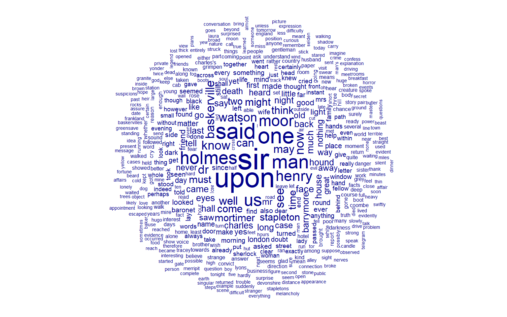
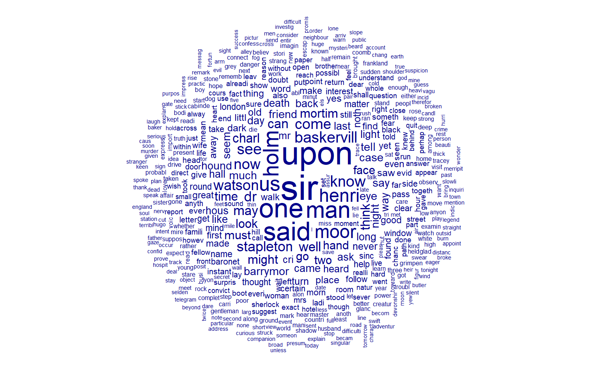
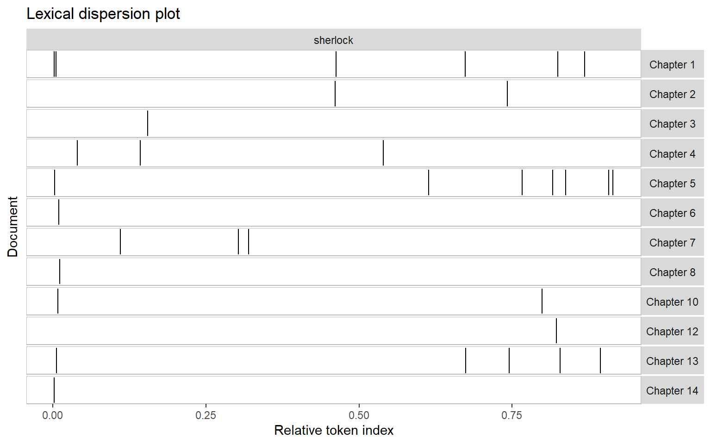

-   [Overview][]
-   [The Data][]
-   [Preparing Text Data][]
    -   [Review of Terms][]
    -   [Splitting the Metadata][]
    -   [Some Basic Cleaning][]
    -   [Defining our "Documents"][]
    -   [Building a Corpus][]
    -   [Cleaning our "Tokens"][]
-   [Exploring Text Data][]
-   [Common Words][]
    -   [Key Words][]
-   [Conclusion][]

## Overview

You will need to install and load the `quanteda` packages:

``` r
# install.packages("quanteda")
# install.packages("quanteda.textplots")
# install.packages("quanteda.textstats")

library(quanteda)
library(quanteda.textplots)
library(quanteda.textstats)
```

## The Data

Today we will be working with purely textual data. Previously, we have worked with text as a part of data--cutting and cleaning particular strings--but today the focus of our work will be large texts. To practice on, we will be looking at the novel *The Hound of the Baskervilles*, one of the most famous Sherlock Holmes stories by Arthur Conan Doyle. The entire book is available for free through [Project Gutenberg][].

To load our text into R, we will use the `readLines()` function (not `readline()`!). This is a base R function for loading in text.

``` r
sherlock_raw = readLines("https://www.gutenberg.org/files/2852/2852-0.txt")
```

If you look at our `sherlock_raw` object, you will see it is a regular character vector of length 7729. It is the same as any other, just pretty long. If we use `head()` to take a look at the first few lines, we can get a sense of how the data is structured.

<div class="question">

Use the `head()` function to look at the first 100 lines of our `sherlock_raw` object. How is the data organized? Would you consider this data tidy?

</div>

## Preparing Text Data

### Review of Terms

Before we can start working on our story in earnest, we need to review some key terms.

Corpus
:   A collection of all of our text data. You could think of this like a library.

Document
:   A unit of observation in our corpus. Think of a single book on a shelf in a library.

Token
:   The thing that makes up our documents. In our books, this would typically be individual words (but not always!).

Metadata
:   Data about our data. Important, but not something we want to mix in with our content.

For this worksheet, we will break up our story as follows: our corpus will be the entire book, our documents will be chapters, and our tokens will be words.

### Splitting the Metadata

Our first task will be separating the content of our story (what we want to look at) from the metadata about the story. Thankfully, that's not too difficult in this case. All we need to do is subset our character vector in the right place. Be sure to check both the start and end of `sherlock_raw`, and make sure only the story itself is in `sherlock_content`.

<div class="question">

Create two new objects, `sherlock_meta` and `sherlock_content`, which contain the metadata and content of our story respectively.

</div>

### Some Basic Cleaning

Before we can do much else, we need to clean our character vector a bit. If we look at `sherlock_content`, you will see that there is a lot of extra white space before and after each line. To resolve this, use `trimws()` or "trim white space" to get rid of the extra spaces.

``` r
sherlock_content = trimws(sherlock_content)
```

Next, we remove all the empty elements in our vector:

``` r
sherlock_content = sherlock_content[sherlock_content != ""]
```

After that, we will want to collapse our many lines into one big text blob. Remember we will be using a computer to look at this text, so it doesn't really care about formatting.

``` r
sherlock_content = paste(sherlock_content, collapse = " ")
```

### Defining our "Documents"

Now that we have our story content separated, we need to work to split our chapters. We can use our old friend `strsplit()` for this. From looking at the content, we know each chapter starts with "Chapter XX.", so we can split on that. We can do so using the following regular expression. I split on the word "Chapter" and either 1 or 2 digits, which is then followed by a period.

``` r
sherlock_content = strsplit(sherlock_content, "Chapter \\d{1,2}\\.")
```

This will give me a list of length 1, with a character vector of length 16 inside it. This is because we split a single character vector, it was just a really big one. I don't really need it in a list though, so I'll use `unlist()` to turn it into a character vector.

``` r
sherlock_content = unlist(sherlock_content)
```

Now I have a character vector of length 16, but I only have 15 chapters in this book? `strsplit()` kept a blank space from before "Chapter 1.", so I need to remove that.

``` r
sherlock_content = sherlock_content[2:16]
```

With that, I'll use `trimws()` again to remove the extra spaces, and I've got the 15 chapters all separated!

``` r
sherlock_content = trimws(sherlock_content)
```

### Building a Corpus

Now that we have our documents clearly defined, we can build our corpus. A corpus is a special object in R which holds all of our documents, and makes looking at all of them at once easier. We can use the tools from `quanteda` for this.

<div class="question">

Use the `corpus()` function from `quanteda` on our `sherlock_content` object to create a corpus of documents. You can also provide a vector of chapter names as an argument to `docnames` if you would like. Assign the output to a new object, `sherlock_corpus`.

</div>

Try using the `summary()` command on our new corpus. It already gives us some neat basic info like the number of sentences and words per chapter!

### Cleaning our "Tokens"

The last thing we need to do to have a "clean" text dataset is clean up our tokens, or in this case, words. We want to look at this whole corpus, and try to understand the meaning of the words within. This means we need to get rid of the words without meaning. Things like "the", "a", "to", etc. help us humans understand what we are reading, but they don't contain much meaning themselves. So we are going to remove them. We also want to remove things like punctuation and symbols.

We can thus create a "tokens" object, which contains all the meaningful words from our corpus.

``` r
sherlock_tokens = tokens(sherlock_corpus, remove_punct = TRUE, remove_symbols = TRUE, remove_separators = TRUE) |>
  tokens_remove(stopwords("en"))
```

## Exploring Text Data

Now that we have our corpus, we can start exploring our texts computationally. There are a few neat things we can do.

## Common Words

One of the most basic things we can look at is how common some words are. To do that, we first have to get a count of every word per document, we can do that using the `dfm()` function, or "document feature matrix." This object will have a column for every token in our corpus, and a row for every document.

``` r
sherlock_dfm = dfm(sherlock_tokens)
```

Once we have a dfm, we can do neat things like plot the most common words! We can do that using a wordcloud, where more common words are larger.

``` r
textplot_wordcloud(sherlock_dfm)
```



Or we can plot it in a more traditional way.

``` r
library(ggplot2)

sherlock_most_common = textstat_frequency(sherlock_dfm, n = 10)

ggplot(sherlock_most_common, aes(x = reorder(feature, frequency), y = frequency)) +
  geom_point() +
  coord_flip() +
  labs(x = "Token", y = "Frequency") +
  theme_minimal()
```



### Key Words

Say we have one key term we are interested in. We can now look for that specific word across our whole corpus. The most simple way is seeing where it appears. We can do this using an x-ray plot. Say we are interested in the word "Sherlock."

First, we can look at the word in the context of the text using `kwic()` or "key word in context."

``` r
kwic(sherlock_tokens, "sherlock")
```

    Keyword-in-context with 33 matches.                                                                              
         [Chapter 1, 2]                                            Mr | Sherlock |
         [Chapter 1, 5]                         Mr Sherlock Holmes Mr | Sherlock |
       [Chapter 1, 467] terrier smaller mastiff laughed incredulously | Sherlock |
       [Chapter 1, 680]                James Mortimer man science ask | Sherlock |
       [Chapter 1, 833]                great unknown ocean presume Mr | Sherlock |
       [Chapter 1, 877]         intention fulsome confess covet skull | Sherlock |
       [Chapter 2, 833]          spectacles forehead stared across Mr | Sherlock |
      [Chapter 2, 1342]           Charles Baskerville must thank said | Sherlock |
       [Chapter 3, 194]             small patch gravel discern others | Sherlock |
        [Chapter 4, 73]                     yes said strange thing Mr | Sherlock |
       [Chapter 4, 262]                   room Sir Henry promise said | Sherlock |
       [Chapter 4, 991]           singularly useless thing steal said | Sherlock |
         [Chapter 5, 4]                          Three Broken Threads | Sherlock |
       [Chapter 5, 949]           May difficulties vanish easily said | Sherlock |
      [Chapter 5, 1185]          Shipley's Yard near Waterloo Station | Sherlock |
      [Chapter 5, 1263]                 mentioned name said cabman Mr | Sherlock |
      [Chapter 5, 1295]                  home upon prettily time name | Sherlock |
      [Chapter 5, 1404]                might interest know driving Mr | Sherlock |
      [Chapter 5, 1415]                  saw went station describe Mr | Sherlock |
        [Chapter 6, 16]            day started arranged Devonshire Mr | Sherlock |
       [Chapter 7, 241]           answer might least something report | Sherlock |
       [Chapter 7, 663]         better explanation come conclusion Mr | Sherlock |
       [Chapter 7, 700]                 name deny identity follows Mr | Sherlock |
        [Chapter 8, 13]         course events transcribing letters Mr | Sherlock |
       [Chapter 10, 12]            quote reports forwarded early days | Sherlock |
     [Chapter 10, 1253]             craniology rest drive lived years | Sherlock |
     [Chapter 12, 1729]                 took indicate relief think Mr | Sherlock |
        [Chapter 13, 8]               Sir Henry pleased surprised see | Sherlock |
      [Chapter 13, 996]                   pike Mrs Laura Lyons office | Sherlock |
     [Chapter 13, 1101]                    wife said wife married man | Sherlock |
     [Chapter 13, 1224]            friend entirely believe madam said | Sherlock |
     [Chapter 13, 1321]             think whole fortunate escape said | Sherlock |
        [Chapter 14, 4]                        Hound Baskervilles One | Sherlock |
                                                  
     Holmes Mr Sherlock Holmes usually            
     Holmes usually late mornings save            
     Holmes leaned back settee blew               
     Holmes specialist crime Come appearance      
     Holmes addressing friend Dr Watson           
     Holmes waved strange visitor chair           
     Holmes latter yawned tossed end              
     Holmes calling attention case certainly      
     Holmes struck hand knee impatient            
     Holmes friend proposed coming round          
     Holmes confine present permission interesting
     Holmes confess share Dr Mortimer's           
     Holmes remarkable degree power detaching     
     Holmes singular thing Dr Mortimer            
     Holmes made note Now Clayton                 
     Holmes Never seen friend completely          
     Holmes Yes sir gentleman's name              
     Holmes come know name see                    
     Holmes cabman scratched head Well            
     Holmes drove station gave last               
     Holmes Sir Henry numerous papers             
     Holmes words took away breath                
     Holmes interesting matter naturally curious  
     Holmes lie table One page                    
     Holmes Now however arrived point             
     Holmes nothing one incident record           
     Holmes friend bowed compliments quick        
     Holmes days expecting recent events          
     Holmes opened interview frankness directness 
     Holmes shrugged shoulders Prove Prove        
     Holmes recital events must painful           
     Holmes power knew yet alive                  
     Holmes's defects indeed one may              

We can then use this information to plot where Sherlock shows up in the story!

``` r
textplot_xray(kwic(sherlock_tokens, "sherlock"))
```



So cool. We can also compare Sherlock to another character, like Watson.

``` r
textplot_xray(
  kwic(sherlock_tokens, "sherlock"),
  kwic(sherlock_tokens, "watson")
  )
```


# Conclusion

While this example was just for fun, the utility is huge with text analysis. Say you wanted to know how often a certain policy appeared over time? Who said it? What it was talked about in the context of? All of these are valid applications. That is to say nothing of more advanced methods like topic modeling or word2vec! If you are interested in text, there is a whole universe of tools out there.

  [Overview]: #overview
  [The Data]: #the-data
  [Preparing Text Data]: #preparing-text-data
  [Review of Terms]: #review-of-terms
  [Splitting the Metadata]: #splitting-the-metadata
  [Some Basic Cleaning]: #some-basic-cleaning
  [Defining our "Documents"]: #defining-our-documents
  [Building a Corpus]: #building-a-corpus
  [Cleaning our "Tokens"]: #cleaning-our-tokens
  [Exploring Text Data]: #exploring-text-data
  [Common Words]: #common-words
  [Key Words]: #key-words
  [Conclusion]: #conclusion
  [Project Gutenberg]: https://www.gutenberg.org/ebooks/2852
