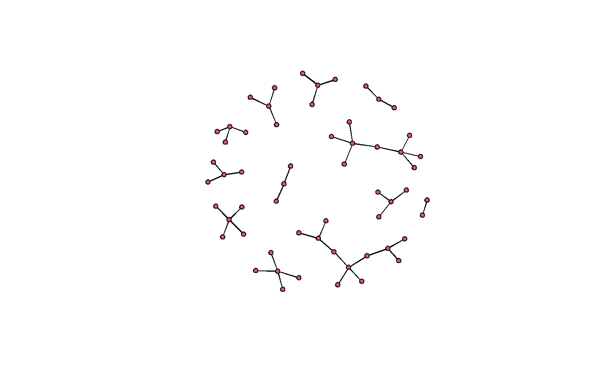

<script src="35_networks_files/libs/htmlwidgets-1.5.4/htmlwidgets.js"></script>
<link href="35_networks_files/libs/vis-9.1.0/vis-network.min.css" rel="stylesheet" />
<script src="35_networks_files/libs/vis-9.1.0/vis-network.min.js"></script>
<script src="35_networks_files/libs/visNetwork-binding-2.1.0/visNetwork.js"></script>


-   [Overview][]
-   [What is Network Analysis][]
-   [Network Data][]
    -   [Edgelist][]
    -   [Adjacency Matrix][]
    -   [Edge Weights][]
    -   [Attributes][]
    -   [Create an Example Network][]
    -   [Components][]
    -   [Limitations of Network Data][]
    -   [Projected Networks][]
-   [Graph Level Properties][]
    -   [Directed or Un-directed][]
    -   [Density][]
    -   [Centralization][]
-   [Node Level Properties][]
    -   [Degree][]
    -   [Geodesic Distance][]
    -   [Centrality][]
-   [Network Workflow][]
-   [Network Tools][]
    -   [Network Models][]
    -   [Network Visualization][]
-   [References][]

## Overview

{}
Our class network is small, which makes many of the measure we will talk about below seem similar. In larger networks the differences are easier to see.
{}

This worksheet will introduce the theoretical and logistical underpinnings of network analysis. It will define what networks are, their limitations, and their use cases. It will then cover some of the most commonly used network measures, what they mean, and how to generate them.

You will need the `statnet` and `visNetwork` packages for this worksheet.

## What is Network Analysis

You are all familiar now with tabular data; rows and columns containing information. It looks like this:

| Person                                                                                                                               | Name | Age | Widgets |
|--------------------------------------------------------------------------------------------------------------------------------------|:-----|:----|:--------|
|          | J    | 30  | 1       |
|        | Y    | 21  | 3       |
|  | G    | 32  | 4       |
|        | Z    | 48  | 8       |

While this is a tidy way to store data, it artificially atomizes or separates many of the things we are interested in as researchers, social or otherwise. Network analysis is a tool to work with *relational* data, a.k.a. information about how entities are connected with each other. For example, the diagram below shows the same data as the table above, with the added benefit of showing how these individuals are connected to each other. Hover over the people to reveal the data about them.

<div id="htmlwidget-06287ce7455f018dd002" style="width:100%;height:480px;" class="visNetwork html-widget"></div>
<script type="application/json" data-for="htmlwidget-06287ce7455f018dd002">{"x":{"nodes":{"id":[1,2,3,4],"shape":["image","image","image","image"],"title":["<p style='color: black;'>Name: J<br>Age: 30<br>Widgets: 1<\/p>","<p style='color: black;'>Name: Y<br>Age: 21<br>Widgets: 3<\/p>","<p style='color: black;'>Name: G<br>Age: 32<br>Widgets: 4<\/p>","<p style='color: black;'>Name: Z<br>Age: 48<br>Widgets: 8<\/p>"],"image":["https://raw.githubusercontent.com/Epsian/sna_lecture/main/resources/male-teacher_emoji.png","https://raw.githubusercontent.com/Epsian/sna_lecture/main/resources/female-student_emoji.png","https://raw.githubusercontent.com/Epsian/sna_lecture/main/resources/female-health-worker_emoji.png","https://raw.githubusercontent.com/Epsian/sna_lecture/main/resources/male-scientist_emoji.png"]},"edges":{"from":[2,4,3,3],"to":[1,2,4,2],"label":["Siblings","Student","Friends","Parent"]},"nodesToDataframe":true,"edgesToDataframe":true,"options":{"width":"100%","height":"100%","nodes":{"shape":"dot","size":50,"shapeProperties":{"useBorderWithImage":false}},"manipulation":{"enabled":false},"edges":{"length":200,"scaling":{"min":400}},"interaction":{"zoomView":false,"zoomSpeed":1},"layout":{"randomSeed":2}},"groups":null,"width":"100%","height":null,"idselection":{"enabled":false},"byselection":{"enabled":false},"main":null,"submain":null,"footer":null,"background":"rgba(0, 0, 0, 0)","tooltipStay":300,"tooltipStyle":"position: fixed;visibility:hidden;padding: 5px;white-space: nowrap;font-family: verdana;font-size:14px;font-color:#000000;background-color: #f5f4ed;-moz-border-radius: 3px;-webkit-border-radius: 3px;border-radius: 3px;border: 1px solid #808074;box-shadow: 3px 3px 10px rgba(0, 0, 0, 0.2);"},"evals":[],"jsHooks":[]}</script>

Rather than looking only at attributes of specific data points, we are looking at the connections between data. In network analysis, data points are called *nodes* or *vertices*, and the connections between them are called *edges* or *ties*. Vertices can be anything---people, places, words, concepts---they are usually mapped into rows in a data frame. Edges contain any information on how these things connect or are related to each other. These components create a *network* or *graph*, defined as "finite set or sets of actors and the relation or relations defined on them"[^1].

## Network Data

Networks are based on relational data. This means the core data requirement is that we have some measure of how nodes are connected. The two most common network data formats are the *edgelist* and *adjacency matrix*. Either of these will work for nearly any network purpose, and it is easy to convert between them. You will also need an *attributes* file, which gives information about the nodes being connected.

### Edgelist

An edgelist is a two-column dataframe with a *from* and *to* column. Each row represents one edge or tie, with the possibility of adding in more information. Here is an example of a basic edgelist. Let's load in some example data from our class survey. This is an edgelist created from your reports of what classes you are taking this semester (with class names replaced).

``` r
# load in the data
toy_edgelist = read.csv(here::here("content/class_worksheets/35_networks/data/edgelist.csv"), header = TRUE, stringsAsFactors = FALSE)

# show the first 10 rows
knitr::kable(head(toy_edgelist, n = 10))
```

| from            | to                      |
|:----------------|:------------------------|
| Spike Spiegal   | berserk gyrfalcon       |
| Doreamon        | apidologic parrot       |
| Doreamon        | contradictive flies     |
| Sherlock Holmes | knavish waterthrush     |
| Sherlock Holmes | misanthropic harvestmen |
| Sherlock Holmes | essential lacewing      |
| Sherlock Holmes | feisty koodoo           |
| Tiana           | explicable bigmouthbass |
| Tiana           | unaccepted dunnart      |
| Tiana           | explicable macropod     |

### Adjacency Matrix

The same data can also be displayed in a table format. The information is the same, but it is presented in a way more usable by our code to create measures we care out. In this format, every node has both a row and column. If there is an edge between two nodes, a 1 is placed in the intersection of their row and column.

### Edge Weights

Edges can also have weights, meaning some edges are valued more than others. In an edgelist, you can add a third "weight" column, entering higher numbers to denote a more important connection. In an adjacency matrix, you can put numbers other than 1 in the intersection to denote more important connections. For our example, we'll stick with un-weighted connections for now.

### Attributes

Each network also typically has an attributes table, which looks just like typical tabular data, with each row belonging to a specific node in our network. Let's load in and look at the sample attributes file.

``` r
# load in data
toy_attributes = read.csv(here::here("content/class_worksheets/35_networks/data/attributes.csv"), header = TRUE, stringsAsFactors = FALSE)

# show top of attributes table
knitr::kable(head(toy_attributes, n = 10))
```

| id              | color  | nerd  |
|:----------------|:-------|:------|
| Spike Spiegal   | Orange | TRUE  |
| Doreamon        | purple | FALSE |
| Sherlock Holmes | green  | TRUE  |
| Tiana           | Purple | FALSE |
| Crush           | blue   | TRUE  |
| Thor            | Yellow | FALSE |
| Rhys            | Purple | TRUE  |
| Buffy           | Red    | TRUE  |
| Sasha Braus     | Pink   | TRUE  |
| Catra           | Green  | TRUE  |

### Create an Example Network

Before we start exploring specific measures, we'll create a toy network to use as an example. Let's start by loading in some packages.

`statnet` is one of the major network packages in R. It allows you to compute many of the most common network measures, and run simulations called *Exponential Random Graph Models*. We'll stick with the basics for now! You'll also need to load in the data. I've created network data out of our class survey and provided it using the commands below.

``` r
# Run this to load statnet, if you need to install it, do so now.
library(statnet)

# data load
toy_edgelist = read.csv("https://raw.githubusercontent.com/Intro-to-Data-Science-Template/intro_to_data_science_reader/main/content/class_worksheets/35_networks/data/edgelist.csv", header = TRUE, stringsAsFactors = FALSE)
toy_attributes = read.csv("https://raw.githubusercontent.com/Intro-to-Data-Science-Template/intro_to_data_science_reader/main/content/class_worksheets/35_networks/data/attributes.csv", header = TRUE, stringsAsFactors = FALSE)
```

Now that we have our tools loaded, let's create out first network. We'll use the data you loaded in before. This toy network will be used as a visual for learning the measurements below.

We are going to turn the attributes file and edgelist into a `statnet` network object. A network object is a special kind of list in R. It is formatted in a way that the other `statnet` functions expect. While you could edit it like a normal list, it is highly recommended you use the other `statnet` functions to manipulate this object to make sure you don't break any of the data expectations.

We'll use the `network` function to create our network object. After we create it, we will sort our attributes file to match the network. This is super important, as the network object will automatically sort things itself. **If we do not sort our attributes dataframe to match, all of our measures later will be misaligned!**

``` r
# make network!
# we will cover the `directed = FALSE` argument soon.
toy_network = network(toy_edgelist, directed = FALSE)

# sort your attributes frame to match the network. Super important!
toy_attributes = toy_attributes[match(toy_attributes$id, toy_network%v%"vertex.names"), ]
```

Before we move on, let's add a `net_id` column to our attributes dataframe. This will let us easily check what the network object IDs are for our nodes.

``` r
# add ID column
toy_attributes$net_id = 1:nrow(toy_attributes)
```

We can inspect our new network by calling the `summary` function on it. Don't worry too much about the output yet.

``` r
summary(toy_network)
```

    Network attributes:
      vertices = 58
      directed = FALSE
      hyper = FALSE
      loops = FALSE
      multiple = FALSE
      bipartite = FALSE
     total edges = 46 
       missing edges = 0 
       non-missing edges = 46 
     density = 0.02782819 

    Vertex attributes:
      vertex.names:
       character valued attribute
       58 valid vertex names

    No edge attributes

    Network edgelist matrix:
          [,1] [,2]
     [1,]    1   16
     [2,]    2   17
     [3,]    2   18
     [4,]    3   19
     [5,]    3   20
     [6,]    3   21
     [7,]    3   22
     [8,]    4   23
     [9,]    4   24
    [10,]    4   25
    [11,]    5   26
    [12,]    5   27
    [13,]    5   28
    [14,]    6   29
    [15,]    6   30
    [16,]    6   31
    [17,]    7   32
    [18,]    7   33
    [19,]    7   34
    [20,]    7   35
    [21,]    8   36
    [22,]    8   37
    [23,]    8   38
    [24,]    8   39
    [25,]    9   40
    [26,]    9   41
    [27,]    9   42
    [28,]   10   43
    [29,]   10   44
    [30,]   10   45
    [31,]   11   46
    [32,]   11   47
    [33,]   12   43
    [34,]   12   31
    [35,]   12   48
    [36,]   12   49
    [37,]   13   50
    [38,]   13   51
    [39,]   13   52
    [40,]   14   53
    [41,]   14   54
    [42,]   14   55
    [43,]   15   38
    [44,]   15   56
    [45,]   15   57
    [46,]   15   58

Then we'll add the node attributes to the network object. If you run `summary` again you should see the values from our `toy_attributes` have been added.

``` r
# add each attribute to network.
# do this by looking at every column, then adding it to the network
for(col_name in colnames(toy_attributes)) {
    toy_network = set.vertex.attribute(x = toy_network, attrname = col_name, value=toy_attributes[,col_name])
}
```

Let's see what out network looks like!

``` r
plot(toy_network)
```



There we are. The default plotting in `statnet` is ugly. For the sake of our eyes, and for exploring some of the measure we create, we'll use the `visNetwork` package to visualize our networks. It will make the code a bit more cumbersome, but it will be worth it. From now on, we will need to use the edges and attributes dataframes for plotting. This means we will often need to run commands twice, once for the network and once for the dataframes. When you are working with networks for research, you would usually do everything you need on your network, than create a dataframe from it all at once. We will need to deal with a bit of redundancy to take things one step at a time.

Let's try plotting again with `visNetwork`, using the dataframes. We'll give the `visNetwork` function our edgelist and attributes dataframe. We'll also tell it to plot the names from our attributes dataframe so we can see them when we hover over the nodes in the plot.

``` r
# add pop-up tooltips with names
# visNetwork uses the "title" column to create pop-up boxes
toy_attributes$title = toy_attributes$id

# plot!
visNetwork(nodes = toy_attributes, edges = toy_edgelist) %>% visInteraction(zoomView = FALSE)
```

<div id="htmlwidget-ca44b8f9ebfa82bf1482" style="width:768px;height:480px;" class="visNetwork html-widget"></div>
<script type="application/json" data-for="htmlwidget-ca44b8f9ebfa82bf1482">{"x":{"nodes":{"id":["Spike Spiegal","Doreamon","Sherlock Holmes","Tiana","Crush","Thor","Rhys","Buffy","Sasha Braus","Catra","Pikachu","My Melody","Claire Fraser","Shinchan","Kakashi","berserk gyrfalcon","apidologic parrot","contradictive flies","knavish waterthrush","misanthropic harvestmen","essential lacewing","feisty koodoo","explicable bigmouthbass","unaccepted dunnart","explicable macropod","rounded alaskanmalamute","unwomanish cottontail","collective komododragon","semiintellectual noctule","obsessive arrowcrab","anticlimactic iridescentshark","antinihilistic germanspaniel","defunctive duiker","agrostographic ozarkbigearedbat","molecular bluegill","seasick canary","optometric ermine","bleached human","abyssal urubu","webby leafhopper","speedless iberianbarbel","enrapt nilgai","vulpine phoebe","spotless annelida","criticisable deviltasmanian","carbon milkweedbug","unextraordinary anemoneshrimp","convectional nene","blithe aztecant","seasick paddlefish","capitalist bandicoot","weak coqui","homeopathic americanblackvulture","convictible turtledove","interuniversity hog","extraterrestrial leveret","corporatist megalosaurus","dewyeyed lice"],"color":["Orange","purple","green","Purple","blue","Yellow","Purple","Red","Pink","Green","Blue","Green","Purple","black","Green",null,null,null,null,null,null,null,null,null,null,null,null,null,null,null,null,null,null,null,null,null,null,null,null,null,null,null,null,null,null,null,null,null,null,null,null,null,null,null,null,null,null,null],"nerd":[true,false,true,false,true,false,true,true,true,true,true,true,true,false,true,null,null,null,null,null,null,null,null,null,null,null,null,null,null,null,null,null,null,null,null,null,null,null,null,null,null,null,null,null,null,null,null,null,null,null,null,null,null,null,null,null,null,null],"net_id":[1,2,3,4,5,6,7,8,9,10,11,12,13,14,15,16,17,18,19,20,21,22,23,24,25,26,27,28,29,30,31,32,33,34,35,36,37,38,39,40,41,42,43,44,45,46,47,48,49,50,51,52,53,54,55,56,57,58],"title":["Spike Spiegal","Doreamon","Sherlock Holmes","Tiana","Crush","Thor","Rhys","Buffy","Sasha Braus","Catra","Pikachu","My Melody","Claire Fraser","Shinchan","Kakashi","berserk gyrfalcon","apidologic parrot","contradictive flies","knavish waterthrush","misanthropic harvestmen","essential lacewing","feisty koodoo","explicable bigmouthbass","unaccepted dunnart","explicable macropod","rounded alaskanmalamute","unwomanish cottontail","collective komododragon","semiintellectual noctule","obsessive arrowcrab","anticlimactic iridescentshark","antinihilistic germanspaniel","defunctive duiker","agrostographic ozarkbigearedbat","molecular bluegill","seasick canary","optometric ermine","bleached human","abyssal urubu","webby leafhopper","speedless iberianbarbel","enrapt nilgai","vulpine phoebe","spotless annelida","criticisable deviltasmanian","carbon milkweedbug","unextraordinary anemoneshrimp","convectional nene","blithe aztecant","seasick paddlefish","capitalist bandicoot","weak coqui","homeopathic americanblackvulture","convictible turtledove","interuniversity hog","extraterrestrial leveret","corporatist megalosaurus","dewyeyed lice"]},"edges":{"from":["Spike Spiegal","Doreamon","Doreamon","Sherlock Holmes","Sherlock Holmes","Sherlock Holmes","Sherlock Holmes","Tiana","Tiana","Tiana","Crush","Crush","Crush","Thor","Thor","Thor","Rhys","Rhys","Rhys","Rhys","Buffy","Buffy","Buffy","Buffy","Sasha Braus","Sasha Braus","Sasha Braus","Catra","Catra","Catra","Pikachu","Pikachu","My Melody","My Melody","My Melody","My Melody","Claire Fraser","Claire Fraser","Claire Fraser","Shinchan","Shinchan","Shinchan","Kakashi","Kakashi","Kakashi","Kakashi"],"to":["berserk gyrfalcon","apidologic parrot","contradictive flies","knavish waterthrush","misanthropic harvestmen","essential lacewing","feisty koodoo","explicable bigmouthbass","unaccepted dunnart","explicable macropod","rounded alaskanmalamute","unwomanish cottontail","collective komododragon","semiintellectual noctule","obsessive arrowcrab","anticlimactic iridescentshark","antinihilistic germanspaniel","defunctive duiker","agrostographic ozarkbigearedbat","molecular bluegill","seasick canary","optometric ermine","bleached human","abyssal urubu","webby leafhopper","speedless iberianbarbel","enrapt nilgai","vulpine phoebe","spotless annelida","criticisable deviltasmanian","carbon milkweedbug","unextraordinary anemoneshrimp","vulpine phoebe","anticlimactic iridescentshark","convectional nene","blithe aztecant","seasick paddlefish","capitalist bandicoot","weak coqui","homeopathic americanblackvulture","convictible turtledove","interuniversity hog","bleached human","extraterrestrial leveret","corporatist megalosaurus","dewyeyed lice"]},"nodesToDataframe":true,"edgesToDataframe":true,"options":{"width":"100%","height":"100%","nodes":{"shape":"dot"},"manipulation":{"enabled":false},"interaction":{"zoomView":false,"zoomSpeed":1}},"groups":null,"width":null,"height":null,"idselection":{"enabled":false},"byselection":{"enabled":false},"main":null,"submain":null,"footer":null,"background":"rgba(0, 0, 0, 0)","tooltipStay":300,"tooltipStyle":"position: fixed;visibility:hidden;padding: 5px;white-space: nowrap;font-family: verdana;font-size:14px;font-color:#000000;background-color: #f5f4ed;-moz-border-radius: 3px;-webkit-border-radius: 3px;border-radius: 3px;border: 1px solid #808074;box-shadow: 3px 3px 10px rgba(0, 0, 0, 0.2);"},"evals":[],"jsHooks":[]}</script>

Nice.

### Components

Most often when working with networks you want to limit your analysis to one cluster or *component*, typically the largest one in your network. If segments of your network aren't connected, you can't answer many of the relational questions network analysis is good for! Let's limit our network to the largest component:

``` r
# find what nodes are part of the largest component
toy_network%v%"lc" = component.largest(toy_network)
# delete those nodes that are not
## in the network
toy_network = delete.vertices(toy_network, which(toy_network%v%"lc" == FALSE))
## in our dataframes
toy_attributes = toy_attributes[toy_attributes$id %in% as.character(toy_network%v%"vertex.names"),]
toy_edgelist = toy_edgelist[which(toy_edgelist$to %in% toy_attributes$id | toy_edgelist$from %in% toy_attributes$id),]

# plot!
visNetwork(nodes = toy_attributes, edges = toy_edgelist) %>% visInteraction(zoomView = FALSE)
```

<div id="htmlwidget-1df759b488f006f7c225" style="width:768px;height:480px;" class="visNetwork html-widget"></div>
<script type="application/json" data-for="htmlwidget-1df759b488f006f7c225">{"x":{"nodes":{"id":["Thor","Catra","My Melody","semiintellectual noctule","obsessive arrowcrab","anticlimactic iridescentshark","vulpine phoebe","spotless annelida","criticisable deviltasmanian","convectional nene","blithe aztecant"],"color":["Yellow","Green","Green",null,null,null,null,null,null,null,null],"nerd":[false,true,true,null,null,null,null,null,null,null,null],"net_id":[6,10,12,29,30,31,43,44,45,48,49],"title":["Thor","Catra","My Melody","semiintellectual noctule","obsessive arrowcrab","anticlimactic iridescentshark","vulpine phoebe","spotless annelida","criticisable deviltasmanian","convectional nene","blithe aztecant"]},"edges":{"from":["Thor","Thor","Thor","Catra","Catra","Catra","My Melody","My Melody","My Melody","My Melody"],"to":["semiintellectual noctule","obsessive arrowcrab","anticlimactic iridescentshark","vulpine phoebe","spotless annelida","criticisable deviltasmanian","vulpine phoebe","anticlimactic iridescentshark","convectional nene","blithe aztecant"]},"nodesToDataframe":true,"edgesToDataframe":true,"options":{"width":"100%","height":"100%","nodes":{"shape":"dot"},"manipulation":{"enabled":false},"interaction":{"zoomView":false,"zoomSpeed":1}},"groups":null,"width":null,"height":null,"idselection":{"enabled":false},"byselection":{"enabled":false},"main":null,"submain":null,"footer":null,"background":"rgba(0, 0, 0, 0)","tooltipStay":300,"tooltipStyle":"position: fixed;visibility:hidden;padding: 5px;white-space: nowrap;font-family: verdana;font-size:14px;font-color:#000000;background-color: #f5f4ed;-moz-border-radius: 3px;-webkit-border-radius: 3px;border-radius: 3px;border: 1px solid #808074;box-shadow: 3px 3px 10px rgba(0, 0, 0, 0.2);"},"evals":[],"jsHooks":[]}</script>

### Limitations of Network Data

Before we move on we should take a moment to talk about some the the caveats when using network data. While powerful, network analysis is particularly picky when in comes to data requirements. I'll cover the two biggest ones below. You should *always* keep these in mind when using or interpreting network tools.

#### Missing Data

Network analysis is very vulnerable to missing data. A simple way to understand why is to make a small adjustment to our network. I've highlighted one node in green. This node is structurally vital to the network; without it, the shape of the network as a whole will change.

<div id="htmlwidget-406377b215468937e30d" style="width:768px;height:480px;" class="visNetwork html-widget"></div>
<script type="application/json" data-for="htmlwidget-406377b215468937e30d">{"x":{"nodes":{"id":["Thor","Catra","My Melody","semiintellectual noctule","obsessive arrowcrab","anticlimactic iridescentshark","vulpine phoebe","spotless annelida","criticisable deviltasmanian","convectional nene","blithe aztecant"],"color":["grey","grey","green","grey","grey","grey","grey","grey","grey","grey","grey"],"nerd":[false,true,true,null,null,null,null,null,null,null,null],"net_id":[6,10,12,29,30,31,43,44,45,48,49],"title":["Thor","Catra","My Melody","semiintellectual noctule","obsessive arrowcrab","anticlimactic iridescentshark","vulpine phoebe","spotless annelida","criticisable deviltasmanian","convectional nene","blithe aztecant"]},"edges":{"from":["Thor","Thor","Thor","Catra","Catra","Catra","My Melody","My Melody","My Melody","My Melody"],"to":["semiintellectual noctule","obsessive arrowcrab","anticlimactic iridescentshark","vulpine phoebe","spotless annelida","criticisable deviltasmanian","vulpine phoebe","anticlimactic iridescentshark","convectional nene","blithe aztecant"],"color":["grey","grey","grey","grey","grey","grey","grey","grey","grey","grey"]},"nodesToDataframe":true,"edgesToDataframe":true,"options":{"width":"100%","height":"100%","nodes":{"shape":"dot"},"manipulation":{"enabled":false},"interaction":{"zoomView":false,"zoomSpeed":1}},"groups":null,"width":null,"height":null,"idselection":{"enabled":false},"byselection":{"enabled":false},"main":null,"submain":null,"footer":null,"background":"rgba(0, 0, 0, 0)","tooltipStay":300,"tooltipStyle":"position: fixed;visibility:hidden;padding: 5px;white-space: nowrap;font-family: verdana;font-size:14px;font-color:#000000;background-color: #f5f4ed;-moz-border-radius: 3px;-webkit-border-radius: 3px;border-radius: 3px;border: 1px solid #808074;box-shadow: 3px 3px 10px rgba(0, 0, 0, 0.2);"},"evals":[],"jsHooks":[]}</script>

If we remove this node, the network changes in a major way! Imagine these nodes are people, and that missing node is the *one* person you forget to survey, or was sick the day data was collected. This could massively change the outcome of your analyses. There is some advanced research going on to detect and replace missing data like this if you have enough context, but it is not something to rely on.

<div id="htmlwidget-49bb6a0847f559820391" style="width:768px;height:480px;" class="visNetwork html-widget"></div>
<script type="application/json" data-for="htmlwidget-49bb6a0847f559820391">{"x":{"nodes":{"id":["Thor","Catra","semiintellectual noctule","obsessive arrowcrab","anticlimactic iridescentshark","vulpine phoebe","spotless annelida","criticisable deviltasmanian","convectional nene","blithe aztecant"],"color":["grey","grey","grey","grey","grey","grey","grey","grey","grey","grey"],"nerd":[false,true,null,null,null,null,null,null,null,null],"net_id":[6,10,29,30,31,43,44,45,48,49],"title":["Thor","Catra","semiintellectual noctule","obsessive arrowcrab","anticlimactic iridescentshark","vulpine phoebe","spotless annelida","criticisable deviltasmanian","convectional nene","blithe aztecant"]},"edges":{"from":["Thor","Thor","Thor","Catra","Catra","Catra"],"to":["semiintellectual noctule","obsessive arrowcrab","anticlimactic iridescentshark","vulpine phoebe","spotless annelida","criticisable deviltasmanian"],"color":["grey","grey","grey","grey","grey","grey"]},"nodesToDataframe":true,"edgesToDataframe":true,"options":{"width":"100%","height":"100%","nodes":{"shape":"dot"},"manipulation":{"enabled":false},"interaction":{"zoomView":false,"zoomSpeed":1}},"groups":null,"width":null,"height":null,"idselection":{"enabled":false},"byselection":{"enabled":false},"main":null,"submain":null,"footer":null,"background":"rgba(0, 0, 0, 0)","tooltipStay":300,"tooltipStyle":"position: fixed;visibility:hidden;padding: 5px;white-space: nowrap;font-family: verdana;font-size:14px;font-color:#000000;background-color: #f5f4ed;-moz-border-radius: 3px;-webkit-border-radius: 3px;border-radius: 3px;border: 1px solid #808074;box-shadow: 3px 3px 10px rgba(0, 0, 0, 0.2);"},"evals":[],"jsHooks":[]}</script>

#### Network Boundaries

Network analysis is all about looking at the relationships between entities. However, following all connections an entity has can quickly spiral out of hand. For example, if you wanted to map your own social network, where would you start? You would include yourself, then your friends and family, but what about after that? Your friends and family have friends and family, as do their friends and family, as do their ... and so on. If you are looking at human networks, *every* human will be included if you look far enough, so how do you decide when to stop?

There is no easy answer. If you are looking at a pre-defined group (e.g. this class), you can set the boundaries to include everyone in this class and the connection between them. However, that doesn't really capture the social networks of people in this class as most people will have friends elsewhere.

Another common method is setting an arbitrary number of "steps" or connections from a target population. If we were interested in a 2-step network from an individual, we would collect all of their relevant connections, and then ask all the people they nominated about their connections. Some sort of justification will be needed as to why you picked the number of steps that you did.


### Projected Networks

Often, you will not have individual level network data, but you will have data on group membership. For example, if you wanted to map the social networks of student, but don't know who they actually hang around with, you may be able to use class rosters to build an approximate network. This is call a *bipartite network*, *two-mode*, or *projected network*. You can see an example below.

In this figure there are two kinds of nodes, students and classes. You can "collapse" this into a student network by assuming every student connected to a class is connected to each other. The same is true with classes, such that classes are related to each other if a single student is enrolled in both. This assumption may not always be correct, and you need to take care if you are going to make it in your research. If a class has 300 students, it is most likely not correct to assume every student knows every other student in that class.


For reference, this is what out projected class network looks like:

<div id="htmlwidget-16634b670ea41ab25332" style="width:100%;height:480px;" class="visNetwork html-widget"></div>
<script type="application/json" data-for="htmlwidget-16634b670ea41ab25332">{"x":{"nodes":{"id":["Thor","Catra","My Melody"],"color":["Yellow","Green","Green"],"nerd":[false,true,true],"net_id":[6,10,12],"title":["Thor","Catra","My Melody"]},"edges":{"from":["Thor","Catra"],"to":["My Melody","My Melody"]},"nodesToDataframe":true,"edgesToDataframe":true,"options":{"width":"100%","height":"100%","nodes":{"shape":"dot"},"manipulation":{"enabled":false},"interaction":{"zoomView":false,"zoomSpeed":1}},"groups":null,"width":null,"height":null,"idselection":{"enabled":false},"byselection":{"enabled":false},"main":null,"submain":null,"footer":null,"background":"rgba(0, 0, 0, 0)","tooltipStay":300,"tooltipStyle":"position: fixed;visibility:hidden;padding: 5px;white-space: nowrap;font-family: verdana;font-size:14px;font-color:#000000;background-color: #f5f4ed;-moz-border-radius: 3px;-webkit-border-radius: 3px;border-radius: 3px;border: 1px solid #808074;box-shadow: 3px 3px 10px rgba(0, 0, 0, 0.2);"},"evals":[],"jsHooks":[]}</script>

## Graph Level Properties

Now that we know what networks are and have some examples of how they are used and the data required, let's get into actually analyzing them. There are a number of measures we can compute to understand the structure of a network as a whole. We will go over some basic network level ones here. These are single measures or attributes used to describe the entire network, and can be used to compare one network against another.

-   Directed or Un-directed
-   Density
-   Centralization

### Directed or Un-directed

Networks can either be *directed* or *un-directed*. A directed network treats the edges between nodes as having a specific direction of flow, while an un-directed network considers all edges to be mutual. An example of each is presented below.

Both edgelist and adjacency matrix datasets are inherently directed. For edgelists, the sender is often the first column, and the receiver is the second. For adjacency matrices the rows are considered senders and columns are receivers. Directionality is often specified when the network objects are created. When we created our toy network, we specified `directed = FALSE` to simplify things. If you want a directed network, the default is `directed = TRUE` for `statnet` networks.

A directed network tracks which node is the source and which node is the receiver for an edge. Take for example the *follow* mechanic on Twitter. User A can follow User B, creating a directed edge from A to B, but B does not have to follow A in return. This can be useful when trying to understand the flows of resources that are finite such as money or goods.

``` r
# visNetwork uses a column called "arrows" to show directionality in its plots.
# For our edgelist, we'll just say every row is "to" for now
toy_edgelist$arrows = "to"

# this will show us what our network would look like if it was directed.
visNetwork(toy_attributes, toy_edgelist, main = "Directed") %>% visInteraction(zoomView = FALSE)
```

<div id="htmlwidget-2d2869905469f586ce28" style="width:768px;height:480px;" class="visNetwork html-widget"></div>
<script type="application/json" data-for="htmlwidget-2d2869905469f586ce28">{"x":{"nodes":{"id":["Thor","Catra","My Melody","semiintellectual noctule","obsessive arrowcrab","anticlimactic iridescentshark","vulpine phoebe","spotless annelida","criticisable deviltasmanian","convectional nene","blithe aztecant"],"color":["Yellow","Green","Green",null,null,null,null,null,null,null,null],"nerd":[false,true,true,null,null,null,null,null,null,null,null],"net_id":[6,10,12,29,30,31,43,44,45,48,49],"title":["Thor","Catra","My Melody","semiintellectual noctule","obsessive arrowcrab","anticlimactic iridescentshark","vulpine phoebe","spotless annelida","criticisable deviltasmanian","convectional nene","blithe aztecant"]},"edges":{"from":["Thor","Thor","Thor","Catra","Catra","Catra","My Melody","My Melody","My Melody","My Melody"],"to":["semiintellectual noctule","obsessive arrowcrab","anticlimactic iridescentshark","vulpine phoebe","spotless annelida","criticisable deviltasmanian","vulpine phoebe","anticlimactic iridescentshark","convectional nene","blithe aztecant"],"arrows":["to","to","to","to","to","to","to","to","to","to"]},"nodesToDataframe":true,"edgesToDataframe":true,"options":{"width":"100%","height":"100%","nodes":{"shape":"dot"},"manipulation":{"enabled":false},"interaction":{"zoomView":false,"zoomSpeed":1}},"groups":null,"width":null,"height":null,"idselection":{"enabled":false},"byselection":{"enabled":false},"main":{"text":"Directed","style":"font-family:Georgia, Times New Roman, Times, serif;font-weight:bold;font-size:20px;text-align:center;"},"submain":null,"footer":null,"background":"rgba(0, 0, 0, 0)","tooltipStay":300,"tooltipStyle":"position: fixed;visibility:hidden;padding: 5px;white-space: nowrap;font-family: verdana;font-size:14px;font-color:#000000;background-color: #f5f4ed;-moz-border-radius: 3px;-webkit-border-radius: 3px;border-radius: 3px;border: 1px solid #808074;box-shadow: 3px 3px 10px rgba(0, 0, 0, 0.2);"},"evals":[],"jsHooks":[]}</script>

An un-directed network treats all ties as mutual, such that A and B are both involved equally in a tie. An example is the *friend* mechanic on Facebook. Once a friendship is established, both users are considered equal in the tie. This can be helpful when you do not have information on what node initiates a tie, or when events happen equally to a group of nodes, such as all nodes being connected through co-membership in a group.

``` r
# lets drop the arrow column for now since our network is un-directed.
toy_edgelist = toy_edgelist[,c("from", "to")]

# plot
visNetwork(toy_attributes, toy_edgelist, main = "Un-directed") %>% visInteraction(zoomView = FALSE)
```

<div id="htmlwidget-16b0c286403483e17811" style="width:768px;height:480px;" class="visNetwork html-widget"></div>
<script type="application/json" data-for="htmlwidget-16b0c286403483e17811">{"x":{"nodes":{"id":["Thor","Catra","My Melody","semiintellectual noctule","obsessive arrowcrab","anticlimactic iridescentshark","vulpine phoebe","spotless annelida","criticisable deviltasmanian","convectional nene","blithe aztecant"],"color":["Yellow","Green","Green",null,null,null,null,null,null,null,null],"nerd":[false,true,true,null,null,null,null,null,null,null,null],"net_id":[6,10,12,29,30,31,43,44,45,48,49],"title":["Thor","Catra","My Melody","semiintellectual noctule","obsessive arrowcrab","anticlimactic iridescentshark","vulpine phoebe","spotless annelida","criticisable deviltasmanian","convectional nene","blithe aztecant"]},"edges":{"from":["Thor","Thor","Thor","Catra","Catra","Catra","My Melody","My Melody","My Melody","My Melody"],"to":["semiintellectual noctule","obsessive arrowcrab","anticlimactic iridescentshark","vulpine phoebe","spotless annelida","criticisable deviltasmanian","vulpine phoebe","anticlimactic iridescentshark","convectional nene","blithe aztecant"]},"nodesToDataframe":true,"edgesToDataframe":true,"options":{"width":"100%","height":"100%","nodes":{"shape":"dot"},"manipulation":{"enabled":false},"interaction":{"zoomView":false,"zoomSpeed":1}},"groups":null,"width":null,"height":null,"idselection":{"enabled":false},"byselection":{"enabled":false},"main":{"text":"Un-directed","style":"font-family:Georgia, Times New Roman, Times, serif;font-weight:bold;font-size:20px;text-align:center;"},"submain":null,"footer":null,"background":"rgba(0, 0, 0, 0)","tooltipStay":300,"tooltipStyle":"position: fixed;visibility:hidden;padding: 5px;white-space: nowrap;font-family: verdana;font-size:14px;font-color:#000000;background-color: #f5f4ed;-moz-border-radius: 3px;-webkit-border-radius: 3px;border-radius: 3px;border: 1px solid #808074;box-shadow: 3px 3px 10px rgba(0, 0, 0, 0.2);"},"evals":[],"jsHooks":[]}</script>

Which of these will be useful to you will likely change from project to project. However, it is vital to understand what kind of network you are working with, as many network calculations we will talk about later change their behavior based on if the network is directed or not.

### Density

*Density* is the first real graph level metric that helps you understand what is particular about the network you are looking at. The density of a network is a numerical score showing how many ties exist in a network, given the max possible in that network. Mathematically that is *Actual Edges*/*Possible Edges*, where actual edges is the number of edges in the network, and possible edges is the number of edges if every single node in the network was connected to every other node.

Networks that are more densely connected are considered to be more cohesive and robust. This means that the removal of any specific edge or node will not have a great effect of the network as a whole. It also typically means that any one node in the network will be more likely to have access to whatever resources are in the network, as there are more potential connections in the network to search for resources.

To calculate the density of a network, we use the `network.density()` function. You can also see it if you use `summary()` on your network object. Below is our toy network and a less dense version to try and visualize the difference. Density is all about how many edges exist in the network. Notice that there are the same number of nodes in both of these networks.

<div id="htmlwidget-7fc7116be95a4d7c58f7" style="width:768px;height:480px;" class="visNetwork html-widget"></div>
<script type="application/json" data-for="htmlwidget-7fc7116be95a4d7c58f7">{"x":{"nodes":{"id":["Thor","Catra","My Melody","semiintellectual noctule","obsessive arrowcrab","anticlimactic iridescentshark","vulpine phoebe","spotless annelida","criticisable deviltasmanian","convectional nene","blithe aztecant"],"color":["Yellow","Green","Green",null,null,null,null,null,null,null,null],"nerd":[false,true,true,null,null,null,null,null,null,null,null],"net_id":[6,10,12,29,30,31,43,44,45,48,49],"title":["Thor","Catra","My Melody","semiintellectual noctule","obsessive arrowcrab","anticlimactic iridescentshark","vulpine phoebe","spotless annelida","criticisable deviltasmanian","convectional nene","blithe aztecant"]},"edges":{"from":["Thor","Thor","Thor","Catra","Catra","Catra","My Melody","My Melody","My Melody","My Melody"],"to":["semiintellectual noctule","obsessive arrowcrab","anticlimactic iridescentshark","vulpine phoebe","spotless annelida","criticisable deviltasmanian","vulpine phoebe","anticlimactic iridescentshark","convectional nene","blithe aztecant"]},"nodesToDataframe":true,"edgesToDataframe":true,"options":{"width":"100%","height":"100%","nodes":{"shape":"dot"},"manipulation":{"enabled":false},"interaction":{"zoomView":false,"zoomSpeed":1}},"groups":null,"width":null,"height":null,"idselection":{"enabled":false},"byselection":{"enabled":false},"main":{"text":"High(er) Density","style":"font-family:Georgia, Times New Roman, Times, serif;font-weight:bold;font-size:20px;text-align:center;"},"submain":null,"footer":null,"background":"rgba(0, 0, 0, 0)","tooltipStay":300,"tooltipStyle":"position: fixed;visibility:hidden;padding: 5px;white-space: nowrap;font-family: verdana;font-size:14px;font-color:#000000;background-color: #f5f4ed;-moz-border-radius: 3px;-webkit-border-radius: 3px;border-radius: 3px;border: 1px solid #808074;box-shadow: 3px 3px 10px rgba(0, 0, 0, 0.2);"},"evals":[],"jsHooks":[]}</script>
<div id="htmlwidget-5f4a33671a9d2ec15199" style="width:768px;height:480px;" class="visNetwork html-widget"></div>
<script type="application/json" data-for="htmlwidget-5f4a33671a9d2ec15199">{"x":{"nodes":{"id":["Thor","Catra","My Melody","semiintellectual noctule","obsessive arrowcrab","anticlimactic iridescentshark","vulpine phoebe","spotless annelida","criticisable deviltasmanian","convectional nene","blithe aztecant"],"color":["Yellow","Green","Green",null,null,null,null,null,null,null,null],"nerd":[false,true,true,null,null,null,null,null,null,null,null],"net_id":[6,10,12,29,30,31,43,44,45,48,49],"title":["Thor","Catra","My Melody","semiintellectual noctule","obsessive arrowcrab","anticlimactic iridescentshark","vulpine phoebe","spotless annelida","criticisable deviltasmanian","convectional nene","blithe aztecant"]},"edges":{"from":["Thor","Thor","Thor","Catra","Catra","My Melody","My Melody"],"to":["semiintellectual noctule","obsessive arrowcrab","anticlimactic iridescentshark","vulpine phoebe","spotless annelida","vulpine phoebe","blithe aztecant"]},"nodesToDataframe":true,"edgesToDataframe":true,"options":{"width":"100%","height":"100%","nodes":{"shape":"dot"},"manipulation":{"enabled":false},"interaction":{"zoomView":false,"zoomSpeed":1}},"groups":null,"width":null,"height":null,"idselection":{"enabled":false},"byselection":{"enabled":false},"main":{"text":"Low(er) Density","style":"font-family:Georgia, Times New Roman, Times, serif;font-weight:bold;font-size:20px;text-align:center;"},"submain":null,"footer":null,"background":"rgba(0, 0, 0, 0)","tooltipStay":300,"tooltipStyle":"position: fixed;visibility:hidden;padding: 5px;white-space: nowrap;font-family: verdana;font-size:14px;font-color:#000000;background-color: #f5f4ed;-moz-border-radius: 3px;-webkit-border-radius: 3px;border-radius: 3px;border: 1px solid #808074;box-shadow: 3px 3px 10px rgba(0, 0, 0, 0.2);"},"evals":[],"jsHooks":[]}</script>

### Centralization

*Freeman Centralization* (usually just called *centralization*) gives a sense of the shape of the network, namely how node level measures are distributed in a network. We'll discuss node level measures next, but for now it is only important to understand that node level measures are numeric scores assigned to specific nodes rather than the network as a whole. This means that each node may have a different value.

Consider the two networks below. The first "star" network would be considered highly centralized, as one node connects to all the others, while the rest of the nodes have no connections to each other. This star network would have a edge centralization score of 1, as 100% of the ties are connected with one node. The loop network would have a score of 0, as every node is equally connected to each other.

Centralization is a measure of how unevenly node level metrics are distributed in a network. This is helpful when trying to understand if some nodes in the network have a larger influence, or are is some way more important than others.

<div id="htmlwidget-93c3a06ae5df94b631bf" style="width:768px;height:480px;" class="visNetwork html-widget"></div>
<script type="application/json" data-for="htmlwidget-93c3a06ae5df94b631bf">{"x":{"nodes":{"id":[1,2,3,4,5,6]},"edges":{"from":[1,2,3,4,5],"to":[6,6,6,6,6]},"nodesToDataframe":true,"edgesToDataframe":true,"options":{"width":"100%","height":"100%","nodes":{"shape":"dot"},"manipulation":{"enabled":false},"interaction":{"zoomView":false,"zoomSpeed":1}},"groups":null,"width":null,"height":null,"idselection":{"enabled":false},"byselection":{"enabled":false},"main":{"text":"Star Network","style":"font-family:Georgia, Times New Roman, Times, serif;font-weight:bold;font-size:20px;text-align:center;"},"submain":null,"footer":null,"background":"rgba(0, 0, 0, 0)","tooltipStay":300,"tooltipStyle":"position: fixed;visibility:hidden;padding: 5px;white-space: nowrap;font-family: verdana;font-size:14px;font-color:#000000;background-color: #f5f4ed;-moz-border-radius: 3px;-webkit-border-radius: 3px;border-radius: 3px;border: 1px solid #808074;box-shadow: 3px 3px 10px rgba(0, 0, 0, 0.2);"},"evals":[],"jsHooks":[]}</script>
<div id="htmlwidget-666b665dd29bfcc716ee" style="width:768px;height:480px;" class="visNetwork html-widget"></div>
<script type="application/json" data-for="htmlwidget-666b665dd29bfcc716ee">{"x":{"nodes":{"id":[1,2,3,4,5,6]},"edges":{"from":[1,2,3,4,5,6],"to":[2,3,4,5,6,1]},"nodesToDataframe":true,"edgesToDataframe":true,"options":{"width":"100%","height":"100%","nodes":{"shape":"dot"},"manipulation":{"enabled":false},"interaction":{"zoomView":false,"zoomSpeed":1},"layout":{"randomSeed":2}},"groups":null,"width":null,"height":null,"idselection":{"enabled":false},"byselection":{"enabled":false},"main":{"text":"Loop Network","style":"font-family:Georgia, Times New Roman, Times, serif;font-weight:bold;font-size:20px;text-align:center;"},"submain":null,"footer":null,"background":"rgba(0, 0, 0, 0)","tooltipStay":300,"tooltipStyle":"position: fixed;visibility:hidden;padding: 5px;white-space: nowrap;font-family: verdana;font-size:14px;font-color:#000000;background-color: #f5f4ed;-moz-border-radius: 3px;-webkit-border-radius: 3px;border-radius: 3px;border: 1px solid #808074;box-shadow: 3px 3px 10px rgba(0, 0, 0, 0.2);"},"evals":[],"jsHooks":[]}</script>

## Node Level Properties

Node level measures are numeric representations of a node's position and importance in a network. There are several common node level measures, and we will go over some of them here. Each measure tries to quantify a different aspect of a node's position in the network so we can make an argument about why that specific node or class of nodes is important in some way. We will go over:

-   Degree
-   Geodesic distance
-   Betweenness centrality
-   Eigenvector centrality

Most node level measures are only helpful within the context of the network they were generated for. This is because the measures are created in part using network level measures like density. This means it is alright to compare one node to another within the same network, but toy should node compare the node level measures between networks.

### Degree

*Degree* counts how many edges are connected to a node. You can count incoming, outgoing, or total (Freeman) degree. Incoming and outgoing degree only matter in directed networks. In un-directed networks, only total edges are applicable. Degree gives a very rough measure of how popular or central a node is in the network. If a node has more ties, it may indicate that node as being more central or important the network as a whole.

Degree is a raw count of the number of edges a node has, this makes the interpretation of degree highly dependent on the size of the network. In a small network with only 25 total edges, having 10 of them would be significant. In a larger network with 250 total edges, 10 edges could be less impressive. Degree should thus be interpreted in the context of other nodes in the network.

Let's scale the node sizes of our toy network based on their total degree numbers. We'll get degree counts for each of our nodes using the `degree()` function. We can save that into our dataframe and network for use later. For now I am naming columns to work specifically with `visNetwork`, we'll make a proper dataframe for analyses later using data we saved in the network object. In our visualization, you can click on any node to highlight only the edges connected to that node.

``` r
# find the degree of each node and save in the network
# we will use the special `%v%` operator when assigning values to a network. `%v%` works like `$` for dataframes, allowing you to ask for specific values in the network
# in this case `%v%` stands for vertex, and you can use `%e%` if you want to work with edges.
# so let's get the degree counts, and assign them to the "degree" variable in our network object
toy_network%v%"degree" = degree(toy_network)

# visNetwork uses the "value" column to determine node size, so let's put it there as well for now.
# we'll square the values just to make them more distinct
toy_attributes$value = degree(toy_network)^2

# plot!
visNetwork(toy_attributes, toy_edgelist, main = "Degree Example") %>% visInteraction(zoomView = FALSE)
```

<div id="htmlwidget-99894dad7614f94ed84d" style="width:768px;height:480px;" class="visNetwork html-widget"></div>
<script type="application/json" data-for="htmlwidget-99894dad7614f94ed84d">{"x":{"nodes":{"id":["Thor","Catra","My Melody","semiintellectual noctule","obsessive arrowcrab","anticlimactic iridescentshark","vulpine phoebe","spotless annelida","criticisable deviltasmanian","convectional nene","blithe aztecant"],"color":["Yellow","Green","Green",null,null,null,null,null,null,null,null],"nerd":[false,true,true,null,null,null,null,null,null,null,null],"net_id":[6,10,12,29,30,31,43,44,45,48,49],"title":["Thor","Catra","My Melody","semiintellectual noctule","obsessive arrowcrab","anticlimactic iridescentshark","vulpine phoebe","spotless annelida","criticisable deviltasmanian","convectional nene","blithe aztecant"],"value":[36,36,64,4,4,16,16,4,4,4,4]},"edges":{"from":["Thor","Thor","Thor","Catra","Catra","Catra","My Melody","My Melody","My Melody","My Melody"],"to":["semiintellectual noctule","obsessive arrowcrab","anticlimactic iridescentshark","vulpine phoebe","spotless annelida","criticisable deviltasmanian","vulpine phoebe","anticlimactic iridescentshark","convectional nene","blithe aztecant"]},"nodesToDataframe":true,"edgesToDataframe":true,"options":{"width":"100%","height":"100%","nodes":{"shape":"dot"},"manipulation":{"enabled":false},"interaction":{"zoomView":false,"zoomSpeed":1}},"groups":null,"width":null,"height":null,"idselection":{"enabled":false},"byselection":{"enabled":false},"main":{"text":"Degree Example","style":"font-family:Georgia, Times New Roman, Times, serif;font-weight:bold;font-size:20px;text-align:center;"},"submain":null,"footer":null,"background":"rgba(0, 0, 0, 0)","tooltipStay":300,"tooltipStyle":"position: fixed;visibility:hidden;padding: 5px;white-space: nowrap;font-family: verdana;font-size:14px;font-color:#000000;background-color: #f5f4ed;-moz-border-radius: 3px;-webkit-border-radius: 3px;border-radius: 3px;border: 1px solid #808074;box-shadow: 3px 3px 10px rgba(0, 0, 0, 0.2);"},"evals":[],"jsHooks":[]}</script>

### Geodesic Distance

**Geodesic Distance** is "the length of the shortest path via the edges or binary connections between nodes"[^2]. In other words, if we treat the network as a map we can move along, with the nodes being stopping places and the edges being paths, the geodesic is the shortest possible path we can use to walk between two nodes.

Nodes that on average have a shorter geodesic distance between all the other nodes in the network are considered to have have greater access to the resources in a network. This is because a node with a low average geodesic distance can theoretically "reach" the other nodes with less effort because it does not need to travel as far.

To find the mean geodesic distance for each node in the network we will first need to find the geodesic distance from each node to every other node, then take the mean. Not super difficult, but there isn't a single function to do it for us. First we will use the `geodist()` function to get all the geodesics.

``` r
# get all the geodesics
# I use the $gdist so we only get geodesics not counts
geodist(toy_network)$gdist
```

          [,1] [,2] [,3] [,4] [,5] [,6] [,7] [,8] [,9] [,10] [,11]
     [1,]    0    4    2    1    1    1    3    5    5     3     3
     [2,]    4    0    2    5    5    3    1    1    1     3     3
     [3,]    2    2    0    3    3    1    1    3    3     1     1
     [4,]    1    5    3    0    2    2    4    6    6     4     4
     [5,]    1    5    3    2    0    2    4    6    6     4     4
     [6,]    1    3    1    2    2    0    2    4    4     2     2
     [7,]    3    1    1    4    4    2    0    2    2     2     2
     [8,]    5    1    3    6    6    4    2    0    2     4     4
     [9,]    5    1    3    6    6    4    2    2    0     4     4
    [10,]    3    3    1    4    4    2    2    4    4     0     2
    [11,]    3    3    1    4    4    2    2    4    4     2     0

This output is just like an adjacency matrix, with row and columns being the network node IDs (`net_id` in our attributes dataframe). Next we would want sum all the columns for each row (so adding up all the geodesics for a node), and divide by the total number of nodes it can have an edge with to get the average geodesic distance for that node. This gives us the average geodesic distance for each node!

``` r
# colsums gives us the sum of all columns for a row
# we subtract one from the denominator becasue a node cannot have a geodesic distance with itself
colSums(geodist(toy_network)$gdist) / (nrow(as.sociomatrix(toy_network)) - 1)
```

     [1] 2.8 2.8 2.0 3.7 3.7 2.3 2.3 3.7 3.7 2.9 2.9

Lets add thus to our network and plot it. I will also add some color and labels so it is easier to see what this measure means. The red node has the longest average geodesic distance, and would need to travel through the whole network to reach the nodes on the opposite side. Meanwhile, the blue node has the smallest average geodesic distance because it is located near the middle of the network.

``` r
# add mean geodesic distance to network object
toy_network%v%"mean_distance" = 
  (colSums(geodist(toy_network)$gdist))/(nrow(as.sociomatrix(toy_network)) - 1)

# set all node colors in visNetwork to grey as default
toy_attributes$color = c("grey")

# add label as geodesic distance, rounding to 3 digits
toy_attributes$label = round(toy_network%v%"mean_distance", 3)

# replace min average geodesic with blue, max with red
toy_attributes$color[which(toy_network%v%"mean_distance" == max(toy_network%v%"mean_distance"))] = "red"
toy_attributes$color[which(toy_network%v%"mean_distance" == min(toy_network%v%"mean_distance"))] = "blue"

# make sure edges are grey too
toy_edgelist$color = "grey"

# plot
visNetwork(toy_attributes, toy_edgelist, main = "Geodesic Example") %>% visInteraction(zoomView = FALSE)
```

<div id="htmlwidget-99916a88486b994e2383" style="width:768px;height:480px;" class="visNetwork html-widget"></div>
<script type="application/json" data-for="htmlwidget-99916a88486b994e2383">{"x":{"nodes":{"id":["Thor","Catra","My Melody","semiintellectual noctule","obsessive arrowcrab","anticlimactic iridescentshark","vulpine phoebe","spotless annelida","criticisable deviltasmanian","convectional nene","blithe aztecant"],"color":["grey","grey","blue","red","red","grey","grey","red","red","grey","grey"],"nerd":[false,true,true,null,null,null,null,null,null,null,null],"net_id":[6,10,12,29,30,31,43,44,45,48,49],"title":["Thor","Catra","My Melody","semiintellectual noctule","obsessive arrowcrab","anticlimactic iridescentshark","vulpine phoebe","spotless annelida","criticisable deviltasmanian","convectional nene","blithe aztecant"],"value":[36,36,64,4,4,16,16,4,4,4,4],"label":[2.8,2.8,2,3.7,3.7,2.3,2.3,3.7,3.7,2.9,2.9]},"edges":{"from":["Thor","Thor","Thor","Catra","Catra","Catra","My Melody","My Melody","My Melody","My Melody"],"to":["semiintellectual noctule","obsessive arrowcrab","anticlimactic iridescentshark","vulpine phoebe","spotless annelida","criticisable deviltasmanian","vulpine phoebe","anticlimactic iridescentshark","convectional nene","blithe aztecant"],"color":["grey","grey","grey","grey","grey","grey","grey","grey","grey","grey"]},"nodesToDataframe":true,"edgesToDataframe":true,"options":{"width":"100%","height":"100%","nodes":{"shape":"dot"},"manipulation":{"enabled":false},"interaction":{"zoomView":false,"zoomSpeed":1}},"groups":null,"width":null,"height":null,"idselection":{"enabled":false},"byselection":{"enabled":false},"main":{"text":"Geodesic Example","style":"font-family:Georgia, Times New Roman, Times, serif;font-weight:bold;font-size:20px;text-align:center;"},"submain":null,"footer":null,"background":"rgba(0, 0, 0, 0)","tooltipStay":300,"tooltipStyle":"position: fixed;visibility:hidden;padding: 5px;white-space: nowrap;font-family: verdana;font-size:14px;font-color:#000000;background-color: #f5f4ed;-moz-border-radius: 3px;-webkit-border-radius: 3px;border-radius: 3px;border: 1px solid #808074;box-shadow: 3px 3px 10px rgba(0, 0, 0, 0.2);"},"evals":[],"jsHooks":[]}</script>

Note that while there is a correlation between degree counts (node size) and mean geodesic distance, one does not cause the other. This is our first instance of how network structure, not node attributes, can inform us about the nodes in a network. Essentially, looking at the network as a whole can tell us things about the people in it that is lost if we look only at individuals.

### Centrality

Centrality scores encompass a wide range of measures computed at the node level. Each tries to understand the importance of a single node within the structure of a network by looking at the nodes connection patterns to other nodes. Any centrality measure can be used to create a network level centralization score like we discussed above. We will go through some of the common centrality measures here, but know there are several more we will not cover.

#### Betweenness Centrality

**Betweenness Centrality** is one of the most common centrality measures. It tries to calculate the extent to which a node acts as a gatekeeper or *broker* in the network. A broker bridges two otherwise disconnected segments in a network. If there are two parts of a network that would otherwise be broken apart if a node was removed, they would have a high betweenness centrality. The fragmenting of a network is not a prerequisite however, simply acting as an effective "shortcut" in a network can also raise a node's betweenness centrality. Betweenness is calculated using geodesic distances, and gives a higher score to nodes that lie on more geodesic paths.

The next network plot shows the size of nodes as their degree, with a label showing their betweenness centrality score. Centrality score are usually normalized such that their scores all sum to 1. This way, you can easily compare nodes within the network (but not between networks), and understand how nodes relate to each other structurally. It is possible for a node to have a 0 betweenness score if no geodesic distances pass through them.

Like last time I've colored the nodes so that the node with the highest betweenness centrality is red, while the lowest is blue. Compared to distance however, it is considered advantageous to have a *high* betweenness centrality, as this means that nodes acts as a gatekeeper in the network, which can be a powerful position. Contrast this with having a *low* mean distance, which meant you were closer to all other nodes.

``` r
# add eigenvector centrality to network object as "norm_betweenness"
# we also tell it we are treating our data as un-directed ("graph"), rather than the default directed ("digraph"), same with `cmode = "undirected"`
# we also say we want a normalized (0-1, sum to 1) score using `rescale = TRUE`
toy_network%v%"norm_betweenness" = betweenness(dat = toy_network, gmode = "graph", rescale = TRUE, cmode = "undirected")

# add label as geodesic distance, rounding to 3 digits
toy_attributes$label = round(toy_network%v%"norm_betweenness", 3)

# reset all nodes to grey
toy_attributes$color = c("grey")

# replace min average geodesic with blue, max with red
toy_attributes$color[which(toy_network%v%"norm_betweenness" == max(toy_network%v%"norm_betweenness"))] = "red"
toy_attributes$color[which(toy_network%v%"norm_betweenness" == min(toy_network%v%"norm_betweenness"))] = "blue"

# plot
visNetwork(toy_attributes, toy_edgelist, main = "Betweenness Centrality Example") %>% visInteraction(zoomView = FALSE)
```

<div id="htmlwidget-8f1306dcec93ec8050a6" style="width:768px;height:480px;" class="visNetwork html-widget"></div>
<script type="application/json" data-for="htmlwidget-8f1306dcec93ec8050a6">{"x":{"nodes":{"id":["Thor","Catra","My Melody","semiintellectual noctule","obsessive arrowcrab","anticlimactic iridescentshark","vulpine phoebe","spotless annelida","criticisable deviltasmanian","convectional nene","blithe aztecant"],"color":["grey","grey","red","blue","blue","grey","grey","blue","blue","blue","blue"],"nerd":[false,true,true,null,null,null,null,null,null,null,null],"net_id":[6,10,12,29,30,31,43,44,45,48,49],"title":["Thor","Catra","My Melody","semiintellectual noctule","obsessive arrowcrab","anticlimactic iridescentshark","vulpine phoebe","spotless annelida","criticisable deviltasmanian","convectional nene","blithe aztecant"],"value":[36,36,64,4,4,16,16,4,4,4,4],"label":[0.156,0.156,0.303,0,0,0.193,0.193,0,0,0,0]},"edges":{"from":["Thor","Thor","Thor","Catra","Catra","Catra","My Melody","My Melody","My Melody","My Melody"],"to":["semiintellectual noctule","obsessive arrowcrab","anticlimactic iridescentshark","vulpine phoebe","spotless annelida","criticisable deviltasmanian","vulpine phoebe","anticlimactic iridescentshark","convectional nene","blithe aztecant"],"color":["grey","grey","grey","grey","grey","grey","grey","grey","grey","grey"]},"nodesToDataframe":true,"edgesToDataframe":true,"options":{"width":"100%","height":"100%","nodes":{"shape":"dot"},"manipulation":{"enabled":false},"interaction":{"zoomView":false,"zoomSpeed":1}},"groups":null,"width":null,"height":null,"idselection":{"enabled":false},"byselection":{"enabled":false},"main":{"text":"Betweenness Centrality Example","style":"font-family:Georgia, Times New Roman, Times, serif;font-weight:bold;font-size:20px;text-align:center;"},"submain":null,"footer":null,"background":"rgba(0, 0, 0, 0)","tooltipStay":300,"tooltipStyle":"position: fixed;visibility:hidden;padding: 5px;white-space: nowrap;font-family: verdana;font-size:14px;font-color:#000000;background-color: #f5f4ed;-moz-border-radius: 3px;-webkit-border-radius: 3px;border-radius: 3px;border: 1px solid #808074;box-shadow: 3px 3px 10px rgba(0, 0, 0, 0.2);"},"evals":[],"jsHooks":[]}</script>

#### Eigenvector Centrality

**Eigenvector Centrality** is commonly known as a measure of "popular friends." Rather than looking at the network position of a node, it looks at the network positions of nodes connected to it. Nodes with a high eigenvector score will be connected to nodes more prominent in the network. Nodes with low degree can have high eigenvector scores if they are connected to important nodes. In real life networks this can be interpreted as being close to influential others in a network.

I've colored the nodes so that the node with the highest eigenvector centrality is red, while the lowest is blue. It is considered advantageous to have a *high* eigenvector centrality, as this means you are well connected to other popular nodes.

``` r
# add eigenvector centrality to network object as "evc"
# we also tell it we are treating our data as un-directed ("graph"), rather than the default directed ("digraph")
# we also say we want a normalized (0-1, sum to 1) score using `rescale = TRUE`
toy_network%v%"evc" = evcent(toy_network, gmode = "graph", rescale = TRUE)

# add label as geodesic distance, rounding to 3 digits
toy_attributes$label = round(toy_network%v%"evc", 3)

# reset all nodes to grey
toy_attributes$color = c("grey")

# replace min average geodesic with blue, max with red
toy_attributes$color[which(toy_network%v%"evc" == max(toy_network%v%"evc"))] = "red"
toy_attributes$color[which(toy_network%v%"evc" == min(toy_network%v%"evc"))] = "blue"

# plot
visNetwork(toy_attributes, toy_edgelist, main = "Eigenvector Centrality Example") %>% visInteraction(zoomView = FALSE)
```

<div id="htmlwidget-6564bbbac38339e579a7" style="width:768px;height:480px;" class="visNetwork html-widget"></div>
<script type="application/json" data-for="htmlwidget-6564bbbac38339e579a7">{"x":{"nodes":{"id":["Thor","Catra","My Melody","semiintellectual noctule","obsessive arrowcrab","anticlimactic iridescentshark","vulpine phoebe","spotless annelida","criticisable deviltasmanian","convectional nene","blithe aztecant"],"color":["grey","grey","grey","grey","grey","red","grey","blue","blue","grey","grey"],"nerd":[false,true,true,null,null,null,null,null,null,null,null],"net_id":[6,10,12,29,30,31,43,44,45,48,49],"title":["Thor","Catra","My Melody","semiintellectual noctule","obsessive arrowcrab","anticlimactic iridescentshark","vulpine phoebe","spotless annelida","criticisable deviltasmanian","convectional nene","blithe aztecant"],"value":[36,36,64,4,4,16,16,4,4,4,4],"label":[0.072,0.072,0.145,0.051,0.051,0.152,0.152,0.051,0.051,0.101,0.101]},"edges":{"from":["Thor","Thor","Thor","Catra","Catra","Catra","My Melody","My Melody","My Melody","My Melody"],"to":["semiintellectual noctule","obsessive arrowcrab","anticlimactic iridescentshark","vulpine phoebe","spotless annelida","criticisable deviltasmanian","vulpine phoebe","anticlimactic iridescentshark","convectional nene","blithe aztecant"],"color":["grey","grey","grey","grey","grey","grey","grey","grey","grey","grey"]},"nodesToDataframe":true,"edgesToDataframe":true,"options":{"width":"100%","height":"100%","nodes":{"shape":"dot"},"manipulation":{"enabled":false},"interaction":{"zoomView":false,"zoomSpeed":1}},"groups":null,"width":null,"height":null,"idselection":{"enabled":false},"byselection":{"enabled":false},"main":{"text":"Eigenvector Centrality Example","style":"font-family:Georgia, Times New Roman, Times, serif;font-weight:bold;font-size:20px;text-align:center;"},"submain":null,"footer":null,"background":"rgba(0, 0, 0, 0)","tooltipStay":300,"tooltipStyle":"position: fixed;visibility:hidden;padding: 5px;white-space: nowrap;font-family: verdana;font-size:14px;font-color:#000000;background-color: #f5f4ed;-moz-border-radius: 3px;-webkit-border-radius: 3px;border-radius: 3px;border: 1px solid #808074;box-shadow: 3px 3px 10px rgba(0, 0, 0, 0.2);"},"evals":[],"jsHooks":[]}</script>

## Network Workflow

We have been taking our analyses one step at a time and plotting them. This is useful for learning, but slightly annoying in practice. Below I've aggregated how you would actually run analyses in practice so you can refer to it later.

``` r
# data load
toy_edgelist = read.csv("https://raw.githubusercontent.com/Intro-to-Data-Science-Template/intro_to_data_science_reader/main/content/class_worksheets/35_networks/data/edgelist.csv", header = TRUE, stringsAsFactors = FALSE)
toy_attributes = read.csv("https://raw.githubusercontent.com/Intro-to-Data-Science-Template/intro_to_data_science_reader/main/content/class_worksheets/35_networks/data/attributes.csv", header = TRUE, stringsAsFactors = FALSE)

# make a network

## make network!
toy_network_total = network(toy_edgelist, directed = FALSE)

## sort your attributes frame to match the network. Super important!
toy_attributes = toy_attributes[match(toy_attributes$id, toy_network_total%v%"vertex.names"), ]

# largest component

## find what nodes are part of the largest component
toy_network_total%v%"lc" = component.largest(toy_network_total)
## delete those nodes that are not
### in the network
toy_network_total = delete.vertices(toy_network_total, which(toy_network_total%v%"lc" == FALSE))
### in our dataframes
toy_attributes = toy_attributes[toy_attributes$id %in% as.character(toy_network_total%v%"vertex.names"),]
toy_edgelist = toy_edgelist[which(toy_edgelist$to %in% toy_attributes$id | toy_edgelist$from %in% toy_attributes$id),]

# generate measures

## degree
toy_network_total%v%"degree" = degree(toy_network_total)
## mean geodesic
toy_network_total%v%"mean_distance" = (colSums(geodist(toy_network_total)$gdist)) / (nrow(as.sociomatrix(toy_network_total)) - 1)
## normalized betweenness
toy_network_total%v%"norm_betweenness" = betweenness(dat = toy_network_total, gmode = "graph", rescale = TRUE, cmode = "undirected")
## eigenvector
toy_network_total%v%"evc" = evcent(toy_network_total, gmode = "graph", rescale = TRUE)

# add back to attributes dataframe

## degree
toy_attributes$degree = toy_network_total%v%"degree"
## mean geodesic
toy_attributes$mean_distance = toy_network_total%v%"mean_distance"
## normalized betweenness
toy_attributes$norm_betweenness = toy_network_total%v%"norm_betweenness"
## eigenvector
toy_attributes$evc = toy_network_total%v%"evc"
```

Finally, we can then look at the network measures for our nodes. This dataframe can be used for plotting or further analyses.

``` r
knitr::kable(head(toy_attributes))
```

|     | id                            | color  | nerd  | degree | mean_distance | norm_betweenness |       evc |
|:----|:------------------------------|:-------|:------|-------:|--------------:|-----------------:|----------:|
| 6   | Thor                          | purple | FALSE |      6 |           2.8 |        0.1559633 | 0.0724638 |
| 10  | Catra                         | purple | TRUE  |      6 |           2.8 |        0.1559633 | 0.0724638 |
| 12  | My Melody                     | purple | TRUE  |      8 |           2.0 |        0.3027523 | 0.1449275 |
| 29  | semiintellectual noctule      | NA     | NA    |      2 |           3.7 |        0.0000000 | 0.0507246 |
| 30  | obsessive arrowcrab           | NA     | NA    |      2 |           3.7 |        0.0000000 | 0.0507246 |
| 31  | anticlimactic iridescentshark | NA     | NA    |      4 |           2.3 |        0.1926606 | 0.1521739 |

## Network Tools

There are several ways to interact with network data in R. Thus far we have been using a combination of `statnet` for analysis and `visNetwork` for visualization. Here we'll gloss over some other tools and what they are used for. Rather than a comprehensive tutorial, this section is just meant to introduce you to what tools are out there so you can investigate them further if you have a need fro them.

### Network Models

#### statnet

`statnet` is one of the two largest network packages in R. It allows you to create network objects and generate the network measures we've been looking at this far. `statnet`'s claim to fame however is it's ability to run network simulations, called *exponential random graph models (ERGMs)*. These models allow you to keep some aspect of a network constant and generate random networks that fit your specifications. This can help you highlight one structural aspect of a network and prove that, all else being random, it is important. [Learn more on the statnet website.][]

#### igraph

`igraph` is the other big network package in R. It has more network measures than `statnet`, but less robust simulation capabilities. While the same network concepts you've learned with `statnet` will help you understand all networks, the code syntax for `igraph` is different, so you can't use the two tools interchangeably. Notably, some functions are named the same in `statnet` and `igraph`, so it is advised not to load both at the same time. [Learn more on the igraph website.][]

#### intergraph

`intergraph` is a utility package in R to convert between `statnet` and `igraph` network objects. This means you can prepare your data in your package of choice, then convert your network and use what tools you need from the other package.

#### tidygraph

`tidygraph` is a relatively new tool in R, built to use tidyverse syntax. It can do many of the same basic network analyses of the two older packages, but lacks the variety of `igraph` or the simulation capability of `statnet`. [Learn more on the tidygraph website.][]

### Network Visualization

#### Built-in

While we avoided it today, all network packages have built in visualization capabilities that can look nice if you work on it. The advantage of these is that you can use the network objects themselves to pull attributes from the networks for your plots (e.g. pull degree centrality for node size).

#### visNetwork

`visNetwork` can make some nice interactive network visualizations with relatively simple code. This is great for learning and for exploring networks interactively. However, it does have significant downsides. For one, you have to keep separate dataframes for your edges and attributes as it cannon run directly on network objects. Most importantly it cannot produce static network images! You will most likely need more static plots than interactive ones. If you can only dig deeply into one tool, this one may not be the best to specialize in.

#### ggraph

`ggraph` uses ggplot syntax to plot networks. There are several packages that do this in various stages of development. To my understanding, `ggraph` is the most recent incarnation still under active development. [Learn more of the ggraph website.][]

------------------------------------------------------------------------

## References

[^1]: Wasserman, S., & Faust, K. (1994). Social network analysis: Methods and applications. Cambridge University Press.

[^2]: Kadushin, C. (2012). Understanding Social Networks: Theories, Concepts, and Findings. Oxford University Press.

  [Overview]: #overview
  [What is Network Analysis]: #what-is-network-analysis
  [Network Data]: #network-data
  [Edgelist]: #edgelist
  [Adjacency Matrix]: #adjacency-matrix
  [Edge Weights]: #edge-weights
  [Attributes]: #attributes
  [Create an Example Network]: #create-an-example-network
  [Components]: #components
  [Limitations of Network Data]: #limitations-of-network-data
  [Projected Networks]: #projected-networks
  [Graph Level Properties]: #graph-level-properties
  [Directed or Un-directed]: #directed-or-un-directed
  [Density]: #density
  [Centralization]: #centralization
  [Node Level Properties]: #node-level-properties
  [Degree]: #degree
  [Geodesic Distance]: #geodesic-distance
  [Centrality]: #centrality
  [Network Workflow]: #network-workflow
  [Network Tools]: #network-tools
  [Network Models]: #network-models
  [Network Visualization]: #network-visualization
  [References]: #references
  [Learn more on the statnet website.]: https://statnet.org/
  [Learn more on the igraph website.]: https://igraph.org/r/
  [Learn more on the tidygraph website.]: https://tidygraph.data-imaginist.com/
  [Learn more of the ggraph website.]: https://ggraph.data-imaginist.com/
