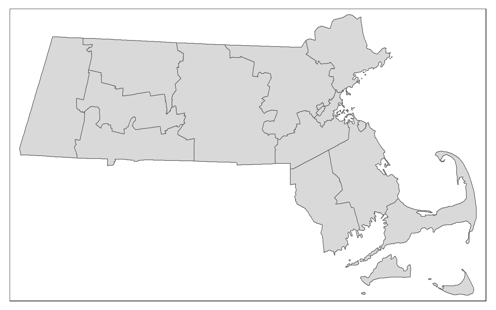
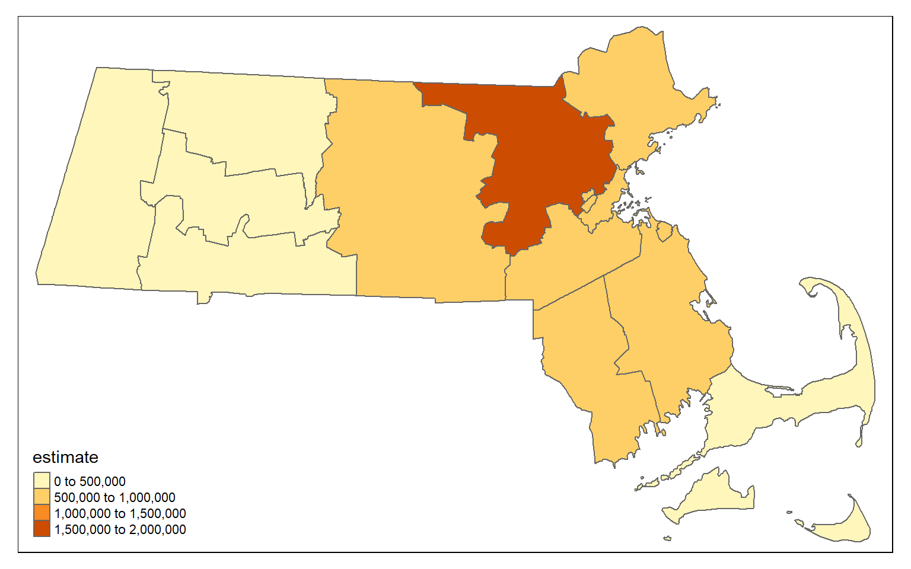
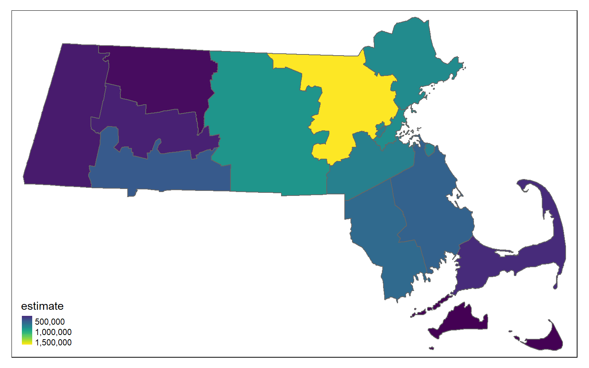
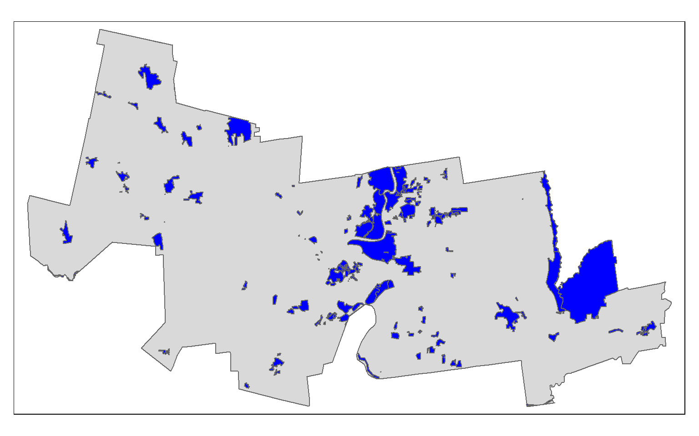
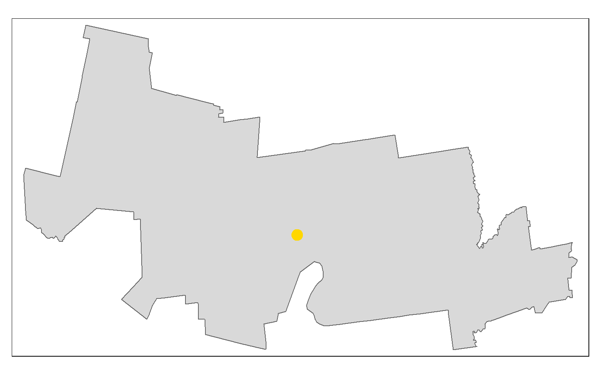

<script src="36_geospatial_files/libs/htmlwidgets-1.5.4/htmlwidgets.js"></script>
<script src="36_geospatial_files/libs/jquery-1.12.4/jquery.min.js"></script>
<link href="36_geospatial_files/libs/leaflet-1.3.1/leaflet.css" rel="stylesheet" />
<script src="36_geospatial_files/libs/leaflet-1.3.1/leaflet.js"></script>
<link href="36_geospatial_files/libs/leafletfix-1.0.0/leafletfix.css" rel="stylesheet" />
<script src="36_geospatial_files/libs/proj4-2.6.2/proj4.min.js"></script>
<script src="36_geospatial_files/libs/Proj4Leaflet-1.0.1/proj4leaflet.js"></script>
<link href="36_geospatial_files/libs/rstudio_leaflet-1.3.1/rstudio_leaflet.css" rel="stylesheet" />
<script src="36_geospatial_files/libs/leaflet-binding-2.1.1/leaflet.js"></script>
<script src="36_geospatial_files/libs/leaflet-providers-1.9.0/leaflet-providers_1.9.0.js"></script>
<script src="36_geospatial_files/libs/leaflet-providers-plugin-2.1.1/leaflet-providers-plugin.js"></script>


-   [Overview][]
-   [The Data][]
    -   [Checking the Coordinate Reference System (CRS)][]
-   [Creating Maps][]
    -   [Simple Maps][]
    -   [Interactive Maps][]
-   [Geospatial Aggregation and Subsetting][]
-   [Geospatial Computations][]
-   [Conclusion][]

## Overview

``` r
library(sf)
library(tidycensus)
library(tmap)
```

## The Data

Today we'll be looking at the [Massachusetts Historical Commission Historic Inventory][] data. This data set includes several locations considered "historic assets" of the commonwealth. We're going to see how many of them are close to Smith college, and maybe spark ideas for a few weekend trips.

The zip file containing the data can be [downloaded from here][Massachusetts Historical Commission Historic Inventory] under the downloads section. You want the "Download Geodatabase (17 MB)" version. Once you have it downloaded, place it somewhere easy to access. **Do not unzip the file**, we can load it into R as is. You will use `read_sf()` from the `sf` package to load in the data.

``` r
# Read in the MA Historic Inventory
ma_hi = read_sf("Path/to/data/MHC_Inventory_GDB.zip")
```

We will also want the boundaries of Massachusetts to serve as a background, so let's use `tidycensus` to grab that. You will need to [register for a census API key][], and set it using `census_api_key()`. Once that is done, we can use `get_acs()` to perform an API call for census data, including geospatial data.

``` r
# Set api key if you do not have one.
# I do so I will skip this
# census_api_key("YOUR KEY HERE", install = TRUE)

# get county boundaries in MA
ma_counties <- get_acs(geography = "county", 
              variables = c(total_pop = "B01003_001"), 
              state = "MA", 
              geometry = TRUE,
              year = 2020)
```

The Census has tons of useful geospatial boundaries. I'll include the most common ones here for reference.

|                           Geography                           |                        Definition                        | Available by  |        Available in        |
|:-------------------------------------------------------------:|:--------------------------------------------------------:|:-------------:|:--------------------------:|
|                             "us"                              |                      United States                       |               | get_acs(), get_decennial() |
|                           "region"                            |                      Census region                       |               | get_acs(), get_decennial() |
|                          "division"                           |                     Census division                      |               | get_acs(), get_decennial() |
|                            "state"                            |                   State or equivalent                    |     state     | get_acs(), get_decennial() |
|                           "county"                            |                   County or equivalent                   | state, county | get_acs(), get_decennial() |
|                     "county subdivision"                      |                    County subdivision                    | state, county | get_acs(), get_decennial() |
|                            "tract"                            |                       Census tract                       | state, county | get_acs(), get_decennial() |
|                         "block group"                         |                    Census block group                    | state, county | get_acs(), get_decennial() |
|                            "block"                            |                       Census block                       | state, county |      get_decennial()       |
|                            "place"                            |                 Census-designated place                  |     state     | get_acs(), get_decennial() |
| "metropolitan statistical area/micropolitan statistical area" |               Core-based statistical area                |     state     | get_acs(), get_decennial() |
|                  "combined statistical area"                  |                Combined statistical area                 |     state     | get_acs(), get_decennial() |
|                         "urban area"                          |              Census-defined urbanized areas              |               | get_acs(), get_decennial() |
|                   "congressional district"                    | Congressional district for the year-appropriate Congress |     state     | get_acs(), get_decennial() |
|                "school district (elementary)"                 |                Elementary school district                |     state     | get_acs(), get_decennial() |
|                 "school district (secondary)"                 |                Secondary school district                 |     state     | get_acs(), get_decennial() |
|                  "school district (unified)"                  |                 Unified school district                  |     state     | get_acs(), get_decennial() |
|             "zip code tabulation area" OR "zcta"              |                 Zip code tabulation area                 |               | get_acs(), get_decennial() |
|         "state legislative district (upper chamber)"          |                  State senate districts                  |     state     | get_acs(), get_decennial() |
|         "state legislative district (lower chamber)"          |                  State house districts                   |     state     | get_acs(), get_decennial() |
|                       "voting district"                       |               Voting districts (2020 only)               |     state     |      get_decennial()       |

### Checking the Coordinate Reference System (CRS)

One of the first steps when working on any spatial data is to check the Coordinate Reference System (CRS). Good documentation will always tell you what the CRS of your data is. The Massachusetts Historical Commission Historic Inventory does not state the CRS on its website. However, more advanced spatial data types include this information in the metadata of the file itself. We can check the CRS using the `st_crs()` function.

``` r
# check the crs of the ma_hi data
st_crs(ma_hi)
```

    Coordinate Reference System:
      User input: NAD83 / Massachusetts Mainland 
      wkt:
    PROJCRS["NAD83 / Massachusetts Mainland",
        BASEGEOGCRS["NAD83",
            DATUM["North American Datum 1983",
                ELLIPSOID["GRS 1980",6378137,298.257222101,
                    LENGTHUNIT["metre",1]]],
            PRIMEM["Greenwich",0,
                ANGLEUNIT["degree",0.0174532925199433]],
            ID["EPSG",4269]],
        CONVERSION["SPCS83 Massachusetts Mainland zone (meters)",
            METHOD["Lambert Conic Conformal (2SP)",
                ID["EPSG",9802]],
            PARAMETER["Latitude of false origin",41,
                ANGLEUNIT["degree",0.0174532925199433],
                ID["EPSG",8821]],
            PARAMETER["Longitude of false origin",-71.5,
                ANGLEUNIT["degree",0.0174532925199433],
                ID["EPSG",8822]],
            PARAMETER["Latitude of 1st standard parallel",42.6833333333333,
                ANGLEUNIT["degree",0.0174532925199433],
                ID["EPSG",8823]],
            PARAMETER["Latitude of 2nd standard parallel",41.7166666666667,
                ANGLEUNIT["degree",0.0174532925199433],
                ID["EPSG",8824]],
            PARAMETER["Easting at false origin",200000,
                LENGTHUNIT["metre",1],
                ID["EPSG",8826]],
            PARAMETER["Northing at false origin",750000,
                LENGTHUNIT["metre",1],
                ID["EPSG",8827]]],
        CS[Cartesian,2],
            AXIS["easting (X)",east,
                ORDER[1],
                LENGTHUNIT["metre",1]],
            AXIS["northing (Y)",north,
                ORDER[2],
                LENGTHUNIT["metre",1]],
        USAGE[
            SCOPE["Engineering survey, topographic mapping."],
            AREA["United States (USA) - Massachusetts onshore - counties of Barnstable; Berkshire; Bristol; Essex; Franklin; Hampden; Hampshire; Middlesex; Norfolk; Plymouth; Suffolk; Worcester."],
            BBOX[41.46,-73.5,42.89,-69.86]],
        ID["EPSG",26986]]

``` r
# check the crs of census data
st_crs(ma_counties)
```

    Coordinate Reference System:
      User input: NAD83 
      wkt:
    GEOGCRS["NAD83",
        DATUM["North American Datum 1983",
            ELLIPSOID["GRS 1980",6378137,298.257222101,
                LENGTHUNIT["metre",1]]],
        PRIMEM["Greenwich",0,
            ANGLEUNIT["degree",0.0174532925199433]],
        CS[ellipsoidal,2],
            AXIS["latitude",north,
                ORDER[1],
                ANGLEUNIT["degree",0.0174532925199433]],
            AXIS["longitude",east,
                ORDER[2],
                ANGLEUNIT["degree",0.0174532925199433]],
        ID["EPSG",4269]]

Right now our references systems do not match. We need to make sure they do, otherwise any plots we make or analyses we do will be misaligned. We can change once CRS to another using the `st_transform()` function. Here I'll change the `ma_counties` CRS to match the historic sites data.

``` r
# change the crs to match
ma_counties_transform = st_transform(x = ma_counties, st_crs(ma_hi))

# check the crs matches
st_crs(ma_hi) == st_crs(ma_counties_transform)
```

    [1] TRUE

## Creating Maps

### Simple Maps

To start out mapping journey, let's just map our historic sites. We can do that using the `tmap` package. It works in a similar way to ggplot, in that it builds layers on top of each other to create a final visualization. Here I say look at my `ma_counties` data, and draw polygons from that data.

``` r
# plot the basic counties
tm_shape(ma_counties_transform) +
  tm_polygons()
```



If I wanted to shade the counties by population (already included in my county data from our census api call), we just need to tell the polygons to be shaded by some variable. Note that is only works in this case because I have only **one** variable in a long format dataframe. If I had more, I would need to transform to wide first.

``` r
# plot with polygons shaded by population
tm_shape(ma_counties_transform) +
  tm_polygons(col = "estimate")
```



We can change how things are shaded with a few arguments. For example, below I change the color palette, and make it so the scale is continuous rather the categorical.

``` r
# plot with polygons shaded by population
tm_shape(ma_counties_transform) +
  tm_polygons(col = "estimate", palette = "viridis", style = "cont")
```



We can use `tm_layout()` and `tm_credits()` to add all of our important meta information. I also add a "title" to the polygons to change the legend title.

``` r
# plot with metadata
tm_shape(ma_counties_transform) +
  tm_polygons(col = "estimate", palette = "viridis", style = "cont", title = "Population") +
  tm_layout(title = "Population by county in Massachusetts",
            frame = FALSE) +
  tm_credits("American Community Survey 5-year estiamtes 2020", position = c("center", "bottom"))
```


### Interactive Maps

The cool thing about `tmap` is that is it super easy to turn your static maps interactive. All you need to do is call `tmap_mode()`, and set the mode to "view" rather than plot. From then on, any maps you plot will be interactive! You can switch back by calling `tmap_mode()` again and setting it to "plot."

{}
The polygons in the interactive map show here are slightly misaligned to the base map. This is an issue with this website, and should not be present when making your maps in R.
{}

``` r
# change modes
tmap_mode("view")

# plot the same map as above
tm_shape(ma_counties_transform) +
  tm_polygons(col = "estimate", palette = "viridis", style = "cont", id = "NAME", title = "Population")
```

<div id="htmlwidget-4c5b06cd64173c8eb2c7" style="width:768px;height:480px;" class="leaflet html-widget"></div>
<script type="application/json" data-for="htmlwidget-4c5b06cd64173c8eb2c7">{"x":{"options":{"crs":{"crsClass":"L.CRS.EPSG3857","code":null,"proj4def":null,"projectedBounds":null,"options":{}}},"calls":[{"method":"createMapPane","args":["tmap401",401]},{"method":"addProviderTiles","args":["Esri.WorldGrayCanvas",null,"Esri.WorldGrayCanvas",{"minZoom":0,"maxZoom":18,"tileSize":256,"subdomains":"abc","errorTileUrl":"","tms":false,"noWrap":false,"zoomOffset":0,"zoomReverse":false,"opacity":1,"zIndex":1,"detectRetina":false,"pane":"tilePane"}]},{"method":"addProviderTiles","args":["OpenStreetMap",null,"OpenStreetMap",{"minZoom":0,"maxZoom":18,"tileSize":256,"subdomains":"abc","errorTileUrl":"","tms":false,"noWrap":false,"zoomOffset":0,"zoomReverse":false,"opacity":1,"zIndex":1,"detectRetina":false,"pane":"tilePane"}]},{"method":"addProviderTiles","args":["Esri.WorldTopoMap",null,"Esri.WorldTopoMap",{"minZoom":0,"maxZoom":18,"tileSize":256,"subdomains":"abc","errorTileUrl":"","tms":false,"noWrap":false,"zoomOffset":0,"zoomReverse":false,"opacity":1,"zIndex":1,"detectRetina":false,"pane":"tilePane"}]},{"method":"addPolygons","args":[[[[{"lng":[-73.074845,-73.072889,-73.071867,-73.071837,-73.072897,-73.072672,-73.069227,-73.065745,-73.063353,-73.061206,-73.061384,-73.06426,-73.066574,-73.067206,-73.069285,-73.069827,-73.069442,-73.0685,-73.069182,-73.070546,-73.07213,-73.070596,-73.071113,-73.061903,-73.03492,-73.024443,-73.007867,-73.004294,-73.00185,-73.001458,-73.001195,-73.000278,-72.991875,-72.975549,-72.953931,-72.953272,-72.953159,-72.895638,-72.894788,-72.885208,-72.880602,-72.881183,-72.894566,-72.904276,-72.912302,-72.87218,-72.86863,-72.86847,-72.864279,-72.857634,-72.856671,-72.845044,-72.813422,-72.812576,-72.793414,-72.793292,-72.791987,-72.782111,-72.781039,-72.766556,-72.726096,-72.703391,-72.686861,-72.686235,-72.690455,-72.670033,-72.669602,-72.66777,-72.656536,-72.651842,-72.637452,-72.634585,-72.613138,-72.612007,-72.609948,-72.605232,-72.601209,-72.600376,-72.599364,-72.598816,-72.598933,-72.600232,-72.607781,-72.611555,-72.615071,-72.618009,-72.621342,-72.624029,-72.623191,-72.614115,-72.611633,-72.610749,-72.607926,-72.603803,-72.596151,-72.594956,-72.593448,-72.572202,-72.546356,-72.541264,-72.52429,-72.498062,-72.478335,-72.464446,-72.44712,-72.403947,-72.402922,-72.402907,-72.395478,-72.360766,-72.358219,-72.360159,-72.361667,-72.361275,-72.359384,-72.359859,-72.360999,-72.363529,-72.363853,-72.362646,-72.363477,-72.364603,-72.364979,-72.364667,-72.361991,-72.363292,-72.360877,-72.359038,-72.357338,-72.355018,-72.353714,-72.352323,-72.349568,-72.346547,-72.34554,-72.346193,-72.343207,-72.34168,-72.33632,-72.335968,-72.333875,-72.318556,-72.312609,-72.294493,-72.291567,-72.281295,-72.27767,-72.276588,-72.273772,-72.271439,-72.270548,-72.269248,-72.268231,-72.257614,-72.249755,-72.247013,-72.221218,-72.239127,-72.255674,-72.257504,-72.260159,-72.262792,-72.263963,-72.264691,-72.264398,-72.263276,-72.263132,-72.26375,-72.263924,-72.255924,-72.238436,-72.207907,-72.200626,-72.199348,-72.192938,-72.180093,-72.141886,-72.135011,-72.135042,-72.135086,-72.135082,-72.135112,-72.13518,-72.135388,-72.135491,-72.135705,-72.135715,-72.1432302502593,-72.1500880173965,-72.1988321207782,-72.2050807834552,-72.2412901545176,-72.249523,-72.2706561367986,-72.2999270688012,-72.317148,-72.3212520818703,-72.3212667983303,-72.3218210714148,-72.3669917600491,-72.3974333745419,-72.4414941437451,-72.45668,-72.4582913228665,-72.4596911701656,-72.4601204240419,-72.4797597224356,-72.5092040512358,-72.5245899680222,-72.5246152595797,-72.528131,-72.5314944001573,-72.5501111622106,-72.552858204224,-72.5530545610102,-72.560958712171,-72.5609752476445,-72.573231,-72.5741893219163,-72.582332,-72.5898262911392,-72.590233,-72.606933,-72.6069560573249,-72.607933,-72.6079909707697,-72.6169036025418,-72.61690464073,-72.6369752374858,-72.643134,-72.6632528827809,-72.6729633546716,-72.6731246644418,-72.678311259508,-72.6784620268016,-72.6820133741491,-72.6860801113328,-72.695927,-72.6994029866905,-72.7128274389607,-72.714557957256,-72.7192527914859,-72.755838,-72.757538,-72.753538,-72.751738,-72.754038,-72.757467,-72.758151,-72.760558,-72.762151,-72.76231,-72.761354,-72.759738,-72.761238,-72.763238,-72.763265,-72.766139,-72.766739,-72.7706452603117,-72.77475938856,-72.7948454404142,-72.7949002458136,-72.8085983692563,-72.816741,-72.8167357432203,-72.813541,-72.8349699391824,-72.847142,-72.863619,-72.8636384107871,-72.863733,-72.9242297429858,-72.9789786343673,-72.999549,-73.0087643066587,-73.053254,-73.0532880861326,-73.055797,-73.056549,-73.053905,-73.054651,-73.056128,-73.058004,-73.061742,-73.058153,-73.061805,-73.073087,-73.074167,-73.074837,-73.074845],"lat":[42.1061459999999,42.1070169999999,42.1081629999998,42.1093559999999,42.1103349999999,42.1116839999999,42.1139259999998,42.1147779999999,42.1158499999999,42.1181119999999,42.1193889999999,42.1227749999999,42.1247909999999,42.1273509999999,42.1308689999999,42.1332279999999,42.1349859999999,42.1354979999999,42.1389669999999,42.1401599999999,42.1435479999998,42.1446949999999,42.1482059999999,42.1470649999999,42.1436519999999,42.1803489999999,42.2384089999999,42.2513469999999,42.2510169999999,42.2651969999999,42.2765559999999,42.3125969999999,42.3182619999999,42.3292459999999,42.3437919999999,42.3438299999999,42.3438239999999,42.3407019999999,42.3314909999999,42.3326119999999,42.2653819999999,42.2649039999999,42.2538119999999,42.2457909999998,42.2391329999999,42.2164389999999,42.2233519999999,42.2236569999999,42.2322659999999,42.2404799999999,42.2405789999999,42.2417679999999,42.2450039999999,42.2349539999999,42.2368539999999,42.2352739999999,42.2173019999999,42.2172709999999,42.1997489999999,42.1972349999999,42.1902069999999,42.1862789999999,42.1833899999999,42.1890729999999,42.2130829999999,42.2165039999999,42.2182089999999,42.2254559999999,42.2277389999999,42.2376389999999,42.2679549999999,42.2739429999999,42.2862649999999,42.2855729999999,42.2852239999999,42.2844629999999,42.2812589999999,42.2773929999999,42.2753359999999,42.2699019999999,42.2680899999999,42.2653849999999,42.2605799999999,42.2569129999999,42.2520139999999,42.2483689999999,42.2418199999999,42.2354629999999,42.2309109999999,42.2260639999999,42.2227719999999,42.2194199999999,42.2162299999999,42.2138669999999,42.2118379999999,42.2116799999999,42.2115569999999,42.2138039999999,42.2164889999999,42.2169869999999,42.2187339999999,42.2216339999999,42.2238109999999,42.2253459999999,42.2272539999999,42.2318469999999,42.2262759999999,42.2261799999999,42.1857369999999,42.1895219999999,42.1898019999999,42.1901449999999,42.1934849999999,42.1946289999999,42.1942509999999,42.1963209999999,42.1972569999999,42.1970179999999,42.1979549999999,42.1985219999999,42.2020399999999,42.2031489999999,42.2066929999999,42.2072599999999,42.2073279999999,42.2060289999999,42.2053279999999,42.2065119999999,42.2090029999999,42.2088539999999,42.2070149999999,42.2070139999999,42.2101779999999,42.2107869999999,42.2131609999999,42.2159779999999,42.2186499999999,42.2192319999999,42.2195449999999,42.2201589999999,42.2207189999999,42.2248989999999,42.2265019999999,42.2314329999999,42.2322209999999,42.2350199999999,42.2331029999999,42.2338689999999,42.2358469999999,42.2363679999999,42.2371259999999,42.2327469999999,42.2293109999998,42.2298739999999,42.2390169999999,42.2420939999999,42.2452519999999,42.2268119999999,42.2097069999999,42.2078089999999,42.2058689999999,42.2025339999999,42.1998819999999,42.1967249999999,42.1935289999999,42.1926009999999,42.1901089999999,42.1883229999999,42.1838309999999,42.1809759999999,42.1747469999999,42.1638789999999,42.1612869999999,42.1537069999999,42.1545179999999,42.1561509999999,42.1609999999999,42.1617839999999,42.1406019999999,42.1118029999999,42.1114449999999,42.0906649999999,42.0835139999999,42.0631459999999,42.0529299999999,42.0315319999999,42.0302453396815,42.0303365108454,42.030419705761,42.0310110442371,42.0310868498097,42.0315261233386,42.0316259999999,42.0317138138475,42.0318354424152,42.0319069999999,42.031968532403,42.0319687530465,42.0319770632499,42.032654306324,42.0331107167354,42.0337713188136,42.0339989999999,42.0340056752258,42.0340114743721,42.0340132526418,42.0340946123474,42.0342165913444,42.0342803305696,42.0342804353449,42.0342949999999,42.0339852092182,42.0322704857244,42.0320174654911,42.0319993797685,42.0312713566217,42.0312698335983,42.0301409999999,42.0295675442086,42.0246949999999,42.0246949999999,42.0246949999999,42.0249949999999,42.0251287324844,42.0307949999999,42.03079763496,42.0312027430773,42.0312027902663,42.032115064202,42.0323949999999,42.0340691282377,42.03487715398,42.0348905768546,42.0353221627112,42.0353347083275,42.0356302222952,42.0359686227735,42.0367879999999,42.0367535946301,42.036620719195,42.0366035904983,42.0365571209568,42.0361949999999,42.0332949999999,42.0320949999999,42.0301949999999,42.0253949999999,42.0209469999999,42.0208649999999,42.0218459999999,42.0215269999999,42.0197749999999,42.0181829999999,42.0169949999999,42.0145949999999,42.0127949999999,42.0097419999999,42.0076949999998,42.0029949999999,42.0025731407606,42.0021288326821,41.9999596258501,41.9999537071037,41.9984743689455,41.9975949999999,41.9976589010849,42.0364939999999,42.0367490988265,42.0368939999999,42.0377089999999,42.0377091702699,42.0377099999999,42.038130042032,42.0385101754815,42.0386529999999,42.0388602821979,42.0398609999999,42.0398619684612,42.0450199999999,42.0474189999999,42.0549899999999,42.0575999999999,42.0588899999999,42.0594519999999,42.0619389999999,42.0667529999999,42.0706379999999,42.0942129999999,42.1018669999999,42.1041109999999,42.1061459999999]}]],[[{"lng":[-70.883352,-70.881583,-70.880207,-70.878634,-70.877583,-70.877166,-70.875989,-70.875199,-70.873953,-70.874386,-70.875264,-70.87605,-70.877096,-70.878874,-70.880089,-70.880621,-70.881681,-70.882656,-70.883465,-70.883352],"lat":[42.3404909999999,42.3414709999999,42.3423069999999,42.3427429999999,42.3428699999999,42.3433039999999,42.3435059999999,42.3436659999999,42.3436339999999,42.3426749999999,42.3417639999999,42.3412289999999,42.3411619999999,42.3410329999999,42.3409599999999,42.3411629999999,42.3405269999999,42.3402379999999,42.3400349999998,42.3404909999999]}],[{"lng":[-70.891755,-70.88861,-70.886251,-70.884777,-70.885956,-70.887529,-70.889544,-70.891018,-70.891804,-70.891755],"lat":[42.3388559999999,42.3396549999999,42.3399459999999,42.3393279999999,42.3384559999999,42.3382019999999,42.3383109999999,42.3380569999999,42.3381289999999,42.3388559999999]}],[{"lng":[-70.892296,-70.89111,-70.888954,-70.888775,-70.889151,-70.89077,-70.891952,-70.892492,-70.892296],"lat":[42.3283939999999,42.3284449999999,42.3289019999999,42.3284609999999,42.3277399999999,42.3276069999999,42.3272309999999,42.3280299999999,42.3283939999999]}],[{"lng":[-70.898407,-70.89721,-70.8956,-70.894605,-70.894605,-70.895156,-70.896714,-70.897354,-70.898407],"lat":[42.3402659999999,42.3433239999999,42.3438919999999,42.3423789999999,42.3403089999999,42.3388789999999,42.3384749999999,42.3394919999999,42.3402659999999]}],[{"lng":[-70.898439,-70.897259,-70.897063,-70.896031,-70.894601,-70.894065,-70.893967,-70.895013,-70.895692,-70.89608,-70.897554,-70.897853,-70.898586,-70.898439],"lat":[42.3311909999999,42.3326439999999,42.3339519999999,42.3347149999999,42.3350959999999,42.3349799999999,42.3344969999998,42.3338069999999,42.3319449999999,42.3303549999999,42.3302459999999,42.3306779999999,42.3305009999999,42.3311909999999]}],[{"lng":[-70.95108,-70.94864,-70.941654,-70.9357,-70.935272,-70.929357,-70.92638,-70.926638,-70.930004,-70.935311,-70.937332,-70.942561,-70.94902,-70.95108],"lat":[42.2897259999999,42.2916369999999,42.2922139999999,42.2965229999999,42.3021009999999,42.3033209999999,42.3014059999999,42.2992039999999,42.2968109999999,42.2919269999999,42.2849159999999,42.2875219999999,42.2859459999999,42.2897259999999]}],[{"lng":[-71.079343,-71.06707,-71.067006,-71.061256,-71.057766,-71.044305,-71.041056,-71.034188,-71.025534,-71.021859,-71.016723,-71.012356,-71.002029,-71.001974,-71.002152,-70.98127,-70.977437,-70.970875,-70.954645,-70.948963,-70.940768,-70.934566,-70.928462,-70.924877,-70.923324,-70.921367,-70.921168,-70.919458,-70.918685,-70.916997,-70.916264,-70.914745,-70.916334,-70.92049,-70.92209,-70.922874,-70.92349,-70.923751,-70.92239,-70.92579,-70.929591,-70.93129,-70.93111,-70.931019,-70.931029,-70.931191,-70.933491,-70.932435,-70.91932,-70.917081,-70.918191,-70.917478,-70.90899,-70.9082859092802,-70.90752,-70.9069660588235,-70.9034769361702,-70.902528,-70.8965659314121,-70.895873,-70.8942117425578,-70.892546,-70.8929968778125,-70.89421,-70.8927716197066,-70.8905896103668,-70.889456,-70.8871799631343,-70.8867999046488,-70.883514,-70.879902910225,-70.87781,-70.877311505565,-70.8767649133908,-70.8765190603828,-70.875908,-70.87876,-70.882801,-70.8873341640442,-70.8901577364405,-70.890169,-70.899676,-70.90443,-70.901815,-70.893972,-70.884702,-70.878285,-70.879473,-70.879545702204,-70.8796530357469,-70.8804813104565,-70.8808635497134,-70.883039,-70.8832916513101,-70.8846894626001,-70.8851410937082,-70.8861491046856,-70.886842,-70.8869301047558,-70.8870525684372,-70.887317,-70.8910421842102,-70.8915300137207,-70.893259,-70.903954,-70.910372,-70.915588,-70.923444,-70.92392,-70.91749,-70.9170191133827,-70.9107162913761,-70.907556,-70.895862,-70.8906979295597,-70.889456,-70.8832410135449,-70.88268,-70.8824282716909,-70.8818999752362,-70.8814092577991,-70.881242,-70.8792973528757,-70.8766537829944,-70.8758586416714,-70.8718524883734,-70.870873,-70.8676126834855,-70.8675590249466,-70.8663597498995,-70.861807,-70.8574949022692,-70.857337473493,-70.851093,-70.831075,-70.8246607239285,-70.825735,-70.826986,-70.836237,-70.839003,-70.840627,-70.844627,-70.844753,-70.845698,-70.84729,-70.848798,-70.84822,-70.849301,-70.841238,-70.841152,-70.844664,-70.85338,-70.8408,-70.827015,-70.797111,-70.791372,-70.789142,-70.788937,-70.784814,-70.785557,-70.785523,-70.787883,-70.78868,-70.786771,-70.784514,-70.781973,-70.783941,-70.783354,-70.786617,-70.789041,-70.786725,-70.784821,-70.7814619230446,-70.776307,-70.774450604306,-70.773944,-70.766338,-70.7633842538665,-70.7633031801226,-70.762773,-70.764757,-70.7624723600298,-70.760683,-70.760158,-70.7589031398905,-70.754488,-70.7494879891232,-70.7487847258233,-70.74723,-70.7450887657164,-70.7448462152443,-70.739145,-70.7337727397926,-70.73056,-70.722269,-70.718089,-70.712993,-70.7134505816038,-70.714286,-70.715895,-70.71595,-70.718707,-70.7186428798319,-70.714761,-70.714301,-70.7114363813575,-70.7069089624742,-70.706264,-70.685315,-70.6794649147252,-70.663931,-70.6602245557513,-70.6520263592576,-70.6450937366011,-70.640169,-70.63848,-70.6440083705761,-70.6442180655163,-70.647349,-70.6477037799946,-70.64819,-70.6459042609167,-70.643208,-70.63086,-70.620277,-70.610983,-70.6084707681393,-70.597892,-70.602704,-70.614046,-70.622542,-70.631919,-70.639137,-70.641199,-70.639655,-70.636387,-70.63395,-70.634426,-70.629857,-70.624205,-70.614223,-70.6155522412943,-70.617788,-70.644337,-70.6503678182765,-70.650874,-70.656054,-70.664373,-70.66936,-70.6707556564096,-70.6711608669602,-70.671666,-70.667512,-70.670934,-70.678798,-70.686798,-70.695809,-70.712204,-70.7110208234907,-70.710034,-70.706443,-70.700025,-70.698837,-70.698981,-70.6934579427172,-70.690986,-70.682199,-70.678159,-70.676257,-70.67196734164,-70.6653775253817,-70.662476,-70.6593222492939,-70.6561361461946,-70.653202,-70.6523772854508,-70.646785,-70.638704,-70.632762,-70.6333140936461,-70.6362376972307,-70.638466,-70.6401014270462,-70.6438616863415,-70.6439074908687,-70.644884,-70.6458240285237,-70.6458447305326,-70.6483001259717,-70.648686,-70.6532846562383,-70.654628,-70.654628,-70.6531117834642,-70.650826,-70.6478152313973,-70.64417,-70.631573,-70.6301914710881,-70.623513,-70.616491,-70.608166,-70.5985378337661,-70.598078,-70.591593,-70.583572,-70.5786622509283,-70.5782481137248,-70.5747839162444,-70.567767,-70.5669662986136,-70.5669168534249,-70.5663839559599,-70.565974,-70.5607745757964,-70.554793667539,-70.5546799787451,-70.5546139698642,-70.552941,-70.543975,-70.5421794180868,-70.539189,-70.540067,-70.53787,-70.5399667336356,-70.541933,-70.544916,-70.546386,-70.54741,-70.5467198348985,-70.545949,-70.5353823047374,-70.5342836711278,-70.532084,-70.532972,-70.5318229470586,-70.531439,-70.5313247493203,-70.5309927246594,-70.530978,-70.530494,-70.525567,-70.526450164451,-70.5312019360598,-70.53255,-70.5331497601783,-70.536264,-70.537737642737,-70.542065,-70.543168,-70.5411551075132,-70.54103,-70.5372893339932,-70.545869,-70.545887,-70.547559,-70.560881,-70.565363,-70.56857,-70.581198,-70.603945,-70.632555,-70.629978,-70.62587,-70.625156,-70.621622,-70.620785,-70.621139,-70.621571,-70.623193,-70.625988,-70.632706,-70.633268,-70.63258,-70.63939,-70.639476,-70.640276,-70.6430739126182,-70.6435581909479,-70.648805,-70.650469,-70.660452,-70.674064,-70.676138,-70.665205,-70.656206,-70.656596,-70.664005,-70.670453,-70.679228,-70.685883,-70.6875876100204,-70.68826,-70.697054,-70.706166,-70.708193,-70.715118,-70.7172020701806,-70.718739,-70.7246106713291,-70.726331,-70.720822,-70.720949,-70.725813,-70.7267824034457,-70.728526,-70.7267775846835,-70.7235480258421,-70.721302,-70.714886,-70.7125702351467,-70.712028,-70.71423,-70.7147973913177,-70.722724,-70.727477,-70.726051,-70.723199,-70.717451,-70.714906,-70.718355,-70.715045,-70.7155248504622,-70.715593,-70.719829,-70.721535,-70.729395,-70.739599,-70.7431971765603,-70.744353,-70.748868,-70.7524200084092,-70.7552971883823,-70.755347,-70.752434,-70.751721,-70.749106,-70.743402,-70.745104,-70.75077,-70.752434,-70.758376,-70.7631703417353,-70.763842,-70.761856,-70.756712,-70.76236,-70.761941,-70.758198,-70.757065,-70.762416,-70.762178,-70.766457,-70.768358,-70.765463,-70.769318,-70.773654,-70.775798,-70.776709,-70.7772251743259,-70.7785294548519,-70.7847290382112,-70.7850845697538,-70.786027,-70.790829,-70.795216,-70.802346,-70.8054581890761,-70.8089299773251,-70.809001,-70.8101608402815,-70.8134257830072,-70.8134994453536,-70.8138377279589,-70.814706,-70.8205775867803,-70.821598,-70.8217590041716,-70.823262,-70.816351,-70.804664,-70.8012879270844,-70.800215,-70.801063,-70.8042961643225,-70.8097350919012,-70.8099820644391,-70.810279,-70.817683,-70.822074,-70.827774,-70.835296,-70.8431763095007,-70.845242,-70.848036,-70.852141,-70.858212,-70.859489,-70.865003,-70.87064,-70.886439,-70.904438,-70.907184,-70.921782,-70.947894,-70.960648,-70.987963,-71.014044,-71.026288,-71.014591,-71.023157,-71.036308,-71.03657,-71.010944,-71.007455,-70.996635,-70.990454,-70.985934,-70.982739,-70.978308,-70.973717,-70.977169,-70.977163,-70.987256,-70.991849,-70.993152,-70.99115,-70.991978,-70.993279,-70.995082,-70.997132,-70.997397,-70.997223,-70.996438,-70.995631,-70.996804,-70.999669,-70.999773,-71.010567,-71.016588,-71.021046,-71.042627,-71.049485,-71.049776,-71.054184,-71.054718,-71.05716,-71.060725,-71.063867,-71.069595,-71.071197,-71.07377,-71.074206,-71.076069,-71.078758,-71.080483,-71.079343],"lat":[42.0959929999999,42.1008799999999,42.1009049999999,42.1031939999999,42.1045699999999,42.1098779999999,42.1111689999999,42.1138719999999,42.1172929999999,42.1187449999999,42.1207529999999,42.1224639999999,42.1265059999999,42.1265259999999,42.1273039999999,42.1355109999999,42.1370109999998,42.1395799999999,42.1459389999999,42.1481559999999,42.1513649999999,42.1537919999999,42.1561839999999,42.1575799999999,42.1679359999999,42.1809799999999,42.1823009999999,42.1937029999999,42.1988589999999,42.2101179999999,42.2149959999999,42.2251149999999,42.2257179999999,42.2257999999999,42.2252999999999,42.2256359999999,42.2258999999999,42.2280549999999,42.2292999999999,42.2367999999999,42.2426999999999,42.2442989999999,42.2463929999999,42.2470409999999,42.2471209999999,42.2485999999999,42.2499999999999,42.2526439999999,42.2547029999999,42.2555999999999,42.2600999999999,42.2634829999999,42.2643989999999,42.2647153306131,42.2623059999999,42.2623059999999,42.2623059999999,42.2623059999999,42.2626204532041,42.2626569999999,42.2625696179583,42.2624819999999,42.2604798749058,42.2550929999999,42.2533898778562,42.2508062576261,42.2494639999999,42.2482509052921,42.24804833962,42.2462969999999,42.2481905430429,42.2492879999999,42.2512707078865,42.2534447193473,42.2544225731882,42.2568529999999,42.2589629999999,42.2681099999999,42.2730873747444,42.2761876327094,42.2761999999999,42.2797169999999,42.2807729999999,42.2828829999999,42.2814759999999,42.2777829999999,42.2783109999999,42.2820029999999,42.2821284857164,42.28231374594,42.2837433675993,42.2844031215607,42.2881579999999,42.2884499806751,42.2900653844668,42.2905873194445,42.2917522440423,42.2925529999999,42.2934987813681,42.2948133967608,42.2976519999999,42.2983134051399,42.2984000190971,42.2987069999999,42.3016949999999,42.2990579999999,42.3024629999999,42.3023979999999,42.3050349999999,42.3056859999999,42.3057904255302,42.3071881622808,42.3078889999999,42.3059339999999,42.3096018926791,42.3104839999999,42.3104005342727,42.3103929999999,42.3086897201335,42.3051150855687,42.3017947234949,42.3006629999999,42.2978507728199,42.2940278072139,42.2928779235086,42.2870844748922,42.2856679999999,42.2821786054333,42.2821211767103,42.2808376375771,42.2759649999999,42.2728679688222,42.27275490046,42.2682699999999,42.2674239999999,42.2659346457722,42.2646139999999,42.2643679999999,42.2646639999999,42.2631379999999,42.2609889999999,42.2604259999999,42.2597789999999,42.2580719999998,42.2541009999999,42.2525379999999,42.2486709999999,42.2473389999999,42.2445159999999,42.2433459999999,42.2422709999999,42.2396069999999,42.2131179999999,42.2007859999999,42.2181759999999,42.2215119999999,42.2228079999999,42.2254749999999,42.2258809999999,42.2263449999998,42.2294639999999,42.2290999999999,42.2325969999999,42.2340409999999,42.2346929999999,42.2364319999999,42.2376469999999,42.2405139999999,42.2395719999999,42.2401699999999,42.2425499999999,42.2462989999999,42.2487180195671,42.2489529999999,42.2530860925713,42.2542139999999,42.2547419999999,42.2510972512646,42.2509972110405,42.2503429999999,42.2440619999999,42.242480024213,42.2412409999999,42.2350349999999,42.233626989415,42.2286729999999,42.223949236624,42.2232848281853,42.2218159999999,42.2212341457363,42.221168235608,42.2196189999999,42.2141879171415,42.2109399999999,42.2079589999999,42.2089849999999,42.2044309999999,42.2023667513573,42.1985979999999,42.1958989999999,42.1901449999999,42.1848529999999,42.1847186336365,42.1765839999999,42.1687829999999,42.1667706027303,42.1635900867399,42.1631369999999,42.1330249999999,42.1262707559226,42.1083359999999,42.1052626866832,42.0984648975444,42.092716498243,42.0886329999999,42.0815789999999,42.0783077305463,42.0781836490212,42.0763309999999,42.0730025646162,42.0684409999999,42.0603569529007,42.0508209999999,42.0360449999999,42.0270869999999,42.0157369999999,42.0135901557691,42.0045499999999,42.0021439999999,42.0066119999999,42.0021419999999,41.9928639999999,41.9938949999999,42.0059249999999,42.0107959999999,42.0138299999999,42.0120319999999,42.0049679999999,42.0014559999999,42.0060279999999,42.0111489999999,42.0135196356659,42.0175069999999,42.0458949999999,42.0462197434653,42.0462469999999,42.0420469999999,42.0411639999999,42.0371159999999,42.0275981800967,42.0248348058037,42.0213899999999,42.0123199999999,42.0077859999999,42.0055099999999,42.0127639999999,42.0133459999999,42.0075859999999,42.0032011587612,41.9995439999999,42.0007289999999,41.9982559999999,41.9918969999999,41.9871029999998,41.9830928251998,41.9812979999999,41.9798839999998,41.9768799999999,41.9722859999998,41.9686459691703,41.9630541172492,41.9605919999999,41.9578371440078,41.9550540276388,41.9524909999999,41.9520820485123,41.9493089999999,41.9494859999999,41.9486019999999,41.9493548373735,41.9533414763429,41.9563799999999,41.9589921474993,41.9649981334818,41.9650712936888,41.9666309999999,41.9680291749871,41.968059966639,41.9717120605916,41.9722859999998,41.9766617661344,41.9779399999999,41.9807669999999,41.9813304965715,41.9821799999999,41.9787435803673,41.9745829999999,41.9530219999999,41.9513509670765,41.9432729999999,41.9402039999999,41.9407009999999,41.9474496878904,41.9477719999999,41.9493259999999,41.9500069999999,41.9467427391175,41.946467398799,41.9441642170765,41.9394989999999,41.9380378204481,41.9379475891836,41.9369751181821,41.9362269999999,41.9335995613592,41.9305772133362,41.9305197626804,41.9304864062398,41.9296409999999,41.9262789999999,41.926464335868,41.9267729999999,41.9236729999999,41.9209459999999,41.9199133728759,41.9189449999999,41.9186369999999,41.9167509999999,41.9119339999999,41.9096778545348,41.9071579999999,41.8937524342106,41.8923586393896,41.8895679999999,41.8858179999999,41.8821002553233,41.8808579999999,41.8782711266937,41.8707533969531,41.8704199999999,41.8654919999999,41.8587299999999,41.8564448768005,41.8441500165073,41.8406619999999,41.8396925976438,41.8346589999999,41.8337963055101,41.8312629999999,41.8244459999999,41.8162626223125,41.8157539999999,41.8108590611293,41.8035159999999,41.8034999999999,41.8020559999999,41.7905439999999,41.7866689999999,41.7856469999999,41.7816249999998,41.7742959999999,41.7629039999999,41.7611339999998,41.7551989999999,41.7511439999999,41.7489719999999,41.7475299999999,41.7470179999999,41.7464179999999,41.7456149999999,41.7449689999999,41.7377589999999,41.7354649999999,41.7336569999999,41.7280179999999,41.7264729999999,41.7236089999998,41.7176035866854,41.7176395342178,41.7180289999999,41.7134159999999,41.7050759999999,41.6913709999998,41.6926539999999,41.7038339999999,41.7133869999999,41.7154009999999,41.7162009999999,41.7219119999999,41.7274309999998,41.7270759999999,41.7246585661006,41.7237049999998,41.7292039999999,41.7289839999998,41.7309589999999,41.7323969999999,41.7343210670016,41.7357399999999,41.733412832056,41.7327309999999,41.7276079999999,41.7232199999998,41.7245919999999,41.7239784851764,41.7228749999999,41.7204772216858,41.7160482018296,41.7129679999999,41.7103119999999,41.70765105816,41.7070279999999,41.7017309999999,41.7018714784483,41.7038339999999,41.7024139999999,41.7006399999999,41.6960259999999,41.6939799999998,41.6919379999999,41.6901569999999,41.6810079999999,41.6759730727047,41.6752579999998,41.6779929999999,41.6814709999999,41.6881399999998,41.6917659999998,41.6964676981052,41.6979779999998,41.6974459999999,41.6957355097643,41.6943499870731,41.6943259999998,41.6901689999999,41.6855539999999,41.6804059999998,41.6747259999999,41.6724449999998,41.6756129999998,41.6784539999999,41.6805839999999,41.6773140940377,41.6768559999999,41.6729329999999,41.6669139999999,41.6677349999999,41.6654929999998,41.6612249999999,41.6528909999999,41.6527079999999,41.6482679999999,41.6484459999999,41.6457819999998,41.6415749999999,41.6411449999998,41.6450329999999,41.6491449999999,41.6507559999999,41.6508381513762,41.651045733263,41.6520324237676,41.6520890081501,41.6522389999999,41.6532309999999,41.6509319999999,41.6557269999999,41.6569728109238,41.6583625695857,41.6583909999999,41.6581382950972,41.6574269324665,41.6574108829842,41.6573371782904,41.6571479999998,41.6551808650788,41.6548389999999,41.6542720021358,41.6489789999999,41.6459949999999,41.6411569999999,41.6340208818389,41.6317529999999,41.6295129999999,41.6278851915735,41.6251468426191,41.6250224988066,41.6248729999999,41.6234319999999,41.6274849999999,41.6246349999999,41.6245319999999,41.6284868153778,41.6446649999998,41.6524629999998,41.6639159999999,41.6811669999999,41.6847359999999,41.7001639999999,41.7159569999999,41.7602319999999,41.7579999999999,41.7635429999999,41.7912439999999,41.7881569999999,41.7866479999999,41.7834149999999,41.7803329999999,41.7788879999998,41.7995679999999,41.8061759999999,41.8163239999999,41.8165249999999,41.8358549999999,41.8384849999998,41.8464949999999,41.8500709999999,41.8539569999999,41.8554089999999,41.8572459999999,41.8608789999999,41.8746959999999,41.8751489999998,41.9058079999999,41.9060809999999,41.9064449999998,41.9091329999999,41.9156019999999,41.9164649999999,41.9149679999999,41.9166819999999,41.9183989999999,41.9231109999998,41.9237779999999,41.9255879999999,41.9274039999999,41.9284389999999,41.9296709999999,41.9400789999999,41.9438649999999,41.9464069999999,41.9595159999999,41.9630939999999,41.9643069999999,41.9827159999999,41.9850569999999,41.9956749999999,42.0111709999999,42.0248019999999,42.0497039999998,42.0564589999999,42.0672889999999,42.0691159999999,42.0769539999999,42.0882739999999,42.0955389999999,42.0959929999999]}]],[[{"lng":[-71.89877002948,-71.8238024745524,-71.8053900684015,-71.7725568791756,-71.7712309238909,-71.745817,-71.7303182541602,-71.7268565049543,-71.7013916601883,-71.6723850899704,-71.651873914723,-71.636214,-71.631814,-71.6306223191203,-71.6197896004541,-71.5858548040503,-71.5673092780746,-71.5426896188347,-71.5425377313421,-71.4956806678101,-71.4881010212958,-71.488035032966,-71.467553246573,-71.457687763627,-71.4517143448072,-71.4491741670486,-71.4323540138532,-71.432335697233,-71.3881948332448,-71.3869430269232,-71.3697250416668,-71.367434834859,-71.3651866518469,-71.351874,-71.3517972926831,-71.3516242384972,-71.3303306369927,-71.330206,-71.3134922158094,-71.313446645429,-71.294205,-71.2888325141297,-71.2790530463259,-71.278929,-71.2785168854597,-71.2754068854342,-71.267905,-71.2663745651487,-71.255605,-71.2551987703894,-71.255147,-71.25242,-71.252064,-71.251236,-71.249323,-71.247913,-71.245937,-71.244272,-71.239565,-71.238179,-71.240397,-71.24249,-71.244172,-71.250112,-71.251716,-71.254966,-71.256188,-71.239065,-71.229261,-71.226182,-71.223955,-71.198951,-71.176213,-71.175996,-71.171758,-71.172215,-71.175013,-71.177915,-71.178388,-71.177495,-71.182023,-71.181349,-71.171235,-71.164879,-71.163909,-71.160667,-71.159517,-71.158617,-71.156564,-71.155721,-71.154419,-71.148653,-71.146608,-71.145942,-71.143197,-71.141203,-71.135456,-71.12136,-71.110996,-71.089365,-71.076167,-71.058766,-71.059352,-71.057425,-71.033998,-71.028312,-71.03098,-71.03546,-71.036665,-71.037663,-71.040098,-71.041532,-71.044281,-71.044681,-71.049753,-71.053006,-71.05704,-71.06326,-71.06511,-71.070978,-71.07515,-71.067567,-71.066983,-71.065855,-71.061963,-71.060673,-71.05838,-71.057513,-71.040983,-71.038599,-71.040913,-71.040989,-71.040108,-71.038302,-71.039483,-71.037075,-71.036633,-71.036946,-71.0349,-71.035839,-71.038721,-71.042229,-71.043774,-71.042087,-71.040431,-71.040019,-71.041859,-71.045209,-71.046949,-71.050252,-71.052629,-71.054214,-71.053365,-71.047778,-71.047089,-71.046949,-71.041591,-71.039968,-71.027572,-71.025836,-71.024996,-71.020377,-71.021005,-71.021348,-71.021581,-71.023002,-71.023036,-71.024088,-71.028227,-71.029319,-71.031086,-71.031729,-71.032566,-71.033181,-71.033442,-71.03491,-71.035295,-71.035629,-71.037097,-71.037743,-71.039075,-71.039487,-71.040887,-71.044821,-71.046148,-71.046161,-71.047061,-71.048145,-71.051945,-71.053095,-71.050002,-71.050695,-71.055295,-71.055524,-71.057395,-71.065695,-71.070896,-71.070696,-71.066997,-71.066944,-71.069322,-71.072696,-71.073496,-71.077405,-71.077638,-71.078727,-71.0795,-71.080932,-71.080701,-71.075657,-71.073928,-71.072689,-71.072466,-71.070545,-71.067115,-71.064059,-71.069478,-71.070575,-71.070644,-71.071537,-71.074792,-71.075657,-71.07571,-71.076403,-71.077334,-71.079361,-71.083398,-71.085175,-71.087511,-71.091235,-71.093002,-71.094025,-71.09789,-71.103032,-71.104316,-71.110358,-71.110589,-71.113196,-71.116902,-71.117165,-71.116681,-71.116597,-71.116704,-71.116936,-71.116921,-71.11723,-71.118444,-71.12248,-71.123204,-71.128203,-71.130997,-71.133101,-71.131971,-71.136303,-71.139892,-71.143667,-71.144492,-71.14717,-71.148332,-71.154475,-71.159746,-71.161508,-71.163888,-71.167625,-71.169474,-71.170397,-71.171387,-71.173935,-71.174798,-71.174265,-71.171898,-71.170003,-71.166699,-71.16674,-71.168936,-71.168886,-71.167565,-71.162732,-71.160917,-71.157036,-71.164599,-71.167348,-71.169223,-71.170485,-71.17172,-71.173715,-71.178847,-71.174395,-71.1698,-71.16642,-71.164702,-71.169808,-71.170439,-71.178636,-71.190904,-71.191247,-71.190886,-71.192645,-71.195268,-71.195793,-71.196732,-71.20159,-71.202975,-71.20524,-71.20635,-71.207881,-71.211565,-71.211253,-71.211289,-71.213275,-71.217017,-71.220855,-71.22411,-71.226688,-71.226311,-71.227068,-71.226286,-71.227543,-71.228035,-71.228256,-71.230913,-71.23442,-71.238421,-71.240789,-71.246146,-71.246799,-71.24919,-71.252937,-71.254594,-71.257818,-71.258474,-71.258999,-71.263092,-71.265687,-71.269958,-71.28137,-71.291793,-71.29705,-71.305981,-71.317208,-71.327327,-71.32975,-71.326396,-71.326351,-71.324323,-71.323662,-71.321658,-71.321541,-71.31397,-71.30846,-71.305832,-71.302922,-71.332496,-71.332434,-71.329436,-71.329772,-71.33088,-71.331185,-71.329695,-71.331369,-71.333581,-71.336746,-71.341012,-71.341657,-71.34307,-71.342887,-71.340966,-71.338623,-71.338505,-71.340295,-71.34681,-71.348299,-71.349983,-71.351479,-71.352179,-71.3507,-71.346541,-71.346815,-71.34417,-71.361986,-71.375626,-71.378391,-71.384765,-71.404427,-71.403139,-71.402295,-71.411427,-71.42355,-71.42373,-71.426624,-71.430174,-71.444067,-71.463957,-71.472744,-71.478119,-71.478096,-71.478027,-71.480013,-71.484633,-71.493136,-71.497378,-71.502626,-71.506894,-71.51538,-71.523219,-71.53589,-71.539277,-71.555738,-71.555435,-71.556447,-71.556269,-71.556782,-71.56495,-71.572271,-71.571548,-71.578225,-71.58291,-71.589216,-71.602221,-71.599318,-71.592868,-71.589855,-71.586759,-71.577968,-71.564564,-71.558533,-71.558503,-71.556584,-71.552412,-71.550115,-71.548255,-71.547939,-71.543668,-71.541692,-71.540003,-71.538011,-71.536308,-71.532255,-71.527995,-71.522992,-71.522385,-71.522178,-71.518221,-71.513882,-71.51054,-71.510226,-71.508985,-71.506478,-71.505928,-71.505882,-71.500317,-71.499575,-71.499015,-71.497046,-71.493346,-71.493182,-71.489897,-71.48635,-71.485109,-71.486744,-71.486797,-71.508216,-71.511238,-71.516527,-71.531883,-71.537316,-71.551126,-71.569085,-71.570308,-71.57825,-71.58521,-71.592502,-71.597363,-71.601885,-71.605266,-71.603591,-71.60396,-71.604104,-71.611474,-71.61826,-71.620658,-71.625825,-71.624702,-71.610007,-71.603065,-71.607759,-71.58794,-71.58015,-71.602537,-71.604251,-71.603725,-71.602631,-71.58526,-71.579095,-71.564584,-71.5591,-71.550702,-71.548903,-71.543394,-71.560367,-71.550691,-71.534855,-71.532718,-71.529841,-71.531377,-71.53376,-71.53878,-71.556019,-71.572041,-71.57541,-71.57794,-71.580287,-71.588559,-71.591124,-71.593012,-71.593189,-71.594648,-71.602898,-71.607852,-71.618316,-71.619927,-71.621097,-71.625126,-71.628475,-71.632017,-71.634011,-71.635885,-71.636432,-71.63665,-71.639206,-71.638938,-71.635869,-71.643407,-71.665334,-71.675741,-71.678969,-71.677691,-71.672687,-71.671902,-71.668029,-71.664601,-71.694113,-71.70134,-71.732257,-71.775755,-71.775325,-71.794186,-71.834458,-71.844843,-71.858483,-71.856814,-71.856393,-71.857757,-71.863754,-71.865751,-71.869778,-71.87745,-71.897103,-71.89877002948],"lat":[42.7114218822192,42.7093952338361,42.7088974788647,42.7080098771559,42.707974031714,42.7072869999999,42.7069477621025,42.7068719910347,42.7063146142969,42.7056797159642,42.7052307655758,42.7048879999999,42.7047879999999,42.7047597596235,42.7045030465578,42.7036988619491,42.7032593712749,42.7026759361839,42.7026723367639,42.7015619211053,42.7013822991328,42.7013807353456,42.7008953592974,42.7006615677211,42.7005200100286,42.7004598130605,42.7000612101588,42.7000607760927,42.6990147287551,42.6989850635299,42.6985770328298,42.6985227596571,42.6984694823616,42.6981539999999,42.6981505873244,42.6981428882181,42.6971955450461,42.6971899999999,42.6970971482224,42.6970968950607,42.6969899999999,42.7020079777688,42.7111421389775,42.7112579999999,42.7118049938273,42.7159328530775,42.7258899999999,42.7271963443498,42.7363889999999,42.7366383439843,42.7365539999999,42.7259249999999,42.7244849999999,42.7212219999999,42.7136639999999,42.7081189999999,42.7003089999999,42.6937459999999,42.6752369999999,42.6694189999999,42.6667299999999,42.6623459999999,42.6615139999999,42.6609869999999,42.6603319999999,42.6577749999999,42.6571449999999,42.6489149999999,42.6442069999999,42.6427269999999,42.6416559999999,42.6296519999999,42.6187239999999,42.6186209999999,42.6165449999999,42.6155629999999,42.6147269999999,42.6130799999999,42.6107989999999,42.6089579999999,42.6084309999999,42.6083729999999,42.6019699999999,42.5980209999999,42.6018519999999,42.6053179999999,42.6076589999999,42.6129479999999,42.6149769999999,42.6150919999999,42.6152679999999,42.6131679999999,42.6099959999999,42.6083349999999,42.6040389999999,42.6032069999999,42.5991159999999,42.6002799999999,42.6011639999999,42.6030069999999,42.6041359999999,42.6090769999999,42.6063269999999,42.6047439999998,42.5854929999999,42.5740819999999,42.5726539999999,42.5702589999999,42.5716489999999,42.5711639999999,42.5715889999999,42.5734899999999,42.5738769999999,42.5729489999999,42.5710909999999,42.5729939999999,42.5740189999999,42.5646849999999,42.5619379999999,42.5558889999999,42.5310349999999,42.5246799999999,42.5247429999999,42.5248279999999,42.5242989999999,42.5252269999999,42.5236209999999,42.5241729999999,42.5262619999999,42.5239599999999,42.5217179999999,42.5198469999999,42.5172369999999,42.5162619999999,42.5145359999999,42.5127509999999,42.5117659999999,42.5104209999999,42.5067579999999,42.5051919999999,42.5027199999999,42.5023429999999,42.5011989999999,42.4982709999999,42.4968759999999,42.4957999999999,42.4932919999999,42.4887199999999,42.4879639999999,42.4865329999999,42.4860569999999,42.4769029999999,42.4759249999999,42.4695929999999,42.4688109999999,42.4686529999999,42.4625759999999,42.4607349999999,42.4466779999999,42.4447089999999,42.4437149999999,42.4382499999999,42.4371169999999,42.4365049999999,42.4360719999999,42.4335209999999,42.4334599999999,42.4315819999999,42.4242019999999,42.4218769999999,42.4187819999999,42.4173919999999,42.4155329999999,42.4142059999999,42.4133799999999,42.4108759999999,42.4102139999999,42.4096409999999,42.4073149999999,42.4063179999998,42.4042629999999,42.4036259999999,42.4017489999999,42.3989789999999,42.3980439999999,42.3980349999999,42.3974009999999,42.3966339999999,42.3976189999999,42.3951899999999,42.3934709999999,42.3919959999999,42.3870969999999,42.3871189999999,42.3872969999999,42.3865959999999,42.3889959999999,42.3895959999999,42.3940059999999,42.3947549999999,42.3940219999999,42.3907959999999,42.3917959999999,42.3861669999999,42.3858379999999,42.3843059999999,42.3833479999999,42.3821329999999,42.3810389999999,42.3801959999999,42.3761569999999,42.3732219999999,42.3726579999999,42.3723559999999,42.3718159999999,42.3690009999999,42.3690459999999,42.3680149999999,42.3679489999999,42.3671099999999,42.3637729999999,42.3616129999999,42.3614629999999,42.3599559999999,42.3590839999999,42.3582669999999,42.3569249999999,42.3563329999999,42.3555569999999,42.3543379999999,42.3538939999998,42.3537229999999,42.3531199999999,42.3525139999999,42.3524029999999,42.3525859999999,42.3526159999999,42.3531099999999,42.3554969999999,42.3569969999999,42.3587359999999,42.3591849999999,42.3612549999999,42.3636769999999,42.3642459999998,42.3673669999999,42.3686159999999,42.3687619999999,42.3689379999999,42.3735719999999,42.3738919999999,42.3727009999999,42.3693339999999,42.3669119999999,42.3644399999999,42.3650809999999,42.3648219999999,42.3617539999999,42.3611189999999,42.3600359999999,42.3597809999998,42.3589719999999,42.3585229999999,42.3600729999999,42.3580469999999,42.3571149999999,42.3560889999999,42.3533969999999,42.3502649999999,42.3495839999999,42.3466549999999,42.3442519999999,42.3400089999999,42.3398539999999,42.3384489999999,42.3358259999999,42.3334409999999,42.3339609999999,42.3336389999999,42.3303899999999,42.3246319999999,42.3226409999999,42.3219939999999,42.3215379999999,42.3194899999999,42.3180509999999,42.3143789999999,42.3109809999999,42.3076069999999,42.3047469999999,42.3038299999999,42.3004429999999,42.3000209999999,42.2945949999999,42.2832479999999,42.2829919999999,42.2858229999999,42.2877449999999,42.2879649999999,42.2861959999999,42.2860779999999,42.2886329999999,42.2885739999999,42.2895679999999,42.2942669999999,42.2971569999999,42.2997299999999,42.3022659999999,42.3031059999999,42.3061609999999,42.3065639999999,42.3064079999998,42.3072999999999,42.3082499999999,42.3102839999999,42.3123979999999,42.3141169999999,42.3153999999999,42.3168379999999,42.3188459999998,42.3207269999999,42.3208089999999,42.3217909999999,42.3208979999999,42.3210129999999,42.3210609999999,42.3236379999999,42.3267559999999,42.3252859999999,42.3245059999999,42.3252999999999,42.3263409999999,42.3260519999999,42.3272419999999,42.3280859999999,42.3252259999999,42.3226019999999,42.3213029999999,42.3190689999999,42.3162569999999,42.3137459999999,42.3129909999999,42.3044019999999,42.3042889999999,42.2991109999999,42.2974149999999,42.2938939999999,42.2936859999999,42.2803839999999,42.2707089999999,42.2600809999999,42.2482739999999,42.2490749999999,42.2477289999999,42.2453019999999,42.2425929999999,42.2404649999999,42.2375849999999,42.2333279999999,42.2317259999999,42.2303969999999,42.2274929999999,42.2244719999999,42.2219219999999,42.2209959999999,42.2199559999999,42.2181079999999,42.2168939999999,42.2152299999999,42.2139259999998,42.2155889999999,42.2148829999999,42.2139509999999,42.2115459999999,42.2074889999999,42.2057829999999,42.2046409999999,42.2035569999999,42.2007029999999,42.1957609999999,42.1938509999999,42.1934719999999,42.1920139999999,42.1884329999999,42.1826099999999,42.1787939999999,42.1785929999999,42.1781309999999,42.1792529999999,42.1793119999999,42.1793859999999,42.1748889999999,42.1582389999999,42.1568729999999,42.1567819999999,42.1586609999999,42.1658709999999,42.1659159999999,42.1660229999999,42.1662099999999,42.1666429999999,42.1914159999999,42.1889269999999,42.1891379999999,42.1893319999999,42.1896489999999,42.1897299999999,42.1825029999999,42.1835279999999,42.1866139999999,42.1918579999999,42.1924499999999,42.1925939999999,42.1927329999998,42.1946529999999,42.1952019999999,42.1955589999999,42.2029059999999,42.2181009999999,42.2259589999999,42.2432109999999,42.2512649999999,42.2595449999999,42.2624439999999,42.2668659999999,42.2678189999999,42.2675379999999,42.2681339999999,42.2674309999999,42.2660229999999,42.2660179999999,42.2656999999999,42.2639299999999,42.2639659999999,42.2628259999999,42.2645629999999,42.2647259999999,42.2661059999999,42.2665249999999,42.2660919999999,42.2664369999999,42.2664539999999,42.2677149999999,42.2675849999999,42.2662269999999,42.2655179999999,42.2644859999999,42.2642759999999,42.2665779999999,42.2729379999999,42.2835759999999,42.2849919999999,42.2860619999999,42.2898289999999,42.2969639999999,42.2972819999999,42.3036549999999,42.3104489999999,42.3231639999999,42.3299369999999,42.3301889999999,42.3279279999999,42.3288049999999,42.3303359999999,42.3285869999999,42.3279689999999,42.3263949999999,42.3203729999999,42.3196609999999,42.3150169999999,42.3109519999999,42.3179009999999,42.3210159999999,42.3269709999999,42.3301599999999,42.3316759999999,42.3353409999999,42.3368309999998,42.3390379999999,42.3425889999999,42.3452489999999,42.3497239999999,42.3504649999999,42.3574029999999,42.3672669999999,42.3700219999999,42.3821899999999,42.3869979999999,42.3969419999999,42.3977029999999,42.3979619999999,42.3984999999999,42.4070969999999,42.4082389999999,42.4109279999999,42.4119429999999,42.4410669999999,42.4473079999999,42.4664519999999,42.4743499999999,42.4891409999999,42.5133299999999,42.5146499999999,42.5198409999999,42.5203519999999,42.5276539999999,42.5430299999999,42.5461189999999,42.5489869999999,42.5495929999999,42.5500459999999,42.5504669999999,42.5462949999999,42.5445039999999,42.5438949999999,42.5438339999999,42.5433759999999,42.5452239999999,42.5453799999999,42.5515569999999,42.5525019999999,42.5519339999999,42.5500989999999,42.5480009999999,42.5445179999999,42.5408759999999,42.5400009999999,42.5343669999999,42.5331269999999,42.5309569999999,42.5287829999999,42.5240239999999,42.5251319999999,42.5283709999999,42.5299509999999,42.5304299999999,42.5394109999999,42.5670919999999,42.5714029999999,42.5927189999999,42.6115979999999,42.6203129999999,42.6224259999999,42.6314539999999,42.6442299999999,42.6366629999999,42.6370249999999,42.6377869999999,42.6379849999999,42.6338149999999,42.6608359999999,42.6676429999999,42.6749819999999,42.6795509999999,42.6841109999999,42.6836469999999,42.6892859999999,42.7037279999999,42.7114218822192]}]],[[{"lng":[-70.93091,-70.930248,-70.925969,-70.925473,-70.925308,-70.928055,-70.93076,-70.93091],"lat":[42.3216049999999,42.3222919999999,42.3219089999999,42.3192119999999,42.3172229999999,42.3172229999999,42.3190269999999,42.3216049999999]}],[{"lng":[-70.932091,-70.931758,-70.93068,-70.929717,-70.928692,-70.926834,-70.923068,-70.922598,-70.923722,-70.924716,-70.925883,-70.92679,-70.92705,-70.927698,-70.929383,-70.930593,-70.931414,-70.93211,-70.931025,-70.930809,-70.931241,-70.932464,-70.932091],"lat":[42.3326979999999,42.3331159999999,42.3336979999998,42.3339729999999,42.3323239999999,42.3303759999999,42.3269899999999,42.3261439999999,42.3253599999999,42.3248799999999,42.3249439999999,42.3253599999999,42.3263499999999,42.3273409999999,42.3281709999999,42.3281069999999,42.3282669999999,42.3289149999999,42.3296729999999,42.3310149999999,42.3319089999999,42.3322279999999,42.3326979999999]}],[{"lng":[-70.94278,-70.940749,-70.937248,-70.934947,-70.936544,-70.939854,-70.942948,-70.94278],"lat":[42.3271809999999,42.3281389999999,42.3274999999999,42.3268069999999,42.3248659999999,42.3242449999999,42.3256949999999,42.3271809999999]}],[{"lng":[-70.958094,-70.95434,-70.951492,-70.948515,-70.94968,-70.952399,-70.9542866009988,-70.95434,-70.957835,-70.958094],"lat":[42.3116499999998,42.3129899999999,42.3135639999999,42.3119369999999,42.3110759999999,42.3109799999999,42.3086528340081,42.3085869999999,42.3098309999999,42.3116499999998]}],[{"lng":[-70.977402,-70.9769047642447,-70.9741558294847,-70.970392,-70.967545,-70.957268,-70.952805,-70.953693,-70.95913,-70.963531,-70.965732,-70.968968,-70.971169,-70.974273,-70.977219,-70.977402],"lat":[42.3122939999999,42.3125742537045,42.314123617647,42.3162449999999,42.3228949999999,42.3316609999999,42.3306269999999,42.3279209999999,42.3245719999999,42.3185419999999,42.3134689999999,42.3129899999999,42.3111709999999,42.3101979999999,42.3102489999999,42.3122939999999]}],[{"lng":[-70.989162,-70.984243,-70.983078,-70.983984,-70.985667,-70.988774,-70.988903,-70.991621,-70.989162],"lat":[42.3283039999999,42.3283999999999,42.3271559999999,42.3213169999999,42.3187329999999,42.3192119999999,42.3237099999999,42.3262939999999,42.3283039999999]}],[{"lng":[-71.016643,-71.01132,-71.006364,-71.000305,-70.999534,-71.000371,-71.003251,-71.006699,-71.011487,-71.014601,-71.017179,-71.016643],"lat":[42.3137309999998,42.3163549999999,42.3209109999999,42.3212819999999,42.3199199999999,42.3193259999999,42.3195239999999,42.3161329999999,42.3092989999999,42.3098689999999,42.3117509999999,42.3137309999998]}],[{"lng":[-71.190904,-71.178636,-71.170439,-71.169808,-71.164702,-71.153691,-71.152211,-71.1503,-71.14792,-71.145967,-71.140135,-71.136502,-71.134359,-71.131863,-71.130642,-71.129637,-71.127177,-71.124269,-71.123367,-71.121528,-71.120112,-71.119539,-71.116537,-71.115929,-71.115589,-71.114547,-71.113575,-71.113325,-71.113262,-71.111413,-71.110808,-71.110751,-71.111551,-71.110597,-71.108225,-71.105516,-71.10674,-71.107213,-71.106894,-71.106854,-71.106702,-71.10657,-71.110936,-71.113784,-71.115808,-71.118277,-71.120286,-71.121311,-71.1224,-71.123518,-71.124697,-71.124755,-71.126215,-71.12858,-71.129746,-71.132007,-71.134254,-71.135155,-71.135456,-71.135985,-71.137824,-71.138809,-71.139977,-71.14071,-71.141298,-71.141754,-71.144212,-71.144779,-71.146215,-71.146259,-71.146156,-71.146749,-71.147266,-71.148482,-71.148295,-71.150104,-71.149853,-71.156262,-71.157036,-71.160917,-71.162732,-71.167565,-71.168886,-71.168936,-71.16674,-71.166699,-71.170003,-71.171898,-71.174265,-71.174798,-71.173935,-71.171387,-71.170397,-71.169474,-71.167625,-71.163888,-71.161508,-71.159746,-71.154475,-71.148332,-71.14717,-71.144492,-71.143667,-71.139892,-71.136303,-71.131971,-71.133101,-71.130997,-71.128203,-71.123204,-71.12248,-71.118444,-71.11723,-71.116921,-71.116936,-71.116704,-71.116597,-71.116681,-71.117165,-71.116902,-71.113196,-71.110589,-71.110358,-71.104316,-71.103032,-71.09789,-71.094025,-71.093002,-71.091235,-71.087511,-71.085175,-71.083398,-71.079361,-71.077334,-71.076403,-71.07571,-71.075657,-71.074792,-71.071537,-71.070644,-71.070575,-71.069478,-71.064059,-71.067115,-71.070545,-71.072466,-71.072689,-71.073928,-71.075657,-71.080701,-71.080932,-71.0795,-71.078727,-71.077638,-71.077405,-71.073496,-71.072696,-71.069322,-71.066944,-71.066997,-71.070696,-71.070896,-71.065695,-71.057395,-71.055524,-71.055295,-71.050695,-71.050002,-71.053095,-71.051945,-71.048145,-71.047061,-71.046161,-71.046148,-71.044821,-71.040887,-71.039487,-71.039075,-71.037743,-71.037097,-71.035629,-71.035295,-71.03491,-71.033442,-71.033181,-71.032566,-71.031729,-71.031086,-71.029319,-71.028227,-71.024088,-71.023036,-71.023002,-71.021581,-71.021348,-71.021005,-71.020377,-71.024996,-71.025836,-71.019885,-71.018757,-71.01461,-71.01324,-71.011924,-71.009671,-71.012269,-71.010504,-71.010835,-71.00592,-71.00215,-71.000424,-70.999857,-70.997347,-70.997234,-70.992023,-70.99012,-70.983708,-70.982294,-70.979454,-70.975194,-70.971594,-70.968594,-70.9661388117847,-70.966309297147,-70.966538,-70.959934,-70.959698,-70.9686386285225,-70.97551,-70.9766428828741,-70.982994,-70.9837042442038,-70.9868150009499,-70.987694,-70.9905596943417,-70.990595,-70.9892164824447,-70.989195,-70.9877229583999,-70.985068,-70.983426,-70.9830109750584,-70.9829573662762,-70.9805087923239,-70.979791,-70.975796,-70.9728366500024,-70.968605,-70.967273,-70.9717729863072,-70.972513,-70.972706,-70.9725474871818,-70.971573,-70.970474068748,-70.9673378283052,-70.966627,-70.969214,-70.9687847373272,-70.968034,-70.9668748754428,-70.962365,-70.958599,-70.953292,-70.953022,-70.960047,-70.965276,-70.9700244514225,-70.972406,-70.97454,-70.975377,-70.9740053452562,-70.9718194651598,-70.9712837210795,-70.97066,-70.972828,-70.9729669644569,-70.9810034470648,-70.988128,-70.9893182344247,-70.9945899868606,-70.997227,-70.9978531307301,-71.00024,-71.0016648216813,-71.002822,-71.0016199959101,-70.9987486611915,-70.997719,-70.988035,-70.9869548729396,-70.9858852713334,-70.985317,-70.9857395963913,-70.98955,-70.9910099599738,-70.994337,-70.997335976056,-70.999476,-71.002657,-71.002661336276,-71.004881,-71.0048849335036,-71.004957,-71.006138287922,-71.0077403167934,-71.0092130585095,-71.015664,-71.0196263822616,-71.02514114613,-71.0300887391807,-71.032777,-71.0343885856381,-71.0395955348549,-71.0400250448392,-71.043160779404,-71.044185,-71.0394672847247,-71.033252,-71.0329242353905,-71.032777,-71.037293,-71.0401595786891,-71.044832,-71.0474393475483,-71.047616,-71.043371,-71.0418149682466,-71.042363,-71.043664,-71.042788,-71.043508,-71.038462,-71.036666,-71.035294,-71.037894,-71.03908,-71.039293,-71.040494,-71.041594,-71.042782,-71.04488,-71.048491,-71.049802,-71.053284,-71.055575,-71.053494,-71.053836,-71.062189,-71.064695,-71.065097,-71.067815,-71.06814,-71.069011,-71.072044,-71.073264,-71.075246,-71.082761,-71.087751,-71.089403,-71.090258,-71.093736,-71.093908,-71.097483,-71.097899,-71.103672,-71.104062,-71.105001,-71.108405,-71.11146,-71.11326,-71.113009,-71.112392,-71.109544,-71.109465,-71.109347,-71.112057,-71.114563,-71.116529,-71.12567,-71.126377,-71.122475,-71.122602,-71.124587,-71.125477,-71.12742,-71.130771,-71.136665,-71.139241,-71.142681,-71.143498,-71.143869,-71.144069,-71.146127,-71.146306,-71.146642,-71.150386,-71.152118,-71.155958,-71.158584,-71.161574,-71.163393,-71.167393,-71.168604,-71.171322,-71.174441,-71.173342,-71.173583,-71.174847,-71.174418,-71.174565,-71.174972,-71.177461,-71.183159,-71.185307,-71.18599,-71.188212,-71.190753,-71.191247,-71.190904],"lat":[42.2832479999999,42.2945949999999,42.3000209999999,42.3004429999999,42.3038299999999,42.2957459999999,42.2946599999999,42.2955299999999,42.2967489999999,42.2979389999999,42.3021469999999,42.3062039999999,42.3092519999999,42.3131779999999,42.3145299999999,42.3157249999999,42.3186069999999,42.3218559999999,42.3225709999999,42.3238819999999,42.3228349999999,42.3227449999999,42.3239389999999,42.3258549999999,42.3268029999999,42.3283719999999,42.3304669999999,42.3319019999999,42.3323389999999,42.3345249999999,42.3355859999999,42.3361679999999,42.3372989999999,42.3404049999999,42.3422719999999,42.3438119999999,42.3460399999999,42.3470489999999,42.3485879999999,42.3487589999999,42.3494329999999,42.3499119999999,42.3504459999999,42.3507799999999,42.3510169999999,42.3513259999999,42.3515569999999,42.3516749999999,42.3518079999999,42.3514859999999,42.3512599999999,42.3512299999999,42.3504119999999,42.3496959999999,42.3488499999999,42.3477729999999,42.3465769999999,42.3460229999999,42.3457949999999,42.3453659999999,42.3438759999999,42.3430869999999,42.3421399999999,42.3415519999999,42.3410699999999,42.3403959999999,42.3400219999999,42.3396569999999,42.3386319999999,42.3377719999999,42.3374419999999,42.3373129999999,42.3372009999999,42.3362529999999,42.3358069999999,42.3352819999999,42.3346349999999,42.3308469999999,42.3303899999999,42.3336389999999,42.3339609999999,42.3334409999999,42.3358259999999,42.3384489999999,42.3398539999999,42.3400089999999,42.3442519999999,42.3466549999999,42.3495839999999,42.3502649999999,42.3533969999999,42.3560889999999,42.3571149999999,42.3580469999999,42.3600729999999,42.3585229999999,42.3589719999999,42.3597809999998,42.3600359999999,42.3611189999999,42.3617539999999,42.3648219999999,42.3650809999999,42.3644399999999,42.3669119999999,42.3693339999999,42.3727009999999,42.3738919999999,42.3735719999999,42.3689379999999,42.3687619999999,42.3686159999999,42.3673669999999,42.3642459999998,42.3636769999999,42.3612549999999,42.3591849999999,42.3587359999999,42.3569969999999,42.3554969999999,42.3531099999999,42.3526159999999,42.3525859999999,42.3524029999999,42.3525139999999,42.3531199999999,42.3537229999999,42.3538939999998,42.3543379999999,42.3555569999999,42.3563329999999,42.3569249999999,42.3582669999999,42.3590839999999,42.3599559999999,42.3614629999999,42.3616129999999,42.3637729999999,42.3671099999999,42.3679489999999,42.3680149999999,42.3690459999999,42.3690009999999,42.3718159999999,42.3723559999999,42.3726579999999,42.3732219999999,42.3761569999999,42.3801959999999,42.3810389999999,42.3821329999999,42.3833479999999,42.3843059999999,42.3858379999999,42.3861669999999,42.3917959999999,42.3907959999999,42.3940219999999,42.3947549999999,42.3940059999999,42.3895959999999,42.3889959999999,42.3865959999999,42.3872969999999,42.3871189999999,42.3870969999999,42.3919959999999,42.3934709999999,42.3951899999999,42.3976189999999,42.3966339999999,42.3974009999999,42.3980349999999,42.3980439999999,42.3989789999999,42.4017489999999,42.4036259999999,42.4042629999999,42.4063179999998,42.4073149999999,42.4096409999999,42.4102139999999,42.4108759999999,42.4133799999999,42.4142059999999,42.4155329999999,42.4173919999999,42.4187819999999,42.4218769999999,42.4242019999999,42.4315819999999,42.4334599999999,42.4335209999999,42.4360719999999,42.4365049999999,42.4371169999999,42.4382499999999,42.4437149999999,42.4447089999999,42.4492559999999,42.4501179999999,42.4452889999999,42.4437079999999,42.4421639999999,42.4410469999999,42.4397239999999,42.4384229999999,42.4346819999999,42.4330439999999,42.4326079999999,42.4315599999999,42.4312959999999,42.4310659999999,42.4310509999999,42.4341349999999,42.4348769999999,42.4316629999999,42.4312959999999,42.4328149999999,42.4368959999999,42.4426959999999,42.4443959999999,42.4434920408457,42.4430474329665,42.4424509999999,42.4412179999999,42.4406669999999,42.4355311709542,42.4315839999999,42.4304353742318,42.4239959999999,42.4228928547471,42.4180612538437,42.4166959999999,42.4072148092753,42.4070979999999,42.4026670507151,42.4025979999999,42.4023993261033,42.4020409999999,42.3962459999999,42.3955969169756,42.3955130749051,42.3916835995492,42.3905609999999,42.3894649999999,42.389731263308,42.3901119999999,42.3882289999999,42.3854920808471,42.3850419999999,42.3817589999999,42.3811464941588,42.3773809999999,42.3752075779402,42.3690048476508,42.3675989999999,42.3642539999999,42.3618301210264,42.3575909999999,42.3570563182717,42.3549759999999,42.3555099999999,42.3496979999999,42.3439729999999,42.3465059999999,42.3514239999999,42.3552840314788,42.3572199999999,42.3592499999999,42.3622859999999,42.3646975185053,42.3685405339049,42.3694824303767,42.3705789999999,42.3719279999999,42.3718969736872,42.3701026844984,42.3685119999999,42.369058652342,42.3714798693361,42.3726909999999,42.3726342679424,42.3724179999999,42.36884601288,42.3659449999999,42.3646770423248,42.3616481583761,42.3605619999999,42.3618799999999,42.3604636744505,42.3590611504901,42.3583159999999,42.357934535126,42.3544949999999,42.3543162791842,42.3539089999999,42.3547429242622,42.3553379999999,42.3547589999999,42.3547445111821,42.3473279391303,42.3473147960978,42.3470739999999,42.345247400314,42.3427702180972,42.3404929497819,42.3305179999999,42.3300299089692,42.3293505936981,42.3287411432131,42.3284099999999,42.3275907867184,42.3249439512952,42.3247256195631,42.3231316394841,42.3226109999999,42.3201841793003,42.3169869999999,42.3145615418898,42.3134719999999,42.3101319999999,42.3097749609511,42.3091929999999,42.3037469777321,42.3033779999999,42.3011909999999,42.3011380737498,42.3000879999999,42.2983369999999,42.2958829999999,42.2952269999999,42.2934689999999,42.2913829999999,42.2887979999999,42.2848979999999,42.2839659999999,42.2837989999999,42.2818979999999,42.2780979999999,42.2771019999999,42.2762659999999,42.2778619999999,42.2780999999999,42.2775019999999,42.2750519999999,42.2724579999999,42.2716989999999,42.2671589999999,42.2686069999999,42.2706589999999,42.2713959999999,42.2709999999999,42.2706619999998,42.2708169999999,42.2703169999999,42.2702999999999,42.2686339999999,42.2695549999999,42.2696899999999,42.2666389999999,42.2671359999999,42.2671399999999,42.2630889999999,42.2628819999999,42.2597229999999,42.2598619999999,42.2608039999999,42.2611159999999,42.2607689999999,42.2589259999999,42.2586889999999,42.2581159999999,42.2554119999998,42.2524099999999,42.2479899999999,42.2465849999999,42.2452839999999,42.2442739999999,42.2395269999999,42.2391619999999,42.2350499999999,42.2345149999999,42.2340119999999,42.2318819999999,42.2311759999999,42.2279259999999,42.2319099999999,42.2336599999999,42.2359979999999,42.2400649999999,42.2418409999999,42.2428189999999,42.2529639999999,42.2539329999999,42.2557549999999,42.2574599999999,42.2582469999999,42.2564849999999,42.2551549999999,42.2575459999999,42.2590229999999,42.2621969999999,42.2631599999999,42.2653459999999,42.2673429999999,42.2708489999999,42.2714149999999,42.2737289999999,42.2750419999999,42.2755759999999,42.2760039999999,42.2768679999999,42.2759129999999,42.2794969999999,42.2797709999999,42.2804379999999,42.2818399999999,42.2829919999999,42.2832479999999]}]],[[{"lng":[-70.686981,-70.683269,-70.6805711662669,-70.679228,-70.6768683998947,-70.676376,-70.672012,-70.668057,-70.668555,-70.666508,-70.6630162529282,-70.658659,-70.6566607013382,-70.654302,-70.655365,-70.653899,-70.649281,-70.64878,-70.642748,-70.6415607866895,-70.6411970181086,-70.640948,-70.64204,-70.6423112509916,-70.652449,-70.6524181744816,-70.6522993207611,-70.651986,-70.646849,-70.646128,-70.64094826999,-70.640003,-70.6400311793113,-70.641789,-70.646782,-70.646267,-70.643771,-70.642047,-70.644868,-70.64616,-70.652614,-70.65327,-70.650437,-70.650724,-70.6480012215395,-70.645868691599,-70.644725,-70.640477,-70.633734,-70.6302949837224,-70.62609,-70.623851,-70.621303,-70.620533,-70.6208408069977,-70.631725,-70.634719,-70.640724,-70.645715,-70.6474878598065,-70.651956,-70.6519773740845,-70.653754,-70.648613,-70.642481,-70.637277,-70.636143,-70.6350214209399,-70.632917,-70.632742,-70.636347,-70.638934,-70.645213,-70.657339,-70.660359,-70.662036,-70.660736,-70.657655,-70.655562,-70.652016,-70.650184,-70.649109,-70.645911,-70.644748,-70.645962,-70.642452,-70.636667,-70.631492,-70.62544,-70.6234071638273,-70.620816,-70.617572,-70.6182999192065,-70.618677,-70.623847,-70.623652,-70.626529,-70.630988244546,-70.633831,-70.639725,-70.6423549387897,-70.6430739126182,-70.640276,-70.639476,-70.63939,-70.63258,-70.633268,-70.632706,-70.625988,-70.623193,-70.621571,-70.621139,-70.620785,-70.621622,-70.625156,-70.62587,-70.629978,-70.632555,-70.603945,-70.581198,-70.56857,-70.565363,-70.560881,-70.547559,-70.545887,-70.545869,-70.5372893339932,-70.532656,-70.5194131967539,-70.517411,-70.5173146662144,-70.4970084006171,-70.494519,-70.4945033472985,-70.4943648021352,-70.4943537018169,-70.4942237206263,-70.494048,-70.4757828206242,-70.471552,-70.4474922387597,-70.4280047230579,-70.4276924422489,-70.4255740427314,-70.4180855604013,-70.412476,-70.3968884276181,-70.3849510311861,-70.3833717670257,-70.375341,-70.3634158571777,-70.3206940473572,-70.295561,-70.28834,-70.283091,-70.275248,-70.273879,-70.274404,-70.278905,-70.281774,-70.285524,-70.288168,-70.290249,-70.292124,-70.292049,-70.293193,-70.296268,-70.303262,-70.31924,-70.332496,-70.340795,-70.346043,-70.348896,-70.363299,-70.373139,-70.382836,-70.385261,-70.38412,-70.388968,-70.3932458258692,-70.394245,-70.396384,-70.3960389445917,-70.395243,-70.385546,-70.382123,-70.362586,-70.360875,-70.362871,-70.357309,-70.34205,-70.3413145007649,-70.328503,-70.327077,-70.329216,-70.327362,-70.319804,-70.306541,-70.3007151918888,-70.300552,-70.294277,-70.284009,-70.2800929875352,-70.278019,-70.26855,-70.267101,-70.264273,-70.26418,-70.26633,-70.265348,-70.263128,-70.2628037923615,-70.261913,-70.258138,-70.257012,-70.256183,-70.256136,-70.255711,-70.254978,-70.253422,-70.252838,-70.251195,-70.250238,-70.250347,-70.250656,-70.248368,-70.244324,-70.242668,-70.24102,-70.240186,-70.239931,-70.240588,-70.241087,-70.239298,-70.239506,-70.238175,-70.235304,-70.239318,-70.239318,-70.239318,-70.240777,-70.234648,-70.216073,-70.2060181154601,-70.189254,-70.183804,-70.1807184136737,-70.14991,-70.141533,-70.121978,-70.1219620657409,-70.1146176835664,-70.1017598955997,-70.096061,-70.082994,-70.072457,-70.0696714050715,-70.0663639421894,-70.0650271768599,-70.064314,-70.0594269951146,-70.047954023259,-70.0426979395001,-70.036646540923,-70.0332418882735,-70.024734,-70.0230301561596,-70.022707,-70.022535,-70.015508,-70.0089381168278,-70.008462,-70.0050058447731,-70.0040915452749,-70.003842,-70.005287,-70.0048861895485,-70.004388,-70.004486,-70.0049926157462,-70.0057859357654,-70.0060474733527,-70.0075246681677,-70.009013,-70.0064441049312,-70.005763,-70.000188,-70.002922,-70.0042260361162,-70.0072178538841,-70.012154,-70.0124418421329,-70.018497,-70.02424,-70.024335,-70.021212,-70.013606,-70.0134194447376,-70.013369,-70.0171398066616,-70.020089,-70.025553,-70.032305,-70.032024,-70.0287061232718,-70.027392,-70.035235,-70.044995,-70.054962,-70.059003,-70.061617,-70.057815,-70.054203,-70.058947,-70.063137,-70.065671,-70.065723,-70.068986,-70.066371,-70.066846,-70.06901,-70.073039,-70.074006,-70.077225,-70.0772923828467,-70.077421,-70.0789285807101,-70.0832637321856,-70.083775,-70.089578,-70.0913617656318,-70.095595,-70.10806,-70.123043,-70.1397432001537,-70.1419072327653,-70.142429,-70.1474360555358,-70.148608,-70.155415,-70.169781,-70.1767422272476,-70.178468,-70.1831060184861,-70.185266157552,-70.186816,-70.1904481611876,-70.194456,-70.19497,-70.1961517655178,-70.201135,-70.205889,-70.19662,-70.192341,-70.189461,-70.173758,-70.166884,-70.171008,-70.179601,-70.186708,-70.190834,-70.196312,-70.208741,-70.213012,-70.218701,-70.228617,-70.235361,-70.238875,-70.24354,-70.245385,-70.238087,-70.225626,-70.206899,-70.189305,-70.160166,-70.1542553579408,-70.115968,-70.082624,-70.059109287122,-70.058531,-70.036670678865,-70.033501,-70.011898,-70.0105104157154,-70.0057173156051,-69.9971252233437,-69.9861958951242,-69.986085,-69.9860240742306,-69.9837096690557,-69.968598,-69.957460195804,-69.9503025394217,-69.945314,-69.942778,-69.941352,-69.939659,-69.9381789777666,-69.938024,-69.928652,-69.9285040274615,-69.928393,-69.930418,-69.933746,-69.943728,-69.943966,-69.947531,-69.9515075488493,-69.952255,-69.954023,-69.956801,-69.957775,-69.967192,-69.976053,-69.983183,-69.988412,-69.988375,-69.989363,-69.988215,-69.991977,-69.997682,-70.003861,-70.008377,-70.011229,-70.012655,-70.013606,-70.012697,-70.008615,-70.002911,-69.99885,-69.993879,-69.991306,-69.992215,-69.989827,-69.985211,-69.98556,-69.977478,-69.975916,-69.973073,-69.970489,-69.9756142221729,-69.975719,-69.9832409001933,-69.985322,-69.996359,-69.9985495682932,-70.007011,-70.0071534421786,-70.0124783115863,-70.014211,-70.0157890522966,-70.0214529309924,-70.0291189262938,-70.029346,-70.0321125550395,-70.0372648921949,-70.0373952975425,-70.040515,-70.055523,-70.062114,-70.06450853855,-70.065702,-70.075974,-70.0865780837204,-70.089238,-70.0930949926647,-70.0967846351662,-70.116506,-70.117564831407,-70.1177527418295,-70.136707357971,-70.140877,-70.1575151449471,-70.158115,-70.168336,-70.1683573534223,-70.187167,-70.193308529146,-70.195193,-70.198,-70.2032853406426,-70.207082,-70.219773,-70.2204161267211,-70.2354440535307,-70.245867,-70.25621,-70.25542,-70.259601,-70.265424,-70.267587,-70.269687,-70.26913,-70.2707872473802,-70.274522,-70.2746643717177,-70.28132,-70.2817314379111,-70.29062,-70.292835648578,-70.296009,-70.300248,-70.300653,-70.311687,-70.316626,-70.321588,-70.3223718358594,-70.3264486030544,-70.3267767433845,-70.329924,-70.3300548492754,-70.3339846209467,-70.338067,-70.3385734681223,-70.3505353752118,-70.351634,-70.360352,-70.364892,-70.3647634467566,-70.364744,-70.369854,-70.379151,-70.400581,-70.4011475964823,-70.408535,-70.4247372173258,-70.426812,-70.431652,-70.4327486740341,-70.437246,-70.4415717633835,-70.442618,-70.4443794460982,-70.445289,-70.446551,-70.450177,-70.4503612487869,-70.45069,-70.461278,-70.4636936400764,-70.4650922076673,-70.476256,-70.485571,-70.493244,-70.4951707630709,-70.5000046934585,-70.5220089104219,-70.522327,-70.528623,-70.5288139001338,-70.532376,-70.538821,-70.546823,-70.5479195438267,-70.559689,-70.560908643137,-70.5612612569352,-70.5704805252824,-70.573768,-70.5743711889753,-70.580555,-70.586415,-70.5888100112027,-70.59381,-70.601839,-70.6078309996119,-70.611081,-70.6167151280547,-70.6179111430936,-70.6229964555056,-70.633607,-70.6337125489995,-70.6337996235151,-70.6412098789893,-70.643627,-70.6500588668422,-70.654104,-70.654011,-70.656625,-70.6598476896084,-70.662828,-70.6646230952381,-70.668295,-70.670196,-70.673049,-70.678515,-70.685408,-70.687785,-70.686981],"lat":[41.5294899999999,41.5328999999999,41.5314746411727,41.5307649999999,41.5292931456565,41.5289859999999,41.5317789999999,41.5328999999999,41.5364609999999,41.5399579999998,41.5414825530914,41.5433849999999,41.546384970518,41.5499259999999,41.5574979999999,41.5651599999999,41.5658069999999,41.5698699999999,41.5723849999999,41.5756432409743,41.576641583635,41.5773249999998,41.5830659999999,41.5836430565814,41.6052099999999,41.6055411579445,41.6068180011537,41.6101839999998,41.6135019999999,41.6197159999998,41.6238597840078,41.6246159999999,41.624691339424,41.6293909999999,41.6350279999998,41.6354119999999,41.6348159999999,41.6355659999999,41.6402179999998,41.6407039999999,41.6378289999999,41.6389819999999,41.6416629999999,41.6461299999999,41.6464068619537,41.6466237053048,41.6467399999999,41.6489139999999,41.6489329999999,41.6506201155207,41.6526829999999,41.6562599999998,41.6561059999999,41.6572659999999,41.657442813008,41.6636949999999,41.6637599999999,41.6594559999999,41.6594559999999,41.6604752310503,41.6630439999999,41.6630920976339,41.6670899999999,41.6703279999999,41.6711649999999,41.6693619999999,41.6677989999999,41.6687199742498,41.6704479999998,41.6755939999999,41.6800019999999,41.6798279999999,41.6813909999999,41.6814799999999,41.6799579999999,41.6809399999999,41.6830629999999,41.6844309999998,41.6867759999999,41.6877739999998,41.6901839999999,41.6905959999999,41.6902049999999,41.6914859999999,41.6937939999999,41.6952409999999,41.6966309999998,41.6963049999999,41.6986909999999,41.6994990347935,41.7005289999999,41.7011409999999,41.7022285969319,41.7027919999999,41.7037229999998,41.7073979999999,41.7129949999999,41.713685077559,41.7141249999999,41.7173549999999,41.7175502179233,41.7176035866854,41.7236089999998,41.7264729999999,41.7280179999999,41.7336569999999,41.7354649999999,41.7377589999999,41.7449689999999,41.7456149999999,41.7464179999999,41.7470179999999,41.7475299999999,41.7489719999999,41.7511439999999,41.7551989999999,41.7611339999998,41.7629039999999,41.7742959999999,41.7816249999998,41.7856469999999,41.7866689999999,41.7905439999999,41.8020559999999,41.8034999999999,41.8035159999999,41.8108590611293,41.8047959999998,41.7927710655731,41.7909529999999,41.7908994887113,41.7796198070175,41.7782369999999,41.7780923039019,41.7768115700567,41.7767089569232,41.7755073898233,41.7738829999999,41.7638800212521,41.7615629999999,41.7545718384207,41.7489092564156,41.7488185154655,41.7482029618376,41.7460269971874,41.7443969999999,41.7420388208792,41.7402328617261,41.7399939414069,41.7387789999999,41.7381262411793,41.7357877334895,41.7344119999999,41.7319809999999,41.7289509999999,41.7258069999998,41.7243099999999,41.7234979999999,41.7225739999999,41.7224199999999,41.7252469999999,41.7292079999999,41.7295019999999,41.7287739999998,41.7275699999999,41.7253449999998,41.7252609999999,41.7274859999999,41.7288869999999,41.7318059999998,41.7307759999999,41.7321249999999,41.7314859999999,41.7329759999999,41.7329759999999,41.7346789999999,41.7339339999999,41.7309539999999,41.7291449999999,41.7298348673137,41.7299959999999,41.7278679999999,41.7270312179536,41.7251009999999,41.7206299999999,41.7214819999999,41.7119009999999,41.7088139999999,41.7050879999999,41.7025319999998,41.7013609999999,41.7014997170993,41.7039159999998,41.7056199999999,41.7089199999998,41.7112629999999,41.7096659999999,41.7103039999999,41.7085442927243,41.7084949999999,41.7108369999998,41.7098789999999,41.7099482983841,41.7099849999999,41.7129269999999,41.7128749999998,41.7117059999999,41.7112869999998,41.7086699999999,41.7071869999998,41.7070479999999,41.7075694005971,41.7090019999998,41.7100439999999,41.7099509999999,41.7093669999999,41.7082689999999,41.7079149999999,41.7080469999999,41.7080399999999,41.7074599999999,41.7073389999999,41.7077369999998,41.7084509999999,41.7092589999999,41.7116819999999,41.7122709999999,41.7111539999999,41.7105389999998,41.7106489999999,41.7111749999999,41.7126439999999,41.7146319999999,41.7162159999998,41.7181409999999,41.7200659999998,41.7224569999999,41.7256249999999,41.7260336666666,41.7268809999999,41.7275279999999,41.7320419999999,41.7429809999999,41.7463556230561,41.7519819999999,41.7505799999999,41.7511628147654,41.7569819999999,41.7600719999999,41.7588409999999,41.7588457390233,41.7610300388188,41.7648540859557,41.7665489999998,41.7689609999999,41.7729369999999,41.7729055282163,41.7728681603438,41.7728530575058,41.7728449999999,41.7746376837778,41.7788462759549,41.7807743477108,41.7829941621611,41.7842430795895,41.7873639999999,41.7881944872788,41.7883519999999,41.7894329999999,41.7960419999999,41.8004654353915,41.8007859999999,41.80657169362,41.8081022547281,41.8085199999999,41.8123419999999,41.8148048219511,41.8178659999999,41.8388259999999,41.8430560792112,41.8496800472707,41.8518638023541,41.8641979059133,41.8766249999999,41.8808134846058,41.8819239999998,41.8869379999999,41.8903149999999,41.8905044185909,41.8909389969733,41.8916559999999,41.8916501914246,41.8915279999999,41.8963429999999,41.8988199999999,41.9001479999999,41.9012099999999,41.9049694427569,41.9059859999999,41.906881566582,41.9075819999999,41.9116989999999,41.9204409999999,41.9242069999999,41.9278772936862,41.9293309999999,41.9300389999999,41.9300489999999,41.9279169999999,41.9256179999999,41.9234959999998,41.9204889999999,41.9209489999999,41.9171049999999,41.9152099999999,41.9116579999999,41.8996409999999,41.8962559999999,41.8863479999998,41.8833399999999,41.8849239999998,41.8997829999999,41.9386499999999,41.9433579999999,41.9578449682565,41.9854969999999,41.9917949575649,42.0099051654286,42.0120409999999,42.0248959999999,42.0272486614681,42.0328319999999,42.0436009999999,42.0516679999999,42.0575190141051,42.0582771957567,42.0584599999999,42.0604623360136,42.0609309999999,42.0624089999999,42.0597359999999,42.0570787616491,42.0564199999999,42.0531031611928,42.0515583564224,42.0504499999998,42.0452299568271,42.0394699999999,42.0363989999999,42.0361281427936,42.0349859999999,42.0326909999999,42.0254519999999,42.0231569999998,42.0242359999999,42.0273569999999,42.0345749999999,42.0280449999999,42.0218579999999,42.0199039999999,42.0200279999999,42.0219839999999,42.0307489999999,42.0361339999999,42.0458479999999,42.0539319999999,42.0574019999999,42.0604789999999,42.0605689999999,42.0637329999999,42.0728779999999,42.0786009999999,42.0818999999999,42.0823369999999,42.0786279999999,42.0771582964787,42.0676379999999,42.0546569999999,42.0407060887029,42.0403629999999,42.0206013744977,42.0177359999999,41.9897199999998,41.9875631780788,41.9801129182979,41.9667576121418,41.9497693722568,41.9495969999999,41.9494649645516,41.9444492950306,41.9116999999999,41.8799005262264,41.8594647471084,41.8452219999999,41.8330649999999,41.8227929999999,41.8186019999998,41.8103690934475,41.8095069999999,41.7412499999998,41.7225100492892,41.7084489999998,41.6919439999999,41.6786309999999,41.6647829999999,41.6555499999999,41.6514649999999,41.6422113587,41.6404719999998,41.6340329999998,41.6297949999999,41.6203639999999,41.6119559999999,41.6116709999999,41.6082949999998,41.5944319999999,41.5869669999999,41.5814549999998,41.5547039999999,41.5474879999999,41.5423299999999,41.5405509999999,41.5414399999999,41.5439309999999,41.5467769999999,41.5510459999998,41.5532279999998,41.5579819999999,41.5620729999999,41.5659039999998,41.5762989999999,41.5887209999999,41.6033189999999,41.6071519999998,41.6131239999999,41.6196679999998,41.6307859999999,41.6388629999999,41.6429409999999,41.6454579999999,41.6535721184687,41.6537379999998,41.6572432070565,41.6582129999999,41.6671839999998,41.6680878253518,41.6715789999998,41.6715867551852,41.6718766647418,41.6719709999999,41.6715302714199,41.6699484270032,41.6678074186029,41.6677439999999,41.6676590390921,41.6675008108135,41.6674968060651,41.6674009999999,41.6648429999998,41.6644459999998,41.6630518553424,41.6623569999999,41.6639539999999,41.6630418121588,41.6628129999999,41.6617790181757,41.6607898995501,41.6555029999999,41.6552822924562,41.6552431235691,41.6512921387922,41.6504229999999,41.6517713866162,41.6518199999999,41.6519979999999,41.6519950982205,41.6494389999999,41.6482712983457,41.6479129999999,41.6441519999998,41.6431923516053,41.6425029999999,41.6364689999999,41.636272074174,41.6316705130791,41.6284789999998,41.6206979999999,41.6175409999999,41.6108629999999,41.6093329999999,41.6109119999999,41.6177749999998,41.6257419999999,41.6279503313105,41.6329269999999,41.6329730331031,41.6351249999999,41.6351281410849,41.6351959999999,41.6348605074707,41.6343799999999,41.6324599999998,41.6295099999999,41.6274079999999,41.6254479999998,41.6305079999998,41.6308907029686,41.6328811591208,41.63304137159,41.6345779999999,41.6346062813119,41.6354556486388,41.6363379999999,41.6362763667081,41.634820694223,41.6346869999999,41.6310689999998,41.6267209999999,41.6240717608629,41.6236709999999,41.6158879999999,41.6113609999999,41.6063819999999,41.6064505984927,41.6073449999999,41.6050171003064,41.6047189999999,41.6057219999999,41.605644954434,41.6053289999998,41.6002752972829,41.5990529999998,41.5942797514568,41.5918149999999,41.5902369999999,41.5890429999998,41.5875880451541,41.5849919999999,41.5718199999999,41.5696720834196,41.5684285179787,41.5585019999999,41.5542439999999,41.5520439999999,41.5518400147337,41.5513282493841,41.5489986759553,41.5489649999998,41.5467209999998,41.5468524886345,41.5493059999999,41.5512559999999,41.5514109999999,41.5511484124412,41.5483299999999,41.548203262454,41.5481666210741,41.547208613432,41.5468669999999,41.5466335275617,41.5442399999999,41.5454299999999,41.5453224754943,41.5450979999999,41.5420819999999,41.5426700484362,41.5429889999999,41.5418046975786,41.5415532933698,41.5404843528446,41.5382539999999,41.5381918819909,41.5381406366398,41.5337795311975,41.5323569999999,41.5241724386999,41.5190249999998,41.5159049999999,41.5147789999998,41.5164280112553,41.5179529999998,41.5179529999998,41.5179529999998,41.5208009999998,41.5236479999999,41.5215119999999,41.5213349999998,41.5241819999998,41.5294899999999]}]],[[{"lng":[-72.313631,-72.315088,-72.31404,-72.312569,-72.313572,-72.310357,-72.310273,-72.308663,-72.308616,-72.306481,-72.306681,-72.30561,-72.302279,-72.300992,-72.301285,-72.302457,-72.300329,-72.300399,-72.297278,-72.293556,-72.292091,-72.290888,-72.288674,-72.290726,-72.287278,-72.28734,-72.283259,-72.291288,-72.25146,-72.244868,-72.262893,-72.269111,-72.270748,-72.271352,-72.27359,-72.2741,-72.27666,-72.276568,-72.276552,-72.276478,-72.276434,-72.273845,-72.274084,-72.271812,-72.271717,-72.269072,-72.265398,-72.263464,-72.261333,-72.263061,-72.267064,-72.265447,-72.262155,-72.260047,-72.25881,-72.256329,-72.253311,-72.254745,-72.251773,-72.240009,-72.238409,-72.23196,-72.229946,-72.227763,-72.228335,-72.22755,-72.229856,-72.229066,-72.230545,-72.231593,-72.231176,-72.227797,-72.226242,-72.225314,-72.226452,-72.228212,-72.229078,-72.224932,-72.22948,-72.242109,-72.243495,-72.257325,-72.258537,-72.271956,-72.2830328756509,-72.2035695536582,-72.1453998112964,-72.1261032420745,-72.124526,-72.1110583499481,-72.089326931405,-72.0813685534858,-72.0786269963685,-72.0776725573282,-72.0157292148081,-71.9814290032211,-71.981402,-71.9558665423702,-71.9290194043648,-71.928811,-71.89877002948,-71.897103,-71.87745,-71.869778,-71.865751,-71.863754,-71.857757,-71.856393,-71.856814,-71.858483,-71.844843,-71.834458,-71.794186,-71.775325,-71.775755,-71.732257,-71.70134,-71.694113,-71.664601,-71.668029,-71.671902,-71.672687,-71.677691,-71.678969,-71.675741,-71.665334,-71.643407,-71.635869,-71.638938,-71.639206,-71.63665,-71.636432,-71.635885,-71.634011,-71.632017,-71.628475,-71.625126,-71.621097,-71.619927,-71.618316,-71.607852,-71.602898,-71.594648,-71.593189,-71.593012,-71.591124,-71.588559,-71.580287,-71.57794,-71.57541,-71.572041,-71.556019,-71.53878,-71.53376,-71.531377,-71.529841,-71.532718,-71.534855,-71.550691,-71.560367,-71.543394,-71.548903,-71.550702,-71.5591,-71.564584,-71.579095,-71.58526,-71.602631,-71.603725,-71.604251,-71.602537,-71.58015,-71.58794,-71.607759,-71.603065,-71.610007,-71.624702,-71.625825,-71.620658,-71.61826,-71.611474,-71.604104,-71.60396,-71.603591,-71.605266,-71.601885,-71.597363,-71.592502,-71.58521,-71.57825,-71.570308,-71.569085,-71.551126,-71.537316,-71.531883,-71.516527,-71.511238,-71.508216,-71.486797,-71.486744,-71.485109,-71.48635,-71.489897,-71.493182,-71.493346,-71.497046,-71.499015,-71.499575,-71.500317,-71.505882,-71.505928,-71.506478,-71.508985,-71.510226,-71.51054,-71.513882,-71.518221,-71.522178,-71.522385,-71.522992,-71.527995,-71.532255,-71.536308,-71.538011,-71.540003,-71.541692,-71.543668,-71.547939,-71.548255,-71.550115,-71.552412,-71.556584,-71.558503,-71.558533,-71.564564,-71.577968,-71.586759,-71.589855,-71.592868,-71.599318,-71.602221,-71.589216,-71.58291,-71.578225,-71.571548,-71.572271,-71.56495,-71.556782,-71.556269,-71.556447,-71.555435,-71.555738,-71.539277,-71.53589,-71.523219,-71.51538,-71.506894,-71.502626,-71.497378,-71.493136,-71.484633,-71.480013,-71.478027,-71.478096,-71.478119,-71.478159,-71.478245,-71.478284,-71.478522,-71.489881,-71.495757,-71.501393,-71.501263,-71.503078,-71.500599,-71.50134,-71.499689,-71.496703,-71.497299,-71.495298,-71.498163,-71.498236,-71.498269,-71.498287,-71.498281,-71.498306,-71.498262,-71.49826,-71.497901,-71.498167,-71.498258301062,-71.499905,-71.500905,-71.5020495411129,-71.5020555032736,-71.5116333994735,-71.5246411875339,-71.527306,-71.527606,-71.5276999611655,-71.5291173605566,-71.5532550816325,-71.553360975429,-71.559439,-71.5636650212292,-71.576908,-71.5868638963374,-71.5911031922974,-71.5941189192252,-71.6067340253166,-71.6453334734301,-71.661603714444,-71.6780229685747,-71.6808758163105,-71.7249374175186,-71.7340673676756,-71.7551091980533,-71.7551888562025,-71.76601,-71.799242,-71.80065,-71.8045665635015,-71.8416470936308,-71.8457122262748,-71.8533407123943,-71.8603967710167,-71.8659515062247,-71.877396643979,-71.882803750428,-71.883947767419,-71.89078,-71.9010880693507,-71.9208828863063,-71.9209864169382,-71.9288901116937,-71.9523269561765,-71.9630193086355,-71.987326,-71.9931020771696,-72.0100396989336,-72.0100444151492,-72.0345788233465,-72.063496,-72.0997252597077,-72.1021687771907,-72.135687,-72.135715,-72.135705,-72.135491,-72.135388,-72.13518,-72.135112,-72.135082,-72.135086,-72.135042,-72.135011,-72.141886,-72.180093,-72.192938,-72.199348,-72.200626,-72.207907,-72.238436,-72.255924,-72.263924,-72.26375,-72.263132,-72.263276,-72.264398,-72.264691,-72.263963,-72.262792,-72.260159,-72.257504,-72.255674,-72.239127,-72.221218,-72.218068,-72.214821,-72.214584,-72.21046,-72.211079,-72.211101,-72.216091,-72.216514,-72.21757,-72.217649,-72.212779,-72.212043,-72.207109,-72.203957,-72.203281,-72.210798,-72.213973,-72.216745,-72.216262,-72.212775,-72.212228,-72.213067,-72.212852,-72.212144,-72.210795,-72.220174,-72.232935,-72.244543,-72.261545,-72.261922,-72.268653,-72.274639,-72.280003,-72.277079,-72.278491,-72.281382,-72.284239,-72.288734,-72.290405,-72.290716,-72.291981,-72.295389,-72.296709,-72.298744,-72.301397,-72.303753,-72.306465,-72.306973,-72.3083,-72.312176,-72.314253,-72.314277,-72.312611,-72.312587,-72.313794,-72.313121,-72.313799,-72.312018,-72.311546,-72.312965,-72.310505,-72.313108,-72.315655,-72.314567,-72.311431,-72.312819,-72.312066,-72.313706,-72.313117,-72.31435,-72.312924,-72.310852,-72.311646,-72.310043,-72.312572,-72.312658,-72.314508,-72.313391,-72.315819,-72.313631],"lat":[42.3964039999999,42.3988559999999,42.3991829999999,42.4035029999999,42.4066399999999,42.4079289999999,42.4106739999999,42.4113479999999,42.4146909999999,42.4164679999999,42.4192009999999,42.4203569999999,42.4203159999999,42.4219449999999,42.4236189999999,42.4240189999999,42.4245619999999,42.4254939999999,42.4264099999999,42.4300219999999,42.4299659999999,42.4340449999999,42.4355749999999,42.4373399999999,42.4372459999999,42.4384579999999,42.4411889999999,42.4795249999999,42.5086069999999,42.5134389999999,42.5282999999999,42.5334249999999,42.5435069999999,42.5472269999999,42.5609989999999,42.5625679999999,42.5704379999999,42.5732349999999,42.5737609999999,42.5759879999999,42.5773739999999,42.5774329999999,42.5791039999999,42.5783009999999,42.5766499999999,42.5777009999999,42.5776109999999,42.5759569999999,42.5759219999999,42.5834329999999,42.6008129999999,42.6009569999999,42.6002509999999,42.6011429999999,42.6037199999999,42.6051219999999,42.6053359999999,42.6116139999999,42.6121389999999,42.6137209999999,42.6146199999999,42.6139499999999,42.6143879999999,42.6162229999999,42.6188579999999,42.6220739999999,42.6220839999999,42.6239989999999,42.6237819999999,42.6248639999999,42.6258619999999,42.6264979999999,42.6294899999999,42.6304259999999,42.6349459999999,42.6364939999999,42.6383539999999,42.6389369999999,42.6626659999999,42.6616419999999,42.6692479999999,42.6679399999999,42.6754239999999,42.6746719999999,42.721558708379,42.7195921600023,42.7181525824771,42.7176750333899,42.7176359999999,42.7172274274577,42.7165681542448,42.7163267183087,42.7162435467861,42.7162145916541,42.714335396039,42.7132948192055,42.7132939999999,42.7127793190642,42.7122382005024,42.7122339999999,42.7114218822192,42.7037279999999,42.6892859999999,42.6836469999999,42.6841109999999,42.6795509999999,42.6749819999999,42.6676429999999,42.6608359999999,42.6338149999999,42.6379849999999,42.6377869999999,42.6370249999999,42.6366629999999,42.6442299999999,42.6314539999999,42.6224259999999,42.6203129999999,42.6115979999999,42.5927189999999,42.5714029999999,42.5670919999999,42.5394109999999,42.5304299999999,42.5299509999999,42.5283709999999,42.5251319999999,42.5240239999999,42.5287829999999,42.5309569999999,42.5331269999999,42.5343669999999,42.5400009999999,42.5408759999999,42.5445179999999,42.5480009999999,42.5500989999999,42.5519339999999,42.5525019999999,42.5515569999999,42.5453799999999,42.5452239999999,42.5433759999999,42.5438339999999,42.5438949999999,42.5445039999999,42.5462949999999,42.5504669999999,42.5500459999999,42.5495929999999,42.5489869999999,42.5461189999999,42.5430299999999,42.5276539999999,42.5203519999999,42.5198409999999,42.5146499999999,42.5133299999999,42.4891409999999,42.4743499999999,42.4664519999999,42.4473079999999,42.4410669999999,42.4119429999999,42.4109279999999,42.4082389999999,42.4070969999999,42.3984999999999,42.3979619999999,42.3977029999999,42.3969419999999,42.3869979999999,42.3821899999999,42.3700219999999,42.3672669999999,42.3574029999999,42.3504649999999,42.3497239999999,42.3452489999999,42.3425889999999,42.3390379999999,42.3368309999998,42.3353409999999,42.3316759999999,42.3301599999999,42.3269709999999,42.3210159999999,42.3179009999999,42.3109519999999,42.3150169999999,42.3196609999999,42.3203729999999,42.3263949999999,42.3279689999999,42.3285869999999,42.3303359999999,42.3288049999999,42.3279279999999,42.3301889999999,42.3299369999999,42.3231639999999,42.3104489999999,42.3036549999999,42.2972819999999,42.2969639999999,42.2898289999999,42.2860619999999,42.2849919999999,42.2835759999999,42.2729379999999,42.2665779999999,42.2642759999999,42.2644859999999,42.2655179999999,42.2662269999999,42.2675849999999,42.2677149999999,42.2664539999999,42.2664369999999,42.2660919999999,42.2665249999999,42.2661059999999,42.2647259999999,42.2645629999999,42.2628259999999,42.2639659999999,42.2639299999999,42.2656999999999,42.2660179999999,42.2660229999999,42.2674309999999,42.2681339999999,42.2675379999999,42.2678189999999,42.2668659999999,42.2624439999999,42.2595449999999,42.2512649999999,42.2432109999999,42.2259589999999,42.2181009999999,42.2029059999999,42.1955589999999,42.1952019999999,42.1946529999999,42.1927329999998,42.1925939999999,42.1924499999999,42.1918579999999,42.1866139999999,42.1835279999999,42.1825029999999,42.1897299999999,42.1896489999999,42.1893319999999,42.1891379999999,42.1889269999999,42.1914159999999,42.1666429999999,42.1662099999999,42.1660229999999,42.1659159999999,42.1658709999999,42.1586609999999,42.1567819999999,42.1540169999999,42.1491019999999,42.1468769999998,42.1313779999999,42.1247339999999,42.1206569999999,42.1166769999999,42.1116849999999,42.1102849999999,42.1074569999999,42.1060609999999,42.1034899999999,42.1020849999999,42.1018969999999,42.0998829999999,42.0933559999999,42.0885629999999,42.0757509999999,42.0648779999999,42.0637719999999,42.0581959999999,42.0343829999999,42.0315899999999,42.0315129999999,42.0246699999999,42.0172202331591,42.0171979999999,42.0170979999998,42.0170112956241,42.0170108439624,42.0162852732492,42.0152998720855,42.0150979999999,42.0149979999999,42.0149960636909,42.0149668545683,42.0144694353798,42.0144672531686,42.0143419999999,42.0142829726268,42.0140979999999,42.0138688220073,42.0137712362847,42.0137018162927,42.0134114250921,42.0125228919321,42.0121483620004,42.0117704018877,42.0117047312645,42.0106904630387,42.0104802977679,42.0099959290799,42.0099940954032,42.0097449999999,42.0080649999999,42.0235689999999,42.0236037202289,42.0239324381205,42.0239684754109,42.024036101733,42.0240986535009,42.0241478960775,42.0242493569126,42.0242972907643,42.0243074324437,42.0243679999999,42.0246362024134,42.0251512375282,42.0251539312591,42.0253595750064,42.0259693708896,42.0262475718443,42.0268799999999,42.0269154132602,42.0270192582039,42.0270192871191,42.027169708133,42.0273469999999,42.0288013695838,42.0288994609479,42.0302449999999,42.0302453396815,42.0315319999999,42.0529299999999,42.0631459999999,42.0835139999999,42.0906649999999,42.1114449999999,42.1118029999999,42.1406019999999,42.1617839999999,42.1609999999999,42.1561509999999,42.1545179999999,42.1537069999999,42.1612869999999,42.1638789999999,42.1747469999999,42.1809759999999,42.1838309999999,42.1883229999999,42.1901089999999,42.1926009999999,42.1935289999999,42.1967249999999,42.1998819999999,42.2025339999999,42.2058689999999,42.2078089999999,42.2097069999999,42.2268119999999,42.2452519999999,42.2486049999999,42.2490409999999,42.2475709999999,42.2472049999999,42.2512619999999,42.2556769999999,42.2561969999999,42.2596479999999,42.2681979999999,42.2701719999999,42.2698049999999,42.2826519999999,42.2852459999999,42.2888779999999,42.2911819999999,42.2944789999999,42.2942569999999,42.2940559999999,42.2993069999999,42.3015139999999,42.3025649999999,42.3038089999999,42.3075659999999,42.3102179999999,42.3113799999999,42.3099009999999,42.3078749999999,42.3060329999999,42.3033309999999,42.3052579999999,42.3035239999999,42.3019629999999,42.3290909999999,42.3294049999999,42.3364649999999,42.3361269999999,42.3520569999999,42.3520239999999,42.3521329999999,42.3510499999999,42.3518269999999,42.3505689999999,42.3493689999999,42.3493219999999,42.3482289999999,42.3457569999999,42.3459509999999,42.3442449999999,42.3441999999999,42.3428019999999,42.3436879999999,42.3483379999999,42.3507959999999,42.3537159999999,42.3545309999999,42.3556969999999,42.3577909999999,42.3579179999999,42.3588499999999,42.3621139999999,42.3642939999999,42.3685569999999,42.3694789999999,42.3714049999999,42.3722059999999,42.3735639999999,42.3764309999999,42.3773319999999,42.3787509999999,42.3816559999999,42.3826869999999,42.3858659999999,42.3866089999999,42.3873899999999,42.3886699999999,42.3909319999999,42.3916549999999,42.3927589999999,42.3945399999999,42.3964039999999]}]],[[{"lng":[-73.0230149955487,-73.022903,-73.018645354584,-72.930260821819,-72.9283203187089,-72.9271903680296,-72.8827924320332,-72.8643005207143,-72.8576585835063,-72.8543534911307,-72.8163552937784,-72.809113,-72.7910764312897,-72.7792570809693,-72.7214323835575,-72.6926641700449,-72.686173477997,-72.6746848221827,-72.616353485468,-72.5986203239781,-72.5702884550829,-72.5653564273728,-72.5167111827822,-72.458519,-72.4511957433251,-72.4378719261575,-72.4292200847109,-72.4120332374223,-72.326282472606,-72.285954,-72.2830328756509,-72.271956,-72.258537,-72.257325,-72.243495,-72.242109,-72.22948,-72.224932,-72.229078,-72.228212,-72.226452,-72.225314,-72.226242,-72.227797,-72.231176,-72.231593,-72.230545,-72.229066,-72.229856,-72.22755,-72.228335,-72.227763,-72.229946,-72.23196,-72.238409,-72.240009,-72.251773,-72.254745,-72.253311,-72.256329,-72.25881,-72.260047,-72.262155,-72.265447,-72.267064,-72.263061,-72.261333,-72.263464,-72.265398,-72.269072,-72.271717,-72.271812,-72.274084,-72.273845,-72.276434,-72.276478,-72.276552,-72.276568,-72.27666,-72.2741,-72.27359,-72.271352,-72.270748,-72.269111,-72.262893,-72.244868,-72.25146,-72.291288,-72.283259,-72.28734,-72.287278,-72.290726,-72.288674,-72.290888,-72.292091,-72.293556,-72.297278,-72.300399,-72.300329,-72.302457,-72.301285,-72.300992,-72.302279,-72.30561,-72.306681,-72.306481,-72.308616,-72.308663,-72.310273,-72.310357,-72.313572,-72.312569,-72.31404,-72.315088,-72.313631,-72.315819,-72.313391,-72.314508,-72.312658,-72.312572,-72.310043,-72.311646,-72.310852,-72.312924,-72.31435,-72.313117,-72.313706,-72.312066,-72.312819,-72.311431,-72.314567,-72.315655,-72.313108,-72.310505,-72.312965,-72.311546,-72.312018,-72.313799,-72.313121,-72.313794,-72.312587,-72.312611,-72.314277,-72.314253,-72.314924,-72.314782,-72.317752,-72.323165,-72.322347,-72.323064,-72.324985,-72.326037,-72.324673,-72.326214,-72.326762,-72.327996,-72.328219,-72.3274,-72.327223,-72.328333,-72.329118,-72.332302,-72.334715,-72.335177,-72.337705,-72.342091,-72.343597,-72.345889,-72.348656,-72.350159,-72.351459,-72.349889,-72.352771,-72.350659,-72.349556,-72.350675,-72.351689,-72.3522,-72.35421,-72.356018,-72.357215,-72.360632,-72.360292,-72.358731,-72.359013,-72.357394,-72.354556,-72.355227,-72.353002,-72.353997,-72.35386,-72.351178,-72.353594,-72.351128,-72.352532,-72.352524,-72.351053,-72.3535,-72.352884,-72.354061,-72.355396,-72.356117,-72.355076,-72.359376,-72.358074,-72.359472,-72.356461,-72.357652,-72.357246,-72.358969,-72.358986,-72.357241,-72.359258,-72.356465,-72.358033,-72.360765,-72.360817,-72.362765,-72.364336,-72.363723,-72.36419,-72.366141,-72.366688,-72.365807,-72.363724,-72.365837,-72.36683,-72.363707,-72.365964,-72.365497,-72.366699,-72.367718,-72.367125,-72.368825,-72.367911,-72.369364,-72.367995,-72.366576,-72.369969,-72.371411,-72.369917,-72.373535,-72.371967,-72.375377,-72.375022,-72.399288,-72.417105,-72.483696,-72.483976,-72.489891,-72.516368,-72.530968,-72.540492,-72.544199,-72.575917,-72.581103,-72.581143,-72.585585,-72.611192,-72.622315,-72.629147,-72.62918,-72.660445,-72.669138,-72.704392,-72.704244,-72.700877,-72.720054,-72.731841,-72.757758,-72.75711,-72.765937,-72.765114,-72.759111,-72.758287,-72.7643,-72.763792,-72.773601,-72.773329,-72.784029,-72.809898,-72.831494,-72.831566,-72.855633,-72.871136,-72.875155,-72.87032,-72.875461,-72.876658,-72.876849,-72.975409,-72.954599,-72.951039,-72.951096,-72.952913,-72.954145,-72.955573,-72.955533,-72.954358,-72.954721,-72.957432,-72.960443,-72.962094,-72.963948,-72.96802,-72.970871,-72.972845,-72.975209,-72.976555,-72.980648,-72.985529,-72.988591,-72.993268,-72.995539,-72.994665,-72.989251,-72.988533,-72.989772,-72.988897,-72.983884,-72.976619,-72.9757,-72.976987,-72.977495,-72.97352,-72.971584,-72.963802,-72.961375,-72.959335,-72.957387,-72.954353,-72.952949,-72.951647,-72.951736,-72.95388,-72.951691,-72.949599,-72.948758,-72.949742,-72.949887,-72.997878,-73.013848,-73.023709,-73.0230149955487],"lat":[42.7411352241425,42.7411329999999,42.7410423465459,42.73916046997,42.7391191529292,42.7390950941075,42.7381497767182,42.7377560483852,42.7376146287764,42.7375442570074,42.736735202354,42.7365809999999,42.7360805358151,42.7357525819998,42.7341481088587,42.7333498716354,42.733169773139,42.7328509951686,42.7312324642082,42.7307404187226,42.7299542888384,42.729817438905,42.7284676698291,42.7268529999999,42.7266313904826,42.7262281976379,42.7259663837357,42.7254462915006,42.7228513823715,42.7216309999999,42.721558708379,42.6746719999999,42.6754239999999,42.6679399999999,42.6692479999999,42.6616419999999,42.6626659999999,42.6389369999999,42.6383539999999,42.6364939999999,42.6349459999999,42.6304259999999,42.6294899999999,42.6264979999999,42.6258619999999,42.6248639999999,42.6237819999999,42.6239989999999,42.6220839999999,42.6220739999999,42.6188579999999,42.6162229999999,42.6143879999999,42.6139499999999,42.6146199999999,42.6137209999999,42.6121389999999,42.6116139999999,42.6053359999999,42.6051219999999,42.6037199999999,42.6011429999999,42.6002509999999,42.6009569999999,42.6008129999999,42.5834329999999,42.5759219999999,42.5759569999999,42.5776109999999,42.5777009999999,42.5766499999999,42.5783009999999,42.5791039999999,42.5774329999999,42.5773739999999,42.5759879999999,42.5737609999999,42.5732349999999,42.5704379999999,42.5625679999999,42.5609989999999,42.5472269999999,42.5435069999999,42.5334249999999,42.5282999999999,42.5134389999999,42.5086069999999,42.4795249999999,42.4411889999999,42.4384579999999,42.4372459999999,42.4373399999999,42.4355749999999,42.4340449999999,42.4299659999999,42.4300219999999,42.4264099999999,42.4254939999999,42.4245619999999,42.4240189999999,42.4236189999999,42.4219449999999,42.4203159999999,42.4203569999999,42.4192009999999,42.4164679999999,42.4146909999999,42.4113479999999,42.4106739999999,42.4079289999999,42.4066399999999,42.4035029999999,42.3991829999999,42.3988559999999,42.3964039999999,42.3945399999999,42.3927589999999,42.3916549999999,42.3909319999999,42.3886699999999,42.3873899999999,42.3866089999999,42.3858659999999,42.3826869999999,42.3816559999999,42.3787509999999,42.3773319999999,42.3764309999999,42.3735639999999,42.3722059999999,42.3714049999999,42.3694789999999,42.3685569999999,42.3642939999999,42.3621139999999,42.3588499999999,42.3579179999999,42.3577909999999,42.3556969999999,42.3545309999999,42.3537159999999,42.3507959999999,42.3483379999999,42.3436879999999,42.3426449999999,42.3397769999999,42.3394909999999,42.3335229999999,42.3321139999999,42.3309429999999,42.3306759999999,42.3280459999999,42.3267659999999,42.3251579999999,42.3268139999999,42.3263969999999,42.3252479999999,42.3234769999999,42.3204669999999,42.3185579999999,42.3196869999999,42.3194089999999,42.3176179999999,42.3151959999999,42.3145389999999,42.3143309999999,42.3118869999999,42.3099689999999,42.3091759999999,42.3103119999999,42.3099929999999,42.3080429999999,42.3076799999999,42.3073899999999,42.3060309999999,42.3040019999999,42.3042619999999,42.3064229999999,42.3056839999999,42.3032829999999,42.3049029999999,42.3076539999999,42.3080879999999,42.3088219999999,42.3098489999999,42.3103779999999,42.3160489999999,42.3181979999999,42.3212519999999,42.3221519999999,42.3242079999999,42.3248839999999,42.3276919999999,42.3295629999999,42.3311349999999,42.3324379999999,42.3349429999999,42.3375849999999,42.3381739999999,42.3400849999999,42.3406779999999,42.3425479999999,42.3431549999999,42.3455659999999,42.3488839999999,42.3494849999999,42.3506159999999,42.3519579999999,42.3543509999999,42.3556389999999,42.3566949999999,42.3596959999999,42.3639139999999,42.3662729999999,42.3667969999999,42.3687749999999,42.3712129999999,42.3720409999999,42.3751859999999,42.3764429999999,42.3788159999999,42.3782389999999,42.3807539999999,42.3817459999999,42.3818199999999,42.3829459999999,42.3853529999999,42.3869919999999,42.3887619999999,42.3906329999999,42.3911239999999,42.3940679999999,42.3945829999998,42.3964409999999,42.3975369999999,42.4002829999999,42.4026599999999,42.4035059999999,42.4080319999999,42.4086149999999,42.4107409999999,42.4133919999999,42.4159699999999,42.4190089999999,42.4208189999999,42.4178449999999,42.4156619999999,42.4074809999999,42.4087149999999,42.4338159999999,42.4305539999999,42.4288529999999,42.4276289999999,42.4271499999999,42.4232559999999,42.4225789999999,42.4225809999999,42.4231439999999,42.4175449999999,42.4151079999999,42.4148719999999,42.4143059999999,42.4107139999999,42.4097109999999,42.4055499999999,42.4074809999999,42.4529199999999,42.4505479999999,42.4490909999999,42.4458829999999,42.4524129999999,42.4516809999999,42.4558839999999,42.4564939999999,42.4609259999999,42.4601559999999,42.4636649999999,42.4655399999999,42.4667819999999,42.4686629999999,42.4732049999999,42.4769979999999,42.4763759999999,42.4809199999999,42.4840409999999,42.5072489999999,42.5251499999999,42.5258969999999,42.5317329999999,42.5411969999999,42.5560369999999,42.6286539999999,42.6410059999999,42.6413559999999,42.6508949999999,42.6514129999999,42.6545129999999,42.6593739999999,42.6624609999999,42.6656239999999,42.6669719999999,42.6673869999999,42.6670229999999,42.6642939999999,42.6642279999999,42.6637149999999,42.6627219999999,42.6608239999999,42.6612319999999,42.6644759999999,42.6659379999999,42.6673169999999,42.6710459999999,42.6731559999999,42.6743219999999,42.6742329999999,42.6753319999999,42.6782189999999,42.6786629999999,42.6793849999999,42.6790879999999,42.6806759999999,42.6827929999999,42.6859129999999,42.6888079999999,42.6890549999999,42.6874919999999,42.6882249999999,42.6895179999999,42.6901129999999,42.6902759999999,42.6912939999999,42.6939509999999,42.6956529999999,42.6981579999999,42.7005099999999,42.7019489999999,42.7040919999999,42.7051029999999,42.7050929999999,42.7012639999999,42.7021459999999,42.7026899999999,42.7411352241425]}]],[[{"lng":[-70.835948,-70.833584,-70.831221,-70.832044,-70.823735,-70.820918,-70.8217067535626,-70.82191,-70.830087,-70.838452,-70.835948],"lat":[41.6025159999998,41.6022479999999,41.6019799999999,41.6065039999999,41.5985689999999,41.5876729999999,41.5838310068401,41.5828409999999,41.5853849999999,41.5964599999999,41.6025159999998]}],[{"lng":[-71.3817,-71.3817,-71.3817,-71.3817,-71.3817,-71.3817,-71.3817,-71.3816,-71.381567712287,-71.381481898709,-71.3814576922812,-71.3814576825117,-71.381401,-71.381501,-71.3814919782937,-71.3814702596934,-71.3814657108006,-71.364344,-71.361275,-71.342822,-71.338795,-71.326932,-71.303616,-71.288265,-71.27016,-71.262564,-71.258734,-71.25686,-71.242364,-71.235435,-71.223893,-71.21158,-71.208503,-71.192629,-71.178457,-71.168681,-71.167469,-71.14226,-71.138607,-71.112863,-71.098373,-71.09328,-71.080483,-71.078758,-71.076069,-71.074206,-71.07377,-71.071197,-71.069595,-71.063867,-71.060725,-71.05716,-71.054718,-71.054184,-71.049776,-71.049485,-71.042627,-71.021046,-71.016588,-71.010567,-70.999773,-70.999669,-70.996804,-70.995631,-70.996438,-70.997223,-70.997397,-70.997132,-70.995082,-70.993279,-70.991978,-70.99115,-70.993152,-70.991849,-70.987256,-70.977163,-70.977169,-70.973717,-70.978308,-70.982739,-70.985934,-70.990454,-70.996635,-71.007455,-71.010944,-71.03657,-71.036308,-71.023157,-71.014591,-71.026288,-71.014044,-70.987963,-70.960648,-70.947894,-70.921782,-70.907184,-70.904438,-70.886439,-70.87064,-70.865003,-70.859489,-70.858212,-70.852141,-70.848036,-70.845242,-70.8431763095007,-70.844165,-70.852518,-70.8559017854219,-70.859654,-70.8596399559874,-70.8552019159308,-70.855126,-70.854259,-70.854426,-70.853665,-70.849645,-70.847981,-70.843227,-70.842039,-70.84233704745,-70.846555,-70.8486506367073,-70.850181,-70.8510423175987,-70.851784,-70.8529960192234,-70.853447,-70.856723,-70.857239,-70.860237,-70.863661,-70.863638,-70.862955,-70.868736150495,-70.868904,-70.86836,-70.869624,-70.872665,-70.8746522528341,-70.8777330123134,-70.8790398409258,-70.8820122688177,-70.8820617027785,-70.8844153187114,-70.8870586118137,-70.889209,-70.8892583573681,-70.8905595302873,-70.890817,-70.894566,-70.8963807515884,-70.903123,-70.905821235443,-70.908827,-70.9088611704449,-70.913202,-70.9116955737794,-70.9098303948804,-70.9071685427121,-70.9053657220747,-70.904522,-70.9033066945312,-70.8996639885777,-70.8995573078106,-70.898607,-70.902051,-70.90908,-70.910814,-70.9123357001185,-70.916581,-70.9170522789957,-70.9184137954997,-70.920074,-70.9217728014315,-70.922375,-70.9226859902111,-70.9256369866749,-70.930456,-70.929722,-70.9302942089725,-70.9305866474172,-70.9310465247926,-70.931169,-70.93,-70.927393,-70.9278201217944,-70.9281315631713,-70.9312970187133,-70.9313265721657,-70.931338,-70.933722,-70.937978,-70.941588,-70.9444298195483,-70.946911,-70.9480803395671,-70.948797,-70.9473,-70.93783,-70.935431,-70.9353158970957,-70.9348250076768,-70.934562,-70.92852,-70.941785,-70.946302,-70.947929,-70.954884,-70.952617,-70.953299,-70.956601,-70.958027,-70.961354,-70.966583,-70.972287,-70.9766173655604,-70.980131,-70.984647,-70.981557,-70.981708,-70.983956,-70.99389,-71.003275,-71.0034593259741,-71.019354,-71.020471,-71.0222534069229,-71.022336,-71.035514,-71.038349,-71.033609,-71.03551,-71.038362,-71.041214,-71.0412034434034,-71.041076389917,-71.041013,-71.048593,-71.058418,-71.0687678258469,-71.070687,-71.085663,-71.0865542380026,-71.093052,-71.097407943702,-71.1032487461324,-71.106814,-71.1138,-71.115781,-71.12057,-71.1224,-71.1265952228316,-71.1276180795753,-71.131312,-71.131491526431,-71.131618,-71.137492,-71.1385490700026,-71.140588,-71.1408678892548,-71.14091,-71.141509,-71.140468,-71.135688,-71.135675749492,-71.1347011713227,-71.134484,-71.134478,-71.13267,-71.132888,-71.134688,-71.135188,-71.14587,-71.1535886121892,-71.153989,-71.1621482835032,-71.1622306023385,-71.17609,-71.17609,-71.1760865819477,-71.17599,-71.1778044812287,-71.18129,-71.184329906138,-71.1843331898864,-71.191175,-71.191178,-71.19439,-71.19564,-71.19569,-71.2012209584915,-71.2082927532454,-71.208371,-71.222470996299,-71.224798,-71.225791,-71.2262367316647,-71.2452464955663,-71.2453326038606,-71.2521307457507,-71.2547429944747,-71.261392,-71.2708270398149,-71.2844017716869,-71.2947580514203,-71.2976875648494,-71.3163878442731,-71.317795,-71.3179242335629,-71.327896,-71.329396,-71.329296,-71.3301161647591,-71.332196,-71.333896,-71.335797,-71.339297,-71.340697,-71.3407635773481,-71.340797,-71.3401734253394,-71.339297,-71.339297,-71.3392736117647,-71.338897,-71.3390037431442,-71.3390217068965,-71.339197,-71.347197,-71.3458887317406,-71.344897,-71.3428393692991,-71.339597,-71.337597,-71.33750452,-71.335197,-71.3407956584837,-71.341797,-71.342198,-71.3416734226395,-71.3344939886823,-71.333997,-71.3374129679819,-71.3378266820677,-71.3378288661724,-71.338863843395,-71.340798,-71.3397188707898,-71.3397157557079,-71.339298,-71.339298,-71.3391777169811,-71.338698,-71.3387624937221,-71.3397631896385,-71.3458749094161,-71.3490536354034,-71.352699,-71.3545188256255,-71.3545367227723,-71.354699,-71.3595183751825,-71.362499,-71.364699,-71.365399,-71.3668451016317,-71.370999,-71.3710771725888,-71.3711903265602,-71.3737565749265,-71.373799,-71.3763523440612,-71.3764963977197,-71.3766,-71.3815293543911,-71.3817,-71.3817],"lat":[41.8937517472526,41.8970619999998,41.9035979999999,41.9146596532257,41.9148159999999,41.9155771386791,41.9226989999999,41.9228989999999,41.9296972672114,41.9477655532283,41.9528622835026,41.9528643404905,41.9647989999999,41.9666989999998,41.9713992187724,41.9827143923184,41.9850843199884,41.9852929999999,41.9864699999999,41.9935459999999,41.9950919999999,41.9996469999999,42.0085849999999,42.0144619999999,42.0215349999999,42.0245029999999,42.0259989999999,42.0267309999999,42.0323949999999,42.0351049999999,42.0396179999999,42.0444279999999,42.0456269999999,42.0518249999999,42.0573619999999,42.0611609999999,42.0616289999999,42.0713629999999,42.0727749999999,42.0828629999999,42.0885339999999,42.0905299999999,42.0955389999999,42.0882739999999,42.0769539999999,42.0691159999999,42.0672889999999,42.0564589999999,42.0497039999998,42.0248019999999,42.0111709999999,41.9956749999999,41.9850569999999,41.9827159999999,41.9643069999999,41.9630939999999,41.9595159999999,41.9464069999999,41.9438649999999,41.9400789999999,41.9296709999999,41.9284389999999,41.9274039999999,41.9255879999999,41.9237779999999,41.9231109999998,41.9183989999999,41.9166819999999,41.9149679999999,41.9164649999999,41.9156019999999,41.9091329999999,41.9064449999998,41.9060809999999,41.9058079999999,41.8751489999998,41.8746959999999,41.8608789999999,41.8572459999999,41.8554089999999,41.8539569999999,41.8500709999999,41.8464949999999,41.8384849999998,41.8358549999999,41.8165249999999,41.8163239999999,41.8061759999999,41.7995679999999,41.7788879999998,41.7803329999999,41.7834149999999,41.7866479999999,41.7881569999999,41.7912439999999,41.7635429999999,41.7579999999999,41.7602319999999,41.7159569999999,41.7001639999999,41.6847359999999,41.6811669999999,41.6639159999999,41.6524629999998,41.6446649999998,41.6284868153778,41.6289829999999,41.6269189999999,41.6255936524306,41.6241239999999,41.624116891149,41.6218704274101,41.6218319999999,41.6185929999999,41.6160109999999,41.6139689999999,41.6102499999999,41.6029629999999,41.5965649999999,41.5935429999998,41.5936368493077,41.5949649999999,41.5941350677573,41.5935289999998,41.590288984329,41.5874989999999,41.5836333656276,41.5821949999999,41.5837089999999,41.5877049999998,41.5946349999999,41.5975939999998,41.6009189999999,41.6038519999999,41.6143589422006,41.6146639999998,41.6226639999999,41.6256079999998,41.6278159999998,41.6284271667322,41.6293746343477,41.6297765410196,41.6306906919574,41.6307058950517,41.6314297343811,41.6322426620469,41.6329039999999,41.6327691573892,41.6292143982882,41.6285109999999,41.6241099999999,41.623996962417,41.6235769999998,41.6235769999999,41.6235769999998,41.6235433294198,41.6192659999999,41.6177205247126,41.6158069972822,41.6130761454897,41.6112265927504,41.6103609999998,41.606722891135,41.595818175274,41.5954988183266,41.5926539999999,41.5915829999999,41.5936999999999,41.5955059999999,41.5986662917146,41.6074829999999,41.6079318821123,41.6092286944252,41.6108099999999,41.6134139429155,41.6143369999999,41.614295975923,41.6139066970924,41.6132709999998,41.6094789999999,41.6084484702263,41.607921798086,41.6070935738702,41.6068729999999,41.6004409999999,41.5940639999999,41.5929960331101,41.5922173112492,41.5843024687988,41.5842285739307,41.5841999999999,41.5802859999999,41.5774159999999,41.5810339999998,41.5810633631551,41.5810889999998,41.5798173587209,41.5790379999998,41.5736589999999,41.5652389999999,41.5556729999999,41.5547554881264,41.5508424950258,41.5487459999999,41.5397759999999,41.5401209999999,41.5375639999999,41.5298019999998,41.5275669999999,41.5181199999999,41.5150099999998,41.5154619999999,41.5216899999999,41.5296979999999,41.5316549999999,41.5307649999999,41.5289973010549,41.5275629999999,41.5204449999999,41.5136819999999,41.5100699999998,41.5088999999999,41.5112559999999,41.5119119999999,41.5118769781794,41.5088569999998,41.5071672659288,41.5044709421095,41.5043459999998,41.4990469999998,41.4921819999998,41.4868019999998,41.4816389999999,41.4811049999999,41.4905409999999,41.4909082750242,41.4953285985608,41.4975339999999,41.5026589999999,41.5059669999999,41.5084218042394,41.5088769999999,41.5092919999999,41.5086795075683,41.5042139999998,41.5036616731753,41.5029210685944,41.5024689999998,41.5001059999998,41.4965089999998,41.4974479999999,41.5221559999998,41.5551792576395,41.5632308113071,41.5923079999999,41.5932525671698,41.5939179999999,41.6025609999999,41.6034285758644,41.6051019999999,41.6071038166269,41.6074049999999,41.6160759999999,41.6238929999999,41.6284019999999,41.6285321972592,41.6388899233838,41.6411979999999,41.6412619999999,41.6587439999999,41.6601019999999,41.6605019999999,41.6605019999999,41.6627949999999,41.6640375454034,41.6641019999999,41.6655787265738,41.6655936252365,41.6681019999999,41.6685019999998,41.6686011235153,41.6714019999998,41.6717785904436,41.6725019999999,41.6730524736455,41.6730530682747,41.6742919999999,41.6742159999998,41.6748019999999,41.6750899999999,41.6751019999999,41.6818607518952,41.6905023835888,41.6905979999999,41.7076790206579,41.7104979999999,41.7117009999998,41.7122093201477,41.7338883857473,41.7339865851446,41.7417393044711,41.7447183583795,41.7523009999999,41.7562822412033,41.7620102808209,41.7663802515256,41.7676163988868,41.7755072318261,41.7761009999999,41.7761572941962,41.7805009999999,41.7825999999999,41.7867999999999,41.7883554848878,41.7922999999999,41.7944999999999,41.7947999999999,41.7962999999999,41.7982999999999,41.7995649696131,41.8001999999999,41.8019460090497,41.8043999999999,41.8064999999999,41.8066052470587,41.8082999999999,41.8085490673363,41.8085909827585,41.8089999999998,41.8230999999999,41.8258871802047,41.8279999999999,41.8295529288308,41.8319999999999,41.8336999999999,41.8337693599999,41.8354999999999,41.8424559090252,41.8436999999999,41.8447999999999,41.8459193883439,41.8612394827532,41.8622999999999,41.8719938953169,41.8731679405832,41.8731741386749,41.8761112156336,41.8815999999999,41.8900884303671,41.8901129336012,41.8933989999998,41.8935989999999,41.8945612641508,41.8983989999999,41.8983911691787,41.898269664782,41.8975275803865,41.8971416197994,41.8966989999998,41.8965170174374,41.8965152277227,41.8964989999999,41.8959429182481,41.8955989999999,41.8953989999999,41.8952989999999,41.8951182372959,41.8945989999999,41.8945934162436,41.8945853338171,41.8944020303623,41.8943989999999,41.8940343667887,41.8940137950417,41.8939989999999,41.8932257679385,41.8931989999999,41.8937517472526]}]],[[{"lng":[-70.580285,-70.575088,-70.573377,-70.573509,-70.575648,-70.57871,-70.580285],"lat":[42.6360249999999,42.6397799999999,42.6395069999999,42.6363759999999,42.6344519999999,42.6345479999999,42.6360249999999]}],[{"lng":[-70.5920440191217,-70.588245,-70.586819,-70.5873742779437,-70.588037,-70.591607,-70.592189,-70.5920440191217],"lat":[42.6295126856784,42.6306049999999,42.6281569999999,42.6273619222218,42.6264129999999,42.6275029999999,42.6294709999999,42.6295126856784]}],[{"lng":[-70.593832,-70.591082,-70.587992,-70.586344,-70.588904,-70.5896027289837,-70.589942,-70.593048,-70.593832],"lat":[42.6607869999999,42.6616579999999,42.6630029999999,42.6622489999999,42.6602789999999,42.6590478099121,42.6584499999999,42.6590959999999,42.6607869999999]}],[{"lng":[-70.723148,-70.721223,-70.72064,-70.720476,-70.720532,-70.721151,-70.721038,-70.720898,-70.721207,-70.721516,-70.721656,-70.722921,-70.723736,-70.723148],"lat":[42.5681569999999,42.5699329999999,42.5696589999999,42.5688819999999,42.5684059999999,42.5677639999999,42.5671639999999,42.5667299999999,42.5664809999999,42.5663509999999,42.5660879999999,42.5665019999999,42.5670189999999,42.5681569999999]}],[{"lng":[-70.783055,-70.782057,-70.781182,-70.780749,-70.780441,-70.780812,-70.780891,-70.781089,-70.781131,-70.781472,-70.78208,-70.782777,-70.783364,-70.783055],"lat":[42.5534609999999,42.5538959999999,42.5542179999999,42.5541379999999,42.5538679999999,42.5535759999999,42.5531609999999,42.5527199999999,42.5524289999999,42.5520979999999,42.5516789999999,42.5520509999999,42.5524209999999,42.5534609999999]}],[{"lng":[-70.788783,-70.78866,-70.788239,-70.787031,-70.78559,-70.784528,-70.783006,-70.782649,-70.782252,-70.783036,-70.783537,-70.784275,-70.78491,-70.785309,-70.785617,-70.786491,-70.787223,-70.787708,-70.788669,-70.789403,-70.788783],"lat":[42.5340059999999,42.5357749999999,42.5368359999999,42.5372949999999,42.5369779999999,42.5363549999999,42.5354809999999,42.5346049999999,42.5337159999999,42.5332609999999,42.5328499999999,42.5324939999999,42.5325439999999,42.5319559999999,42.5312059999999,42.5308269999999,42.5308959999999,42.5305789999999,42.5309149999999,42.5319309999999,42.5340059999999]}],[{"lng":[-70.802121,-70.802228,-70.801634,-70.800735,-70.79938,-70.798512,-70.797568,-70.796273,-70.79503,-70.7953447133109,-70.795405,-70.794385,-70.795496,-70.796669,-70.800065,-70.802091,-70.80334,-70.802121],"lat":[42.5504529999999,42.5510479999999,42.5514739999999,42.5512829999999,42.5512379999999,42.5497569999999,42.5497119999999,42.5511259999999,42.5506779999999,42.5489449787015,42.5486129999999,42.5476479999999,42.5472219999999,42.5464589999999,42.5477039999999,42.5471879999999,42.5482989999999,42.5504529999999]}],[{"lng":[-70.817433,-70.816396,-70.815091,-70.813635,-70.812062,-70.8119425108808,-70.811928,-70.812146,-70.812665,-70.81407,-70.815743,-70.816898,-70.817433],"lat":[42.5140269999999,42.5146059999999,42.5140509999999,42.5127559999999,42.5119919999999,42.5110244948185,42.5109069999999,42.5103269999999,42.5101169999999,42.5104009999999,42.5123489999999,42.5133239999999,42.5140269999999]}],[{"lng":[-70.835581,-70.834885,-70.834286,-70.833705,-70.833,-70.83345,-70.83396,-70.83405,-70.83357,-70.83349621875,-70.833465,-70.834621,-70.835355,-70.835549,-70.835581],"lat":[42.4838329999999,42.4848829999999,42.4853369999999,42.4852719999999,42.4841869999999,42.4836339999999,42.4835449999999,42.4831909999999,42.4828699999999,42.4822551562499,42.4819949999999,42.4819619999999,42.4822549999999,42.4829359999999,42.4838329999999]}],[{"lng":[-71.254966,-71.251716,-71.250112,-71.244172,-71.24249,-71.240397,-71.238179,-71.239565,-71.244272,-71.245937,-71.247913,-71.249323,-71.251236,-71.252064,-71.25242,-71.255147,-71.2551987703894,-71.245539259394,-71.245504,-71.233404,-71.223904,-71.2165064621218,-71.2136387030069,-71.208302,-71.208227,-71.208137,-71.1977511242317,-71.1937396072816,-71.1880852829691,-71.181803,-71.1828889002483,-71.1840804591766,-71.186104,-71.1846539259595,-71.1822787103307,-71.174403,-71.1743700929581,-71.167703,-71.1662718327869,-71.165603,-71.149703,-71.1479058162874,-71.132503,-71.1157535303384,-71.1137387924973,-71.102787752512,-71.0997439643316,-71.0912305585822,-71.0911796423333,-71.0654193227566,-71.064201,-71.053601,-71.0535652698312,-71.047501,-71.044401,-71.034844624728,-71.031201,-71.0162253766253,-71.0046387450972,-70.9974413286187,-70.9972385147257,-70.9747244419216,-70.9665,-70.9556609326778,-70.949199,-70.931699,-70.930799,-70.9305645786504,-70.927629,-70.914899,-70.914886,-70.9145991974291,-70.9145252357167,-70.902768,-70.886136,-70.8834992324132,-70.8833896662875,-70.8725538144977,-70.8637361026381,-70.8488596714692,-70.848625,-70.837376,-70.830795,-70.8241858387649,-70.8232716394645,-70.821769,-70.817296,-70.817731,-70.81631488006,-70.812686,-70.8121487037349,-70.8105465144348,-70.80854,-70.8082127803659,-70.80522,-70.7950242003619,-70.792867,-70.7881561419957,-70.772267,-70.770453,-70.775791,-70.7759455897273,-70.776083,-70.764421,-70.752742,-70.744602,-70.72982,-70.727834,-70.725023015067,-70.719153,-70.705832,-70.695942,-70.691231,-70.6904293682206,-70.6865233616239,-70.6820595938564,-70.681594,-70.6785073835635,-70.6747140517297,-70.673643,-70.672379863432,-70.672065977863,-70.6706997513398,-70.666768,-70.663548,-70.6539146859169,-70.6491524072941,-70.645101,-70.643512413702,-70.6402223504652,-70.63774,-70.630077,-70.62732,-70.626456,-70.623255,-70.620031,-70.622948,-70.620673,-70.620712828722,-70.6207606378346,-70.620764,-70.620873619098,-70.6209805782358,-70.6212466787441,-70.622791,-70.6189053461541,-70.6172251022719,-70.616124,-70.614298022752,-70.6117861014748,-70.609828,-70.605272,-70.6005578161281,-70.596379848474,-70.595474,-70.5954663918139,-70.594898,-70.597103,-70.591742,-70.594219045005,-70.594971,-70.5931538599306,-70.591469,-70.594014,-70.5978180811389,-70.6032353243028,-70.6051272134594,-70.605611,-70.6108317896464,-70.6122250042703,-70.6159010368064,-70.61842,-70.6180075461076,-70.617922,-70.620485,-70.627173,-70.632217,-70.6323031554713,-70.632332,-70.635635,-70.6358147191065,-70.641697,-70.646087,-70.64804,-70.654727,-70.664887,-70.666037,-70.663898,-70.65962,-70.657005,-70.658907,-70.6633966068191,-70.665562,-70.6686913591036,-70.6706589179813,-70.676733,-70.676495,-70.681486,-70.684338,-70.680803,-70.684502,-70.6876090787838,-70.688076,-70.692932,-70.698574,-70.708191,-70.710349,-70.7153289988717,-70.729688,-70.730934,-70.735507,-70.737044,-70.74014,-70.757283,-70.7586078964059,-70.763723,-70.772132,-70.777476,-70.7876948152838,-70.788442,-70.7933264012084,-70.7934957482393,-70.794419,-70.8026727177733,-70.804091,-70.8139767488116,-70.815391,-70.816490743472,-70.823291,-70.8297787661042,-70.8322014627757,-70.837113,-70.845485,-70.8464249030849,-70.8501442096603,-70.8515846995622,-70.855167,-70.8565539684564,-70.8575760369475,-70.860893,-70.8623998809036,-70.868065,-70.8703419341485,-70.871382,-70.875195,-70.8758628376621,-70.878523,-70.880360991063,-70.882563,-70.881222253128,-70.878922,-70.8755123690502,-70.8718678962285,-70.87163,-70.867589,-70.864207,-70.86632,-70.877572,-70.8817483888904,-70.8841349189619,-70.885178,-70.8854347241004,-70.8857189826905,-70.8860045492734,-70.8860198909716,-70.8860445872674,-70.886366,-70.88185,-70.8787286480587,-70.8786560459255,-70.87472,-70.8736459110794,-70.8721272769632,-70.8711882324674,-70.869491,-70.8667572991967,-70.864024,-70.859751,-70.857125,-70.848707,-70.845623,-70.842091,-70.8421976367106,-70.842395,-70.8470793771704,-70.8472514623118,-70.8483412503331,-70.8500386562623,-70.851665,-70.8519676665028,-70.8527982542632,-70.853091,-70.853329,-70.847387,-70.844772,-70.840732,-70.83381,-70.831091,-70.833788,-70.835991,-70.841591,-70.847391,-70.857791,-70.8609191317033,-70.870039328842,-70.879692,-70.8796990602452,-70.8862730461679,-70.886493,-70.8875960532767,-70.887992,-70.887292,-70.894292,-70.901453,-70.907275,-70.9073930698611,-70.908092,-70.909256571886,-70.9207615581946,-70.9219192984711,-70.921993,-70.9267917206023,-70.927713,-70.931487,-70.9342639777429,-70.934993,-70.9351685532667,-70.9351810569124,-70.93748,-70.936159,-70.928489,-70.928018,-70.933402,-70.928628,-70.925085,-70.913192,-70.908392,-70.907647,-70.902872,-70.905692,-70.9102133567764,-70.910852,-70.9183580702162,-70.919934,-70.928046,-70.927971,-70.936393,-70.937432,-70.9367765313368,-70.93633825249,-70.9361602756,-70.935546,-70.939771,-70.940475,-70.938528,-70.938780931026,-70.938984,-70.943664,-70.9443528677282,-70.944557002753,-70.9489459026516,-70.962607,-70.965398,-70.9661336611353,-70.9661388117847,-70.968594,-70.971594,-70.975194,-70.979454,-70.982294,-70.983708,-70.99012,-70.992023,-70.997234,-70.997347,-70.999857,-71.000424,-71.00215,-71.00592,-71.010835,-71.010504,-71.012269,-71.009671,-71.011924,-71.01324,-71.01461,-71.018757,-71.019885,-71.025836,-71.027572,-71.039968,-71.041591,-71.046949,-71.047089,-71.047778,-71.053365,-71.054214,-71.052629,-71.050252,-71.046949,-71.045209,-71.041859,-71.040019,-71.040431,-71.042087,-71.043774,-71.042229,-71.038721,-71.035839,-71.0349,-71.036946,-71.036633,-71.037075,-71.039483,-71.038302,-71.040108,-71.040989,-71.040913,-71.038599,-71.040983,-71.057513,-71.05838,-71.060673,-71.061963,-71.065855,-71.066983,-71.067567,-71.07515,-71.070978,-71.06511,-71.06326,-71.05704,-71.053006,-71.049753,-71.044681,-71.044281,-71.041532,-71.040098,-71.037663,-71.036665,-71.03546,-71.03098,-71.028312,-71.033998,-71.057425,-71.059352,-71.058766,-71.076167,-71.089365,-71.110996,-71.12136,-71.135456,-71.141203,-71.143197,-71.145942,-71.146608,-71.148653,-71.154419,-71.155721,-71.156564,-71.158617,-71.159517,-71.160667,-71.163909,-71.164879,-71.171235,-71.181349,-71.182023,-71.177495,-71.178388,-71.177915,-71.175013,-71.172215,-71.171758,-71.175996,-71.176213,-71.198951,-71.223955,-71.226182,-71.229261,-71.239065,-71.256188,-71.254966],"lat":[42.6577749999999,42.6603319999999,42.6609869999999,42.6615139999999,42.6623459999999,42.6667299999999,42.6694189999999,42.6752369999999,42.6937459999999,42.7003089999999,42.7081189999999,42.7136639999999,42.7212219999999,42.7244849999999,42.7259249999999,42.7365539999999,42.7366383439843,42.7425673577622,42.7425889999999,42.7454889999999,42.7466889999999,42.7450887762889,42.7444684271662,42.7433139999999,42.7432939999999,42.7432729999999,42.7410316795779,42.7401659755137,42.73894574596,42.7375899999999,42.7509962351273,42.7657069041661,42.7906889999999,42.7920398082249,42.7942524268348,42.8015889999999,42.8016174866929,42.8073889999999,42.8082749606556,42.8086889999999,42.8154889999999,42.8161054758083,42.8213889999999,42.817686077803,42.8172406656423,42.8148196427766,42.8141467312729,42.8122646132263,42.8122533568157,42.8065583431176,42.8062889999999,42.8330889999999,42.8331534314518,42.8440889999999,42.8487889999999,42.8562458685834,42.8590889999999,42.861380443276,42.8631533316723,42.8642546194907,42.8642856523579,42.8677305654313,42.8689889999999,42.8734371462335,42.8760889999999,42.8841889999999,42.8845889999999,42.8846435011149,42.8853259999999,42.8865889999999,42.8865639999999,42.8865631953054,42.8865629877878,42.8865299999999,42.8826099999999,42.8810866764315,42.8810233774656,42.8747632472601,42.8696690446606,42.8610745753087,42.8609389999999,42.8649959999999,42.8689179999999,42.8710868827363,42.8713868891985,42.8718799999999,42.8722899999999,42.8506129999999,42.8428258841672,42.8228709999999,42.8218434500515,42.8187793499646,42.8149419999999,42.8116753230265,42.7817979999999,42.7531741570912,42.7471179999999,42.7388730837627,42.7110639999999,42.7048239999999,42.7006689999999,42.6956898342972,42.6912639999999,42.6856499999999,42.6843289999999,42.6813079999999,42.6696019999999,42.6659279999999,42.6652227442478,42.6637499999999,42.6582449999999,42.6558249999999,42.6557899999999,42.6563350131179,42.65899062744,42.6620254522208,42.6623419999999,42.6652942975725,42.6689225567344,42.6699469999999,42.6704408634319,42.6705635869823,42.6710977567124,42.6726349999999,42.6776029999999,42.6837755902564,42.686827042163,42.6894229999999,42.6893740108558,42.6892725512233,42.6891959999999,42.6926989999999,42.6914109999999,42.6888249999999,42.6868969999999,42.6880059999999,42.6810629999999,42.6767009999999,42.6723981849899,42.6672332247,42.6668699999999,42.6665456853817,42.6662292404143,42.6654419662415,42.6608729999999,42.6606614367262,42.660569952021,42.6605099999999,42.6603829704518,42.6602082211635,42.6600719999999,42.6590149999999,42.659650582455,42.6602138703985,42.6603359999999,42.6602910245248,42.6569309999999,42.6517769999999,42.6485079999999,42.644439171661,42.6432039999999,42.6414486074085,42.6398209999999,42.6350299999999,42.634986700982,42.6349250405442,42.6349035065812,42.6348979999999,42.632347316761,42.6316666440218,42.6298706715328,42.6286399999999,42.6260128840427,42.6254679999999,42.6230319999999,42.6213379999999,42.6167949999999,42.6101130813145,42.6078759999999,42.6002429999999,42.6000734794042,42.5945249999999,42.5922049999999,42.5875489999999,42.5822339999999,42.5804359999999,42.5840819999999,42.5882819999999,42.5921309999999,42.5982549999999,42.6035039999999,42.6072805317765,42.6091019999999,42.608660791461,42.6083833852097,42.6075269999999,42.6033289999999,42.6007039999999,42.5961549999999,42.5934639999999,42.5888579999999,42.5863264349696,42.5859459999999,42.5842139999999,42.5773929999999,42.5755749999999,42.5725679999999,42.5722955537097,42.5715099999999,42.5744869999999,42.5755209999999,42.5768629999999,42.5748069999999,42.5704549999999,42.5686493143237,42.5616779999999,42.5596059999999,42.5593569999999,42.5629875402466,42.5632529999999,42.564272047734,42.5643073791289,42.5644999999999,42.5620209832369,42.5615949999999,42.5551211467959,42.5541949999999,42.5538191383069,42.5514949999999,42.5512434124849,42.5511494633158,42.5509589999999,42.5481959999999,42.5481309581628,42.5478735799965,42.5477738972622,42.5475259999999,42.5468291246508,42.5463155914603,42.5446489999999,42.5454310148804,42.5483709999999,42.5470207650074,42.5464039999999,42.5443439999999,42.5433601033481,42.5394409999999,42.5373691655195,42.5348869999999,42.5338769289563,42.5321439999999,42.5337543632735,42.5354756419895,42.5355879999999,42.5362879999999,42.5334289999999,42.5267289999999,42.5235019999999,42.5189813308262,42.5163980673397,42.5152689999999,42.5138302213295,42.5122371289951,42.5106367061767,42.5105507255143,42.5104123181593,42.5086109999999,42.5056319999999,42.505325118133,42.5053179801112,42.5049309999999,42.5063707187309,42.5084063099568,42.5096650138908,42.5119399999999,42.5152687445119,42.5185969999999,42.5204409999999,42.5214919999999,42.5192079999999,42.5174749999999,42.5194949999999,42.5157385114013,42.5087859999999,42.5044472661935,42.5042878785965,42.5032785021185,42.5017063416754,42.5001999999999,42.4993072823907,42.4968574562192,42.4959939999999,42.4930149999999,42.4938909999999,42.4965199999999,42.4993239999999,42.5058679999999,42.5035959999999,42.4993789999999,42.4904959999998,42.4875959999999,42.4914959999999,42.4902959999999,42.4886534487654,42.4838645228215,42.4787959999999,42.4787870732173,42.4704751036615,42.4701969999999,42.4679150999259,42.4670959999999,42.4648959999999,42.4608959999999,42.4642259999999,42.4628549999999,42.4634389905861,42.4668959999999,42.4668792447753,42.4667137173124,42.4666970603773,42.4666959999999,42.4618268086755,42.4608919999999,42.4606299999999,42.4584644959642,42.4578959999999,42.4566389623749,42.4565494308421,42.4400879999999,42.4374029999999,42.4383259999999,42.4372159999999,42.4334349999999,42.4288339999999,42.4302989999999,42.4276969999999,42.4251969999999,42.4218339999999,42.4200529999998,42.4161969999999,42.4164765179866,42.4165159999999,42.4223600236179,42.4235869999999,42.4206629999999,42.4171299999999,42.4180969999999,42.4257999999999,42.4277921242721,42.4291241573313,42.4296650711878,42.4315319999999,42.4384719999999,42.4437599999999,42.4540899999999,42.4557174114697,42.4570239999999,42.4583379999999,42.4578567780896,42.4577141756094,42.4546482244739,42.4451049999999,42.4454239999999,42.4435054731971,42.4434920408457,42.4443959999999,42.4426959999999,42.4368959999999,42.4328149999999,42.4312959999999,42.4316629999999,42.4348769999999,42.4341349999999,42.4310509999999,42.4310659999999,42.4312959999999,42.4315599999999,42.4326079999999,42.4330439999999,42.4346819999999,42.4384229999999,42.4397239999999,42.4410469999999,42.4421639999999,42.4437079999999,42.4452889999999,42.4501179999999,42.4492559999999,42.4447089999999,42.4466779999999,42.4607349999999,42.4625759999999,42.4686529999999,42.4688109999999,42.4695929999999,42.4759249999999,42.4769029999999,42.4860569999999,42.4865329999999,42.4879639999999,42.4887199999999,42.4932919999999,42.4957999999999,42.4968759999999,42.4982709999999,42.5011989999999,42.5023429999999,42.5027199999999,42.5051919999999,42.5067579999999,42.5104209999999,42.5117659999999,42.5127509999999,42.5145359999999,42.5162619999999,42.5172369999999,42.5198469999999,42.5217179999999,42.5239599999999,42.5262619999999,42.5241729999999,42.5236209999999,42.5252269999999,42.5242989999999,42.5248279999999,42.5247429999999,42.5246799999999,42.5310349999999,42.5558889999999,42.5619379999999,42.5646849999999,42.5740189999999,42.5729939999999,42.5710909999999,42.5729489999999,42.5738769999999,42.5734899999999,42.5715889999999,42.5711639999999,42.5716489999999,42.5702589999999,42.5726539999999,42.5740819999999,42.5854929999999,42.6047439999998,42.6063269999999,42.6090769999999,42.6041359999999,42.6030069999999,42.6011639999999,42.6002799999999,42.5991159999999,42.6032069999999,42.6040389999999,42.6083349999999,42.6099959999999,42.6131679999999,42.6152679999999,42.6150919999999,42.6149769999999,42.6129479999999,42.6076589999999,42.6053179999999,42.6018519999999,42.5980209999999,42.6019699999999,42.6083729999999,42.6084309999999,42.6089579999999,42.6107989999999,42.6130799999999,42.6147269999999,42.6155629999999,42.6165449999999,42.6186209999999,42.6187239999999,42.6296519999999,42.6416559999999,42.6427269999999,42.6442069999999,42.6489149999999,42.6571449999999,42.6577749999999]}]],[[{"lng":[-70.8071,-70.802584,-70.801972,-70.802964,-70.801723,-70.798351,-70.792447,-70.789036,-70.787014,-70.784153,-70.779824,-70.775489,-70.771394,-70.770345,-70.767993,-70.761751,-70.757187,-70.754901,-70.750057,-70.747152,-70.743402,-70.737602,-70.73503,-70.730166,-70.726465,-70.722086,-70.718787,-70.715202,-70.710222,-70.707235,-70.702521,-70.700619,-70.698243,-70.700382,-70.699431,-70.69444,-70.692063,-70.687309,-70.682793,-70.678278,-70.676851,-70.675188,-70.674712,-70.677231,-70.681562,-70.685537,-70.689894,-70.693727,-70.698005,-70.702046,-70.707037,-70.706086,-70.704541,-70.709889,-70.712266,-70.717495,-70.722311,-70.72575,-70.73437,-70.739579,-70.747205,-70.752909,-70.756712,-70.759802,-70.76099,-70.757187,-70.755664,-70.758138,-70.761128,-70.766426,-70.767883,-70.776308,-70.780513,-70.784433,-70.790395,-70.796078,-70.799996,-70.805199,-70.806625,-70.8071],"lat":[41.4585759999999,41.4592879999998,41.4619119999998,41.4648699999999,41.4672749999999,41.4688059999999,41.4692889999998,41.4719339999999,41.4766869999999,41.4779599999998,41.4770699999999,41.4770979999998,41.4817819999999,41.4849449999998,41.4877879999999,41.4880759999999,41.4909859999998,41.4910159999999,41.4954369999999,41.4998889999998,41.5009559999999,41.5042609999998,41.5037829999998,41.5031759999999,41.5056249999999,41.5092719999998,41.5128739999998,41.5154659999999,41.5189149999999,41.5199469999999,41.5196439999998,41.5217789999998,41.5208899999999,41.5173299999999,41.5135929999999,41.5139489999999,41.5125249999998,41.5123469999998,41.5143049999999,41.5173299999999,41.5167969999998,41.5139489999999,41.5123469999998,41.5097549999999,41.5072689999998,41.5066679999999,41.5045289999999,41.5068299999999,41.5045159999999,41.5039819999999,41.5014899999998,41.4981079999999,41.4968099999998,41.4936569999998,41.4906299999999,41.4893839999999,41.4882789999999,41.4884319999999,41.4868909999998,41.4823649999999,41.4778099999998,41.4787009999999,41.4790569999998,41.4769199999999,41.4730019999999,41.4706869999998,41.4671459999999,41.4630289999998,41.4611119999998,41.4605269999999,41.4576849999998,41.4576639999999,41.4538939999998,41.4503329999999,41.4465349999999,41.4467929999999,41.4461669999999,41.4503809999999,41.4550129999999,41.4585759999999]}],[{"lng":[-70.832039,-70.829832,-70.823872,-70.819665,-70.817263,-70.816041,-70.814154,-70.812874,-70.811965,-70.811876,-70.809607,-70.802718,-70.801561,-70.803519,-70.803315,-70.804236,-70.805945,-70.809245,-70.810928,-70.812222,-70.813096,-70.81384,-70.8152,-70.81733,-70.821284,-70.825508,-70.828371,-70.830718,-70.832333,-70.832039],"lat":[41.2594949999999,41.2597479999998,41.2594719999998,41.2600639999999,41.2616389999998,41.2618159999998,41.2622799999998,41.2641029999998,41.2648389999999,41.2633879999998,41.2607029999999,41.2590519999998,41.2584099999998,41.2532609999999,41.2502249999999,41.2494579999998,41.2492649999999,41.2490679999999,41.2495539999998,41.2494079999998,41.2500499999999,41.2505759999999,41.2506739999999,41.2505559999998,41.2510139999998,41.2522769999999,41.2547449999998,41.2562779999998,41.2583619999998,41.2594949999999]}],[{"lng":[-70.838777,-70.8341095091775,-70.833802,-70.8330809242275,-70.819852,-70.812309,-70.808093,-70.800289,-70.783859848774,-70.7834605246328,-70.783291,-70.774974,-70.768901,-70.7685340745098,-70.7683003346841,-70.758637,-70.749086,-70.745066,-70.740428,-70.736979,-70.731859,-70.729225,-70.724366,-70.719709,-70.712432,-70.7123514423336,-70.711493,-70.709399,-70.706561,-70.705724,-70.701378,-70.700964,-70.697928,-70.695478,-70.689924,-70.686881,-70.684164,-70.679255,-70.67186,-70.669536,-70.665918,-70.665083,-70.659652,-70.656088039126,-70.64933,-70.64215,-70.6327374932136,-70.632184,-70.620025,-70.603555,-70.598444,-70.59628,-70.5962039381681,-70.595803,-70.5988437208169,-70.599843,-70.599843,-70.599843,-70.59913,-70.597752565762,-70.596516,-70.5960452362336,-70.592,-70.5919474438957,-70.5903475939121,-70.588435,-70.5883007646574,-70.583681,-70.5784380446288,-70.57485,-70.567356,-70.56328,-70.5594085010467,-70.5580293372132,-70.5578187255079,-70.5576728980861,-70.553277,-70.553243814268,-70.5531073714231,-70.552943,-70.5530259190101,-70.5538258918114,-70.555588,-70.553096,-70.5482073256813,-70.547567,-70.538301,-70.528581,-70.517584,-70.5173002889131,-70.506984,-70.502372,-70.5019580325624,-70.501306,-70.498959,-70.490758,-70.484503,-70.478389,-70.471687,-70.472604,-70.473035,-70.470788,-70.463833,-70.452497,-70.450431,-70.446233,-70.449268,-70.448262,-70.452244,-70.463292,-70.482429,-70.495026,-70.5118055630358,-70.5287773059415,-70.538294,-70.579165,-70.599157,-70.6067574950246,-70.648805,-70.6511943134485,-70.691112,-70.709826,-70.733253,-70.742487,-70.747541,-70.748393,-70.75408,-70.764188,-70.768015,-70.766166,-70.768687,-70.775665,-70.7999054620579,-70.802083,-70.819415,-70.8326491095335,-70.8374100690638,-70.838777],"lat":[41.3472089999999,41.3530041941327,41.3533859999999,41.3533958211036,41.3535759999998,41.3557449999999,41.3557609999999,41.3537999999999,41.348028823275,41.34788855004,41.3478289999998,41.3491759999999,41.3532459999999,41.3537358297998,41.3540478624471,41.3669479999999,41.3751879999999,41.3765859999999,41.3827769999998,41.3915259999998,41.3977969999999,41.3977279999998,41.3989419999998,41.4046639999998,41.4088499999999,41.4094170779282,41.4154599999998,41.4186609999999,41.4191979999999,41.4240229999998,41.4309249999999,41.4340099999999,41.4355889999998,41.4350099999998,41.4368409999999,41.4413339999999,41.4419379999999,41.4405979999999,41.4423639999999,41.4471739999999,41.4510939999998,41.4562259999999,41.4606769999998,41.4608120037493,41.4610679999999,41.4623159999999,41.4672111457628,41.4674989999998,41.4745919999998,41.4823839999999,41.4811509999999,41.4719049999999,41.471398399497,41.4687279999998,41.4632321229195,41.4614259999999,41.4601772247189,41.4585759999999,41.4553689999998,41.4547118995811,41.4541219999998,41.4543077619644,41.4559039999998,41.4559643989787,41.4578029923538,41.4600009999999,41.4600211042414,41.4607129999999,41.4651930522285,41.4682589999998,41.4712079999998,41.4691269999998,41.4628678896258,41.4606381747887,41.4602976756885,41.4600619143105,41.4529549999999,41.4520050335818,41.4480992550172,41.4433939999998,41.4430017570302,41.4392175378659,41.4308819999999,41.4239519999999,41.4167715109165,41.4158309999998,41.4092409999999,41.4050999999998,41.4037689999999,41.4036745991505,41.4002419999998,41.3920049999998,41.3894365378682,41.3853909999998,41.3843389999999,41.3836339999999,41.3862899999999,41.3921009999998,41.3961999999999,41.3991279999999,41.4087569999999,41.4128749999999,41.4191449999999,41.4214299999998,41.4207029999999,41.3964799999998,41.3804219999999,41.3536509999999,41.3498279999999,41.3474789999999,41.3484009999999,41.3475089999999,41.3480709299906,41.3486392958838,41.3489579999999,41.3500069999999,41.3492719999999,41.3489200515214,41.3469729999998,41.3468218712791,41.3442969999999,41.3417229999999,41.3362259999999,41.3327979999998,41.3299519999998,41.3268069999999,41.3248929999998,41.3187059999998,41.3119589999998,41.3089619999998,41.3037019999999,41.3009819999999,41.3131169122081,41.3142069999999,41.3272119999999,41.3408801380197,41.3457972389251,41.3472089999999]}],[{"lng":[-70.840375,-70.838202,-70.832508,-70.82857,-70.82268,-70.820595,-70.816369,-70.812329,-70.808288,-70.809952,-70.808051,-70.810115,-70.814468,-70.822883,-70.830868,-70.836868,-70.841564,-70.840375],"lat":[41.4528749999999,41.4560119999999,41.4579509999998,41.4567279999998,41.4567829999999,41.4585069999998,41.4560819999998,41.4532319999998,41.4494909999998,41.4466399999999,41.4450369999999,41.4436919999998,41.4459279999999,41.4453109999999,41.4412949999999,41.4419679999998,41.4491339999999,41.4528749999999]}],[{"lng":[-70.904786,-70.903598,-70.901011,-70.894566,-70.887576,-70.8873324174354,-70.8827819196792,-70.882207,-70.8803,-70.872517,-70.868018,-70.863668,-70.860816,-70.857103,-70.854636,-70.855111,-70.855824,-70.851071,-70.849169,-70.848563,-70.853725,-70.857793,-70.862663,-70.871216,-70.879052,-70.884405,-70.889371,-70.896051,-70.901879,-70.905975,-70.904786],"lat":[41.4277529999998,41.4307819999998,41.4344529999999,41.4327419999998,41.4332299999999,41.433199784692,41.432635316168,41.4325639999999,41.4379689999999,41.4393599999999,41.4423539999999,41.4425419999999,41.4457489999999,41.4502529999998,41.4485999999999,41.4448589999998,41.4405829999999,41.4359499999999,41.4354149999999,41.4328439999999,41.4285049999999,41.4259999999999,41.4241149999998,41.4220849999999,41.4217259999998,41.4214979999999,41.4226309999999,41.4218259999999,41.4213279999999,41.4243669999998,41.4277529999998]}],[{"lng":[-70.925416,-70.923518,-70.920666,-70.917394,-70.915354,-70.915165,-70.920334,-70.921186,-70.925781,-70.925416],"lat":[41.4517319999999,41.4543659999999,41.4545529999999,41.4523389999999,41.4524769999998,41.4510339999999,41.4488889999999,41.4453929999998,41.4495849999998,41.4517319999999]}],[{"lng":[-70.949185,-70.94329,-70.940676,-70.941099,-70.937008,-70.932119,-70.930218,-70.927475,-70.923088,-70.91976,-70.914531,-70.908114,-70.907496,-70.9117868804559,-70.913818,-70.918572,-70.923341,-70.92719,-70.9291442877964,-70.929743,-70.933981,-70.939012,-70.944066,-70.948757,-70.951372,-70.949185],"lat":[41.4157759999998,41.4149199999998,41.4195549999999,41.4217389999999,41.4252679999999,41.4250799999999,41.4286439999999,41.4318109999999,41.4302479999998,41.4252579999998,41.4238319999999,41.4229409999998,41.4215119999998,41.4210301073831,41.4208019999999,41.4227629999998,41.4224629999998,41.4181499999998,41.4154049643406,41.4145639999999,41.4130599999999,41.4118899999999,41.4106889999998,41.4090379999998,41.4115339999999,41.4157759999998]}]],[[{"lng":[-73.065772,-73.019714,-73.011683,-73.009085,-72.992643,-72.988126,-72.986736,-72.986473,-72.980239,-72.979284,-72.972169,-72.9692,-72.968583,-72.978983,-72.979036,-72.975409,-72.876849,-72.876658,-72.875461,-72.87032,-72.875155,-72.871136,-72.855633,-72.831566,-72.831494,-72.809898,-72.784029,-72.773329,-72.773601,-72.763792,-72.7643,-72.758287,-72.759111,-72.765114,-72.765937,-72.75711,-72.757758,-72.731841,-72.720054,-72.700877,-72.704244,-72.704392,-72.669138,-72.660445,-72.62918,-72.629147,-72.622315,-72.611192,-72.585585,-72.581143,-72.581103,-72.575917,-72.544199,-72.540492,-72.530968,-72.516368,-72.489891,-72.483976,-72.483696,-72.417105,-72.399288,-72.375022,-72.375377,-72.371967,-72.373535,-72.369917,-72.371411,-72.369969,-72.366576,-72.367995,-72.369364,-72.367911,-72.368825,-72.367125,-72.367718,-72.366699,-72.365497,-72.365964,-72.363707,-72.36683,-72.365837,-72.363724,-72.365807,-72.366688,-72.366141,-72.36419,-72.363723,-72.364336,-72.362765,-72.360817,-72.360765,-72.358033,-72.356465,-72.359258,-72.357241,-72.358986,-72.358969,-72.357246,-72.357652,-72.356461,-72.359472,-72.358074,-72.359376,-72.355076,-72.356117,-72.355396,-72.354061,-72.352884,-72.3535,-72.351053,-72.352524,-72.352532,-72.351128,-72.353594,-72.351178,-72.35386,-72.353997,-72.353002,-72.355227,-72.354556,-72.357394,-72.359013,-72.358731,-72.360292,-72.360632,-72.357215,-72.356018,-72.35421,-72.3522,-72.351689,-72.350675,-72.349556,-72.350659,-72.352771,-72.349889,-72.351459,-72.350159,-72.348656,-72.345889,-72.343597,-72.342091,-72.337705,-72.335177,-72.334715,-72.332302,-72.329118,-72.328333,-72.327223,-72.3274,-72.328219,-72.327996,-72.326762,-72.326214,-72.324673,-72.326037,-72.324985,-72.323064,-72.322347,-72.323165,-72.317752,-72.314782,-72.314924,-72.314253,-72.312176,-72.3083,-72.306973,-72.306465,-72.303753,-72.301397,-72.298744,-72.296709,-72.295389,-72.291981,-72.290716,-72.290405,-72.288734,-72.284239,-72.281382,-72.278491,-72.277079,-72.280003,-72.274639,-72.268653,-72.261922,-72.261545,-72.244543,-72.232935,-72.220174,-72.210795,-72.212144,-72.212852,-72.213067,-72.212228,-72.212775,-72.216262,-72.216745,-72.213973,-72.210798,-72.203281,-72.203957,-72.207109,-72.212043,-72.212779,-72.217649,-72.21757,-72.216514,-72.216091,-72.211101,-72.211079,-72.21046,-72.214584,-72.214821,-72.218068,-72.221218,-72.247013,-72.249755,-72.257614,-72.268231,-72.269248,-72.270548,-72.271439,-72.273772,-72.276588,-72.27767,-72.281295,-72.291567,-72.294493,-72.312609,-72.318556,-72.333875,-72.335968,-72.33632,-72.34168,-72.343207,-72.346193,-72.34554,-72.346547,-72.349568,-72.352323,-72.353714,-72.355018,-72.357338,-72.359038,-72.360877,-72.363292,-72.361991,-72.364667,-72.364979,-72.364603,-72.363477,-72.362646,-72.363853,-72.363529,-72.360999,-72.359859,-72.359384,-72.361275,-72.361667,-72.360159,-72.358219,-72.360766,-72.395478,-72.402907,-72.402922,-72.403947,-72.44712,-72.464446,-72.478335,-72.498062,-72.52429,-72.541264,-72.546356,-72.572202,-72.593448,-72.594956,-72.596151,-72.603803,-72.607926,-72.610749,-72.611633,-72.614115,-72.623191,-72.624029,-72.621342,-72.618009,-72.615071,-72.611555,-72.607781,-72.600232,-72.598933,-72.598816,-72.599364,-72.600376,-72.601209,-72.605232,-72.609948,-72.612007,-72.613138,-72.634585,-72.637452,-72.651842,-72.656536,-72.66777,-72.669602,-72.670033,-72.690455,-72.686235,-72.686861,-72.703391,-72.726096,-72.766556,-72.781039,-72.782111,-72.791987,-72.793292,-72.793414,-72.812576,-72.813422,-72.845044,-72.856671,-72.857634,-72.864279,-72.86847,-72.86863,-72.87218,-72.912302,-72.904276,-72.894566,-72.881183,-72.880602,-72.885208,-72.894788,-72.895638,-72.953159,-72.953272,-72.953931,-72.975549,-72.991875,-73.000278,-73.001909,-73.002193,-73.00333,-73.003714,-73.005809,-73.005354,-73.006611,-73.010249,-73.012742,-73.01433,-73.016858,-73.018241,-73.020146,-73.022073,-73.02507,-73.026141,-73.029398,-73.031282,-73.034163,-73.036127,-73.038954,-73.039629,-73.040752,-73.045445,-73.046675,-73.049016,-73.052656,-73.056766,-73.062886,-73.064288,-73.068508,-73.065772],"lat":[42.3891109999999,42.3810599999999,42.3796829999999,42.3877339999999,42.4490939999999,42.4669469999999,42.4667449999999,42.4667059999999,42.4937119999999,42.4978569999999,42.5258829999999,42.5375809999999,42.5400119999999,42.5416089999999,42.5416169999999,42.5560369999999,42.5411969999999,42.5317329999999,42.5258969999999,42.5251499999999,42.5072489999999,42.4840409999999,42.4809199999999,42.4763759999999,42.4769979999999,42.4732049999999,42.4686629999999,42.4667819999999,42.4655399999999,42.4636649999999,42.4601559999999,42.4609259999999,42.4564939999999,42.4558839999999,42.4516809999999,42.4524129999999,42.4458829999999,42.4490909999999,42.4505479999999,42.4529199999999,42.4074809999999,42.4055499999999,42.4097109999999,42.4107139999999,42.4143059999999,42.4148719999999,42.4151079999999,42.4175449999999,42.4231439999999,42.4225809999999,42.4225789999999,42.4232559999999,42.4271499999999,42.4276289999999,42.4288529999999,42.4305539999999,42.4338159999999,42.4087149999999,42.4074809999999,42.4156619999999,42.4178449999999,42.4208189999999,42.4190089999999,42.4159699999999,42.4133919999999,42.4107409999999,42.4086149999999,42.4080319999999,42.4035059999999,42.4026599999999,42.4002829999999,42.3975369999999,42.3964409999999,42.3945829999998,42.3940679999999,42.3911239999999,42.3906329999999,42.3887619999999,42.3869919999999,42.3853529999999,42.3829459999999,42.3818199999999,42.3817459999999,42.3807539999999,42.3782389999999,42.3788159999999,42.3764429999999,42.3751859999999,42.3720409999999,42.3712129999999,42.3687749999999,42.3667969999999,42.3662729999999,42.3639139999999,42.3596959999999,42.3566949999999,42.3556389999999,42.3543509999999,42.3519579999999,42.3506159999999,42.3494849999999,42.3488839999999,42.3455659999999,42.3431549999999,42.3425479999999,42.3406779999999,42.3400849999999,42.3381739999999,42.3375849999999,42.3349429999999,42.3324379999999,42.3311349999999,42.3295629999999,42.3276919999999,42.3248839999999,42.3242079999999,42.3221519999999,42.3212519999999,42.3181979999999,42.3160489999999,42.3103779999999,42.3098489999999,42.3088219999999,42.3080879999999,42.3076539999999,42.3049029999999,42.3032829999999,42.3056839999999,42.3064229999999,42.3042619999999,42.3040019999999,42.3060309999999,42.3073899999999,42.3076799999999,42.3080429999999,42.3099929999999,42.3103119999999,42.3091759999999,42.3099689999999,42.3118869999999,42.3143309999999,42.3145389999999,42.3151959999999,42.3176179999999,42.3194089999999,42.3196869999999,42.3185579999999,42.3204669999999,42.3234769999999,42.3252479999999,42.3263969999999,42.3268139999999,42.3251579999999,42.3267659999999,42.3280459999999,42.3306759999999,42.3309429999999,42.3321139999999,42.3335229999999,42.3394909999999,42.3397769999999,42.3426449999999,42.3436879999999,42.3428019999999,42.3441999999999,42.3442449999999,42.3459509999999,42.3457569999999,42.3482289999999,42.3493219999999,42.3493689999999,42.3505689999999,42.3518269999999,42.3510499999999,42.3521329999999,42.3520239999999,42.3520569999999,42.3361269999999,42.3364649999999,42.3294049999999,42.3290909999999,42.3019629999999,42.3035239999999,42.3052579999999,42.3033309999999,42.3060329999999,42.3078749999999,42.3099009999999,42.3113799999999,42.3102179999999,42.3075659999999,42.3038089999999,42.3025649999999,42.3015139999999,42.2993069999999,42.2940559999999,42.2942569999999,42.2944789999999,42.2911819999999,42.2888779999999,42.2852459999999,42.2826519999999,42.2698049999999,42.2701719999999,42.2681979999999,42.2596479999999,42.2561969999999,42.2556769999999,42.2512619999999,42.2472049999999,42.2475709999999,42.2490409999999,42.2486049999999,42.2452519999999,42.2420939999999,42.2390169999999,42.2298739999999,42.2293109999998,42.2327469999999,42.2371259999999,42.2363679999999,42.2358469999999,42.2338689999999,42.2331029999999,42.2350199999999,42.2322209999999,42.2314329999999,42.2265019999999,42.2248989999999,42.2207189999999,42.2201589999999,42.2195449999999,42.2192319999999,42.2186499999999,42.2159779999999,42.2131609999999,42.2107869999999,42.2101779999999,42.2070139999999,42.2070149999999,42.2088539999999,42.2090029999999,42.2065119999999,42.2053279999999,42.2060289999999,42.2073279999999,42.2072599999999,42.2066929999999,42.2031489999999,42.2020399999999,42.1985219999999,42.1979549999999,42.1970179999999,42.1972569999999,42.1963209999999,42.1942509999999,42.1946289999999,42.1934849999999,42.1901449999999,42.1898019999999,42.1895219999999,42.1857369999999,42.2261799999999,42.2262759999999,42.2318469999999,42.2272539999999,42.2253459999999,42.2238109999999,42.2216339999999,42.2187339999999,42.2169869999999,42.2164889999999,42.2138039999999,42.2115569999999,42.2116799999999,42.2118379999999,42.2138669999999,42.2162299999999,42.2194199999999,42.2227719999999,42.2260639999999,42.2309109999999,42.2354629999999,42.2418199999999,42.2483689999999,42.2520139999999,42.2569129999999,42.2605799999999,42.2653849999999,42.2680899999999,42.2699019999999,42.2753359999999,42.2773929999999,42.2812589999999,42.2844629999999,42.2852239999999,42.2855729999999,42.2862649999999,42.2739429999999,42.2679549999999,42.2376389999999,42.2277389999999,42.2254559999999,42.2182089999999,42.2165039999999,42.2130829999999,42.1890729999999,42.1833899999999,42.1862789999999,42.1902069999999,42.1972349999999,42.1997489999999,42.2172709999999,42.2173019999999,42.2352739999999,42.2368539999999,42.2349539999999,42.2450039999999,42.2417679999999,42.2405789999999,42.2404799999999,42.2322659999999,42.2236569999999,42.2233519999999,42.2164389999999,42.2391329999999,42.2457909999998,42.2538119999999,42.2649039999999,42.2653819999999,42.3326119999999,42.3314909999999,42.3407019999999,42.3438239999999,42.3438299999999,42.3437919999999,42.3292459999999,42.3182619999999,42.3125969999999,42.3117849999999,42.3102389999999,42.3097849999999,42.3077289999999,42.3064709999999,42.3051999999999,42.3047939999999,42.3046819999999,42.3067669999999,42.3090369999999,42.3110889999999,42.3090049999999,42.3082589999999,42.3095049999999,42.3090929999999,42.3080139999999,42.3085679999999,42.3093019999999,42.3121199999999,42.3135619999999,42.3149549999999,42.3186309999999,42.3201829999999,42.3193959999999,42.3207449999999,42.3214179999999,42.3242889999999,42.3259449999999,42.3289509999999,42.3397319999999,42.3807199999999,42.3891109999999]}]],[[{"lng":[-70.844664,-70.841152,-70.841238,-70.849301,-70.84822,-70.848798,-70.84729,-70.845698,-70.844753,-70.844627,-70.840627,-70.839003,-70.836237,-70.826986,-70.825735,-70.8246607239285,-70.8179575899518,-70.8168427859424,-70.8120010493151,-70.811742,-70.8025885579192,-70.8019577938711,-70.7913819098197,-70.788724,-70.786778,-70.784402,-70.7814619230446,-70.784821,-70.786725,-70.789041,-70.786617,-70.783354,-70.783941,-70.781973,-70.784514,-70.786771,-70.78868,-70.787883,-70.785523,-70.785557,-70.784814,-70.788937,-70.789142,-70.791372,-70.797111,-70.827015,-70.8408,-70.85338,-70.844664],"lat":[42.2422709999999,42.2433459999999,42.2445159999999,42.2473389999999,42.2486709999999,42.2525379999999,42.2541009999999,42.2580719999998,42.2597789999999,42.2604259999999,42.2609889999999,42.2631379999999,42.2646639999999,42.2643679999999,42.2646139999999,42.2659346457722,42.2643782205706,42.2641193701491,42.2629951496081,42.2629349999999,42.2593500542896,42.259103015542,42.2549609704154,42.2539199999999,42.2508709999999,42.2485839999999,42.2487180195671,42.2462989999999,42.2425499999999,42.2401699999999,42.2395719999999,42.2405139999999,42.2376469999999,42.2364319999999,42.2346929999999,42.2340409999999,42.2325969999999,42.2290999999999,42.2294639999999,42.2263449999998,42.2258809999999,42.2254749999999,42.2228079999999,42.2215119999999,42.2181759999999,42.2007859999999,42.2131179999999,42.2396069999999,42.2422709999999]}],[{"lng":[-71.178847,-71.173715,-71.17172,-71.170485,-71.169223,-71.167348,-71.164599,-71.157036,-71.156262,-71.149853,-71.150104,-71.148295,-71.148482,-71.147266,-71.146749,-71.146156,-71.146259,-71.146215,-71.144779,-71.144212,-71.141754,-71.141298,-71.14071,-71.139977,-71.138809,-71.137824,-71.135985,-71.135456,-71.135155,-71.134254,-71.132007,-71.129746,-71.12858,-71.126215,-71.124755,-71.124697,-71.123518,-71.1224,-71.121311,-71.120286,-71.118277,-71.115808,-71.113784,-71.110936,-71.10657,-71.106702,-71.106854,-71.106894,-71.107213,-71.10674,-71.105516,-71.108225,-71.110597,-71.111551,-71.110751,-71.110808,-71.111413,-71.113262,-71.113325,-71.113575,-71.114547,-71.115589,-71.115929,-71.116537,-71.119539,-71.120112,-71.121528,-71.123367,-71.124269,-71.127177,-71.129637,-71.130642,-71.131863,-71.134359,-71.136502,-71.140135,-71.145967,-71.14792,-71.1503,-71.152211,-71.153691,-71.164702,-71.16642,-71.1698,-71.174395,-71.178847],"lat":[42.3143789999999,42.3180509999999,42.3194899999999,42.3215379999999,42.3219939999999,42.3226409999999,42.3246319999999,42.3303899999999,42.3308469999999,42.3346349999999,42.3352819999999,42.3358069999999,42.3362529999999,42.3372009999999,42.3373129999999,42.3374419999999,42.3377719999999,42.3386319999999,42.3396569999999,42.3400219999999,42.3403959999999,42.3410699999999,42.3415519999999,42.3421399999999,42.3430869999999,42.3438759999999,42.3453659999999,42.3457949999999,42.3460229999999,42.3465769999999,42.3477729999999,42.3488499999999,42.3496959999999,42.3504119999999,42.3512299999999,42.3512599999999,42.3514859999999,42.3518079999999,42.3516749999999,42.3515569999999,42.3513259999999,42.3510169999999,42.3507799999999,42.3504459999999,42.3499119999999,42.3494329999999,42.3487589999999,42.3485879999999,42.3470489999999,42.3460399999999,42.3438119999999,42.3422719999999,42.3404049999999,42.3372989999999,42.3361679999999,42.3355859999999,42.3345249999999,42.3323389999999,42.3319019999999,42.3304669999999,42.3283719999999,42.3268029999999,42.3258549999999,42.3239389999999,42.3227449999999,42.3228349999999,42.3238819999999,42.3225709999999,42.3218559999999,42.3186069999999,42.3157249999999,42.3145299999999,42.3131779999999,42.3092519999999,42.3062039999999,42.3021469999999,42.2979389999999,42.2967489999999,42.2955299999999,42.2946599999999,42.2957459999999,42.3038299999999,42.3047469999999,42.3076069999999,42.3109809999999,42.3143789999999]}],[{"lng":[-71.501263,-71.501393,-71.495757,-71.489881,-71.478522,-71.478284,-71.478245,-71.478159,-71.478119,-71.472744,-71.463957,-71.444067,-71.430174,-71.426624,-71.42373,-71.42355,-71.411427,-71.402295,-71.403139,-71.404427,-71.384765,-71.378391,-71.375626,-71.361986,-71.34417,-71.346815,-71.346541,-71.3507,-71.352179,-71.351479,-71.349983,-71.348299,-71.34681,-71.340295,-71.338505,-71.338623,-71.340966,-71.342887,-71.34307,-71.341657,-71.341012,-71.336746,-71.333581,-71.331369,-71.329695,-71.331185,-71.33088,-71.329772,-71.329436,-71.332434,-71.332496,-71.302922,-71.305832,-71.30846,-71.31397,-71.321541,-71.321658,-71.323662,-71.324323,-71.326351,-71.326396,-71.32975,-71.327327,-71.317208,-71.305981,-71.29705,-71.291793,-71.28137,-71.269958,-71.265687,-71.263092,-71.258999,-71.258474,-71.257818,-71.254594,-71.252937,-71.24919,-71.246799,-71.246146,-71.240789,-71.238421,-71.23442,-71.230913,-71.228256,-71.228035,-71.227543,-71.226286,-71.227068,-71.226311,-71.226688,-71.22411,-71.220855,-71.217017,-71.213275,-71.211289,-71.211253,-71.211565,-71.207881,-71.20635,-71.20524,-71.202975,-71.20159,-71.196732,-71.195793,-71.195268,-71.192645,-71.190886,-71.191247,-71.190753,-71.188212,-71.18599,-71.185307,-71.183159,-71.177461,-71.174972,-71.174565,-71.174418,-71.174847,-71.173583,-71.173342,-71.174441,-71.171322,-71.168604,-71.167393,-71.163393,-71.161574,-71.158584,-71.155958,-71.152118,-71.150386,-71.146642,-71.146306,-71.146127,-71.144069,-71.143869,-71.143498,-71.142681,-71.139241,-71.136665,-71.130771,-71.12742,-71.125477,-71.124587,-71.122602,-71.122475,-71.126377,-71.12567,-71.116529,-71.114563,-71.112057,-71.109347,-71.109465,-71.109544,-71.112392,-71.113009,-71.11326,-71.11146,-71.108405,-71.105001,-71.104062,-71.103672,-71.097899,-71.097483,-71.093908,-71.093736,-71.090258,-71.089403,-71.087751,-71.082761,-71.075246,-71.073264,-71.072044,-71.069011,-71.06814,-71.067815,-71.065097,-71.064695,-71.062189,-71.053836,-71.053494,-71.055575,-71.053284,-71.049802,-71.048491,-71.04488,-71.042782,-71.041594,-71.040494,-71.039293,-71.03908,-71.037894,-71.035294,-71.036666,-71.038462,-71.043508,-71.042788,-71.043664,-71.042363,-71.0418149682466,-71.041396699933,-71.038814,-71.030394,-71.025837,-71.023297,-71.023367,-71.021523,-71.0203281086215,-71.0194505051184,-71.0149414532442,-71.0146541847794,-71.0145026031843,-71.014251,-71.013903,-71.010807,-71.0106743356722,-71.009102,-71.001309,-70.994908,-70.99047,-70.987428,-70.9896985485856,-70.990246,-71.005206,-71.0055061995186,-71.00611,-71.004616,-71.0112040235165,-71.012769,-71.02021,-71.02231,-71.020915418443,-71.0201452479714,-71.0199585229029,-71.0182425098795,-71.0180913891422,-71.0173339184091,-71.0172529428601,-71.0165271189304,-71.016138,-71.0131516215695,-71.009001914912,-71.0087940234114,-71.0010333309437,-70.998341,-70.9960614426205,-70.9960324398345,-70.996002,-70.9957971122527,-70.9866741464017,-70.985278,-70.980714,-70.973357,-70.9721204716731,-70.9692018381548,-70.9691778952993,-70.967351,-70.9656836364578,-70.9643352600318,-70.9623742959851,-70.9588362449893,-70.9581899812763,-70.9572516542533,-70.956219,-70.955938068584,-70.9541698723578,-70.954105,-70.957432,-70.9561709006197,-70.953833,-70.9511200599765,-70.9494331064595,-70.948971,-70.9498363455836,-70.950777,-70.951253,-70.954311421715,-70.9556604578316,-70.9568488133663,-70.95727,-70.9571731420295,-70.9561890705029,-70.955368,-70.9548398158237,-70.9511042412522,-70.9492236757077,-70.9445534220601,-70.943172,-70.942530789543,-70.936938748264,-70.936164,-70.927227,-70.9271969163672,-70.9265358747957,-70.9260554275132,-70.9249351966733,-70.92483,-70.9248784308848,-70.926336,-70.917056,-70.912932,-70.909421,-70.9082859092802,-70.90899,-70.917478,-70.918191,-70.917081,-70.91932,-70.932435,-70.933491,-70.931191,-70.931029,-70.931019,-70.93111,-70.93129,-70.929591,-70.92579,-70.92239,-70.923751,-70.92349,-70.922874,-70.92209,-70.92049,-70.916334,-70.914745,-70.916264,-70.916997,-70.918685,-70.919458,-70.921168,-70.921367,-70.923324,-70.924877,-70.928462,-70.934566,-70.940768,-70.948963,-70.954645,-70.970875,-70.977437,-70.98127,-71.002152,-71.001974,-71.002029,-71.012356,-71.016723,-71.021859,-71.025534,-71.034188,-71.041056,-71.044305,-71.057766,-71.061256,-71.067006,-71.06707,-71.079343,-71.080483,-71.09328,-71.098373,-71.112863,-71.138607,-71.14226,-71.167469,-71.168681,-71.178457,-71.192629,-71.208503,-71.21158,-71.223893,-71.235435,-71.242364,-71.25686,-71.258734,-71.262564,-71.27016,-71.288265,-71.303616,-71.326932,-71.338795,-71.342822,-71.361275,-71.364344,-71.3814657108006,-71.3814370412492,-71.381401,-71.4142580473303,-71.4243569233817,-71.4541177522349,-71.4581035191943,-71.4581166451263,-71.483712882957,-71.4837831179649,-71.4894123033105,-71.4913542802411,-71.498258301062,-71.498167,-71.497901,-71.49826,-71.498262,-71.498306,-71.498281,-71.498287,-71.498269,-71.498236,-71.498163,-71.495298,-71.497299,-71.496703,-71.499689,-71.50134,-71.500599,-71.503078,-71.501263],"lat":[42.1116849999999,42.1166769999999,42.1206569999999,42.1247339999999,42.1313779999999,42.1468769999998,42.1491019999999,42.1540169999999,42.1567819999999,42.1568729999999,42.1582389999999,42.1748889999999,42.1793859999999,42.1793119999999,42.1792529999999,42.1781309999999,42.1785929999999,42.1787939999999,42.1826099999999,42.1884329999999,42.1920139999999,42.1934719999999,42.1938509999999,42.1957609999999,42.2007029999999,42.2035569999999,42.2046409999999,42.2057829999999,42.2074889999999,42.2115459999999,42.2139509999999,42.2148829999999,42.2155889999999,42.2139259999998,42.2152299999999,42.2168939999999,42.2181079999999,42.2199559999999,42.2209959999999,42.2219219999999,42.2244719999999,42.2274929999999,42.2303969999999,42.2317259999999,42.2333279999999,42.2375849999999,42.2404649999999,42.2425929999999,42.2453019999999,42.2477289999999,42.2490749999999,42.2482739999999,42.2600809999999,42.2707089999999,42.2803839999999,42.2936859999999,42.2938939999999,42.2974149999999,42.2991109999999,42.3042889999999,42.3044019999999,42.3129909999999,42.3137459999999,42.3162569999999,42.3190689999999,42.3213029999999,42.3226019999999,42.3252259999999,42.3280859999999,42.3272419999999,42.3260519999999,42.3263409999999,42.3252999999999,42.3245059999999,42.3252859999999,42.3267559999999,42.3236379999999,42.3210609999999,42.3210129999999,42.3208979999999,42.3217909999999,42.3208089999999,42.3207269999999,42.3188459999998,42.3168379999999,42.3153999999999,42.3141169999999,42.3123979999999,42.3102839999999,42.3082499999999,42.3072999999999,42.3064079999998,42.3065639999999,42.3061609999999,42.3031059999999,42.3022659999999,42.2997299999999,42.2971569999999,42.2942669999999,42.2895679999999,42.2885739999999,42.2886329999999,42.2860779999999,42.2861959999999,42.2879649999999,42.2877449999999,42.2858229999999,42.2829919999999,42.2818399999999,42.2804379999999,42.2797709999999,42.2794969999999,42.2759129999999,42.2768679999999,42.2760039999999,42.2755759999999,42.2750419999999,42.2737289999999,42.2714149999999,42.2708489999999,42.2673429999999,42.2653459999999,42.2631599999999,42.2621969999999,42.2590229999999,42.2575459999999,42.2551549999999,42.2564849999999,42.2582469999999,42.2574599999999,42.2557549999999,42.2539329999999,42.2529639999999,42.2428189999999,42.2418409999999,42.2400649999999,42.2359979999999,42.2336599999999,42.2319099999999,42.2279259999999,42.2311759999999,42.2318819999999,42.2340119999999,42.2345149999999,42.2350499999999,42.2391619999999,42.2395269999999,42.2442739999999,42.2452839999999,42.2465849999999,42.2479899999999,42.2524099999999,42.2554119999998,42.2581159999999,42.2586889999999,42.2589259999999,42.2607689999999,42.2611159999999,42.2608039999999,42.2598619999999,42.2597229999999,42.2628819999999,42.2630889999999,42.2671399999999,42.2671359999999,42.2666389999999,42.2696899999999,42.2695549999999,42.2686339999999,42.2702999999999,42.2703169999999,42.2708169999999,42.2706619999998,42.2709999999999,42.2713959999999,42.2706589999999,42.2686069999999,42.2671589999999,42.2716989999999,42.2724579999999,42.2750519999999,42.2775019999999,42.2780999999999,42.2778619999999,42.2762659999999,42.2771019999999,42.2780979999999,42.2818979999999,42.2837989999999,42.2839659999999,42.2848979999999,42.2887979999999,42.2913829999999,42.2934689999999,42.2952269999999,42.2958829999999,42.2983369999999,42.3000879999999,42.3011380737498,42.3011238469364,42.3010359999999,42.3004959999999,42.2996979999999,42.2979479999999,42.2944739999999,42.2943459999999,42.2953691832526,42.2961206734911,42.2999817661781,42.3002277536273,42.3003575526637,42.3005729999999,42.3034289999999,42.3045099999999,42.3043345407276,42.3022549999999,42.3034549999999,42.3053849999999,42.3080229999999,42.3060799999999,42.3044628988603,42.3040729999999,42.3005989999999,42.2994453571598,42.2971249999999,42.2944809999999,42.2910112375836,42.2901869999999,42.2904949999999,42.2881879999999,42.2863012929355,42.2852593416332,42.2850067242772,42.2826851577273,42.2824807089009,42.2814559388716,42.2813463883476,42.2803644327719,42.2798379999999,42.2785913963386,42.2768591846873,42.2767724045582,42.273532859447,42.2724089999999,42.2669786050796,42.2669095142187,42.2668369999999,42.2667894272201,42.2646711705091,42.2643469999999,42.2653179999999,42.2630089999999,42.2640711461268,42.2665781774823,42.2665987437812,42.2681679999999,42.268561325248,42.2688794025472,42.269341987131,42.2701766010291,42.2703290523866,42.2705504004608,42.2707939999999,42.2713254308101,42.2746702826117,42.2747929999999,42.2800689999999,42.2803219907619,42.2807909999999,42.2761675073972,42.2732925388982,42.2725049999999,42.2692194658542,42.2656479999999,42.2610739999999,42.2579805058071,42.2566159996071,42.255414016595,42.2549879999999,42.2546009755121,42.250668828508,42.2473879999999,42.2475921971458,42.2490363783613,42.2497634090716,42.2515689392412,42.2521029999999,42.2525344080057,42.2562967474222,42.2568179999999,42.2573809999999,42.2574557760886,42.2590988656517,42.2602930687843,42.2630775224113,42.2633389999999,42.2635465195881,42.2697919999999,42.2725419999999,42.2697919999999,42.2682859999999,42.2647153306131,42.2643989999999,42.2634829999999,42.2600999999999,42.2555999999999,42.2547029999999,42.2526439999999,42.2499999999999,42.2485999999999,42.2471209999999,42.2470409999999,42.2463929999999,42.2442989999999,42.2426999999999,42.2367999999999,42.2292999999999,42.2280549999999,42.2258999999999,42.2256359999999,42.2252999999999,42.2257999999999,42.2257179999999,42.2251149999999,42.2149959999999,42.2101179999999,42.1988589999999,42.1937029999999,42.1823009999999,42.1809799999999,42.1679359999999,42.1575799999999,42.1561839999999,42.1537919999999,42.1513649999999,42.1481559999999,42.1459389999999,42.1395799999999,42.1370109999998,42.1355109999999,42.1273039999999,42.1265259999999,42.1265059999999,42.1224639999999,42.1207529999999,42.1187449999999,42.1172929999999,42.1138719999999,42.1111689999999,42.1098779999999,42.1045699999999,42.1031939999999,42.1009049999999,42.1008799999999,42.0959929999999,42.0955389999999,42.0905299999999,42.0885339999999,42.0828629999999,42.0727749999999,42.0713629999999,42.0616289999999,42.0611609999999,42.0573619999999,42.0518249999999,42.0456269999999,42.0444279999999,42.0396179999999,42.0351049999999,42.0323949999999,42.0267309999999,42.0259989999999,42.0245029999999,42.0215349999999,42.0144619999999,42.0085849999999,41.9996469999999,41.9950919999999,41.9935459999999,41.9864699999999,41.9852929999999,41.9850843199884,42.0000208695583,42.0187979999999,42.0183543755169,42.0182180239871,42.0178162035746,42.0177623891284,42.0177622119066,42.017416620361,42.0174156720722,42.0173396687596,42.0173134488591,42.0172202331591,42.0246699999999,42.0315129999999,42.0315899999999,42.0343829999999,42.0581959999999,42.0637719999999,42.0648779999999,42.0757509999999,42.0885629999999,42.0933559999999,42.0998829999999,42.1018969999999,42.1020849999999,42.1034899999999,42.1060609999999,42.1074569999999,42.1102849999999,42.1116849999999]}]],[[{"lng":[-70.234054,-70.221219,-70.21504,-70.211712,-70.2116092230359,-70.2105269365785,-70.2061254145417,-70.20173,-70.2005230988279,-70.193886,-70.1918870027769,-70.191747,-70.1923053296939,-70.1956228769996,-70.195788,-70.202205,-70.207434,-70.205692,-70.199115,-70.193411,-70.1921737521572,-70.1880176594542,-70.186991,-70.1855105039345,-70.1727984311467,-70.1677298705201,-70.12446,-70.1228553487567,-70.109613,-70.104415,-70.0946867536375,-70.092142,-70.082072,-70.062565,-70.046088,-70.031332,-70.024421,-70.024031,-70.030363,-70.034641,-70.041517,-70.045586,-70.049564,-70.049053,-70.04274,-70.037371,-70.02038,-69.9751853643607,-69.9686160689453,-69.960277,-69.960181,-69.964129,-69.968088,-69.974983,-69.9850096084073,-70.001603,-70.015225,-70.036972831898,-70.05318,-70.0750937317934,-70.083489,-70.092404,-70.097861,-70.100495,-70.1022607417466,-70.118669,-70.1629639170759,-70.170356,-70.195635063167,-70.2126523957224,-70.22134,-70.237144,-70.234054],"lat":[41.2856529999998,41.2819029999999,41.2795809999998,41.2756509999999,41.2756601945329,41.2757570169939,41.2761507816883,41.2765439999998,41.2771211400173,41.2802949999999,41.2861368567748,41.2865459999999,41.2871135868304,41.2904861392512,41.2906539999998,41.2879749999999,41.2886889999999,41.2912459999998,41.2961899999999,41.2967259999998,41.2962995156578,41.2948668936715,41.2945129999998,41.2944973263596,41.2943627468361,41.2943090872571,41.2938509999998,41.2940161449517,41.2953789999999,41.2973269999999,41.2976551588848,41.2977409999998,41.2990929999999,41.3087259999999,41.3216509999998,41.3393319999998,41.3606219999999,41.3686129999998,41.3750699999998,41.3789939999999,41.3815389999999,41.3835979999999,41.3878999999998,41.3917019999998,41.3893109999999,41.3840659999999,41.3690059999998,41.3011234361954,41.291256322347,41.2787309999999,41.2645459999999,41.2553819999999,41.2509779999999,41.2465279999999,41.2440375441475,41.2399159999999,41.2379639999998,41.2414374648125,41.2440259999999,41.2445675350261,41.2447749999998,41.2433199999998,41.2411489999999,41.2405529999998,41.2407276893176,41.2423509999999,41.2552717434122,41.2574279999998,41.2671515938287,41.2736973122648,41.2770389999998,41.2851169999999,41.2856529999998]}],[{"lng":[-70.277262,-70.276653,-70.272999,-70.271051,-70.26752,-70.265389,-70.26295,-70.253477,-70.246552,-70.24281,-70.242069,-70.241875,-70.240249,-70.239816,-70.241095,-70.242495,-70.243287,-70.242617,-70.242739,-70.244322,-70.24767,-70.252541,-70.255951,-70.259665,-70.261553,-70.268616,-70.273121,-70.276653,-70.277262],"lat":[41.3105059999999,41.3112829999999,41.3108719999999,41.3112379999999,41.3111919999998,41.3113749999998,41.3114519999998,41.3086409999999,41.3061859999999,41.3033839999998,41.3009469999999,41.2998009999999,41.2973999999999,41.2958229999999,41.2949539999998,41.2942219999998,41.2931239999999,41.2905619999999,41.2891899999998,41.2881379999998,41.2886409999998,41.2930329999999,41.2949539999998,41.2960059999998,41.2976529999998,41.3017699999998,41.3055209999998,41.3086309999998,41.3105059999999]}],[{"lng":[-70.30897,-70.308104,-70.304319,-70.297204,-70.292027,-70.289719,-70.289325,-70.29086,-70.29649,-70.302513,-70.307001,-70.309245,-70.30897],"lat":[41.3360569999998,41.3376829999998,41.3384199999998,41.3376809999998,41.3377879999999,41.3363229999999,41.3350219999999,41.3336629999999,41.3334259999998,41.3325979999998,41.3323909999998,41.3345789999999,41.3360569999998]}]],[[{"lng":[-73.508142,-73.49717499243,-73.4866515062267,-73.4829633739641,-73.47591804393,-73.459935234225,-73.4499292352414,-73.4428917594207,-73.440762329917,-73.4407508083025,-73.4314003439404,-73.431083661343,-73.4140768834451,-73.4119740257161,-73.4106444074273,-73.4006265119019,-73.3915561466823,-73.3886840757322,-73.38567731141,-73.3835658122273,-73.3821230605161,-73.3623718857683,-73.3603000819545,-73.352527,-73.34727644444,-73.3416444868655,-73.329038467006,-73.3125496783094,-73.3070040761806,-73.2741450593067,-73.273102434817,-73.264957,-73.2131702740111,-73.1636420860578,-73.1424934176269,-73.0899016073198,-73.0794195287845,-73.0484428838831,-73.0421951960565,-73.0230149955487,-73.023709,-73.013848,-72.997878,-72.949887,-72.949742,-72.948758,-72.949599,-72.951691,-72.95388,-72.951736,-72.951647,-72.952949,-72.954353,-72.957387,-72.959335,-72.961375,-72.963802,-72.971584,-72.97352,-72.977495,-72.976987,-72.9757,-72.976619,-72.983884,-72.988897,-72.989772,-72.988533,-72.989251,-72.994665,-72.995539,-72.993268,-72.988591,-72.985529,-72.980648,-72.976555,-72.975209,-72.972845,-72.970871,-72.96802,-72.963948,-72.962094,-72.960443,-72.957432,-72.954721,-72.954358,-72.955533,-72.955573,-72.954145,-72.952913,-72.951096,-72.951039,-72.954599,-72.975409,-72.979036,-72.978983,-72.968583,-72.9692,-72.972169,-72.979284,-72.980239,-72.986473,-72.986736,-72.988126,-72.992643,-73.009085,-73.011683,-73.019714,-73.065772,-73.068508,-73.064288,-73.062886,-73.056766,-73.052656,-73.049016,-73.046675,-73.045445,-73.040752,-73.039629,-73.038954,-73.036127,-73.034163,-73.031282,-73.029398,-73.026141,-73.02507,-73.022073,-73.020146,-73.018241,-73.016858,-73.01433,-73.012742,-73.010249,-73.006611,-73.005354,-73.005809,-73.003714,-73.00333,-73.002193,-73.001909,-73.000278,-73.001195,-73.001458,-73.00185,-73.004294,-73.007867,-73.024443,-73.03492,-73.061903,-73.071113,-73.070596,-73.07213,-73.070546,-73.069182,-73.0685,-73.069442,-73.069827,-73.069285,-73.067206,-73.066574,-73.06426,-73.061384,-73.061206,-73.063353,-73.065745,-73.069227,-73.072672,-73.072897,-73.071837,-73.071867,-73.072889,-73.074845,-73.074837,-73.074167,-73.073087,-73.061805,-73.058153,-73.061742,-73.058004,-73.056128,-73.054651,-73.053905,-73.056549,-73.055797,-73.0532880861326,-73.1272774996918,-73.1721252790948,-73.229798,-73.231056,-73.2329591865244,-73.2333631515401,-73.293097,-73.29442,-73.2963299656829,-73.3256265850805,-73.3277308315671,-73.3405304264512,-73.3407275663495,-73.3753553801167,-73.405132814352,-73.4261681710053,-73.432812,-73.4367542184717,-73.487314,-73.496879,-73.5030419422981,-73.508142],"lat":[42.0862569999999,42.116120539008,42.1447763540724,42.1548192651389,42.1740039412645,42.2175256820893,42.2447723616466,42.2639356504789,42.269734160295,42.2697655340478,42.2952271702727,42.296089507883,42.3423995493333,42.3481257032927,42.3517462996478,42.3790253738978,42.4037242905189,42.4115450385492,42.4197325612668,42.425482246202,42.4294109087592,42.4831940372719,42.4888356303515,42.5100019999999,42.5241484608621,42.5393225251103,42.5732866579597,42.6177120528151,42.6326534514114,42.7211848060215,42.7239939271457,42.7459399999999,42.7449115567937,42.7439279663573,42.7435079706161,42.7424635390754,42.7422553733292,42.7416402017888,42.7415161276757,42.7411352241425,42.7026899999999,42.7021459999999,42.7012639999999,42.7050929999999,42.7051029999999,42.7040919999999,42.7019489999999,42.7005099999999,42.6981579999999,42.6956529999999,42.6939509999999,42.6912939999999,42.6902759999999,42.6901129999999,42.6895179999999,42.6882249999999,42.6874919999999,42.6890549999999,42.6888079999999,42.6859129999999,42.6827929999999,42.6806759999999,42.6790879999999,42.6793849999999,42.6786629999999,42.6782189999999,42.6753319999999,42.6742329999999,42.6743219999999,42.6731559999999,42.6710459999999,42.6673169999999,42.6659379999999,42.6644759999999,42.6612319999999,42.6608239999999,42.6627219999999,42.6637149999999,42.6642279999999,42.6642939999999,42.6670229999999,42.6673869999999,42.6669719999999,42.6656239999999,42.6624609999999,42.6593739999999,42.6545129999999,42.6514129999999,42.6508949999999,42.6413559999999,42.6410059999999,42.6286539999999,42.5560369999999,42.5416169999999,42.5416089999999,42.5400119999999,42.5375809999999,42.5258829999999,42.4978569999999,42.4937119999999,42.4667059999999,42.4667449999999,42.4669469999999,42.4490939999999,42.3877339999999,42.3796829999999,42.3810599999999,42.3891109999999,42.3807199999999,42.3397319999999,42.3289509999999,42.3259449999999,42.3242889999999,42.3214179999999,42.3207449999999,42.3193959999999,42.3201829999999,42.3186309999999,42.3149549999999,42.3135619999999,42.3121199999999,42.3093019999999,42.3085679999999,42.3080139999999,42.3090929999999,42.3095049999999,42.3082589999999,42.3090049999999,42.3110889999999,42.3090369999999,42.3067669999999,42.3046819999999,42.3047939999999,42.3051999999999,42.3064709999999,42.3077289999999,42.3097849999999,42.3102389999999,42.3117849999999,42.3125969999999,42.2765559999999,42.2651969999999,42.2510169999999,42.2513469999999,42.2384089999999,42.1803489999999,42.1436519999999,42.1470649999999,42.1482059999999,42.1446949999999,42.1435479999998,42.1401599999999,42.1389669999999,42.1354979999999,42.1349859999999,42.1332279999999,42.1308689999999,42.1273509999999,42.1247909999999,42.1227749999999,42.1193889999999,42.1181119999999,42.1158499999999,42.1147779999999,42.1139259999998,42.1116839999999,42.1103349999999,42.1093559999999,42.1081629999998,42.1070169999999,42.1061459999999,42.1041109999999,42.1018669999999,42.0942129999999,42.0706379999999,42.0667529999999,42.0619389999999,42.0594519999999,42.0588899999999,42.0575999999999,42.0549899999999,42.0474189999999,42.0450199999999,42.0398619684612,42.0419641690368,42.0432383922417,42.0448769999999,42.0449449999999,42.0450061991604,42.045019189122,42.0469399999999,42.0469839999999,42.0470337254635,42.0477964553878,42.047851238902,42.0481844730511,42.0481896055375,42.0490911317312,42.0498663795458,42.0504140296268,42.0505869999999,42.0505183572835,42.0496379999999,42.0496749999999,42.0696921140149,42.0862569999999]}]]],["Hampden.County..Massachusetts","Plymouth.County..Massachusetts","Middlesex.County..Massachusetts","Suffolk.County..Massachusetts","Barnstable.County..Massachusetts","Worcester.County..Massachusetts","Franklin.County..Massachusetts","Bristol.County..Massachusetts","Essex.County..Massachusetts","Dukes.County..Massachusetts","Hampshire.County..Massachusetts","Norfolk.County..Massachusetts","Nantucket.County..Massachusetts","Berkshire.County..Massachusetts"],"ma_counties_transform",{"interactive":true,"className":"","pane":"tmap401","stroke":true,"color":"#666666","weight":1,"opacity":1,"fill":true,"fillColor":["#375A8C","#33628D","#FDE725","#218E8D","#472B7A","#1F958B","#470C5F","#306A8E","#228B8D","#440154","#482173","#27808E","#440154","#481B6D"],"fillOpacity":[1,1,1,1,1,1,1,1,1,1,1,1,1,1],"dashArray":"none","smoothFactor":1,"noClip":false},["<style> div.leaflet-popup-content {width:auto !important;overflow-y:auto; overflow-x:hidden;}<\/style><div style=\"max-height:25em;padding-right:0px;\"><table>\n\t\t\t   <thead><tr><th colspan=\"2\"><b>Hampden County, Massachusetts<\/b><\/th><\/thead><\/tr><tr><td style=\"color: #888888;\"><nobr>estimate<\/nobr><\/td><td align=\"right\"><nobr>466,647<\/nobr><\/td><\/tr><\/table><\/div>","<style> div.leaflet-popup-content {width:auto !important;overflow-y:auto; overflow-x:hidden;}<\/style><div style=\"max-height:25em;padding-right:0px;\"><table>\n\t\t\t   <thead><tr><th colspan=\"2\"><b>Plymouth County, Massachusetts<\/b><\/th><\/thead><\/tr><tr><td style=\"color: #888888;\"><nobr>estimate<\/nobr><\/td><td align=\"right\"><nobr>518,597<\/nobr><\/td><\/tr><\/table><\/div>","<style> div.leaflet-popup-content {width:auto !important;overflow-y:auto; overflow-x:hidden;}<\/style><div style=\"max-height:25em;padding-right:0px;\"><table>\n\t\t\t   <thead><tr><th colspan=\"2\"><b>Middlesex County, Massachusetts<\/b><\/th><\/thead><\/tr><tr><td style=\"color: #888888;\"><nobr>estimate<\/nobr><\/td><td align=\"right\"><nobr>1,605,899<\/nobr><\/td><\/tr><\/table><\/div>","<style> div.leaflet-popup-content {width:auto !important;overflow-y:auto; overflow-x:hidden;}<\/style><div style=\"max-height:25em;padding-right:0px;\"><table>\n\t\t\t   <thead><tr><th colspan=\"2\"><b>Suffolk County, Massachusetts<\/b><\/th><\/thead><\/tr><tr><td style=\"color: #888888;\"><nobr>estimate<\/nobr><\/td><td align=\"right\"><nobr>801,162<\/nobr><\/td><\/tr><\/table><\/div>","<style> div.leaflet-popup-content {width:auto !important;overflow-y:auto; overflow-x:hidden;}<\/style><div style=\"max-height:25em;padding-right:0px;\"><table>\n\t\t\t   <thead><tr><th colspan=\"2\"><b>Barnstable County, Massachusetts<\/b><\/th><\/thead><\/tr><tr><td style=\"color: #888888;\"><nobr>estimate<\/nobr><\/td><td align=\"right\"><nobr>213,505<\/nobr><\/td><\/tr><\/table><\/div>","<style> div.leaflet-popup-content {width:auto !important;overflow-y:auto; overflow-x:hidden;}<\/style><div style=\"max-height:25em;padding-right:0px;\"><table>\n\t\t\t   <thead><tr><th colspan=\"2\"><b>Worcester County, Massachusetts<\/b><\/th><\/thead><\/tr><tr><td style=\"color: #888888;\"><nobr>estimate<\/nobr><\/td><td align=\"right\"><nobr>826,655<\/nobr><\/td><\/tr><\/table><\/div>","<style> div.leaflet-popup-content {width:auto !important;overflow-y:auto; overflow-x:hidden;}<\/style><div style=\"max-height:25em;padding-right:0px;\"><table>\n\t\t\t   <thead><tr><th colspan=\"2\"><b>Franklin County, Massachusetts<\/b><\/th><\/thead><\/tr><tr><td style=\"color: #888888;\"><nobr>estimate<\/nobr><\/td><td align=\"right\"><nobr>70,529<\/nobr><\/td><\/tr><\/table><\/div>","<style> div.leaflet-popup-content {width:auto !important;overflow-y:auto; overflow-x:hidden;}<\/style><div style=\"max-height:25em;padding-right:0px;\"><table>\n\t\t\t   <thead><tr><th colspan=\"2\"><b>Bristol County, Massachusetts<\/b><\/th><\/thead><\/tr><tr><td style=\"color: #888888;\"><nobr>estimate<\/nobr><\/td><td align=\"right\"><nobr>563,301<\/nobr><\/td><\/tr><\/table><\/div>","<style> div.leaflet-popup-content {width:auto !important;overflow-y:auto; overflow-x:hidden;}<\/style><div style=\"max-height:25em;padding-right:0px;\"><table>\n\t\t\t   <thead><tr><th colspan=\"2\"><b>Essex County, Massachusetts<\/b><\/th><\/thead><\/tr><tr><td style=\"color: #888888;\"><nobr>estimate<\/nobr><\/td><td align=\"right\"><nobr>787,038<\/nobr><\/td><\/tr><\/table><\/div>","<style> div.leaflet-popup-content {width:auto !important;overflow-y:auto; overflow-x:hidden;}<\/style><div style=\"max-height:25em;padding-right:0px;\"><table>\n\t\t\t   <thead><tr><th colspan=\"2\"><b>Dukes County, Massachusetts<\/b><\/th><\/thead><\/tr><tr><td style=\"color: #888888;\"><nobr>estimate<\/nobr><\/td><td align=\"right\"><nobr>17,430<\/nobr><\/td><\/tr><\/table><\/div>","<style> div.leaflet-popup-content {width:auto !important;overflow-y:auto; overflow-x:hidden;}<\/style><div style=\"max-height:25em;padding-right:0px;\"><table>\n\t\t\t   <thead><tr><th colspan=\"2\"><b>Hampshire County, Massachusetts<\/b><\/th><\/thead><\/tr><tr><td style=\"color: #888888;\"><nobr>estimate<\/nobr><\/td><td align=\"right\"><nobr>161,361<\/nobr><\/td><\/tr><\/table><\/div>","<style> div.leaflet-popup-content {width:auto !important;overflow-y:auto; overflow-x:hidden;}<\/style><div style=\"max-height:25em;padding-right:0px;\"><table>\n\t\t\t   <thead><tr><th colspan=\"2\"><b>Norfolk County, Massachusetts<\/b><\/th><\/thead><\/tr><tr><td style=\"color: #888888;\"><nobr>estimate<\/nobr><\/td><td align=\"right\"><nobr>703,740<\/nobr><\/td><\/tr><\/table><\/div>","<style> div.leaflet-popup-content {width:auto !important;overflow-y:auto; overflow-x:hidden;}<\/style><div style=\"max-height:25em;padding-right:0px;\"><table>\n\t\t\t   <thead><tr><th colspan=\"2\"><b>Nantucket County, Massachusetts<\/b><\/th><\/thead><\/tr><tr><td style=\"color: #888888;\"><nobr>estimate<\/nobr><\/td><td align=\"right\"><nobr>11,212<\/nobr><\/td><\/tr><\/table><\/div>","<style> div.leaflet-popup-content {width:auto !important;overflow-y:auto; overflow-x:hidden;}<\/style><div style=\"max-height:25em;padding-right:0px;\"><table>\n\t\t\t   <thead><tr><th colspan=\"2\"><b>Berkshire County, Massachusetts<\/b><\/th><\/thead><\/tr><tr><td style=\"color: #888888;\"><nobr>estimate<\/nobr><\/td><td align=\"right\"><nobr>125,927<\/nobr><\/td><\/tr><\/table><\/div>"],null,["Hampden County, Massachusetts","Plymouth County, Massachusetts","Middlesex County, Massachusetts","Suffolk County, Massachusetts","Barnstable County, Massachusetts","Worcester County, Massachusetts","Franklin County, Massachusetts","Bristol County, Massachusetts","Essex County, Massachusetts","Dukes County, Massachusetts","Hampshire County, Massachusetts","Norfolk County, Massachusetts","Nantucket County, Massachusetts","Berkshire County, Massachusetts"],{"interactive":false,"permanent":false,"direction":"auto","opacity":1,"offset":[0,0],"textsize":"10px","textOnly":false,"className":"","sticky":true},null]},{"method":"addLegend","args":[{"colors":["#35608D , #396F8B 10%, #388F86 30%, #29AF7F 50%, #84C363 70%, #BDD83D 90%, #D7E219 "],"labels":["600,000","800,000","1,000,000","1,200,000","1,400,000"],"na_color":null,"na_label":null,"opacity":1,"position":"topright","type":"numeric","title":"Population","extra":{"p_1":0.1,"p_n":0.9},"layerId":"legend401","className":"info legend ma_counties_transform","group":"ma_counties_transform"}]},{"method":"addLayersControl","args":[["Esri.WorldGrayCanvas","OpenStreetMap","Esri.WorldTopoMap"],"ma_counties_transform",{"collapsed":true,"autoZIndex":true,"position":"topleft"}]}],"limits":{"lat":[41.2379639999998,42.8865889999999],"lng":[-73.508142,-69.928393]},"fitBounds":[41.2379639999998,-73.508142,42.8865889999999,-69.928393,[]]},"evals":[],"jsHooks":[]}</script>

``` r
# change back
tmap_mode("plot")
```

## Geospatial Aggregation and Subsetting

A geospatial join works a bit differently than the other joins we have done. Rather than trying to match data by some value, we do some kind of spatial comparison. For example, are certain points within a specified area? Do two areas touch? Are points within a certain distance from each other? These are the sorts of questions you are merging and splitting by in a spatial context.

To start with, let's quickly plot out historic assets on top of the counties.

``` r
# plot historic sites over the state
tm_shape(ma_counties_transform) +
  tm_polygons() +
  tm_shape(ma_hi) +
  tm_polygons(col = "blue")
```


For the sake of simplicity, let's subset the data to only look at Hampshire county. We can do that using the following. First I subset Hampshire country out of our full state data. Then, I say give me all the historic sites that are within Hampshire county. I do this using the `st_filter()` function, and for join type I use `st_within`. There are several other comparators, which [you can see here][], and are explained in some detail [here][].

``` r
# get just Hampshire county
hampshire_county = ma_counties_transform[ma_counties_transform$NAME == "Hampshire County, Massachusetts", ]

# get only the locations completely within Hampshire county (so if anything is on the boundary, it will be dropped)
hampshire_sites = st_filter(ma_hi, hampshire_county, join = st_within, left = FALSE)

# plot our results
tm_shape(hampshire_county) +
  tm_polygons() +
  tm_shape(hampshire_sites) +
  tm_polygons(col = "blue")
```


We're close, but we still have location that are only partially inside the county. This isn't necessarily bad, but let's trim off all the extra bits for now. We can do that using `st_intersection()`, which will return only the area where both our inputs intersect.

``` r
# Trim the historic sites so that we only have the areas within the county
trimmed_sites = st_intersection(hampshire_county, hampshire_sites)

# plot the new trimmed sites.
tm_shape(hampshire_county) +
  tm_polygons() +
  tm_shape(trimmed_sites) +
  tm_polygons(col = "blue")
```



## Geospatial Computations

Now that we have our data in a state that is easier to work with, let's ask some questions of it. First, let's see how many sites are within 5 miles of Smith college. To do this, we'll need the spatial coordinates of the college. You can grab these off of Google maps by right clicking on a location. Smith collage is located at longitude/latitude `42.316643513274755, -72.64027428068538`. Once we have that, we can ask "how many of our historic sites are within X distance of Y?"

First we need to turn the longitude and latitude of Smith College into a spatial point. I do that below, and make a quick plot to check if it all worked.

``` r
# turn the location of smith college into a spatial point
# fist make a data frame with the data
smith_college = data.frame("name" = "smith college", lon =  42.316643513274755, lat = -72.64027428068538)
# turn it into a spatial data frame with the right CRS (what is used by google maps)
smith_college =  st_as_sf(smith_college, coords = c("lat", "lon"), crs = "EPSG:4326")
# convert CRS to match our data
smith_college = st_transform(smith_college, crs = st_crs(hampshire_county))

# plot the college
tm_shape(hampshire_county) +
  tm_polygons() +
  tm_shape(smith_college) +
  tm_dots(col = "gold", size = 1)
```



Now that that is done, we can start making some comparisons. We first need to know what units are geospatial objects use. We can do this using the `st_crs()` function again. I'll subset the results to just get the units used. We see that this object uses meters.

``` r
# get the units of length used in this object
st_crs(trimmed_sites, parameters = TRUE)$ud_unit
```

    1 [m]

Given that, if we want to find what sites are within one mile, we would ask what things are within a distance of 1,609.344 meters. I'll multiply that by 5 to get those within 5 miles of the college.

``` r
# find all the sites within a 5 miles of smith college
close_sites = st_is_within_distance(smith_college, trimmed_sites, dist = 1609.344 * 5)
smith_5_mile_sites = trimmed_sites[unlist(close_sites), ]
```

We can then make a pretty cool map showing the nearby points of interest! You can click on the areas to get info about them.

{}
The polygons in the interactive map show here are slightly misaligned to the base map. This is an issue with this website, and should not be present when making your maps in R.
{}

``` r
# filter sites for easier plotting later.
smith_5_mile_sites = smith_5_mile_sites[, c("HISTORIC_N", "TOWN_NAME", "USE_TYPE", "geometry")]

# set mode to interactive
tmap_mode("view")

# plot those sites
tm_shape(smith_5_mile_sites) +
  tm_polygons(col = "green") +
  tm_shape(smith_college) +
  tm_dots(col = "gold", size = 1)
```

<div id="htmlwidget-bfc480f250cab102a649" style="width:768px;height:480px;" class="leaflet html-widget"></div>
<script type="application/json" data-for="htmlwidget-bfc480f250cab102a649">{"x":{"options":{"crs":{"crsClass":"L.CRS.EPSG3857","code":null,"proj4def":null,"projectedBounds":null,"options":{}}},"calls":[{"method":"createMapPane","args":["tmap401",401]},{"method":"createMapPane","args":["tmap402",402]},{"method":"addProviderTiles","args":["Esri.WorldGrayCanvas",null,"Esri.WorldGrayCanvas",{"minZoom":0,"maxZoom":18,"tileSize":256,"subdomains":"abc","errorTileUrl":"","tms":false,"noWrap":false,"zoomOffset":0,"zoomReverse":false,"opacity":1,"zIndex":1,"detectRetina":false,"pane":"tilePane"}]},{"method":"addProviderTiles","args":["OpenStreetMap",null,"OpenStreetMap",{"minZoom":0,"maxZoom":18,"tileSize":256,"subdomains":"abc","errorTileUrl":"","tms":false,"noWrap":false,"zoomOffset":0,"zoomReverse":false,"opacity":1,"zIndex":1,"detectRetina":false,"pane":"tilePane"}]},{"method":"addProviderTiles","args":["Esri.WorldTopoMap",null,"Esri.WorldTopoMap",{"minZoom":0,"maxZoom":18,"tileSize":256,"subdomains":"abc","errorTileUrl":"","tms":false,"noWrap":false,"zoomOffset":0,"zoomReverse":false,"opacity":1,"zIndex":1,"detectRetina":false,"pane":"tilePane"}]},{"method":"addPolygons","args":[[[[{"lng":[-72.6705139994691,-72.6704120003225,-72.6702679997173,-72.6703629993971,-72.6702139994652,-72.6701920000116,-72.6706070003145,-72.6705480004026,-72.6705549994386,-72.670426000395,-72.670487999757,-72.6705140001335,-72.6707919994836,-72.6710329996629,-72.671153000222,-72.6714589997353,-72.6722629998322,-72.6717430003086,-72.6725160002216,-72.6723790000766,-72.6725959998771,-72.6725479994303,-72.6727360003066,-72.6728450004924,-72.6729830002087,-72.6732439996701,-72.6735199994046,-72.6749810002902,-72.6747630000747,-72.6755020001021,-72.6752849998713,-72.6747079998375,-72.6744669999501,-72.6742269998163,-72.6739580001613,-72.6739050001357,-72.6735660005056,-72.6735650000061,-72.6736229996996,-72.6735630000302,-72.6733520002036,-72.6732240005787,-72.6731690003079,-72.6734949994031,-72.6729399995107,-72.6729340001136,-72.6728599999797,-72.6727220000999,-72.6731450003298,-72.673017999783,-72.6729669996709,-72.6727639997486,-72.672835999792,-72.6727089999835,-72.6726310002644,-72.6721690004274,-72.6718429995399,-72.6712140000186,-72.670939999523,-72.6705139994691],"lat":[42.272727000216,42.2726629999742,42.2725139996482,42.2724729997553,42.2722979996282,42.2719599998016,42.2719389998277,42.2716220003789,42.271511999873,42.27147699967,42.2712059999208,42.2712020001347,42.2713380003087,42.270973999993,42.2708690002627,42.2703439999904,42.2702370004064,42.2694760001106,42.2691769999714,42.26896899994,42.2688270002448,42.2687980002136,42.2685209997473,42.2684850003863,42.2682380003196,42.2683160000094,42.2678550003286,42.2682399998115,42.2684080002331,42.2689040001558,42.2690610003515,42.2695019997539,42.269335999975,42.2695369999465,42.2697650002436,42.2697290001008,42.2700149999055,42.2700210003613,42.2700610003749,42.2701069999306,42.2699629999771,42.270086999893,42.2702890002889,42.2704240002767,42.2713390003541,42.2713399998266,42.2713230001244,42.2716319999933,42.2718359996463,42.2721329997616,42.2721729996446,42.2723470004356,42.2724639997232,42.2726570001481,42.272748000276,42.2730919996636,42.2727699996285,42.2731620001809,42.2729930000193,42.272727000216]}]],[[{"lng":[-72.6728010004587,-72.6726309994088,-72.6724959995757,-72.6724470004562,-72.672398999462,-72.6722100002939,-72.6720360002147,-72.6719539998669,-72.6719089997925,-72.671721999879,-72.6716529998486,-72.6716020001815,-72.671535999804,-72.6714940001165,-72.6710779994417,-72.6719749995059,-72.6720829996736,-72.6724650002232,-72.6730340000283,-72.6728010004587],"lat":[42.274200999749,42.2742759995794,42.2743079998404,42.2743449996692,42.274371999576,42.2744299999669,42.2744880000363,42.274516999822,42.2745460001521,42.2745839999085,42.2745789999677,42.2745709999676,42.2745980003512,42.2746310000066,42.2740960001477,42.2736220000653,42.2737290001479,42.2735410002091,42.274096000224,42.274200999749]}]],[[{"lng":[-72.6675300002482,-72.6675280001792,-72.6681025241727,-72.6682215245895,-72.668408245409,-72.6683280002226,-72.6684849999118,-72.6688289999511,-72.6688970004727,-72.6690459996276,-72.6688179997475,-72.6683480003574,-72.6688330003968,-72.6687590003423,-72.668358999854,-72.6682560005915,-72.6681269999574,-72.6681020002295,-72.6677110003754,-72.6676739997912,-72.6677289994709,-72.6673519994402,-72.6673020000177,-72.667008999539,-72.6669320003464,-72.6669030000685,-72.6668939996369,-72.6668960005451,-72.6665740002565,-72.6661340003559,-72.6660689997115,-72.6664339995965,-72.6663120004537,-72.6664609996551,-72.6665170000069,-72.6665809994866,-72.6668649996577,-72.6671609995733,-72.6675300002482],"lat":[42.2651270000535,42.2651370002064,42.2653313685149,42.2650960004409,42.2651489131141,42.2653929998243,42.2654109999924,42.265496000057,42.2655589998856,42.2657540001144,42.266001999831,42.2667110000667,42.2675570002904,42.267564999746,42.2668690003307,42.2668959999228,42.2670260000092,42.2670260004109,42.2671619998735,42.267241000016,42.2676860001142,42.2677310003815,42.267503999736,42.26754099956,42.2676210001857,42.2676930002411,42.2677410000158,42.2677850001567,42.2678260004013,42.2679119997693,42.2674880002114,42.2665880000784,42.2662770000736,42.2658769999718,42.2656779999037,42.2655060001683,42.2655859999657,42.26500400029,42.2651270000535]}]],[[{"lng":[-72.6749259995389,-72.674770999561,-72.6748990003243,-72.6749200004886,-72.6749480001734,-72.6750949994315,-72.6751229997847,-72.6752540004315,-72.6752860000652,-72.6753669999705,-72.6754750000279,-72.6754440000479,-72.6754789997182,-72.6757080005162,-72.6757060003291,-72.6759439998961,-72.6762560003612,-72.6767610003076,-72.6777619996515,-72.6779549999754,-72.6783450000841,-72.6773850004776,-72.678559000362,-72.6798610002594,-72.6804099996489,-72.6807800001777,-72.6805940000543,-72.6812100000783,-72.6801419996362,-72.6792079999826,-72.677270999487,-72.6765269996959,-72.6761430004167,-72.6749259995389],"lat":[42.2681639995733,42.2681219997249,42.2678800003193,42.2678879996322,42.2678559999261,42.2676910000591,42.2677010003779,42.2675560003104,42.2675039999293,42.2673519995794,42.2672469999967,42.2672220004055,42.2671800004021,42.2669530000501,42.2668400001631,42.2664629999644,42.2666399995661,42.2661329996526,42.265385999699,42.2653930003882,42.2650939995751,42.2643789998797,42.2633419996372,42.2642999998078,42.2645289997733,42.2650490002711,42.2650990003994,42.2655459997978,42.2661279998616,42.2666719997022,42.2678629999947,42.2684749997193,42.2685149999065,42.2681639995733]}]],[[{"lng":[-72.6736770001482,-72.6738120003308,-72.6732999999449,-72.6733289997652,-72.6734330001404,-72.6738669998073,-72.6739629996752,-72.6740329995232,-72.6741019996324,-72.6741949997966,-72.6736859998873,-72.6740400004527,-72.6729260005245,-72.6731479996862,-72.6744889996204,-72.6752589996582,-72.6762660001032,-72.6761519995789,-72.6759739994376,-72.6754560001147,-72.6753050004798,-72.6754689997427,-72.6754300003541,-72.6754599995055,-72.6753580005547,-72.6752450001429,-72.675119999455,-72.6750920003187,-72.6749160004563,-72.6748930000894,-72.6747599997495,-72.6736770001482],"lat":[42.2678360004082,42.2675379999341,42.2674049996874,42.2673570002959,42.267154999578,42.267273000327,42.267243999969,42.2672080001819,42.2671490004349,42.2669570003482,42.2666899998667,42.2659630004148,42.265289999709,42.2649079996502,42.2650010000029,42.2651910002781,42.2657479998971,42.265978999925,42.2659289997184,42.2668670003969,42.2671260001096,42.2671759997299,42.2672229999718,42.2672460001608,42.2673459997141,42.2675509998683,42.2676909999355,42.2676809996036,42.2678789998328,42.2678710002753,42.2681189996383,42.2678360004082]}]],[[{"lng":[-72.6603789995438,-72.6605920005928,-72.6613409997898,-72.6615619995021,-72.6617789994038,-72.6640329997134,-72.6643109995402,-72.664541000261,-72.6647350004961,-72.6648829995019,-72.6651929995238,-72.6652040005782,-72.6653290002424,-72.6651209994663,-72.6642379994758,-72.6640070004489,-72.6642699999553,-72.6634790003772,-72.6621570003327,-72.6625430001489,-72.6631459997991,-72.6633080005816,-72.6633940004869,-72.6633720000749,-72.6625039997408,-72.6623069994636,-72.6621989998603,-72.6624919999538,-72.6624610003534,-72.6613379996868,-72.6611449995536,-72.6601669998356,-72.6599780000409,-72.6595120003843,-72.6594289997271,-72.6586719993958,-72.6583069996788,-72.6576670000211,-72.6574150000941,-72.6573469996404,-72.657273999444,-72.6571569997397,-72.656743000535,-72.6560220001799,-72.6558780000466,-72.6557100001894,-72.6555710003994,-72.6549989996206,-72.6549960001001,-72.6547179998624,-72.6543009994985,-72.6538939994056,-72.6535130003936,-72.6525290002841,-72.6526570001281,-72.6529480000466,-72.6528510002883,-72.6527570000185,-72.6527209996906,-72.6513949996482,-72.6514329998488,-72.6519190004407,-72.6518799994108,-72.6523749998061,-72.6525350005973,-72.6529330004027,-72.6527540003642,-72.6526500002301,-72.652614000218,-72.6522599999471,-72.6518889994082,-72.6530800001339,-72.653027999704,-72.6537559999766,-72.6540979993997,-72.6531000004665,-72.6530749996468,-72.6534459996792,-72.6533709999167,-72.6546360001248,-72.6571400000216,-72.6567580005462,-72.6584979996893,-72.6588089996302,-72.6588529996699,-72.6592339999721,-72.6595829995514,-72.6597380004019,-72.6602449998918,-72.6602489997022,-72.6603789995438],"lat":[42.2692009996505,42.2698719999443,42.2698549998841,42.2701339997973,42.2704830000791,42.2713490001153,42.2714700002153,42.2717740003994,42.2716810001548,42.2718569997091,42.2717850001156,42.2718220003148,42.272200000372,42.2722530002562,42.2725310002361,42.2726179999288,42.2729959995993,42.2733129998125,42.2739159999326,42.2743709997052,42.2741009995546,42.2742780000352,42.2746639997794,42.2747939995501,42.2753069997927,42.2757419998319,42.2758330000135,42.276179999767,42.2762470000202,42.276746999739,42.2765050001889,42.2769390002712,42.2766900002825,42.276777000432,42.2767649998951,42.2763990000939,42.2762109996997,42.2759519998972,42.2760350001851,42.2760400000686,42.2760329996458,42.275991000064,42.2759890003189,42.276569999879,42.2766630004456,42.2767620002432,42.2768349995486,42.276989000391,42.2769889999432,42.277048999867,42.2771160001646,42.2771410003527,42.2771139996279,42.2769070002705,42.2763480001235,42.2763820000135,42.2757909996623,42.2757919999336,42.2761069996126,42.2760399999837,42.2757029998457,42.2756080004068,42.2750069995661,42.2749489997698,42.2749570003102,42.2748959999469,42.2744150004199,42.2744259997387,42.2743110002883,42.2742790003214,42.2732379996774,42.2730959998336,42.2729149996326,42.2728289996543,42.2727919998957,42.2717620001999,42.2716040000279,42.2715639999119,42.2712399996918,42.2710979999335,42.2706830002394,42.2693729999987,42.2691459999571,42.2691080002992,42.269027999738,42.2689820003251,42.2689449997342,42.2690230000154,42.2689659996915,42.2689609999929,42.2692009996505]}]],[[{"lng":[-72.6561120001357,-72.6560159993961,-72.6558659994299,-72.6557020002888,-72.6555640002986,-72.6552009997668,-72.6549929997678,-72.654864000391,-72.6546779994763,-72.6544529997729,-72.6543080004851,-72.6540889999165,-72.653891000405,-72.6537320003195,-72.6535200003267,-72.6534670005197,-72.6535179998459,-72.6525590000579,-72.6526849995315,-72.6529749993942,-72.6528730002533,-72.6542709994067,-72.6548670003641,-72.6559580001065,-72.6567099998944,-72.6567180004818,-72.6561120001357],"lat":[42.2764879997025,42.2765609997889,42.2766599996172,42.2767550001825,42.2768200003766,42.2769160001887,42.2769720003942,42.2770030001363,42.2770400002996,42.2770769996122,42.2770970002866,42.2771130003334,42.2771190000746,42.2771130000569,42.2770919997569,42.277081000041,42.2770920000409,42.2768929999905,42.2763650000315,42.2764039997769,42.2757859996236,42.2758470003521,42.2758710002601,42.2758750003187,42.2759830003447,42.2759829998985,42.2764879997025]}]],[[{"lng":[-72.6620789993999,-72.6613169999801,-72.6601639995534,-72.6591809995724,-72.6583619998976,-72.6577629997195,-72.6574740000113,-72.6574000004935,-72.6573369998072,-72.6572830003935,-72.6572330000016,-72.657175999816,-72.6580609999957,-72.6581510000995,-72.6581449998677,-72.6583729994639,-72.658672999556,-72.6592300001738,-72.659780000087,-72.6604069997828,-72.6616030005914,-72.6622430000166,-72.6622150003025,-72.663221999462,-72.6635929994582,-72.6638769996562,-72.6643079998656,-72.6645350006055,-72.6647400005073,-72.6648739995275,-72.6651789994466,-72.6652559999403,-72.6652409997263,-72.6652860001881,-72.6651000004959,-72.664225999533,-72.66396400013,-72.6642370003285,-72.6634560004835,-72.6629210004334,-72.6620789993999],"lat":[42.2739290001617,42.2742769996909,42.2748030002253,42.2752519998378,42.2756249998975,42.2758979999633,42.2760059995825,42.2760229998586,42.2760260000337,42.2760200002406,42.2760059998938,42.2759839999743,42.2752610002383,42.2751889997873,42.2751750000034,42.2750030001292,42.2747750001229,42.274389999702,42.2740350002397,42.2736510004115,42.2729569999706,42.2725929997911,42.2725649995709,42.2719990004429,42.2718200003617,42.2716940001396,42.2715050004427,42.2718110001817,42.2717190003556,42.2718819999821,42.2718069997621,42.2720380003259,42.2720430001684,42.2721879997677,42.2722400002407,42.2725170003496,42.2726110004361,42.2729910003024,42.2732969999013,42.2735440000825,42.2739290001617]}]],[[{"lng":[-72.6537920000832,-72.6529159995897,-72.6527270005128,-72.6526990005432,-72.6520570002459,-72.6514190003709,-72.6514630003071,-72.6519410004083,-72.6519250004445,-72.6519109998647,-72.65237899956,-72.6525409995838,-72.6529339996718,-72.6529670003373,-72.6529179999845,-72.6528809993905,-72.6527730001412,-72.6526590004874,-72.6526259999752,-72.6522779997346,-72.6521420004981,-72.6521060005868,-72.6519159994767,-72.6531210006046,-72.6530679997794,-72.6537589998506,-72.654137999634,-72.6540989999223,-72.6537229996431,-72.6535910005254,-72.6532929995975,-72.6531279999746,-72.6531029994815,-72.6534770000806,-72.6533999998007,-72.6546199996027,-72.6546629995395,-72.6547119997607,-72.6548340001111,-72.6550060005245,-72.6550860003282,-72.654975999518,-72.6550730001529,-72.6551760005051,-72.6553129996777,-72.6555040005502,-72.6556950004458,-72.6558719996889,-72.6559200005449,-72.6559539996048,-72.655948999907,-72.6559389998489,-72.6559210001869,-72.6559020005169,-72.6558490005991,-72.6558109995001,-72.6557529996736,-72.6552229999897,-72.6550110000194,-72.6547869999715,-72.6545550005335,-72.6544820001789,-72.6544639999852,-72.6544270005721,-72.6543950003311,-72.6543449996583,-72.6542749999306,-72.6537920000832],"lat":[42.2757179995552,42.2756769996783,42.2757839995729,42.2760899998158,42.2760590003689,42.2760210000259,42.275718000058,42.2756199996523,42.2752560002018,42.2750240001721,42.2749669995802,42.274973000124,42.2749129998306,42.2749039997064,42.2747610003995,42.2746669997587,42.274386000355,42.2743970001121,42.2742939995924,42.274255999678,42.2738739999514,42.2737859999371,42.2732579999423,42.2731150002867,42.2729290004505,42.2728479998868,42.2728060003412,42.2727669998726,42.2723849995647,42.2722520001153,42.2719289999244,42.2717579995969,42.2716200004069,42.2715810000947,42.2712550004402,42.2711129999307,42.2713269997013,42.2714099999194,42.2715370004003,42.2715689996651,42.2717029995559,42.2717949999249,42.2720559999504,42.2721589998322,42.2723310001634,42.2725710000255,42.2728109995831,42.2730379996343,42.2731260001885,42.273242999654,42.2733569999347,42.2734040003445,42.2734620001467,42.2735040004014,42.273567000212,42.2736059998524,42.2736889995946,42.2742710002812,42.2744880003705,42.2747629996376,42.2752839996723,42.2756009998638,42.2756640000904,42.2757010002342,42.2757209996243,42.2757390001196,42.2757399998992,42.2757179995552]}]],[[{"lng":[-72.661298999619,-72.662218999887,-72.662536999631,-72.6631460004285,-72.66328299976,-72.6633699994866,-72.6633539995106,-72.6624789997761,-72.6622829994272,-72.6621719998687,-72.6624649999326,-72.6624489994268,-72.6613349998035,-72.6611519999665,-72.6601800001431,-72.6599900004627,-72.6595110002809,-72.6594499995549,-72.6583170004703,-72.6578290000287,-72.661298999619],"lat":[42.2744459998705,42.2740180003137,42.2744039998791,42.2741250000304,42.2742810003305,42.2746590000077,42.2747780002966,42.2752959999228,42.2757300002839,42.2758330004228,42.2761880001005,42.2762289995866,42.2767199998402,42.2764799997601,42.2769080004104,42.2766709999654,42.276757999964,42.2767519998369,42.2761960002946,42.2760019998447,42.2744459998705]}]],[[{"lng":[-72.6615569999178,-72.6617490001114,-72.6616490005606,-72.6615499999641,-72.6608660001439,-72.6571540005948,-72.656784999908,-72.6577749994432,-72.6584780004097,-72.6588230004819,-72.6588739994668,-72.6592619999926,-72.6595710003443,-72.6597290003683,-72.6599909994023,-72.6602349997607,-72.6602429996013,-72.6602529999586,-72.6603519994217,-72.6604129997347,-72.6604460003026,-72.660556000391,-72.6613359995172,-72.6615569999178],"lat":[42.2701649999852,42.2704989998713,42.2706009997396,42.2707530000407,42.2699510001321,42.2705780002434,42.2693850001805,42.2692550001099,42.2691640003965,42.2691229997794,42.2690369995897,42.2689960003724,42.2689629997183,42.2690410003396,42.2690120000007,42.2689829999368,42.2689839995644,42.2689870003292,42.2692060003651,42.2694249998393,42.2695250000605,42.2698959996132,42.2698819996875,42.2701649999852]}]],[[{"lng":[-72.6993090004165,-72.690657999671,-72.6902469997181,-72.6902949994375,-72.6891850003904,-72.6898130002039,-72.6937759999943,-72.693844999909,-72.6940149999333,-72.6945899996401,-72.6976190000279,-72.698661999515,-72.6986870004452,-72.7022110003391,-72.7030569996162,-72.7034369997786,-72.7077870005295,-72.7086460001059,-72.7090500001976,-72.7092990001399,-72.7096869997459,-72.7098300004107,-72.7099699999054,-72.7102109994764,-72.7120260003437,-72.7116300002114,-72.7118139994077,-72.7049430003122,-72.7047610002676,-72.7046259999909,-72.7044190004789,-72.7033330001901,-72.702945999629,-72.7022320004391,-72.7030919999856,-72.7003020003377,-72.6989000000261,-72.6990610004579,-72.6994019999326,-72.6998030000882,-72.6995110005602,-72.6992589994676,-72.6990689995646,-72.6991289999692,-72.6990339997498,-72.6992369998856,-72.6993090004165],"lat":[42.2886620002623,42.289685000331,42.2865600000106,42.2865719999016,42.2820740002163,42.2793090003145,42.2788669996626,42.277752000351,42.2777019996428,42.27791400017,42.2786089996174,42.2790339996092,42.2790520002427,42.2811979995561,42.2805569996077,42.2807810001229,42.2803090004029,42.2802659998753,42.280534000437,42.2803319998074,42.2806000000536,42.2807859996952,42.2809060002239,42.2811029997012,42.2822579998098,42.2824380003212,42.2826780004417,42.2833339995945,42.2830310004181,42.2827719995513,42.2825929998245,42.2820889999158,42.2818450001234,42.2824640003674,42.2835569997491,42.2838700004418,42.2840449998523,42.2843829999489,42.2847609998546,42.2857009997776,42.2861759996741,42.2862570001661,42.2867520000707,42.2873690000931,42.2879509995666,42.28831199957,42.2886620002623]}]],[[{"lng":[-72.7166020004408,-72.7167420001111,-72.7170849998658,-72.7172500000113,-72.7173579994546,-72.717756999873,-72.7176379997145,-72.7177379999529,-72.7179230003502,-72.7179220001869,-72.7174319998777,-72.7174240001406,-72.7164019995477,-72.7159359998663,-72.7145420005913,-72.7139739997035,-72.7133019995831,-72.7132519998738,-72.7131810002976,-72.7131140005461,-72.7130210001459,-72.7129260002596,-72.7129059997446,-72.7129430005067,-72.7129219996057,-72.7128269999868,-72.71276499946,-72.7127229997707,-72.7124660004571,-72.7124100000343,-72.7123369998638,-72.712279999545,-72.7122630000306,-72.7122680003647,-72.7122300001761,-72.7121560000843,-72.7121099999207,-72.7120720002109,-72.7120480001886,-72.7120209995908,-72.7119469995388,-72.7118030000353,-72.7116000005026,-72.7114989998277,-72.7113719995615,-72.7111960002086,-72.7110249998062,-72.7108570001151,-72.7106549996819,-72.7105630000863,-72.7104590003975,-72.7103670003395,-72.7102949997745,-72.7102540000974,-72.7101569999711,-72.7101020001234,-72.7100729997862,-72.7100609999219,-72.710029000503,-72.7099730003464,-72.7099309994895,-72.7099030003555,-72.709889000095,-72.7098379998244,-72.7097439994743,-72.7096980004218,-72.7094280002936,-72.7091159996271,-72.7090370005799,-72.7089860000786,-72.7089310003754,-72.7087930002166,-72.7085350002754,-72.7085779994245,-72.7086459997466,-72.7086729997977,-72.7087250000937,-72.7087399996915,-72.7087759999269,-72.7088760000671,-72.7089450001622,-72.7089329995162,-72.7090740000138,-72.7087120005424,-72.7111189999478,-72.7118239996582,-72.7120700000784,-72.7123380000695,-72.7128169998826,-72.7130440002183,-72.7135360001199,-72.7136890000081,-72.7140159996725,-72.7145880005184,-72.7151030001528,-72.715109999483,-72.7153840001932,-72.7155860002804,-72.7158900005873,-72.7159310000135,-72.7161639996855,-72.7164420002942,-72.7166020004408],"lat":[42.2766310003064,42.2766610000697,42.2766540000528,42.2766300001372,42.2766189998004,42.2765389996402,42.27708099975,42.2773450004471,42.2773089996715,42.2778070000981,42.2778020001661,42.2779520000605,42.2778989995786,42.2795319998111,42.2792889998468,42.279017999725,42.2806839998773,42.280689000259,42.2807459999414,42.2807589996652,42.2807369995932,42.2807009997765,42.2807219999639,42.2807649996432,42.2807960001622,42.280812000158,42.2807999999381,42.2807709999383,42.2808920003059,42.2809010001442,42.2808789999871,42.2808490002682,42.2808219997939,42.280779999915,42.2807119996972,42.2806199997015,42.2805479997306,42.2804839998629,42.2803869999251,42.2802889998047,42.280177000338,42.28005799969,42.2799750000732,42.2799560004232,42.2799029999781,42.2798739999483,42.2798460003909,42.2798319996325,42.2797900003301,42.2797870002509,42.2797509996347,42.2797750001244,42.2797290001169,42.2795700002273,42.2793289999436,42.2792210003073,42.2791279999375,42.2790830000085,42.2790419996018,42.2790300004055,42.2790010003131,42.2789019999967,42.2788079997015,42.2787530003419,42.2786870001029,42.2786089999099,42.2784959999841,42.2783470003555,42.278306000153,42.2782319996157,42.2781329996656,42.2779270000553,42.2772969998604,42.2772349998093,42.2771010003122,42.2769230000942,42.2767209999133,42.276484000412,42.2764569998457,42.2764369996062,42.2763929999158,42.2763470004397,42.2762630003788,42.275561000223,42.2752470004052,42.2752200000044,42.2752009998812,42.2758119997364,42.2760099999182,42.2759160000112,42.2759570001857,42.2760630001573,42.2761000001157,42.276024999814,42.2761299997645,42.276220000277,42.2762920004335,42.2763269998734,42.2764179999752,42.2764039997979,42.2765010001153,42.2765849998717,42.2766310003064]}]],[[{"lng":[-72.6479059996852,-72.6474030000261,-72.6473569996979,-72.6473110000479,-72.6472769998245,-72.6473230001147,-72.6461639999113,-72.6445469999963,-72.6427319994517,-72.6427810005148,-72.6426989997375,-72.6421940000271,-72.6418930003846,-72.6417350004566,-72.6417019995691,-72.641648999732,-72.641567999925,-72.641474000241,-72.6411949994249,-72.6409229997714,-72.6406860005676,-72.6384179998605,-72.637661999482,-72.6367260005977,-72.6363259993937,-72.6351829995626,-72.6343349998359,-72.6337960004679,-72.6324950000418,-72.6315650000218,-72.6311540000636,-72.630651999516,-72.6296589999568,-72.6291129997168,-72.6303430005229,-72.6308709996766,-72.6329399999217,-72.6360480003676,-72.6351969996142,-72.6362519997581,-72.6375359998576,-72.6394420001879,-72.6442989995991,-72.6484070002042,-72.6494069998864,-72.6502750001913,-72.6502979999649,-72.6502450005764,-72.6510109998883,-72.6507350001183,-72.6505650005173,-72.6495809994281,-72.6479059996852],"lat":[42.2892159998653,42.2880369999924,42.2880289995584,42.2880119998666,42.288038000097,42.2880629996144,42.2880410003664,42.2880309998761,42.2876249997256,42.2875880003246,42.2876140004146,42.2874959996151,42.2872969998581,42.2869459997054,42.2865239996969,42.2862979998329,42.2858969998929,42.2855530002272,42.284997000009,42.2845540002264,42.2841309997536,42.2864160003199,42.285664000076,42.2849809999875,42.2847769996677,42.2844420002192,42.2842660004415,42.2841279999305,42.2839849999635,42.2838669997531,42.2838059997054,42.2838219997345,42.2839759997215,42.2836510002912,42.2825899998568,42.2822240000406,42.2812639998248,42.2799839997008,42.2790739998367,42.2785299998275,42.2777900002589,42.27660899976,42.279405000123,42.2814170001025,42.2824430000701,42.2835149999215,42.2835490000348,42.28375399958,42.2853210003864,42.2860440004097,42.2860919996942,42.2887960000905,42.2892159998653]}]],[[{"lng":[-72.634585,-72.6366113145329,-72.6368630003681,-72.6368860001039,-72.6368589997513,-72.6393700004335,-72.6452560004668,-72.6463560002336,-72.6472269999652,-72.6477990002214,-72.6473440000025,-72.6467480003512,-72.6460300002624,-72.6467360005912,-72.6500360005714,-72.6500420004183,-72.6502290001821,-72.6494980000926,-72.6494109999608,-72.6471860003999,-72.6461389996542,-72.6434810001995,-72.6427590001864,-72.642481999621,-72.6419419996661,-72.6415840005101,-72.6398170004508,-72.6393100004752,-72.6390479995725,-72.6345070005125,-72.6345375420043,-72.634585],"lat":[42.2739429999999,42.2697109763659,42.269193999714,42.26919099976,42.2692100002738,42.2690810001112,42.2684349997375,42.2690509995745,42.2685890003464,42.2690119998694,42.2693690002069,42.2689329998673,42.2694309998534,42.2719570000873,42.2715679996957,42.2716050000211,42.2726669997378,42.272764000056,42.2721990003826,42.2725239997793,42.2728699996656,42.2742370003863,42.274556999785,42.2747240003683,42.2750489996636,42.2747190004442,42.2763480002779,42.2765260000244,42.2762969999939,42.274033000174,42.2739702759119,42.2739429999999]}]],[[{"lng":[-72.6159489995384,-72.6163679999265,-72.6170139995791,-72.6179129999109,-72.619649000039,-72.6200750001274,-72.6203209995524,-72.6205290001646,-72.620763999446,-72.6212069996907,-72.6223580005975,-72.6233620001521,-72.6236459999909,-72.6233589999355,-72.6246650000071,-72.6271139996079,-72.6295510005981,-72.6306579996757,-72.6309249998883,-72.6316370003937,-72.6309050003865,-72.6306520000188,-72.6297970001975,-72.6290309994265,-72.6292209994838,-72.6289179998985,-72.6281149999322,-72.6275110005967,-72.626635000579,-72.6260910005043,-72.625478999664,-72.6249380002114,-72.6242099993962,-72.6236330000223,-72.6228629995658,-72.6218709996926,-72.6209969996602,-72.6203099997764,-72.6194460002665,-72.6194160005666,-72.618745999652,-72.6175520002515,-72.6173249997334,-72.6172380005142,-72.616953000076,-72.6166420002191,-72.6161000002739,-72.6156389999853,-72.615091000493,-72.6159489995384],"lat":[42.2849010002718,42.2850959996072,42.285401999973,42.2858289997446,42.2857659995889,42.2859580001076,42.2853819995872,42.2852589996574,42.2850929998355,42.2848199996983,42.2840040003738,42.2832990002313,42.2832770002986,42.2830819996507,42.2821419998987,42.2803870002733,42.278645999559,42.2805170003237,42.2809030003075,42.2818219998453,42.2821449997543,42.2822740000131,42.2829769998267,42.2836680004238,42.2837550002577,42.2839139995746,42.2847640000971,42.2849719999908,42.2857730003268,42.2861699996575,42.2865010000658,42.2867339996664,42.2869449995934,42.2870509995919,42.2871599999167,42.2872240002507,42.2872119999575,42.2871769998681,42.2871029997337,42.2870319999148,42.2869919997576,42.2869020003631,42.2868620002062,42.2866920004073,42.2865929996906,42.286457000035,42.286077000443,42.2857299998091,42.2853999999848,42.2849010002718]}]],[[{"lng":[-72.637452,-72.639294510498,-72.6396850000902,-72.6399360005712,-72.6397000002749,-72.6388259997148,-72.6372315911334,-72.637452],"lat":[42.2679549999999,42.2640750374519,42.2644319998027,42.2656640001297,42.2666859999692,42.2675449997404,42.2684153876723,42.2679549999999]}]],[[{"lng":[-72.5878570001529,-72.5881380003147,-72.5881330002769,-72.5876520001952,-72.5877030004747,-72.5872470003296,-72.5873509999599,-72.5877299994626,-72.5876949998637,-72.5890189999836,-72.5890279998571,-72.5898490000141,-72.5898870003541,-72.5900040004304,-72.5900529999934,-72.5899689997814,-72.5899949996337,-72.590448000144,-72.5904889996149,-72.5898650002414,-72.5890999996883,-72.5891299997125,-72.5892080005823,-72.5892659999119,-72.5878670005427,-72.5878600002067,-72.5878570001529],"lat":[42.342781000354,42.3427739996778,42.342356999872,42.3423820001317,42.3417490002344,42.3417449995817,42.3413450002653,42.3413189998937,42.339589999622,42.3394809996334,42.3398660001017,42.3398409999426,42.340364999659,42.3403709996451,42.3408989996988,42.3409029995711,42.3415280004457,42.3415240000715,42.3421290002921,42.3421549996484,42.3421809997637,42.342377000203,42.3428200003847,42.3431649999648,42.3431889996747,42.3430030003813,42.342781000354]}]],[[{"lng":[-72.597088000566,-72.5970649998952,-72.5970790001363,-72.5969279998473,-72.5965869995763,-72.5962530004993,-72.5930079999541,-72.5915679994685,-72.5915519998066,-72.5915149997173,-72.5914069998677,-72.5925520002996,-72.5931729998529,-72.5931269998984,-72.5931350001417,-72.5925779994415,-72.5922040002355,-72.5914490001938,-72.5914199994482,-72.5913539998222,-72.5913260006109,-72.5914189995627,-72.5913469995745,-72.5913030004661,-72.5911760004147,-72.5922080001638,-72.5921869994457,-72.5931059998562,-72.5935409997583,-72.5936679996444,-72.5945830001511,-72.5947089995106,-72.594673999563,-72.5948720004067,-72.5951100005806,-72.5956300002043,-72.5956099994983,-72.5955280004558,-72.5955000000471,-72.5954730001545,-72.595460000577,-72.5955119995345,-72.5954699995556,-72.5955489997836,-72.5954379995233,-72.594872999786,-72.594243999815,-72.593321999763,-72.5926220004233,-72.5924619995478,-72.5922049999509,-72.5908679997532,-72.5907649994043,-72.590793000101,-72.5907220001159,-72.5904499994235,-72.5899650001708,-72.5899610001702,-72.5900250003139,-72.5901220005421,-72.5905679999431,-72.5906020002158,-72.5904309996875,-72.5901599998097,-72.5901459997276,-72.5901479995889,-72.59021399947,-72.5917609996139,-72.5917600001163,-72.5924580002686,-72.5924650005191,-72.5928389998416,-72.5930559998298,-72.5930830001435,-72.5926350000836,-72.5923120000816,-72.5917970003207,-72.5915660005191,-72.5910649998025,-72.5907510001062,-72.5904809999,-72.5901140004919,-72.5897189995007,-72.5894710003379,-72.5898429996323,-72.5900929994885,-72.5902270005061,-72.5903729996942,-72.5907940000029,-72.5911520000625,-72.5914169998363,-72.5916129998814,-72.59187299981,-72.591948000239,-72.5917570000939,-72.5912939995082,-72.5908319999618,-72.5903129995448,-72.5901389998107,-72.5901739995391,-72.5896720003091,-72.5893930001592,-72.5892069999844,-72.5890590004461,-72.5892960001137,-72.5897039995423,-72.5902050002749,-72.5909829999515,-72.5922229996269,-72.5928949999528,-72.5932530004946,-72.5939910000994,-72.594545000061,-72.5950590002207,-72.5955059994374,-72.5960649996633,-72.5965590001178,-72.5974200003093,-72.5983039998082,-72.5986020000209,-72.5992870001949,-72.5995210000411,-72.5995420001063,-72.5995559999293,-72.600086999565,-72.6000799994406,-72.600072999734,-72.601828999456,-72.6018540001551,-72.6018740002544,-72.6019079998842,-72.601965000116,-72.6019990002381,-72.6017089995956,-72.6012059994807,-72.601171000043,-72.6008430001049,-72.6002800003426,-72.6003099998654,-72.6014109998332,-72.6016360001287,-72.6015400002827,-72.6015980001199,-72.6021669998201,-72.6021999999658,-72.6022879997484,-72.6029750001687,-72.6030589995615,-72.6031639998362,-72.6026709998943,-72.6025079997924,-72.6024750002077,-72.6025599997603,-72.6023280003017,-72.6017870004893,-72.6008409998703,-72.5988240005673,-72.5980600004268,-72.597088000566],"lat":[42.3492870000399,42.3491489997143,42.3490140001736,42.3490679999245,42.3491010002637,42.3491280004008,42.3492710002376,42.3493380003612,42.34887800015,42.3485770001346,42.3478400003894,42.3478050003246,42.3477760001698,42.347398000431,42.3469610002198,42.3469719999725,42.3469810004074,42.3470300002712,42.3467589996277,42.3466120003601,42.3463820004219,42.3462330003239,42.3457259998289,42.3455200003121,42.3445819995529,42.3444660001435,42.3441239998428,42.3438730003451,42.3437390000956,42.3437440000439,42.3437000004172,42.3436330000968,42.3434569995843,42.3434080003963,42.3433339996488,42.3431499998094,42.342900999803,42.3428780000758,42.3428179997558,42.3426650002333,42.3425140002473,42.3425020000318,42.342038000187,42.3420309998488,42.3411290002888,42.3411459996202,42.3411699996601,42.3412079996261,42.3412379996542,42.3412280000865,42.3397129999869,42.3397200002371,42.339703000119,42.3390589997455,42.3390489996577,42.3390099996971,42.3390200001853,42.3388030001059,42.3383060000238,42.3375200003128,42.337503999903,42.3367360001963,42.3365019999313,42.3364809997055,42.3361209997801,42.3354320000496,42.3344569999727,42.3344470000404,42.3347620003385,42.3347599997342,42.3344310003393,42.3344359997793,42.3344579995898,42.3337060003264,42.333323000407,42.333237000414,42.3328640003125,42.3326980001078,42.3323450003262,42.3319799996646,42.3318339996594,42.3314999996524,42.3311060003202,42.3307309995715,42.3306740000782,42.3306810004526,42.3308259998946,42.3309219995581,42.3309569998008,42.3311390001022,42.3312439996137,42.3311839996869,42.3309859996354,42.3307320003539,42.3303819997704,42.3301920000739,42.330097999584,42.329713000293,42.3295389998108,42.3292850001617,42.3291920001772,42.3290190002214,42.3289339999003,42.3287400002773,42.3287280000843,42.3287530001698,42.3288660001081,42.3289749996912,42.3291779997504,42.3292989995935,42.3294220001086,42.3295420003015,42.3296239998825,42.3297369999664,42.3297319997057,42.3297690002397,42.3298159998928,42.3299009998486,42.330003000189,42.33004299964,42.3346759998274,42.3360190002219,42.3361599997765,42.3364720000961,42.33655299961,42.33721899997,42.3373330000067,42.3374600001308,42.3378189996754,42.3383650000888,42.3386800001646,42.3391899997695,42.3399950003799,42.3400619995835,42.3400819996085,42.3403410002694,42.3403729996914,42.3403489997622,42.3409309996373,42.3407340003752,42.3414290001128,42.3414730002315,42.3420119996268,42.3418629996495,42.3426389998584,42.3438100002383,42.3437529997858,42.3446930000226,42.3462810001846,42.3462999999136,42.3463879999151,42.3467260003116,42.34829200001,42.3483160004335,42.3483929999077,42.3485960001633,42.3489680002552,42.3491040000929,42.3492870000399]}]],[[{"lng":[-72.6034210003223,-72.6041520001969,-72.604689000341,-72.6054449994385,-72.6058719999559,-72.6068360001339,-72.6078119996973,-72.6085110001117,-72.6091839998426,-72.6101519998002,-72.6108749994937,-72.6126149994042,-72.6130449999232,-72.6134659998636,-72.6136050004659,-72.6149829999627,-72.6155839997945,-72.6159280002191,-72.6166539994718,-72.6167219997425,-72.6175830005436,-72.6179429998485,-72.6170730003142,-72.6172139996779,-72.6173589999224,-72.6173770003215,-72.6184269995518,-72.618577000054,-72.6174609994989,-72.6175439997605,-72.6176360004078,-72.617858000475,-72.6179409998578,-72.6178719999999,-72.617934999734,-72.6180470005877,-72.6182930001772,-72.6185080000607,-72.6187350000092,-72.6190009997534,-72.6193169994442,-72.6196500000063,-72.6189850003381,-72.6183090004003,-72.6170750001378,-72.6159760000089,-72.6148180001542,-72.6129270004845,-72.6119810002035,-72.610880999883,-72.6095500004521,-72.6084890005466,-72.6066359994909,-72.6047460005699,-72.6045909997822,-72.6023629997441,-72.6022029996634,-72.6016460004235,-72.6015890004344,-72.6016809994658,-72.6014490000855,-72.6003479999662,-72.6003239998271,-72.6008309999393,-72.6012049997009,-72.6012480004285,-72.6017249997884,-72.6020500005597,-72.6020120005243,-72.6019209997127,-72.601893000234,-72.6001199996284,-72.6001590005941,-72.5996230003829,-72.5996049994012,-72.599591000075,-72.5995080002802,-72.5992390002755,-72.6000389995737,-72.6008650003925,-72.6016920002811,-72.6022149995235,-72.6034210003223],"lat":[42.3334949996899,42.3335060004215,42.3335459995972,42.3336110003092,42.3336439998098,42.3336969998303,42.3338060000464,42.3340429997848,42.3342179998387,42.334497000348,42.3347339998659,42.3353410000474,42.3355359997603,42.3359110003485,42.3361899998369,42.3362130003391,42.3364779997559,42.3366379998046,42.3369769999058,42.3371409999027,42.3364160003051,42.33668100001,42.3373519996839,42.3374290004418,42.3375959999385,42.3377369996199,42.3370999999837,42.3373239997551,42.3379700003188,42.338343000409,42.3388000002187,42.3393140000205,42.33964199979,42.340130000255,42.3404020003101,42.3407299997432,42.3410280003707,42.3417140004012,42.3419700003854,42.3423040002216,42.3426730003316,42.3429639997652,42.3430060003268,42.3430410001992,42.3431179997134,42.3431570004402,42.3431970003265,42.343287000084,42.3433239997411,42.3433559998076,42.3434189996868,42.3434649998756,42.3435260000126,42.3436090000566,42.3436030001506,42.3437319999468,42.341821999806,42.3419609999598,42.3414920000601,42.3414579997885,42.3407029998659,42.3409009997975,42.3403879998935,42.3404120001202,42.3403619995695,42.3401089996663,42.3400819998522,42.3400109997527,42.3392419995757,42.3384450001669,42.3374340002174,42.3372960002328,42.3364830001425,42.3364050001695,42.336247000204,42.3359649997913,42.3354140003422,42.3339550000817,42.3338079998694,42.3336819998097,42.3336019997312,42.3335429998432,42.3334949996899]}]],[[{"lng":[-72.5489410001886,-72.5509220002342,-72.5572170000412,-72.5567440005079,-72.5641150002615,-72.5639390005047,-72.5639170005473,-72.5632180000907,-72.5629970000515,-72.5628420003813,-72.5626490004442,-72.5623700001181,-72.5603050003718,-72.560622999986,-72.5593359999623,-72.5600889999402,-72.5637900001739,-72.5646290005421,-72.5649080000559,-72.5651700003114,-72.5657159997537,-72.565362999421,-72.5657150005717,-72.565703000308,-72.5674209994854,-72.5689579997383,-72.5702279995739,-72.5702550005467,-72.5703329995153,-72.5731330000426,-72.5731190004233,-72.5733379996589,-72.5741709997959,-72.5740770004668,-72.5749270005916,-72.5754389999426,-72.5753340004571,-72.5755899996016,-72.5752330002395,-72.5747139995105,-72.5744059995994,-72.5742389997124,-72.5740530005586,-72.5738419998899,-72.5737729995243,-72.5739079999486,-72.5740160001574,-72.5741840002829,-72.5745989999925,-72.5745430003443,-72.5742919999238,-72.5739130002592,-72.5736320000824,-72.5732469994931,-72.5728889998005,-72.5727969994008,-72.5723179994272,-72.5709110003857,-72.5708990005751,-72.5710169994133,-72.5711570005806,-72.5672779995916,-72.565764000579,-72.5658869994375,-72.5661419999507,-72.566330999731,-72.5663680001209,-72.5662600004683,-72.566218999941,-72.5663749996982,-72.5665409995242,-72.5666540003757,-72.5667449994223,-72.5666379997621,-72.5664040004001,-72.5635509997159,-72.5632229998338,-72.561630999914,-72.5598309997939,-72.5593690002896,-72.5592419996116,-72.5593499995927,-72.5595149999729,-72.5596350001274,-72.5596070005541,-72.5595140000054,-72.5594669998634,-72.5592550001173,-72.5590419999853,-72.5588399999604,-72.5586310003555,-72.5587559995515,-72.5577670003641,-72.5582460005956,-72.5580770002097,-72.5577420002703,-72.5572570001343,-72.5558430004753,-72.5552680000585,-72.5545840004506,-72.5530410003702,-72.5532500003266,-72.5533729999422,-72.5535100005165,-72.5535630002632,-72.553677999792,-72.5536579995385,-72.5537689995586,-72.55397899948,-72.5540789996948,-72.554203999971,-72.5542500006038,-72.554147000077,-72.5494960003552,-72.549262000416,-72.5481719994471,-72.5481469994224,-72.5480189994347,-72.5442210001804,-72.5416840003667,-72.540159000322,-72.5405010001465,-72.5407250004856,-72.5392730003797,-72.5389289994553,-72.5390859996492,-72.5413390001285,-72.5415080002614,-72.5420410003571,-72.542290999643,-72.5424230003033,-72.5426080000194,-72.5427299994158,-72.5428709999764,-72.5430789998211,-72.5433219997018,-72.5436739994378,-72.5438609996685,-72.5443759997281,-72.5445319994896,-72.5447269995431,-72.5449619995793,-72.5451199995841,-72.5454980005436,-72.5457059995495,-72.5459129998492,-72.5457929999649,-72.5459730000638,-72.5462320005651,-72.5464289998222,-72.5465860001842,-72.5468609998118,-72.5469580002341,-72.5489410000102,-72.548980000263,-72.5489410001886],"lat":[42.3156390001829,42.3154760002727,42.3151270003124,42.3187470002695,42.3185049998529,42.3189769997838,42.3196829999098,42.3197640000242,42.3205220002786,42.3212160000672,42.3216389998871,42.3219629997786,42.3221930004019,42.32402900016,42.3241440003437,42.3252409997719,42.3250330002592,42.3253350001365,42.3250220000746,42.3247349997284,42.3244450002789,42.3253029999652,42.3253739998656,42.3256469998194,42.325631000368,42.3257280002782,42.3258149997475,42.3264090002604,42.3271139997485,42.3268650002026,42.3280660004061,42.3291420001432,42.3290599997659,42.3304099997899,42.3303650001329,42.330310000059,42.3313469998968,42.3314490001158,42.3321489998561,42.3320820004499,42.3320520004394,42.3320149998859,42.3319320000978,42.331913999719,42.3320249999067,42.3322129997243,42.3323490004466,42.3324119996389,42.3324450003282,42.3328170004215,42.3327609998083,42.3325559999941,42.3324890003657,42.332550999771,42.3326589998056,42.3323340001923,42.332398000048,42.3325540000285,42.3322959999473,42.332074000375,42.331817999922,42.3322149999872,42.3323599997045,42.3324329998227,42.3324469999034,42.3325190002459,42.3327160002099,42.3328899996375,42.3330619999985,42.3331100003996,42.333124999874,42.3332720001967,42.3334430000351,42.333632999701,42.3335700003781,42.3337190002448,42.3339519999563,42.3340740003395,42.3342790002404,42.3344469995502,42.3341940002617,42.334011999934,42.3339779999569,42.3338209995812,42.3335169996076,42.333239000392,42.3330909995785,42.3329370004258,42.3328320001114,42.3326540001021,42.3325609999055,42.3329770002332,42.3331110000937,42.3346079998665,42.3345850001803,42.3345940001991,42.3346309996131,42.3347669998065,42.3348379998725,42.3349680004072,42.3350279999975,42.3347080000009,42.3344099999506,42.3340810001573,42.3338260002019,42.333140999938,42.3323990003319,42.3314799996482,42.3303499999235,42.3297580003847,42.3290890000795,42.3287990003071,42.3287430003154,42.3287479996672,42.323265999944,42.3233379996802,42.3234870002646,42.3235230003455,42.323917999787,42.3241580003653,42.324288000049,42.3216800001662,42.3196660000824,42.319900999758,42.3199540002894,42.3189170003371,42.3186700002675,42.317704999632,42.3175869999474,42.3175450002931,42.3176240002768,42.3176059995873,42.3177189999784,42.3177010001111,42.3177800002548,42.3179400004503,42.3181309999069,42.3182579999401,42.3183560001767,42.3183740003842,42.3183720001377,42.3185049995842,42.3186579996873,42.3187500000406,42.318834999942,42.3187560000767,42.3185839999318,42.3185150000702,42.3184930004404,42.3186259998131,42.3187310001537,42.3188530001114,42.3184969997207,42.318260999752,42.3166909997131,42.3156390001829]}]],[[{"lng":[-72.5944019996184,-72.5957650000347,-72.5956350002042,-72.5958840003623,-72.5959970003954,-72.5960470002261,-72.5978990005818,-72.5983180006007,-72.598591000361,-72.5988210001569,-72.5990150002305,-72.5992939994854,-72.5995970003746,-72.5985599994925,-72.5985160001702,-72.5984949999902,-72.5985170000216,-72.5984720001077,-72.5983909998816,-72.5982559996607,-72.5980729996914,-72.5979759998616,-72.5977739999976,-72.5976980003794,-72.5975160003254,-72.5975059996106,-72.5979040002452,-72.5980979996603,-72.5984379996898,-72.5986130003459,-72.5988559998283,-72.5993490002553,-72.5994769996086,-72.5996840000193,-72.599925000286,-72.6002439999141,-72.6005139994931,-72.6006430001232,-72.6007829994599,-72.6011859995035,-72.6013269997823,-72.6014800003043,-72.60165400006,-72.6018199999256,-72.6019389996835,-72.6020750004867,-72.6024479999534,-72.6044980004129,-72.6065009999863,-72.6084859997949,-72.6089669998954,-72.6094649994065,-72.6100059998934,-72.6103800003058,-72.6106029994639,-72.6109069998036,-72.6112199996458,-72.6114350000848,-72.6117659994235,-72.6120479994425,-72.6124149995501,-72.6126600004363,-72.6128669994929,-72.6131409996224,-72.6132169994231,-72.6131090000015,-72.6128509994745,-72.6125010002578,-72.6121939998507,-72.6117620005105,-72.611124000221,-72.6105860000909,-72.6102319996302,-72.6090349998262,-72.6087299999603,-72.6061650003256,-72.6058170002717,-72.6048250004584,-72.6042909999393,-72.6037230001736,-72.6031959996737,-72.6026950005214,-72.6021099994592,-72.6014230000848,-72.6004209995438,-72.5980489997945,-72.5944019996184],"lat":[42.3005860002335,42.2985949998657,42.2985449999325,42.2983509996355,42.2982000002285,42.2979010001785,42.2985669999664,42.2984539997381,42.2983790002684,42.298299999622,42.2981810002329,42.2981009995755,42.2980169995883,42.2976910001718,42.2976020002411,42.297410000128,42.2971539996783,42.2970899998242,42.2968610002064,42.2965680001919,42.2962229999294,42.2960149999813,42.2956759998784,42.2954359999214,42.295277000157,42.2952040004447,42.29455299965,42.2942219997735,42.2937099995985,42.2934840000777,42.2929980003918,42.2922309995986,42.2920150003879,42.2916589995614,42.2913119996696,42.2908350000968,42.2904120002756,42.290204999989,42.2899759999302,42.2893940002667,42.2891460002386,42.2888920001494,42.2886500002178,42.2883790002775,42.2881249996929,42.2881300002446,42.2879969995743,42.287258999797,42.2865260003034,42.2858010001503,42.2858279999296,42.2858569997935,42.2858509997131,42.2858679998069,42.2859380003709,42.2860409998848,42.2861630002592,42.2863279997808,42.2865670003164,42.2868190002185,42.2872759997021,42.2875999996604,42.2879020003106,42.2886269999882,42.2892689996825,42.2896220002617,42.2897950000227,42.2901130004264,42.2905160004341,42.2910300002242,42.2919339999348,42.2927299996764,42.2931950001584,42.294762000167,42.2950650003683,42.2977020002499,42.298032000378,42.2989760003841,42.2995059995939,42.3000620003149,42.3005280000773,42.3009810003929,42.3015370001139,42.3021769998318,42.3031080003462,42.3020560000379,42.3005860002335]}]],[[{"lng":[-72.6014659998765,-72.601887000287,-72.6018020001873,-72.6016919998235,-72.6012640004868,-72.6009720004103,-72.6000350001146,-72.5996599997991,-72.5985140002083,-72.5983410002267,-72.5981970005541,-72.5977979998049,-72.5973350004467,-72.5974890002014,-72.5976200004767,-72.5976999996767,-72.5978449997232,-72.5980799996505,-72.5983959999935,-72.5984460004172,-72.5984409997777,-72.5984780001974,-72.5985139994431,-72.5996360002647,-72.599152000299,-72.5990390002525,-72.5989839995157,-72.5988679999072,-72.5979169995656,-72.5960229998542,-72.5959560006061,-72.5958590000538,-72.5957509994576,-72.5955869994639,-72.5957259994321,-72.5952790005064,-72.5943650005823,-72.5979979999369,-72.5990379994739,-72.5982040005442,-72.5947690001384,-72.5946060003868,-72.5946710005248,-72.594732000562,-72.5952169996179,-72.595384999914,-72.5956409994694,-72.595267000094,-72.5945390004839,-72.5936489995026,-72.5933850004201,-72.5932829996736,-72.592725000168,-72.5927379996817,-72.5923829996399,-72.5922480003182,-72.5917310003798,-72.5914310005275,-72.5912239997994,-72.5913290000488,-72.5908700004807,-72.5905629994371,-72.5903889999746,-72.5900640003412,-72.5895999999683,-72.5894080001189,-72.5887860002783,-72.5884180000741,-72.5880509997065,-72.5875259999182,-72.5870700001384,-72.5865729997718,-72.5849770002299,-72.5837789995075,-72.5822560004949,-72.5821490003392,-72.581548999699,-72.5798619994078,-72.5795850002369,-72.5773220003457,-72.574970000151,-72.5767550004173,-72.5787869995501,-72.5805869999753,-72.5821390004303,-72.5838450000036,-72.5871130002576,-72.5879420000969,-72.5884630003597,-72.58995699999,-72.5924750000816,-72.5953459997521,-72.5971019995045,-72.5988439998841,-72.6007029995947,-72.6011510003131,-72.6014659998765],"lat":[42.2885730002252,42.2881279997248,42.288333999709,42.2885249997758,42.2891479997889,42.2896300000861,42.2910230002299,42.2916089996768,42.2934779995615,42.2937800003715,42.2939509995903,42.2945909996329,42.2953389996027,42.2954159998714,42.2955410002593,42.2957539997106,42.2959659998169,42.2963729995796,42.2969659997933,42.2971790000934,42.2975270002525,42.2976530001,42.2977310002487,42.2980599995986,42.2981839996718,42.298205999774,42.2982289999106,42.2983120003439,42.2985860003303,42.2978710003022,42.2982050003088,42.2983380000423,42.2984169999009,42.2985489997103,42.2986059997294,42.2992469995734,42.3005949997508,42.3020779998242,42.3025179999075,42.3042809996107,42.3032430000483,42.3034720001056,42.3048270001093,42.3051370000807,42.3053910003009,42.3054209997895,42.3056669998012,42.3058149998443,42.3060760003851,42.3063729996547,42.3059919999001,42.3058839995656,42.3061329996106,42.306246999642,42.3063719997153,42.3063990001145,42.3066479998467,42.3069600000008,42.3071970001653,42.3074659999665,42.3077740001246,42.3079819995821,42.308092000399,42.3082819999705,42.3085700002772,42.3086759997731,42.3089650002388,42.3090819995959,42.3092069997071,42.3093340000758,42.3094249998107,42.3095209997758,42.309820000029,42.3100459998115,42.3103460003625,42.3098630004119,42.3099500003925,42.31050000028,42.3098509998157,42.3092089999904,42.3035309998022,42.3031810001718,42.3027060002484,42.3022590000914,42.3018870000164,42.3014669999391,42.3006179998939,42.3004009995663,42.2999870002836,42.2988499998326,42.2967189998789,42.2944440003725,42.2927539997291,42.2910919998273,42.2893280000797,42.2888869997581,42.2885730002252]}]],[[{"lng":[-72.5769899995071,-72.5768979997947,-72.5767440005138,-72.5766149999255,-72.5765449994179,-72.5764610003886,-72.5762349996222,-72.5757840003615,-72.5755469997499,-72.5754679997014,-72.575330000587,-72.5752610002873,-72.5750639997634,-72.5748229999608,-72.5746199998953,-72.5744819999387,-72.5743489999441,-72.5743459997447,-72.5743189995037,-72.5742539995368,-72.5742040003845,-72.5741049996981,-72.573984000127,-72.5739580004378,-72.5741100001247,-72.5742189996431,-72.5742679994639,-72.5743389997633,-72.5743580003097,-72.574336999998,-72.5742309998671,-72.5740339997088,-72.573463999628,-72.5733199997119,-72.5732430005851,-72.5730409994999,-72.5728709996531,-72.572685000367,-72.5726249998672,-72.5723949998945,-72.5722810002692,-72.5719569998701,-72.5718949996837,-72.5718710004734,-72.5717340003665,-72.5713270004936,-72.5713039995374,-72.5713029994711,-72.5720740003936,-72.5722919993965,-72.5724210003178,-72.5725590000607,-72.5726690000059,-72.5727500004632,-72.5728179995937,-72.5729060001417,-72.573123999606,-72.5732939997334,-72.5733809996471,-72.5735250000482,-72.5739030000023,-72.5742540004255,-72.5744239996328,-72.5746889995152,-72.5748529994585,-72.5749150004502,-72.5749079996254,-72.5748839997261,-72.5747090002861,-72.5744329997517,-72.574275000575,-72.574126000326,-72.5735879994464,-72.5744300004472,-72.574548999421,-72.574752000302,-72.5749700002457,-72.5751399999225,-72.575339000403,-72.5753169994054,-72.5753610002901,-72.5754830002895,-72.5756580004914,-72.5758760002555,-72.5761290002372,-72.5762179996356,-72.5764210005496,-72.5765770002114,-72.5767690001273,-72.5768179997244,-72.5768640000625,-72.5769889995221,-72.5771599994392,-72.5773909996522,-72.577534000115,-72.5776039995688,-72.5776620004769,-72.5776800004571,-72.5765510003829,-72.5763860003652,-72.5763359997979,-72.5764429995685,-72.5765519994964,-72.5767150004705,-72.5768599994302,-72.5769610005755,-72.5770459994038,-72.5769899995071],"lat":[42.3734590000922,42.3735110002602,42.3735719998758,42.3735809998445,42.3735219997929,42.3734260003824,42.3732220004474,42.3729049996852,42.3727959996875,42.3728880002378,42.3729410000461,42.3729490000108,42.3729669999134,42.3729850000607,42.3729710002038,42.3730199996519,42.3730770004345,42.3731640001762,42.3731920001469,42.3733080001761,42.3734070001805,42.3736070003718,42.3737840003223,42.3739240003031,42.3740689999665,42.3742269995547,42.3742699998897,42.3743839995521,42.3745149999101,42.3745779997321,42.3746109997103,42.3746449996487,42.3745750000204,42.3744770004007,42.3743509995566,42.374075000201,42.3738269999146,42.3735950000817,42.3734889999628,42.3731620002131,42.3730359997356,42.3725439999535,42.3723350004004,42.3721919995636,42.3719949999346,42.3713330001568,42.3712149997259,42.3711470004293,42.3709189995927,42.3708809995578,42.3709189998058,42.3711640003547,42.3713449995755,42.3717209998229,42.3719730003108,42.3720790002872,42.3723349998353,42.3725949996257,42.3726769999238,42.3726920000789,42.3725969999842,42.3725029998811,42.3724140000928,42.3723160003646,42.3721960003013,42.3720919998269,42.3719569996485,42.3718429995601,42.3719040000599,42.3720370000749,42.3721220001213,42.3721590003362,42.3713560001283,42.3712370001694,42.371291999998,42.3712780000225,42.3712319998176,42.3711630001199,42.3710779999738,42.3711769998915,42.3713000000698,42.3715129998771,42.3714669997606,42.3714040001807,42.3713349996466,42.3713560003911,42.3713490003726,42.3713239998965,42.3716310003372,42.3717200001719,42.3717989999926,42.3718620001546,42.3717989997325,42.371740000031,42.3717669998583,42.3717639995878,42.3718289997078,42.3719279998636,42.3722689995554,42.3723240000372,42.3723899997079,42.3725389999074,42.3726799997076,42.3728609996654,42.3730199995733,42.3731639999983,42.3733399999576,42.3734590000922]}]],[[{"lng":[-72.6185109997206,-72.6186110004085,-72.6175030002029,-72.6176249995389,-72.6176590005383,-72.6177389998542,-72.6178769996303,-72.617964000031,-72.6179609997193,-72.6179170001575,-72.617894999758,-72.6179110005159,-72.6179590002628,-72.6180450004845,-72.6180950000297,-72.6182419996669,-72.6183150000106,-72.6183980005989,-72.6184910004204,-72.6185419995277,-72.6185990004079,-72.6188249995777,-72.6189870005377,-72.6192289997068,-72.6193379996818,-72.6193960001167,-72.6195160005493,-72.6197339997491,-72.6198899996837,-72.6204839998238,-72.6209119998908,-72.6212529995585,-72.6215709997835,-72.6220130000907,-72.6222849997143,-72.6225460005125,-72.6229819995096,-72.6233830002895,-72.6238530002459,-72.624261000129,-72.6245899997487,-72.6248609996219,-72.6250370002484,-72.625219000122,-72.6255749995774,-72.6259020001616,-72.6261509998731,-72.6267620005126,-72.6280879994236,-72.6290259996312,-72.6292580002575,-72.6298190002948,-72.6302110003031,-72.6313240001854,-72.6319739999648,-72.6329850005363,-72.6341260005782,-72.6349219994158,-72.6354000001119,-72.6355580003694,-72.6359069995865,-72.6363790004838,-72.636705000192,-72.6369739997277,-72.6371830005667,-72.6374370003771,-72.6377759999576,-72.6379750000815,-72.6380280006015,-72.6380550003059,-72.6378850003048,-72.6376529998983,-72.6373580003581,-72.636600000253,-72.636186999602,-72.6356509999372,-72.6352150001664,-72.6347220004242,-72.6339930002906,-72.6335219999714,-72.6330030005359,-72.6324180004693,-72.6317869997663,-72.6312429997768,-72.6307240001416,-72.6297310002954,-72.6290779994119,-72.6284349994994,-72.6279709996588,-72.6273609994812,-72.6268860005769,-72.6262769999122,-72.6257459999172,-72.6253230003948,-72.6248849995401,-72.6244739994493,-72.623932999798,-72.6235739997559,-72.6229599997546,-72.622562000042,-72.6212089994492,-72.6208029999473,-72.6198209994674,-72.6180240005999,-72.6170629996011,-72.6160429997573,-72.6149329999446,-72.6143099995668,-72.6137810003792,-72.6135730005358,-72.6133640005395,-72.6130509997588,-72.6128679999944,-72.612724999627,-72.612006999677,-72.6115499999436,-72.6113409998178,-72.6109369996592,-72.610324000417,-72.609789000098,-72.6092279995193,-72.6086540004808,-72.6082239998586,-72.6079570006015,-72.6074149994668,-72.6069839994279,-72.6065469996403,-72.6051579994711,-72.6044019998538,-72.604115000562,-72.6035669994083,-72.603103999598,-72.6024069998412,-72.6018930001913,-72.6016400001266,-72.6011269996305,-72.5992890000489,-72.5972289997821,-72.596760999743,-72.5963769997883,-72.595719999694,-72.5952460000199,-72.5948879994318,-72.5946679994919,-72.5940869996007,-72.5936189997645,-72.593152000115,-72.5928310002087,-72.5924910003369,-72.5921150006073,-72.591667000097,-72.5910099996894,-72.5905619997409,-72.5902610003805,-72.5900350002823,-72.5894170000058,-72.5888990005341,-72.5886349997022,-72.5884640001008,-72.5883009994099,-72.5880659995958,-72.5879739995303,-72.5878119998241,-72.587679999436,-72.5875200001667,-72.58726799942,-72.5872019998985,-72.5871549996325,-72.5870749998226,-72.5870050005349,-72.5868860000288,-72.5867690000971,-72.5866200005522,-72.5864750000854,-72.5863150001067,-72.586237000271,-72.5861359999605,-72.5860579996088,-72.5860319998463,-72.5860450005662,-72.5860250002709,-72.5859830000405,-72.5859560000799,-72.5859229999938,-72.5855110000147,-72.585474999857,-72.5792289996933,-72.5792849997568,-72.5795420003891,-72.5796249996721,-72.5790819996282,-72.5792950005874,-72.5795199994467,-72.5787779996755,-72.5787509996271,-72.577543999959,-72.5768949999089,-72.576698000192,-72.5763529998713,-72.5745329994944,-72.574520000528,-72.573912999819,-72.572750999535,-72.5726250002474,-72.5725299998112,-72.571941000167,-72.5719820005728,-72.5719889994905,-72.5736209994088,-72.574919999876,-72.5792670001729,-72.579093000016,-72.5790930000768,-72.5790750002164,-72.5789500004711,-72.5788420001143,-72.578684999716,-72.57666700057,-72.576576000079,-72.5765290005893,-72.5765260005109,-72.5764129998294,-72.5761769999629,-72.576033000535,-72.5758819994329,-72.5754680002285,-72.5753820001297,-72.5753700004412,-72.5753029996113,-72.5752870000827,-72.5753160003939,-72.5754140001246,-72.5756320001691,-72.5757549999966,-72.5757720001038,-72.5757419994916,-72.5757199995604,-72.5756749998895,-72.5773479999128,-72.5768019993985,-72.5762430004116,-72.5759319997637,-72.5757199998553,-72.5752199995457,-72.5751049996715,-72.5746700000298,-72.5738570003358,-72.5737210000605,-72.5735619997528,-72.5734880005643,-72.5734060003623,-72.5734860003909,-72.5733999999254,-72.5733779996585,-72.5732419995303,-72.57322400052,-72.573131999718,-72.5725060002118,-72.5726459996118,-72.5728150005826,-72.5729009999624,-72.5730499995443,-72.5731709996619,-72.5732610001796,-72.5732899999937,-72.573306000314,-72.5732269996274,-72.5731060001109,-72.573003000348,-72.572947000554,-72.5729050001224,-72.572907000513,-72.5729599996419,-72.572989999914,-72.5731439994941,-72.5732549999225,-72.5733839996484,-72.5735509994546,-72.5736629998846,-72.5737639995272,-72.5738389998688,-72.5738899993975,-72.5739170005593,-72.5739250003997,-72.5739009999358,-72.5739579993994,-72.5740190003317,-72.5740369994905,-72.5740219994085,-72.5740050001891,-72.5739889995323,-72.5739230005543,-72.5738769995551,-72.5737640005371,-72.5736070003634,-72.5734260003219,-72.5732880004721,-72.5732240003091,-72.5731719996789,-72.5731390000356,-72.5732189999844,-72.5733109995704,-72.5733970002055,-72.5734330005777,-72.5734480001245,-72.5733960001221,-72.5733249995667,-72.5732489996916,-72.573109999848,-72.5729700004403,-72.5729239997913,-72.5728720003494,-72.5729330002911,-72.5730010006058,-72.5731180002547,-72.5732669997355,-72.5733770004415,-72.5735879999346,-72.5736859997127,-72.5738710000681,-72.5740129994251,-72.5743159995647,-72.5744090005613,-72.5744890000379,-72.5745119995428,-72.5745160004,-72.5745129997821,-72.5745660001884,-72.574632000342,-72.5747920003655,-72.574871999622,-72.5750570003966,-72.5752239995596,-72.5753729999663,-72.5755589998394,-72.5756950005428,-72.5758359999596,-72.5758529995463,-72.5757890003557,-72.5756390005517,-72.5755750004592,-72.5754730002707,-72.5754660003039,-72.5754330002796,-72.5754489994395,-72.5755419998888,-72.5756340002569,-72.5758139994019,-72.5759320001493,-72.5760769994544,-72.5761960000868,-72.5763979997677,-72.5764929995003,-72.5764810001594,-72.5764220000289,-72.576320999596,-72.5762990000366,-72.5763459998856,-72.5764800005435,-72.5766320004377,-72.5768269995001,-72.5772149996944,-72.5773729997849,-72.5774580003467,-72.5774429995272,-72.577463999958,-72.5773789996546,-72.5772969995497,-72.5773199998266,-72.5774060002357,-72.5776430001788,-72.5778520003939,-72.5780889995031,-72.5782899996307,-72.5784580004599,-72.5780550000661,-72.5778300004583,-72.5766750000226,-72.5748910000643,-72.5755819996395,-72.5758249999273,-72.575607000429,-72.5761320005545,-72.5762159996738,-72.5763160000473,-72.5763449996618,-72.5764230001883,-72.5764849998359,-72.5775650001727,-72.5775990001715,-72.5778350002117,-72.577905999546,-72.5778120005203,-72.5778660002972,-72.5779519999576,-72.578063000215,-72.5781940003253,-72.5786439997957,-72.5786730002482,-72.5787390003193,-72.5788259995607,-72.5789609998899,-72.5791729999411,-72.5794140005291,-72.579589000528,-72.5797189996668,-72.5798019997345,-72.5798660002891,-72.5799360002242,-72.579985999492,-72.5800020002307,-72.5798970001625,-72.5798050004181,-72.5797589996292,-72.5797380003878,-72.579790000431,-72.5798799996304,-72.5800490000963,-72.5802510003087,-72.5804220004488,-72.5806059996383,-72.5808029999136,-72.5808700000672,-72.581085000002,-72.5811949994968,-72.5813189999782,-72.5813699997682,-72.5814469998785,-72.5815750002315,-72.5816439998416,-72.5817459995325,-72.5818349999865,-72.5817620003416,-72.5818440004228,-72.5819540000951,-72.5821280001621,-72.5823100002493,-72.5824120000574,-72.5825080003665,-72.5826110005981,-72.5827470000851,-72.582909999537,-72.5830729998836,-72.5832430002444,-72.5834709996066,-72.5836329996947,-72.5837560001218,-72.5838599999736,-72.583990000538,-72.5840549997868,-72.5841050000092,-72.5841609998204,-72.5841399993936,-72.5841829999325,-72.5842210004735,-72.5840889994975,-72.5839970003936,-72.5839769994257,-72.583864999973,-72.5837009999511,-72.583344000329,-72.5831050003254,-72.583024000517,-72.5830360001209,-72.5831510005715,-72.5833180001062,-72.583481000465,-72.5839409999091,-72.5842260002987,-72.5842890005244,-72.5844569994993,-72.5845810002808,-72.5846479997676,-72.5847939994329,-72.5849000005656,-72.5850119996936,-72.5851180003106,-72.5851910005875,-72.5852379997906,-72.5853500001068,-72.585526999832,-72.5857879994071,-72.5859659997731,-72.5860459994768,-72.5861920000716,-72.5864750005652,-72.5866340001857,-72.5869160004806,-72.5873550005951,-72.5875590002659,-72.5877039997429,-72.5878939998356,-72.5883050000794,-72.5885099994638,-72.5885900002984,-72.588831000246,-72.5889509996501,-72.5889719996844,-72.588889000201,-72.5887340000677,-72.588565000094,-72.5885219995617,-72.5885190002014,-72.5885919996777,-72.5887700003488,-72.5888610004915,-72.5888769994617,-72.5888790002914,-72.5889790002941,-72.5890649995826,-72.589210999774,-72.5893870003996,-72.5893980003952,-72.5895469995834,-72.589903000345,-72.5901330001516,-72.5903780006088,-72.5907829999197,-72.591352999958,-72.5914579998507,-72.5916650003426,-72.5918379997848,-72.591821000537,-72.5916640005737,-72.5915379997373,-72.5915360000463,-72.5914179994291,-72.591249000444,-72.5909490000757,-72.5907450000985,-72.5905810000731,-72.5905059999568,-72.5903430000582,-72.5902820004534,-72.5901180003681,-72.5899549996482,-72.5897920000748,-72.5898229995556,-72.589892999423,-72.590042000096,-72.5900660004804,-72.5900069995216,-72.5897970004387,-72.5896469996735,-72.5895499997495,-72.5894589998264,-72.5893719997849,-72.5891929994069,-72.5890270000351,-72.5890190002935,-72.5893150002304,-72.5897320004412,-72.5899889995761,-72.5904829996683,-72.5913829994147,-72.5925109998212,-72.5929210002073,-72.5932640004777,-72.593537000574,-72.5940679994696,-72.5943129995106,-72.5944050002335,-72.5945890001695,-72.5948749995665,-72.595026000396,-72.595212000258,-72.5954139996372,-72.5959950005955,-72.5961230000576,-72.5963920003638,-72.5969979999523,-72.5976070005432,-72.5978669998809,-72.5980960003077,-72.5981719997723,-72.5983669999281,-72.5985569994983,-72.5989349997453,-72.5995240003491,-72.5998250003975,-72.6004069994061,-72.600890000565,-72.601468999815,-72.6016309994496,-72.6018660002264,-72.6021179994305,-72.6023639998938,-72.602497000355,-72.6026579998141,-72.6027349999211,-72.6028400000116,-72.6029529996281,-72.6030120001825,-72.603052000207,-72.6031009997073,-72.6031910004686,-72.6032820002141,-72.6033869996801,-72.6035489998483,-72.6037810002711,-72.6040269994268,-72.6043949996403,-72.6044449999464,-72.6046209999021,-72.6049580000832,-72.6051309996169,-72.6052579997086,-72.6053529998535,-72.6054480005141,-72.6054969999656,-72.6055570000141,-72.6056159995234,-72.6057779999616,-72.6058629998274,-72.6059199995423,-72.606025999975,-72.606261999815,-72.6066709998804,-72.6068579999443,-72.6070730003377,-72.6072699999911,-72.6074250003665,-72.6076439999223,-72.6077179995077,-72.607996000116,-72.6081379995414,-72.6083550003741,-72.608595000593,-72.6087550003761,-72.6088899994924,-72.609023999552,-72.6092529994435,-72.6093799994778,-72.6095510004412,-72.6096370003535,-72.6098410001684,-72.6099340000129,-72.6100600001709,-72.610120000401,-72.6103299995436,-72.6104769999365,-72.6105550006009,-72.6106279996171,-72.6107259994786,-72.6108479998107,-72.6109170002197,-72.6109689994255,-72.6110369995182,-72.6110800000546,-72.6111699999005,-72.611356000446,-72.611469999928,-72.6116840003426,-72.6118989997414,-72.6121210002664,-72.6121619995931,-72.6123329996019,-72.6124619996403,-72.6125970003688,-72.6126750004534,-72.6130699994217,-72.6132120000043,-72.6133580001354,-72.6134409996697,-72.6134910005286,-72.613639000556,-72.6138889998389,-72.6142309994528,-72.6144740005277,-72.6147289999745,-72.6149829995395,-72.6160400003023,-72.6161269998448,-72.6163189999565,-72.6165030005318,-72.6166659998906,-72.6166980000825,-72.6167420001374,-72.6175819994419,-72.6178960004845,-72.6179830001893,-72.6171120001982,-72.6172409999201,-72.6173870005743,-72.6173979996219,-72.6184270001639,-72.6185109997206],"lat":[42.3371849996634,42.3373309996568,42.3379809996131,42.3385820004138,42.3387839996132,42.3389739999702,42.3392910001663,42.3395630000642,42.3396880000573,42.3399890003568,42.3401199996106,42.3401870000387,42.3403840001328,42.3406280003668,42.3407109999434,42.3408749995691,42.3410159997707,42.3412060001415,42.3415670002562,42.3416880003789,42.3417650000479,42.3420489999633,42.3422659999581,42.342554000315,42.3426749999576,42.3427330000253,42.3428320001616,42.343034999754,42.3432259996346,42.3436389998902,42.343868999675,42.3439709995649,42.3440930001066,42.3442269998135,42.3442750001951,42.3443350001709,42.3444100002042,42.3444359999601,42.3445059997228,42.3445740000107,42.3446839999702,42.3446980001897,42.3447210002126,42.3447820003565,42.3448120001275,42.3447920003889,42.3448359996137,42.3448749998505,42.3448669996927,42.3449159999404,42.3449469997235,42.3450630000448,42.3451810002846,42.3452319997538,42.3452680000768,42.3452960002633,42.3453090004249,42.3452890000055,42.3452590003293,42.3452369999466,42.3451960002519,42.3450740001471,42.3449700001697,42.3448540001988,42.3448599995521,42.3448370002036,42.3450579998385,42.3454469996847,42.3457310000601,42.3463290003075,42.3466800004392,42.3470849997528,42.3474140001238,42.3479500001493,42.348221999568,42.3485959995961,42.3488009998631,42.3490150000437,42.3492899995748,42.3494709999425,42.3495349995838,42.3496239998289,42.3496810000159,42.3496190001506,42.3496410003087,42.349668000164,42.3497749995758,42.349790000158,42.3497520000877,42.3497669995683,42.349720999738,42.3497439995674,42.3498089995677,42.3498229999848,42.349808000095,42.3497829998139,42.3497589996421,42.3497340001569,42.3497010001578,42.3496520002933,42.349447999924,42.3493649997521,42.3492539998233,42.349170999676,42.3490800004124,42.3488640001506,42.3487069997073,42.348649000188,42.3486249999448,42.3486219995764,42.3486390000481,42.3486269998343,42.3485810000206,42.3485579996107,42.3485169999399,42.3484820002279,42.3484839997776,42.3484929999073,42.3484560000846,42.348412000215,42.3483890001124,42.3483900000667,42.34842799965,42.348419999869,42.3483770000054,42.3483670002693,42.3483370003211,42.3482969996637,42.348305000065,42.3483219999852,42.3483130001574,42.3483030003953,42.3483329998527,42.3484010002994,42.3484469999905,42.3485580001081,42.3489090003486,42.3492820000978,42.3493539997603,42.3493919996094,42.3494750004174,42.3495569999714,42.3496089997849,42.3497079995891,42.3498920002873,42.3500330001275,42.3501939998014,42.350300000263,42.3503649999464,42.3504570000252,42.3506739997175,42.3510630000373,42.351319999824,42.3514939996749,42.3517629998491,42.3522750000694,42.3527039998222,42.3528909998298,42.3531319999373,42.35328399981,42.3535530000117,42.3536019997539,42.3538419998026,42.3541650002659,42.3545289999884,42.3552850004374,42.3554959998635,42.3556919998237,42.3560469996819,42.3567559998741,42.3572760001879,42.3576750002241,42.3578569998694,42.3579509998647,42.358136999739,42.3583189998078,42.3585619997781,42.3587539999072,42.3588300001169,42.3589300000251,42.3591260000311,42.3593920003115,42.3595909997253,42.3597519997321,42.3597040003034,42.359936999856,42.3587529998315,42.3585480001603,42.358596999731,42.3580289996145,42.3579319998963,42.3576559999801,42.357361999737,42.3574340004385,42.3570220001869,42.3571130000165,42.3571560000752,42.3571649997919,42.3571790003238,42.3571160002564,42.3565939995607,42.3565699995732,42.3566209999103,42.3561840000134,42.3555080000616,42.3555150000998,42.3549549997632,42.3548640000308,42.3548239997436,42.3547189995941,42.354517999837,42.3540099996494,42.353531000019,42.3534629997096,42.3533910001634,42.3534039998518,42.3534180002101,42.3535350004265,42.353459000248,42.3533050003026,42.3531169999197,42.3526429999667,42.3518839995645,42.3514880004178,42.3512119997263,42.3500089997598,42.34973100025,42.3494250000365,42.3491279999944,42.3489060003701,42.3487749998497,42.3486860000713,42.3485819996638,42.3484559998302,42.348348999587,42.3481170002053,42.3479450001589,42.3475970001219,42.3471910003687,42.3471959998049,42.3472430000138,42.3473199997511,42.3456450002122,42.3458540004441,42.3457290003455,42.3455600003684,42.3452570000853,42.3451799998789,42.3449810004194,42.344828999658,42.3445670000366,42.3443040002066,42.3442469995976,42.3433429996151,42.3419709995542,42.3413779996042,42.341384000304,42.3403590003323,42.3402789997336,42.3402249997462,42.3402449998738,42.3402910002748,42.3403110003432,42.340302000285,42.340240000424,42.3401509996679,42.3400549995979,42.339954000186,42.3398399999157,42.3397119997998,42.3396459997039,42.3395300001949,42.3393819997476,42.3392660000077,42.3392000000387,42.3390969996951,42.3390039997816,42.3389329997577,42.3389409996835,42.3389910002105,42.3390179999693,42.3390960002257,42.3392250000861,42.3392990001594,42.339386999836,42.3394230001361,42.3393770002266,42.3392840002031,42.3391449996689,42.3388910003084,42.3386559998747,42.3384389999866,42.3383329997594,42.3382510002874,42.3382109998754,42.3381900002234,42.3381400000079,42.3380199995942,42.3379149995693,42.3378090001299,42.3377479998407,42.3376410000231,42.3375800003026,42.3374830003558,42.3372510002281,42.3371319997778,42.3370209998785,42.3369429995676,42.3367919995626,42.3366129996039,42.3365120004447,42.3363880000814,42.3363079997323,42.3362390002619,42.3361870003298,42.3361209999371,42.3360269996262,42.3359510003879,42.3358390003172,42.3357410001147,42.3356699996286,42.3355420002289,42.3355039995496,42.3354440004066,42.3353459997244,42.3352259999842,42.3350499997014,42.3348699996833,42.3347209997689,42.3345989995733,42.3345159996769,42.3343889997528,42.3343230003745,42.3342980002176,42.3342829996729,42.3342030000946,42.3340770003512,42.3339560001083,42.3338739995826,42.3338240001672,42.333727999912,42.3336269998307,42.333525000172,42.3334150001017,42.3333129995557,42.3332379996171,42.3331679996263,42.3331200000437,42.3331230003712,42.3332010004361,42.3332639998084,42.3334099999599,42.3335199999168,42.3336669998285,42.3338179998565,42.3341000004082,42.33434899969,42.3345250004009,42.3346799995664,42.3347770002066,42.3348469995865,42.3348960000975,42.3348289996959,42.3346449996889,42.3342989996578,42.3339649997374,42.3336590003551,42.3334830002947,42.333274000448,42.3331749998836,42.333074000359,42.3329610000358,42.3328999996755,42.3328199995708,42.3326530003202,42.3323199997526,42.3323219998023,42.3327899998363,42.3328229998581,42.3314830003649,42.331570999619,42.331962000411,42.3321060001431,42.3319060002004,42.3317089998036,42.3316180003429,42.3316289997885,42.3306249998336,42.3306699995584,42.3308169997566,42.3308420003754,42.3310119997784,42.3310329996388,42.3311599998971,42.331261000296,42.3313059999264,42.3313210001787,42.3312970003387,42.3311760003821,42.3310279999616,42.3309180000192,42.3308160001996,42.3307830000216,42.3308000003126,42.3307689998561,42.3307289996067,42.330651000008,42.3305639997037,42.3304660000671,42.3303260003059,42.330161000137,42.3300900004366,42.3300620001835,42.3299939998186,42.329946000099,42.3299020001153,42.3298579996696,42.3298419998582,42.3298690004221,42.3299399998163,42.3300450002653,42.3301490003333,42.3302159997145,42.3302429999357,42.3302230002325,42.3301970001932,42.3301579995743,42.3300509997913,42.3299150003931,42.3297979998548,42.3296620000144,42.3295300002559,42.3294390003553,42.3292510003472,42.3292059996876,42.329136999754,42.3290720001413,42.3289699998394,42.3288770000877,42.3287750000813,42.328724999879,42.3287520002775,42.3287850004165,42.3287880001889,42.328791000446,42.3287459995862,42.3287110000292,42.3287289998535,42.3287129999999,42.3286550000446,42.3285529997043,42.3283969996498,42.3283009999586,42.3282040004507,42.3281019997832,42.3280350004383,42.3279780003242,42.3279199997549,42.3278589996857,42.3277680000888,42.3274910004225,42.3272379996753,42.3270689996408,42.3269970002474,42.3268789998016,42.3267329996378,42.3267120002285,42.3266009996379,42.3264830001303,42.3263710000927,42.3262820003397,42.3263100001243,42.3264209996434,42.3265790004281,42.3266989999257,42.3267800004394,42.326845999894,42.3269520003841,42.3270339996919,42.3270860002507,42.3271420002921,42.3272030004034,42.3273020004072,42.3274079999587,42.3275659998805,42.3277759996125,42.3279240000855,42.3280179998201,42.328179000389,42.32832600037,42.3283929997149,42.3284689997251,42.328837000037,42.3290430001276,42.3291579996954,42.3291649997562,42.3293040000679,42.3293909998607,42.3294739996015,42.3295719996515,42.3295889999473,42.3297389997661,42.3299230000205,42.3300329995647,42.3301039995648,42.3301419997193,42.3302870001982,42.3303979998216,42.3305660000754,42.3305990000443,42.3307860002827,42.3307840002062,42.3306830001001,42.3306229998407,42.3305089997901,42.3305990000927,42.3308480003525,42.3309019995973,42.3311190001636,42.3311369998745,42.3310529999099,42.3308679998674,42.3306650001018,42.3306130000738,42.3304980000559,42.3303579999009,42.330330000088,42.3303420001166,42.3303199996724,42.3302300000833,42.3301159997539,42.3299720004035,42.3299150000026,42.3298189999286,42.3297580003066,42.3297349995783,42.3297320000553,42.3296400002159,42.3295130001213,42.3294780002958,42.3293719995633,42.3293190003842,42.3292770000772,42.3292830004435,42.3293129996789,42.3293099996749,42.3291800004456,42.329003000032,42.3287969998933,42.3287149999694,42.3287100001431,42.3287400000507,42.3288020001153,42.3288939995585,42.3290189997953,42.3292060001276,42.3292840000142,42.3293939996884,42.3294420002761,42.3295260000684,42.3295720000234,42.3295639995889,42.3295589999916,42.32961699996,42.3296989995866,42.3297050003309,42.3296789999244,42.3297149997162,42.3298360001707,42.3298380004215,42.3298919997839,42.3299639996894,42.3299950001643,42.3299360001087,42.3298680001494,42.3298429995903,42.3298770001878,42.3299230003785,42.3300090000655,42.330062999754,42.3301330004242,42.3301980003614,42.3303140003466,42.3303720003591,42.3303980003105,42.3304479997454,42.3304839997508,42.3305319999525,42.3305439997627,42.3305400000025,42.3305389998608,42.330599999941,42.3306079998235,42.3306640000911,42.3306609998702,42.3306319999168,42.3306229998902,42.330661000123,42.3306980001674,42.3307659997812,42.3308420001286,42.3309289998313,42.3309800001866,42.3310380001579,42.3311279997471,42.3312080001591,42.3312739999466,42.3313010003145,42.3313339996951,42.3313779999258,42.3313880003017,42.3313790000787,42.3314349999924,42.3314829997886,42.3315660002808,42.3316319995813,42.3317340001471,42.3318909998627,42.3319690000711,42.332059999816,42.3321230003043,42.3322230001969,42.332349999953,42.3323829999555,42.33248399982,42.3325920004214,42.3327989997548,42.3329419999069,42.3330339996386,42.3331150002308,42.3331630004189,42.3332329997366,42.3332900004294,42.333350999755,42.3334469997215,42.3335120000071,42.3336319996873,42.3336250000196,42.3336630001222,42.3337800004116,42.3338520002937,42.3338990000491,42.3340069997274,42.3340719997145,42.3341020003066,42.3340970000808,42.334123999941,42.3341610002885,42.3342209997206,42.3342750004309,42.3343040000857,42.3343639999295,42.3344479996173,42.3345690003377,42.3347100001488,42.3347570002409,42.3348070002888,42.3348129998905,42.3348740000743,42.3349519996031,42.3352319997261,42.335301000445,42.3353310000839,42.335367999614,42.3354139999883,42.3355369996786,42.3356960003828,42.335894000218,42.3360390002733,42.3361939999197,42.3361950003484,42.3366779995761,42.3367100000739,42.3367910004423,42.3368790001533,42.3369560003913,42.3369909998703,42.3371000004046,42.3363890001315,42.3366059996651,42.3366709996684,42.337366000365,42.337423000051,42.3375959996933,42.3377020002043,42.3370689996761,42.3371849996634]}]],[[{"lng":[-72.5878649999313,-72.5953000003795,-72.6014159998412,-72.601855999927,-72.6020590002094,-72.6085229998358,-72.6091310002838,-72.6104270001562,-72.6112830002046,-72.6119800005293,-72.6129029996377,-72.6131869995395,-72.6133360000673,-72.6131540002725,-72.6128340004978,-72.6116440000545,-72.6106970002655,-72.6090380005556,-72.6079809995455,-72.6059929997449,-72.6035379994429,-72.6025109994114,-72.5998730001352,-72.5980710000779,-72.5973800002892,-72.5957669997895,-72.5947029998136,-72.5945810003247,-72.5933080005885,-72.5934210002301,-72.5934990003954,-72.5936289998322,-72.5932989995807,-72.5926459998238,-72.5926479997014,-72.5924630004961,-72.5916920003207,-72.5911800000762,-72.5912980002303,-72.5905319997062,-72.5894519999533,-72.5888229995472,-72.5881120002196,-72.5874400000735,-72.5826539995476,-72.5822720005927,-72.5833999994273,-72.5843309994067,-72.5831049997637,-72.5820230004208,-72.5819300000542,-72.5878649999313],"lat":[42.3003710001785,42.2944280000791,42.2885879998675,42.2880940003045,42.2881020001705,42.285745000314,42.2857799997843,42.2857969997734,42.2861199996126,42.2866040003734,42.2877069999239,42.2884959998771,42.2893060004138,42.2897089998802,42.2899130004047,42.2913369998469,42.2927189999825,42.2948510003776,42.2959099996106,42.297931000372,42.3002959995686,42.3012360001065,42.3037039996931,42.3057770002067,42.3066589995877,42.3057749997072,42.305150999716,42.303501000377,42.303583000403,42.3045890000923,42.3051700002854,42.305746000045,42.3058199999079,42.3061190002302,42.3062230000992,42.306287000311,42.3066270002868,42.3071919996291,42.3075009997436,42.3080350000777,42.3086829997965,42.3089870002316,42.3092140004328,42.309376000087,42.3102820000341,42.3084939997876,42.308362999956,42.3079430000193,42.3021619998104,42.3023270000046,42.3019000004134,42.3003710001785]}]],[[{"lng":[-72.6014179999847,-72.6008500002266,-72.5997909995935,-72.599669000472,-72.5989290002017,-72.5985799997283,-72.5988559994056,-72.5984549994045,-72.5981719994925,-72.5984900001619,-72.5995889999391,-72.5999850005534,-72.5997369998545,-72.5994230003186,-72.5996149996094,-72.5989679999372,-72.5988239996993,-72.5986670004885,-72.5984469994252,-72.5978980005813,-72.5975209999241,-72.5959929997515,-72.5959280000582,-72.5958420004088,-72.5955059995308,-72.5956569995595,-72.5942950000656,-72.6004020000732,-72.5999370003155,-72.5997549999125,-72.5990599998111,-72.5947790003772,-72.594634000156,-72.5946380005365,-72.5933389995196,-72.5935260002449,-72.5936560000423,-72.5933320005339,-72.5926930003574,-72.5927029995787,-72.5916909997,-72.5911429999219,-72.5912430005725,-72.5903500003981,-72.5898260001094,-72.5896290004255,-72.5894090003744,-72.5887519996767,-72.588003999867,-72.5874150005994,-72.5869390000568,-72.5862270003276,-72.5845279997178,-72.5826740002057,-72.5823230001381,-72.5834119999234,-72.5843749995164,-72.583115000513,-72.5820380004189,-72.5819670005441,-72.5840140000121,-72.5864560005938,-72.5873189999873,-72.5879240000059,-72.5885599995912,-72.5908629999207,-72.5917020000977,-72.5923900003924,-72.5931859994251,-72.5941610004568,-72.5947629997047,-72.595378999664,-72.5964539994784,-72.5973310002366,-72.5978749999899,-72.5986590001328,-72.5995970001396,-72.6004790002032,-72.6012629995827,-72.6013949997611,-72.6018370001963,-72.6014179999847],"lat":[42.2891730004055,42.2900160004245,42.2917169996429,42.2919470001121,42.2932400002074,42.2940169998948,42.2943970003308,42.2947979999464,42.2952009998489,42.2953950000983,42.2957879996794,42.2960949996243,42.296615000209,42.2971360000145,42.2979949997676,42.2981770002192,42.2982780002306,42.298341000215,42.2984020002987,42.2985450001079,42.2984170003476,42.2978519997867,42.2981889996241,42.2983019999526,42.2985690002769,42.2986200002728,42.3006049996581,42.3031370002658,42.3035789999436,42.3037679998056,42.304572000349,42.3032619996708,42.3034829996033,42.3035190003346,42.3036059996271,42.3051650002185,42.3057579996964,42.3058329995638,42.3061129998453,42.3062380002302,42.3065810003772,42.3071799998198,42.3074850004332,42.3080899998177,42.3083980001987,42.3085219998082,42.3086470004454,42.3089489997426,42.3091939996318,42.3093369998218,42.3094329998347,42.3095690000132,42.3098769997205,42.3102320000519,42.3085259999464,42.3084020002879,42.3079759999021,42.3021470000418,42.3023070003627,42.3019489999247,42.3014410003622,42.3008050001176,42.3005810003331,42.3004419996712,42.2999459998294,42.2981090002156,42.2973919996644,42.2968049996905,42.2961870000694,42.295406999894,42.2949369997997,42.294451999701,42.2934170002609,42.2925800002489,42.2920570004476,42.2913029999726,42.2904279998155,42.2895870001185,42.2888179997086,42.2886789996274,42.2882049997366,42.2891730004055]}]],[[{"lng":[-72.5872342047207,-72.5851130595172,-72.5836085488929,-72.5835960823293,-72.5835972961121,-72.5847665844858,-72.5852299703884,-72.5856885695168,-72.5861501650276,-72.5866148843887,-72.5867737696759,-72.5867355788089,-72.5882450969371,-72.5882502777978,-72.5886851956443,-72.5887002800415,-72.5872342047207],"lat":[42.3382308085075,42.3381614429686,42.338108111787,42.3374764895905,42.337369987717,42.3373965402837,42.3374070596579,42.3374174684112,42.3374279433649,42.3374384868797,42.3374420918049,42.3375963416413,42.3376450547251,42.3377761740383,42.3377895753354,42.3382787291233,42.3382308085075]}]],[[{"lng":[-72.5798289814397,-72.5797894534797,-72.5792268172065,-72.5792675974835,-72.5794500628697,-72.5795691833373,-72.5791744404624,-72.5798375075771,-72.5799917343548,-72.5800641514027,-72.5801426769597,-72.5802270627542,-72.5807732632549,-72.5817552857601,-72.584056962397,-72.5855364713436,-72.5858720193193,-72.5857572692127,-72.585377276016,-72.5853193042497,-72.5856916065574,-72.5856225526477,-72.5855807544312,-72.5855461963625,-72.5855189109035,-72.5855054552959,-72.5854667227936,-72.5854287230762,-72.5798289814397],"lat":[42.3584814347367,42.3588626884329,42.3587578515942,42.3585474242924,42.3585839586228,42.3580842703378,42.3580037790502,42.3572070179136,42.3570204205309,42.3569380767685,42.3568588727282,42.3567830565257,42.3568498616448,42.3569699645166,42.357254203468,42.3574385503504,42.3576407841623,42.3578368765945,42.3577656309307,42.3579125410145,42.3579813763145,42.3581903650713,42.3583652747828,42.3585410506918,42.3587175295351,42.3588290921385,42.3591894245066,42.3595003026217,42.3584814347367]}]],[[{"lng":[-72.5820031545017,-72.5810920443286,-72.5795373946379,-72.5799445606973,-72.5844780299036,-72.5846948786149,-72.5873393418863,-72.5887806948505,-72.5867101633582,-72.5866570769374,-72.5849663643003,-72.5854120087202,-72.5820031545017],"lat":[42.3699760801253,42.3685785529436,42.3658874868028,42.3658388080634,42.3660658686076,42.3660457194851,42.365742587828,42.3681764849123,42.3684979328034,42.368336037398,42.3685381203099,42.3694967402675,42.3699760801253]}]],[[{"lng":[-72.637452,-72.6397558102115,-72.6398270021231,-72.636687888525,-72.6366273321713,-72.637452],"lat":[42.2679549999999,42.2631035520537,42.2631096548031,42.2696886985552,42.2696775205995,42.2679549999999]}]],[[{"lng":[-72.634585,-72.637452,-72.6434337590641,-72.6434846001186,-72.6345888772908,-72.6167120089379,-72.616707576875,-72.634585],"lat":[42.2739429999999,42.2679549999999,42.2553567471634,42.2553522344363,42.2740087959895,42.2842168938892,42.2842147742276,42.2739429999999]}]],[[{"lng":[-72.6027199995775,-72.6009870002138,-72.5999920003456,-72.5987319999333,-72.5961179995586,-72.5958180005806,-72.5953720001976,-72.5952280001863,-72.59525999952,-72.5951149996589,-72.5949159996837,-72.5947020000056,-72.5944209997885,-72.5942510004805,-72.5940250003573,-72.5937039998333,-72.5935699998017,-72.5935229995411,-72.593405000153,-72.5933409999554,-72.5933110003361,-72.5936699995876,-72.5936629998604,-72.5936560003749,-72.593649999915,-72.5934110004437,-72.5935039994969,-72.5942269994738,-72.5940579995535,-72.5939239994918,-72.5938059996465,-72.5938479995312,-72.5938479998972,-72.5935880001972,-72.5933019996608,-72.5931590005731,-72.5928729997662,-72.5926800003557,-72.5924620002396,-72.5924030004891,-72.5922430003838,-72.5920330005097,-72.5918740004605,-72.5916299995214,-72.5914370002358,-72.5911259996673,-72.5909240001809,-72.590553999635,-72.5903780003384,-72.589373999787,-72.5887439996364,-72.5882529998538,-72.588139999499,-72.5881649995471,-72.5885179995768,-72.5890640004994,-72.5907809997486,-72.591354999633,-72.5915260002335,-72.5918950001882,-72.5921800003946,-72.592309999929,-72.5925949995263,-72.5933030002377,-72.5933980003291,-72.5936170002636,-72.5955179999132,-72.5975849994098,-72.5986069998756,-72.5991730001335,-72.6015999995768,-72.6026480001138,-72.6033430004619,-72.6035560005714,-72.6046189998163,-72.6051729998524,-72.604549999533,-72.6038359995232,-72.6027199995775],"lat":[42.3851779998684,42.3855469997368,42.3855159997703,42.3857510000338,42.3861539997824,42.3865569997351,42.3867329997268,42.3870469998873,42.3873189997899,42.3875920002705,42.3878659997316,42.3880900003275,42.3883249999261,42.3887199998478,42.3890240000532,42.3893800002127,42.3894619998467,42.3899060002839,42.3901390004268,42.3903719996132,42.3909969995927,42.39134699965,42.3916899997889,42.3920630003151,42.3925169999057,42.3928719996569,42.3935059998486,42.3944270000374,42.3948190002951,42.3948809998661,42.3950239997874,42.3952789996163,42.3954029996285,42.3954400000421,42.3954460004404,42.395347000288,42.3952600003027,42.3952410000977,42.3952290003214,42.3952969998822,42.3955699996957,42.3955950002536,42.3956449998618,42.3956629998044,42.395657000284,42.3956069995663,42.3954520000747,42.3949060000136,42.3943659998475,42.392091999942,42.3904469999291,42.3895330000606,42.389243999995,42.3884440000643,42.3878230003128,42.3867439996244,42.3837820003758,42.3827200002046,42.3822500000939,42.3815219995948,42.3808109996779,42.3802759995713,42.3793629998217,42.3775599998185,42.3770419996214,42.3756689997297,42.3758790001474,42.376222000347,42.3763969997339,42.3774550002098,42.3805480000969,42.3826920000726,42.3833030003675,42.3841369996466,42.3844630001818,42.3851340000571,42.3860180001315,42.3857409998802,42.3851779998684]}]],[[{"lng":[-72.5932670000828,-72.5933450003489,-72.5932250003562,-72.5931239994008,-72.5930280002146,-72.592989999638,-72.5929580001619,-72.592111000187,-72.591770999621,-72.5911510000617,-72.590577999722,-72.5901300000781,-72.5898459998821,-72.5953029996655,-72.5983840001034,-72.5984739994732,-72.5987799998341,-72.6005249998988,-72.6012620002014,-72.6029369994129,-72.6045769994962,-72.6047250003603,-72.6048430005517,-72.6049500002183,-72.6049249995203,-72.6047770002309,-72.6045420003475,-72.6044190003171,-72.6041220006107,-72.603913000483,-72.6035780001289,-72.6033539999151,-72.6032310003857,-72.6033039999888,-72.6037540002184,-72.6042539998415,-72.6045859996285,-72.6049840003279,-72.6051090001808,-72.6046990002408,-72.6045479999668,-72.6044019998395,-72.6042359994755,-72.6038589996463,-72.6037780004782,-72.6033260002711,-72.6014720002188,-72.6004950001174,-72.5999799996977,-72.5997990001352,-72.5981119996521,-72.5980159995245,-72.5975259994774,-72.5974439996835,-72.5973950000717,-72.5971079997577,-72.5980049997104,-72.5981080005282,-72.5982309998906,-72.5982500003468,-72.5968739995321,-72.5932670000828],"lat":[42.3754179996805,42.3743930003883,42.3730049998984,42.3723229995725,42.37188299978,42.3711869997045,42.3709240000351,42.3684069998334,42.3675060003642,42.3659170002086,42.3646959995945,42.3634629998183,42.3628950002491,42.3628820001013,42.3627250003745,42.3635319998925,42.3653819995551,42.3651349998957,42.3650339998988,42.36516800022,42.3655690004042,42.3658760001082,42.3660330000614,42.3665320000377,42.3668110001384,42.367003000325,42.3670599996848,42.3670519999443,42.3670250002691,42.366903000012,42.3667829998371,42.3667989999313,42.3668670003501,42.3671560001233,42.3677189998437,42.3678469997782,42.3679329998299,42.3682400000612,42.3684989999767,42.3687159996696,42.3687870002421,42.3690949999517,42.3695160001287,42.369807000298,42.3699360002991,42.3706239999413,42.3712830000201,42.3720430002621,42.3724659996576,42.3726530000286,42.3725000002595,42.372900999948,42.3728530004362,42.3732730002304,42.3734560001798,42.3743289998947,42.374362000387,42.3751769997321,42.3756070002843,42.3761219998555,42.3759550002982,42.3754179996805]}]],[[{"lng":[-72.6199190006024,-72.6198420000708,-72.6199069996656,-72.6201039994402,-72.6206180004542,-72.6204070004249,-72.620357000516,-72.6203030000398,-72.6201050002427,-72.6199509995029,-72.619746999615,-72.6196169999583,-72.619328999998,-72.6190579999931,-72.618817999538,-72.6184020002791,-72.6180809999925,-72.6178259994273,-72.6176710005973,-72.6172790002503,-72.6171399994712,-72.6170569993954,-72.6170429994106,-72.6169870001395,-72.6169049996583,-72.6167519997994,-72.6159930005257,-72.6150230005109,-72.6141549998972,-72.6135610001913,-72.6132060001635,-72.6130579997976,-72.6130549994858,-72.6129720000197,-72.612713999519,-72.6122380001941,-72.611853000052,-72.6115889997382,-72.6115519998188,-72.6115839995833,-72.6116589995152,-72.6114660001602,-72.611263999697,-72.6108320000874,-72.6105280002734,-72.6102219995014,-72.6098810001396,-72.6095860005119,-72.609318999404,-72.6091329998011,-72.6088939999215,-72.6058209998991,-72.605660000274,-72.6052630002135,-72.6050590001208,-72.604977999632,-72.604914000375,-72.6048790002383,-72.6050070001894,-72.6050529995018,-72.6067329994333,-72.6065410002155,-72.6085769995907,-72.6120680002427,-72.6132249998238,-72.6133839996649,-72.6135450001006,-72.6138429998022,-72.6140000000298,-72.6140840002479,-72.6141760003833,-72.614350999517,-72.6146300005662,-72.6152109995203,-72.6155209995048,-72.6159249999668,-72.6166980002168,-72.6183979995516,-72.6199190006024],"lat":[42.3644490001361,42.3645970002522,42.3647149999091,42.3648010002396,42.3650809996632,42.3653929998085,42.365698999769,42.3659919997132,42.366092999607,42.3659629998004,42.3656950003297,42.3657170001771,42.3663920000114,42.3668500003263,42.3670540001534,42.3672090003327,42.3672059997479,42.3669969995707,42.366910000174,42.3668679996839,42.3668900003992,42.3671210000648,42.367524000323,42.367908000396,42.3680119997702,42.3680399999303,42.3677469998582,42.3677559996787,42.3679660003085,42.3681100002118,42.3683739997857,42.3689109999906,42.3691029996089,42.3691660000621,42.3691890000196,42.3690800000761,42.3690259998574,42.3690959996905,42.3693500001638,42.3695670000636,42.3698820001193,42.3700389996323,42.370057000199,42.3696519997543,42.3690859997376,42.3683440001373,42.3679999998646,42.3678530004148,42.3678320001609,42.3679409998468,42.3681440001386,42.3674519995984,42.3673390000753,42.3666609995973,42.366265000392,42.3660630003143,42.3658059999725,42.365466000205,42.3652729998656,42.3649799999783,42.3643559996169,42.3608890002425,42.360852000244,42.3608660003456,42.3607929999213,42.3607659995805,42.3607729995544,42.3608460001491,42.3609669997469,42.3612289996163,42.3615460002144,42.3617820001414,42.3620629999994,42.3617619998522,42.3615579999374,42.3619059995787,42.3622239999646,42.3628750003574,42.3644490001361]}]],[[{"lng":[-72.6075980000122,-72.607637000284,-72.6078730005924,-72.6080730001765,-72.608173999922,-72.6084460001106,-72.6085789996409,-72.6086609995757,-72.6087070003173,-72.6087540005273,-72.6087870002703,-72.6088120004567,-72.6088220001221,-72.6087989994835,-72.6087669996918,-72.6087630001809,-72.6087569995349,-72.6087789998442,-72.6086829997108,-72.6080439994053,-72.6075560002325,-72.6075420002876,-72.6075980000122],"lat":[42.3706499997239,42.3706550001694,42.3706780001848,42.37069900022,42.370713000046,42.3707489997662,42.3708189997802,42.3709079997571,42.3709730002571,42.3710609996018,42.3711429997889,42.3712469997529,42.3713619998593,42.3715309997677,42.3717630003033,42.3718750003187,42.3719230000991,42.3720730000374,42.3720759997975,42.3720840001268,42.3718929995706,42.3712400002656,42.3706499997239]}]],[[{"lng":[-72.6007510004882,-72.601718999567,-72.6020800000538,-72.6027180000728,-72.6028820000558,-72.6029969997918,-72.6032019998009,-72.6036719996767,-72.6041939996202,-72.6041329995805,-72.6037030002907,-72.6037220001671,-72.6037170001033,-72.6037240001205,-72.6035120000972,-72.6021830004864,-72.6026059995707,-72.6013450000097,-72.6014709996053,-72.6015250004962,-72.6015500002246,-72.6015250002,-72.601430000289,-72.6012659996224,-72.6011839996393,-72.6010890005313,-72.601024999975,-72.6009690005887,-72.6009429994944,-72.6009239999895,-72.6008830002702,-72.6007250000533,-72.6006809996941,-72.6006049997989,-72.6007819996049,-72.6009079996168,-72.601345000265,-72.6014980001972,-72.6015620003499,-72.601663999578,-72.6017279999733,-72.6017850005406,-72.6017909996478,-72.6018040004733,-72.6019820006103,-72.6020399998865,-72.6021480002482,-72.6022049998536,-72.6022559999728,-72.602313999673,-72.6023960003907,-72.6024349998614,-72.6023519999336,-72.6024029996491,-72.602459999816,-72.6025679997411,-72.6025809998896,-72.6025810002029,-72.6026260002959,-72.6026829996527,-72.6027850002844,-72.6028040001691,-72.6028419994211,-72.6029120003938,-72.6029629997413,-72.6030329997944,-72.6030529995158,-72.6030529997031,-72.6030840003759,-72.6032279999882,-72.6033240005038,-72.6033749995168,-72.6034189997862,-72.6034639998861,-72.6035280000141,-72.6035849996988,-72.6036420004256,-72.6036549995569,-72.6036040003586,-72.6036039996002,-72.6036100000631,-72.6036990005136,-72.6037380001199,-72.6037759995429,-72.6038080003401,-72.6039220004048,-72.6041480000837,-72.6041669996364,-72.6041929994288,-72.6042369997726,-72.6042499994369,-72.6042759999354,-72.6043049999089,-72.604336999919,-72.60436500023,-72.6044460000257,-72.6044540001509,-72.6044660003548,-72.6044659997239,-72.6044659999415,-72.6044459995822,-72.6044409997547,-72.6044539995837,-72.6039570001802,-72.6039090000179,-72.6038460000135,-72.6037510004626,-72.603637000058,-72.6035110005158,-72.6034609998087,-72.6034160000972,-72.6033929998645,-72.6033659998296,-72.6033430000527,-72.6032300005686,-72.6030440004547,-72.6030350002578,-72.6030329994302,-72.6030360004285,-72.6030039999801,-72.6029270003878,-72.6028219998095,-72.6027979996781,-72.6027849998613,-72.6027719996793,-72.6027559996041,-72.6026919997379,-72.6025800004551,-72.6025060004951,-72.6024550000897,-72.6023330005299,-72.602272000329,-72.6021919998046,-72.6021059999737,-72.6020800002024,-72.6019709993971,-72.6018660000063,-72.6018049998638,-72.6017700001615,-72.6016639996287,-72.6015779998631,-72.6015229998248,-72.6014560003095,-72.601408999638,-72.6013740002594,-72.6013799998511,-72.6013710002414,-72.6013520004358,-72.6012910002358,-72.6012069994342,-72.6011589997368,-72.6011560003198,-72.6011849997895,-72.6012169999076,-72.6012200005304,-72.601211000588,-72.6011530003871,-72.6010760005031,-72.6010439998281,-72.6010469994872,-72.6004879999012,-72.5996819995252,-72.5987669995955,-72.5980339997204,-72.5975269997061,-72.5971639994708,-72.5959329996093,-72.5955700005634,-72.5963130001471,-72.5963779994848,-72.5965799997574,-72.5966570001066,-72.5967169998402,-72.5967520002852,-72.5968000000373,-72.5968389994221,-72.5968860005674,-72.596945999832,-72.5969689998713,-72.5969729995653,-72.5969779994585,-72.5969610005555,-72.5969369995317,-72.5968600000834,-72.5967760005935,-72.5967349997679,-72.5966639994986,-72.5966160001531,-72.5965630004371,-72.5964849997309,-72.5964080000176,-72.5962600000646,-72.5961589994373,-72.5960870003977,-72.595945000234,-72.5952849998003,-72.594781000176,-72.5946039995646,-72.5942600003176,-72.5941669996075,-72.5939490004171,-72.5940250005498,-72.5940579998957,-72.5940329995147,-72.5940099997861,-72.5939570000579,-72.593805999754,-72.593579000589,-72.5934620001189,-72.593361000183,-72.593242999795,-72.5931509998831,-72.5930919998488,-72.5930250004689,-72.5929319997572,-72.5925879997497,-72.5925120002186,-72.5924530004477,-72.5924530003878,-72.5924450001492,-72.5924110001868,-72.5923269995536,-72.592201000075,-72.5920919995416,-72.5917640002035,-72.5913439998358,-72.5911590002764,-72.5910000002681,-72.5907560001515,-72.5906300001073,-72.5905459999074,-72.5904699996067,-72.5903859999975,-72.5903530003105,-72.5903269997812,-72.5903110002157,-72.5902940002857,-72.5902010003593,-72.5901590000264,-72.5900670000857,-72.5899490005667,-72.5898489996174,-72.5898319998217,-72.5898400005877,-72.5898569994158,-72.5895289999997,-72.5893910002141,-72.5893320003149,-72.5892859995908,-72.5892860003773,-72.5892530003264,-72.5892020004203,-72.5891520003056,-72.5891349998602,-72.5891270005722,-72.589126999577,-72.5891099994964,-72.5890679994406,-72.5890010003411,-72.5887990002771,-72.5886900002447,-72.5885889999951,-72.5885129997961,-72.588454999654,-72.5884130003904,-72.5883619998313,-72.5883030004749,-72.5882700005661,-72.5882029999299,-72.5881150004036,-72.5880560005446,-72.5880310004201,-72.5880390002003,-72.5880729994413,-72.5880729997609,-72.5880980004129,-72.5882739994,-72.58837499975,-72.5885009999947,-72.5886940004803,-72.5889040001678,-72.5897850000054,-72.590248999795,-72.5905930003312,-72.5911160003139,-72.5911990002563,-72.5913130005988,-72.5914829997496,-72.5916330002066,-72.5917029995165,-72.5917430001781,-72.5918729997871,-72.5919930003577,-72.5920930003799,-72.5921379997257,-72.5921779998164,-72.5922579995705,-72.5923279997425,-72.5924179994967,-72.592551999815,-72.5926220003807,-72.5927019998589,-72.5928119995635,-72.5929220004645,-72.5932019994468,-72.5930119998064,-72.5930719999505,-72.5931519999259,-72.5931519995701,-72.5931220001922,-72.5931520000244,-72.5932140001748,-72.5932319998915,-72.593231999484,-72.5932809998935,-72.5933310000937,-72.5933859997991,-72.5950940006027,-72.595020000586,-72.595603999399,-72.5959479999177,-72.5959139995599,-72.5958329994494,-72.5969449995566,-72.5983989994843,-72.6008670002151,-72.6007510004882],"lat":[42.3773969998441,42.3784910000562,42.3790849997289,42.3801299997495,42.3800999999747,42.3803069996807,42.3806340000298,42.3813889996217,42.381412000434,42.3820059997957,42.3820770002569,42.3824369999241,42.3826000002639,42.3827610001399,42.3831090001166,42.3829580000414,42.3839349999864,42.3836780003149,42.3842029999832,42.3846850003405,42.3849139995495,42.3850589996001,42.3851990003154,42.3853429999373,42.3854179996125,42.3855069997997,42.385646999681,42.3859600004418,42.3860580000284,42.3861799998075,42.3863360001481,42.3866540003386,42.3866960002496,42.3867570001791,42.3868640004186,42.3869249998496,42.3871440001777,42.3872429998863,42.3872949998632,42.3873129998689,42.387342000369,42.3873839995612,42.3874170001801,42.3874500003729,42.3875580002981,42.3875999997036,42.3876849997033,42.3877459996376,42.3877649999778,42.3877929997357,42.3878449996589,42.3878780000674,42.3879340001526,42.3879909996077,42.388024000398,42.3880239999844,42.388070999603,42.3881080002896,42.3882120003704,42.388286999578,42.388361999603,42.3884470002848,42.3885270001883,42.3885840000551,42.3886019998079,42.3886399995741,42.3886779996833,42.3887909996131,42.3888799997802,42.3890850003958,42.3892829999418,42.3893910000614,42.3894380003047,42.3894800003158,42.3894989996714,42.389531999916,42.3896639996372,42.3897250004414,42.3898659996551,42.3899370001638,42.3899650001369,42.390048999678,42.3902519996479,42.3903219999711,42.390434999898,42.390782999678,42.3916609998245,42.3918210000646,42.3919290001964,42.391999999774,42.3920519997128,42.3922820004461,42.3925050000885,42.3927089997094,42.3929729999082,42.3933309998929,42.3935570001965,42.3937729997558,42.3939990003025,42.3942529998103,42.3943840004483,42.3944879997598,42.3946669998409,42.3960309995704,42.3960749999095,42.3961679996055,42.3963289996336,42.396479000413,42.3966699999532,42.3967429996138,42.3967730002899,42.3968140002087,42.3968799996665,42.3969140002797,42.3970140002118,42.3971580001499,42.3972120000337,42.3972500003028,42.3972789995867,42.397298000208,42.3973250004389,42.3973589999614,42.3974120001378,42.3974620002762,42.3975140000838,42.3975559996864,42.397577999803,42.3976059996336,42.397641000117,42.3976819997941,42.3977709999702,42.3978119999183,42.3978540002379,42.3979280004195,42.3979540002123,42.3980339998899,42.3981120001927,42.3981689999231,42.3982070000861,42.3983060004354,42.3983860001039,42.3984310000568,42.3984549999389,42.398471999956,42.3985029998037,42.3985409999795,42.3985740000398,42.3986000001879,42.3986210002236,42.3986519998848,42.3986829998226,42.398705999934,42.398759000364,42.3987889997618,42.398813000362,42.398821999906,42.3988220003145,42.3988340004233,42.3988439997302,42.3989220003491,42.3992949998842,42.3997359995896,42.4005930004141,42.4004780001141,42.4003909996998,42.4003379996696,42.4001369998786,42.4000750003938,42.3991540000607,42.3990659996585,42.3988030001928,42.3986619999107,42.3985740001257,42.3985039996736,42.3983860003778,42.3982920000031,42.3981429996042,42.3979189998928,42.3977519998502,42.3975649996932,42.3973899996946,42.3972629997159,42.3970779996269,42.3967840002488,42.3966090004185,42.3965169995869,42.3963849996065,42.3963149996384,42.3962139997982,42.39612599966,42.3960159999003,42.3958629998808,42.3957580004381,42.3956920004167,42.3955689999694,42.3951480000843,42.3949309999187,42.3948689996957,42.3947389997609,42.3948630000364,42.3951479999116,42.3952599996543,42.3953219996844,42.3954030001326,42.3954480001646,42.3954769999654,42.3954960002587,42.3955019995928,42.3954959996494,42.3955390000832,42.3955450002108,42.3955140002378,42.3954770001361,42.3954029997879,42.3953970000209,42.3952970000088,42.3952970004341,42.3953340002474,42.3953780000989,42.395464999841,42.3955890002875,42.3956570003538,42.3956759997918,42.3957069996152,42.3957130004202,42.3957380004269,42.395694000253,42.3956320002834,42.3954090004373,42.3952229996066,42.3950799999051,42.3949060001908,42.3947020002121,42.3945770002421,42.3944779998188,42.3944219996247,42.3943730000835,42.3943170001742,42.394229999837,42.3939689998515,42.3939259998578,42.3938510002827,42.3937639998178,42.3936960002263,42.3935970002663,42.3928270001691,42.3925139999717,42.3922720002058,42.3921759997418,42.3921200000724,42.3920209999137,42.391984000435,42.3919530003733,42.3919220003513,42.391835000094,42.391753999655,42.391685999942,42.391580000098,42.3915000002216,42.3911400001361,42.3910090004123,42.3908670001104,42.390729999619,42.390642999638,42.3905379998222,42.3904320002188,42.3902399996361,42.3901469999763,42.3899420001985,42.3895920002604,42.3893189999518,42.3890949999162,42.3889030003059,42.3887040004218,42.3884750002057,42.3882889999491,42.3878669999305,42.3876370001614,42.3873830000366,42.3870170001735,42.3866380001116,42.3851690004361,42.384457999631,42.3839049999948,42.3829130003497,42.3827109999201,42.3823350004331,42.3820990002431,42.3818409995791,42.3817230002486,42.3815309996778,42.3812649997872,42.3810359998901,42.3807849997434,42.3806049999789,42.3803239998032,42.3799700004504,42.379631000316,42.3792689998683,42.3788959996378,42.3787259999931,42.3784089999785,42.3780989996072,42.3781070003787,42.3773689999594,42.377369000211,42.377117999918,42.3769410000588,42.3768079996433,42.376659999976,42.3764609998066,42.3763209996887,42.3761730003419,42.3760700004289,42.3758410000572,42.3754799998756,42.3750800003106,42.3751950003288,42.3754099996309,42.3755209999077,42.3755840004223,42.3757199998002,42.3758849996851,42.3760460004484,42.3762450001347,42.3766099996904,42.3773969998441]}]],[[{"lng":[-72.6010770002348,-72.6008030000379,-72.6011679995112,-72.5999260002008,-72.6000100004272,-72.5981900000067,-72.5981730002866,-72.5981599997561,-72.5981469997892,-72.5981410003389,-72.5981469994929,-72.5981470005085,-72.5981600003859,-72.5981339994673,-72.5981990003255,-72.5982120004061,-72.5982350001108,-72.598283000565,-72.5983279994691,-72.5980219998736,-72.5975119994648,-72.5960210001556,-72.5957069998821,-72.5951519997871,-72.5951070004694,-72.5933639997106,-72.5933710005759,-72.5933969994706,-72.593408999466,-72.5933970002602,-72.5933740000396,-72.5933539995506,-72.5933280005186,-72.5932440003771,-72.5931540000524,-72.5930640001502,-72.5930670000319,-72.5930349997378,-72.5929770002358,-72.5929439994758,-72.5928860001595,-72.5927570001317,-72.592614999668,-72.5924280004705,-72.5920240002389,-72.5918110005947,-72.5916759997108,-72.5915529997581,-72.5915470003739,-72.5915400005661,-72.5914950005128,-72.5914179999028,-72.5911109998633,-72.5909560005014,-72.5908329997742,-72.5907300003905,-72.590574999397,-72.5905240001779,-72.5904590000513,-72.590329999622,-72.5902649995126,-72.5901940000553,-72.5901040005382,-72.5899880003486,-72.5894289995641,-72.5894029997622,-72.5893839997422,-72.5893650004435,-72.5893149998783,-72.589322999762,-72.5893160004359,-72.5893810005252,-72.5894260002447,-72.5894710002908,-72.5897129996188,-72.5900999994699,-72.5901580001122,-72.5902999998019,-72.590403000246,-72.5906100002032,-72.5906709999748,-72.5907549999408,-72.5908550004483,-72.5911479998438,-72.5912900000031,-72.5914129995552,-72.5914780005589,-72.5915229995571,-72.5915940005721,-72.5916710005442,-72.591786999609,-72.5919029997895,-72.5922259997474,-72.5923549999689,-72.5924910004873,-72.5926520004249,-72.5930070002835,-72.5933230002396,-72.5936590000667,-72.5939099999551,-72.5941809996389,-72.5944520004556,-72.5946779996027,-72.5948390005363,-72.5951970003731,-72.5957709994908,-72.596288000197,-72.5967200004571,-72.597243000343,-72.597558999991,-72.5979850002957,-72.5984909999582,-72.599161999902,-72.5993040003642,-72.5994779996212,-72.6000259995203,-72.6001619997147,-72.6004260003543,-72.6005489995896,-72.6006330002209,-72.600710000399,-72.6007749996311,-72.6008260003892,-72.6009100006024,-72.6009560003973,-72.6011099998205,-72.601239000434,-72.6014389998045,-72.6019490002401,-72.6025329994274,-72.6029330002069,-72.6036049994129,-72.6041719997568,-72.604404999435,-72.6049080003877,-72.6051920002482,-72.6054309999917,-72.6056820004334,-72.6059919999629,-72.606256000182,-72.6066410000607,-72.6068019996156,-72.6071310001803,-72.6074920002058,-72.6079889995049,-72.6084090001405,-72.6085539997125,-72.6087219995822,-72.6091409996914,-72.6093930001553,-72.6097610000316,-72.6105479995541,-72.6107800000003,-72.6111610001262,-72.6117680005107,-72.6122899998427,-72.6124769994967,-72.6127290004391,-72.6143980000901,-72.6148579996699,-72.6149780002217,-72.6151260005896,-72.6152689997718,-72.6153199994566,-72.6153470001334,-72.6153589998654,-72.6154059999522,-72.6154740005741,-72.6154749999258,-72.6154639997655,-72.6154230001191,-72.6153709999845,-72.6152999998406,-72.6152170003924,-72.6151319997504,-72.6150149997355,-72.6149660002988,-72.6147600002789,-72.6146429996328,-72.6145129995081,-72.6144280004109,-72.6143789996745,-72.6143500000226,-72.6144160005362,-72.6144280004218,-72.6144160001334,-72.6144039999639,-72.614349999783,-72.6142809995393,-72.6142360002867,-72.6142039997438,-72.6141840000474,-72.6141969999388,-72.6142910004984,-72.6143979996571,-72.6145059999206,-72.6146719996054,-72.6148190003363,-72.6148809995322,-72.6149660000629,-72.6150539999997,-72.6151609999906,-72.6152979995967,-72.615464000223,-72.6156109996501,-72.6157290003073,-72.6159830001566,-72.6160319994212,-72.6159630004942,-72.6156990001403,-72.6155920001147,-72.6153959997637,-72.6153080001541,-72.6151809999516,-72.6150439996662,-72.6149750005934,-72.6149170002413,-72.6148290001313,-72.6150339996798,-72.6151120004498,-72.6151120005001,-72.615034000529,-72.6148289998752,-72.6146620000426,-72.6145820002698,-72.6145529996882,-72.6145060005416,-72.6143890004083,-72.6142619998725,-72.6141390005478,-72.6140270002432,-72.6139139997676,-72.6138069996157,-72.6137250004656,-72.6136700003891,-72.6136700000227,-72.6136799996001,-72.613708999786,-72.613791000058,-72.613855000251,-72.6139680004563,-72.6139829998154,-72.6139590003551,-72.6138489999609,-72.6137150005048,-72.6136159994785,-72.6135120004123,-72.6134300002454,-72.6133550000082,-72.6132909999484,-72.6131680003734,-72.6130749994052,-72.6129939999425,-72.6129879994117,-72.6129879996523,-72.613017000199,-72.6130409995466,-72.6130869997252,-72.6130640002585,-72.6129999995246,-72.6129359996518,-72.6128890000701,-72.6128430003787,-72.6128249996281,-72.6128250005239,-72.6127899997197,-72.6127029996823,-72.6125930001271,-72.6125400003899,-72.6125230000528,-72.6125229995332,-72.6125290002257,-72.612551999997,-72.6125749998057,-72.6125640002854,-72.6125289995927,-72.6124650004154,-72.6123780001298,-72.6122729999018,-72.6121910001008,-72.6120519997944,-72.6119180004326,-72.6118829994802,-72.6117549996961,-72.6116419997401,-72.6116009994598,-72.6115830005492,-72.6116130003643,-72.6116360000464,-72.6117349993964,-72.6118799994167,-72.6119319994522,-72.6119440005248,-72.611921000237,-72.6118740001313,-72.6117640005282,-72.6116999993999,-72.6116359995253,-72.6115829996387,-72.6115309996266,-72.6114670004896,-72.6114790002331,-72.6115019995508,-72.6115369996728,-72.6116070001998,-72.6117060001518,-72.6119029997565,-72.6120139997767,-72.6121530004472,-72.6122459995337,-72.6122699995788,-72.6122640004502,-72.6122410005172,-72.6121880001579,-72.6121300004849,-72.6119959996265,-72.6118040004687,-72.6116710001132,-72.6115490003416,-72.6114209996732,-72.6113160001398,-72.6111469998676,-72.6110370000247,-72.6108270002753,-72.610664999913,-72.6105889995108,-72.6104900000963,-72.6103620004533,-72.6102520000944,-72.6101410001771,-72.6100709996365,-72.610053999954,-72.6100599999091,-72.6100829996555,-72.6101820004061,-72.6102520003288,-72.610339000431,-72.6104260001901,-72.6104730005945,-72.6104789996867,-72.610403000541,-72.610310000515,-72.6102459996394,-72.6102110002267,-72.6102400000196,-72.610303999915,-72.6103849996744,-72.6104730001953,-72.6105540001953,-72.6106410000915,-72.6108100004391,-72.6109089996423,-72.611001999552,-72.6110019994939,-72.6110539995925,-72.6111239998951,-72.6111879994527,-72.611187999851,-72.6110949998811,-72.6110369996079,-72.6110190003958,-72.6110310002846,-72.6110479995332,-72.6111119997709,-72.6111820004497,-72.6111940006008,-72.6112169996634,-72.611216999802,-72.6111710002579,-72.6111179994705,-72.6110720006098,-72.6110189996905,-72.610954999497,-72.610845000206,-72.6107929996412,-72.6106999995951,-72.6106120003471,-72.6105540005142,-72.610537000046,-72.6105480004712,-72.6105769994796,-72.6106009997698,-72.6105889999137,-72.6105250002345,-72.6104379994797,-72.6103159994337,-72.6102200005517,-72.6100570004699,-72.6099820000383,-72.6097430004959,-72.6096500004103,-72.6095630001195,-72.6095160005396,-72.6095039996959,-72.6094989999897,-72.6094870003629,-72.609504000587,-72.6094930004897,-72.6094810004075,-72.6094690002093,-72.6094640005303,-72.6094289997595,-72.6093819997395,-72.6093470005224,-72.6092479995208,-72.6091840002411,-72.6091260004648,-72.6090619996872,-72.608963000166,-72.6088469998079,-72.6087660001915,-72.6087309999519,-72.6086960004335,-72.6085620003324,-72.6084690003519,-72.6084629995789,-72.6084459997384,-72.6083879996108,-72.6082540000654,-72.608061999632,-72.6079859994756,-72.6079459995697,-72.6078530001006,-72.6078060002173,-72.6077540004345,-72.6076260000627,-72.607567999848,-72.6075209996303,-72.6074980000447,-72.6074859999125,-72.6075040002451,-72.6075269994221,-72.6076319994572,-72.6077649998383,-72.6078700004983,-72.6079050004777,-72.6079519998795,-72.6079920002524,-72.6080270001927,-72.6080099996862,-72.6079460003228,-72.607887999449,-72.6078119998599,-72.6077600005397,-72.6076669996304,-72.6076080000013,-72.607572999706,-72.6075269995577,-72.6074509995285,-72.6073870002605,-72.6073060005433,-72.607190000293,-72.607143000207,-72.6070209996611,-72.6069739998655,-72.6069569999523,-72.60691600034,-72.606808999561,-72.6066519996748,-72.6065760003467,-72.6064420001975,-72.6063839998457,-72.6063429998908,-72.6062679996423,-72.6061810005274,-72.60616900059,-72.6061810001043,-72.6062329996717,-72.6062449994653,-72.6062390005744,-72.6062150004893,-72.6061690006002,-72.6061280004481,-72.6060470000914,-72.6059649997093,-72.6058719995908,-72.6057970004579,-72.6057330001487,-72.605680000343,-72.6056919994132,-72.6056979999725,-72.6057439996654,-72.6058370004008,-72.6059419996138,-72.6060349995944,-72.6060989995972,-72.6061219995502,-72.6060929996106,-72.6059419994384,-72.6058319996712,-72.6057910005831,-72.6057560004502,-72.6057419995114,-72.6057130005261,-72.6055930005396,-72.605532000189,-72.6054800001246,-72.6054219999415,-72.6053659998771,-72.6052769998993,-72.6051830002791,-72.6051140002416,-72.6050869998265,-72.6050030000148,-72.6049659999525,-72.6049360003737,-72.6049480003025,-72.6050349996198,-72.6051749999339,-72.6052210004945,-72.6052269999667,-72.6052620004864,-72.6052680003255,-72.6052449994314,-72.6051920005172,-72.6051279995007,-72.6050639996751,-72.6050000005388,-72.6049480004427,-72.6049020003312,-72.6048380000601,-72.6047390002005,-72.6046860003157,-72.6046340003485,-72.6045579996893,-72.6044770003326,-72.6044069999851,-72.6043259998302,-72.604301999591,-72.6043080002663,-72.6043200005701,-72.6042820001219,-72.6042469999416,-72.6042410003262,-72.6042470003425,-72.6042999993988,-72.6043749994688,-72.6043110001062,-72.6042469999339,-72.604159999578,-72.6041079998326,-72.6041019995513,-72.6041080000263,-72.6041370001565,-72.6041769995645,-72.6042469995306,-72.6042819997126,-72.6043170005319,-72.6043460003595,-72.6043399997533,-72.6042880003026,-72.6041889997615,-72.6040729994255,-72.604032000048,-72.6039909999971,-72.6039680004089,-72.6039799998156,-72.6040260003179,-72.6041080002912,-72.6042009994076,-72.6043580004721,-72.6044330005485,-72.6044739996129,-72.6045789999627,-72.6047770004672,-72.6048870005749,-72.6049450000582,-72.6049659996165,-72.6049889998642,-72.6049949994906,-72.6049780003544,-72.6049140004661,-72.6048550003297,-72.6047509997442,-72.6046399999136,-72.6045590002257,-72.604500999564,-72.604402000099,-72.6042910006024,-72.6042159999631,-72.6041570002566,-72.6040639998793,-72.6039709994238,-72.6038550001694,-72.6037619999216,-72.6036510004248,-72.6035290003769,-72.6034300002577,-72.603383999504,-72.6033780000519,-72.6033780002394,-72.6034069994747,-72.603483000352,-72.6035819998274,-72.6036629998714,-72.6037500003798,-72.6037909994849,-72.6038960005523,-72.6039309998597,-72.6039539996463,-72.6039650004153,-72.6039599999853,-72.6039599997208,-72.603971000253,-72.6040000003221,-72.6040349996932,-72.6040759999935,-72.604122999898,-72.6041979999158,-72.604302999667,-72.6043900003965,-72.6044310002682,-72.6044480000809,-72.6044420002276,-72.6044600004331,-72.6045240006048,-72.6046169998709,-72.6047040002868,-72.6047570000872,-72.6048030002493,-72.6048260003298,-72.6048440001228,-72.6048439996432,-72.6048380005508,-72.6047829996705,-72.6047069997084,-72.6046139999596,-72.6045499994232,-72.604498000021,-72.6044979998797,-72.6045039999197,-72.6045389995468,-72.6045679997588,-72.6046139997684,-72.6046669999941,-72.6046799999506,-72.6047159995563,-72.6047550002505,-72.6047630003832,-72.6047680003809,-72.6048149994547,-72.6048530000365,-72.6054919999013,-72.6055200000282,-72.6055369995141,-72.6057349999094,-72.6057870001648,-72.6058050002371,-72.6058049995221,-72.6058220004765,-72.6058500001998,-72.6059029996795,-72.6059649998474,-72.6060129994519,-72.6060330003995,-72.6061049994712,-72.6062000000298,-72.6064879998238,-72.6065829996074,-72.6065980004225,-72.6066279998283,-72.6066310004882,-72.6066360001553,-72.6059279999691,-72.6057500002463,-72.6056170001049,-72.6054969997897,-72.6050970001723,-72.6048740002122,-72.6048359999293,-72.6047930005318,-72.6047360005885,-72.6047030001974,-72.6046629997719,-72.6046209997495,-72.6045709996374,-72.6044609998177,-72.6042139999464,-72.6041340002521,-72.6040819999262,-72.6040120001493,-72.6039839996038,-72.6039339995221,-72.603882000312,-72.6038390004106,-72.603785999744,-72.6037290005731,-72.6036389994405,-72.6035709995737,-72.6035309996738,-72.6034739998826,-72.6034159997733,-72.6033459995675,-72.603275999802,-72.6031989998488,-72.6031660004118,-72.6031429995372,-72.6031109997029,-72.6031110005394,-72.6031689999871,-72.6031909998457,-72.6033039997232,-72.603365999486,-72.6034389997057,-72.6034740003855,-72.6035189996753,-72.6035490003714,-72.6035909997752,-72.6036469997307,-72.6036840003667,-72.6037419997845,-72.6038270000607,-72.6039069996519,-72.603993999507,-72.6040369997974,-72.6040690005358,-72.6041170000552,-72.6041690001747,-72.6042589995793,-72.604294999993,-72.6043270005826,-72.6043550002797,-72.6044099995318,-72.6045300004727,-72.604615000365,-72.6046599994156,-72.6047299998555,-72.6047899999341,-72.6048300000438,-72.6048670005586,-72.6048999996924,-72.6049100005274,-72.6048870004419,-72.6048869997453,-72.6048969996555,-72.6049180001862,-72.6049450001799,-72.6050050004657,-72.6050480004527,-72.6050599994995,-72.6050500001934,-72.6050529995201,-72.6050750002323,-72.6051080005696,-72.6051300000868,-72.6051380000369,-72.6051279994562,-72.6050799996075,-72.6050450000509,-72.6050249996607,-72.6050179996663,-72.6049780002175,-72.6049429996277,-72.6049100003922,-72.6048920000204,-72.6048350002179,-72.6048100005003,-72.604792000595,-72.6047799997848,-72.6047650002821,-72.6047349999285,-72.6047069995053,-72.6046619994297,-72.6046419996738,-72.6046069999795,-72.6045720001795,-72.6045419995563,-72.6044860004284,-72.604417999889,-72.6043730002083,-72.6043529994113,-72.6043360000825,-72.604306000087,-72.6042759999922,-72.6042579999507,-72.6042580002565,-72.6042810003748,-72.6043280004322,-72.6043330003122,-72.6043329997808,-72.6043310001006,-72.6043230002667,-72.6043029994259,-72.6042859998704,-72.6042530003045,-72.6041649998891,-72.6041020001858,-72.6040870004648,-72.6040820005604,-72.6040520002961,-72.604019999977,-72.6039999997975,-72.6039180003848,-72.6038909997415,-72.6038740002967,-72.6038610003686,-72.6038609994507,-72.603857999797,-72.6038450004433,-72.6038090002058,-72.6037790001425,-72.6037329996781,-72.6036870001988,-72.603665000291,-72.6036490002915,-72.6036340000966,-72.6036140004692,-72.603580999779,-72.6035729998431,-72.6035620000605,-72.6035510002356,-72.6035319995454,-72.6035000003447,-72.6034619999844,-72.6034509998625,-72.6034100004056,-72.6033909998525,-72.6033639999905,-72.6033699996657,-72.6033779999459,-72.6033970003877,-72.6034539994512,-72.6034839997105,-72.6035080000947,-72.603589000232,-72.6036679998237,-72.603763000213,-72.6038579997565,-72.6040920001269,-72.603992000519,-72.6038400005255,-72.6035680004952,-72.6033270003621,-72.6032830003311,-72.6032069995337,-72.6031089998296,-72.6030029999805,-72.602788999795,-72.6027779999016,-72.6022019999287,-72.6017170003149,-72.6010770002348],"lat":[42.377695000097,42.3773780000707,42.3750289995561,42.3748649998127,42.3745259998459,42.3743160001366,42.3743859998776,42.374481000167,42.3745810000901,42.3747050004311,42.3748099995839,42.3749060002773,42.3749819998502,42.3750100004527,42.3751870000162,42.3752299999575,42.37531599967,42.3754110000693,42.3756349997037,42.3756019997439,42.3755349999596,42.3753399998696,42.3752509998441,42.3751990003286,42.3751749995563,42.3750600001858,42.3748980004409,42.374683999608,42.3744929997954,42.3743260000196,42.3740419999646,42.3736749996737,42.3733739997655,42.372516999994,42.3718960000083,42.3712189999143,42.3710679998313,42.3709399995567,42.3706199999922,42.3703960003626,42.3702200000141,42.3698430002678,42.3694419998719,42.3689129998132,42.3678049998647,42.3671799998857,42.3667940000255,42.366445999739,42.3663649999052,42.3663119996668,42.3662600002079,42.366206999794,42.365546999696,42.3652269997892,42.3649939996016,42.3647790002846,42.3644070000916,42.3642400003861,42.3640159998291,42.363448999604,42.3631580001805,42.3629529997006,42.3627909999695,42.3625569997065,42.3613569996145,42.361247999963,42.3611429999859,42.3610140002279,42.3604729997317,42.3597859997656,42.3596479998273,42.3590659999444,42.3588950001963,42.358560999798,42.3573329999387,42.3559979998454,42.3557929997437,42.3555349998609,42.3553059999013,42.3548770004442,42.3547700001879,42.3546319995643,42.354442999652,42.3539359995621,42.3537070004457,42.3534870004348,42.3533869997764,42.3533299998433,42.353281999688,42.3532160002945,42.353096000123,42.3529909997046,42.3527199995657,42.3526189997072,42.3525239997721,42.3524049999893,42.3522049997018,42.3520280004045,42.3518469996988,42.3517089999339,42.3515890000495,42.3514800000288,42.3513889999947,42.3513460004404,42.3512529996699,42.3511199995683,42.3510199995935,42.3509380002978,42.3508720000913,42.350838000358,42.350767000062,42.3506930001688,42.3505879999989,42.3505690000551,42.3505540003682,42.3505159997304,42.350497000303,42.350472999713,42.3504640002413,42.3504640002394,42.3504780001845,42.3504829997708,42.3504830004129,42.3504729999681,42.350463999864,42.35044499984,42.3504400000597,42.3504450000756,42.3504490001762,42.3504469998165,42.3504470001367,42.3504850002364,42.3505229999423,42.3505379995836,42.3505999997885,42.3506379998426,42.3506620000205,42.3506950004091,42.3507280000076,42.350752000202,42.3507880003396,42.3508069995647,42.3508589997905,42.3509160002793,42.3509929997785,42.351058999651,42.3510859999685,42.3511050001567,42.3511720001085,42.3512240001082,42.3512860003816,42.3514050003847,42.3514430000057,42.3514769997067,42.3515209995811,42.3515720003678,42.3515820004129,42.3516150001137,42.3518030002213,42.3518459999379,42.3518559999387,42.3518699995746,42.3518970000609,42.3519219999066,42.3519620001683,42.3520129997323,42.3520340002353,42.3521060002923,42.352136999787,42.3521860003732,42.3522419996241,42.3522800002882,42.3523130000604,42.3522899996289,42.3522579996715,42.3522510004295,42.3522510001667,42.3522720003559,42.3523300001908,42.3524170003375,42.3525179996255,42.3526119999515,42.3526989997308,42.3527859999131,42.3528869999571,42.3529240002631,42.3529709999255,42.3530389995634,42.3530889996454,42.3531339997334,42.3531860001728,42.3532389998637,42.3532910000367,42.3533709997105,42.3535080000501,42.3535950001,42.3536239996068,42.3535879999642,42.3535580004358,42.3535160002884,42.3534510001966,42.3532989997981,42.3531690002539,42.353095999904,42.3530889997288,42.3531470001767,42.3533059999411,42.3533569995827,42.3533849995523,42.3534579998256,42.35348700032,42.3535880003091,42.3536169999046,42.3535810000806,42.3535809997014,42.353631000182,42.353703999827,42.3538699999866,42.3540499995921,42.3541079995766,42.35418099957,42.3542089998158,42.3542020000903,42.3541660003191,42.354138999769,42.3540869998704,42.3540499996758,42.353963999807,42.3538630004503,42.3538090004026,42.3538119996654,42.3538230000699,42.3538660003283,42.3539290001547,42.3540180000325,42.3541049996534,42.3541700003611,42.3543060001035,42.3543749997024,42.3544270002067,42.3544769999043,42.3545430001639,42.3545989998123,42.3546369997648,42.3546109997431,42.3545599998857,42.3545040000453,42.3544609998321,42.3544610003205,42.3544910003686,42.354529999764,42.3545990002346,42.3546760002761,42.3547059996916,42.3547530000709,42.3548389995884,42.3549290000679,42.3550149997876,42.3550580001199,42.3550800003395,42.3550670000801,42.3550370004063,42.3550449995604,42.3550839998062,42.3551139996549,42.3551439996849,42.3551569999532,42.3551439998203,42.3551100001546,42.3550449995746,42.3549599996861,42.3548949998638,42.3548519996369,42.3548050000235,42.3547489998674,42.3546969999072,42.3546720003395,42.3546630001753,42.354672000198,42.3546720001015,42.3547099996908,42.3547790004243,42.3548049998988,42.3548859999906,42.3549879997871,42.3550350003418,42.3551079995997,42.3552709999095,42.3553189997248,42.3553489995943,42.3553739997082,42.3554050003527,42.3554389996851,42.3554780004039,42.3554990000705,42.3554949999973,42.3554779996821,42.3554820001143,42.3555209999464,42.3555510000379,42.3556240000179,42.3557700000372,42.355813000204,42.3558559996129,42.3558769999297,42.3558729996964,42.3558169998853,42.3557869999316,42.3557869999264,42.3558300000049,42.3558769996272,42.3559369997284,42.3559889998378,42.356018999994,42.3560359996206,42.3560530003779,42.3560960003795,42.3561179997604,42.3561570003096,42.3561870002495,42.3561870003103,42.3561609996931,42.3561349996328,42.3561270002084,42.3561270001575,42.3561350000368,42.3561690000384,42.3562169995881,42.3562769998204,42.3563540001979,42.3564449995791,42.356508999762,42.3565520004313,42.3566080001917,42.3566470004386,42.3566640004079,42.3566639995503,42.3566589998579,42.35663399962,42.3566120000321,42.3565820002773,42.3565609998063,42.3565259996757,42.3564789996001,42.3564269996169,42.3563709999546,42.3563239999239,42.3562859997091,42.3562549997682,42.3562339996912,42.3562429996407,42.356243000386,42.3562600000936,42.3563539998957,42.3564400000406,42.3564960001691,42.356530000434,42.3565690002223,42.3566039997835,42.3566470002153,42.3567149996781,42.3567579999567,42.3568229998323,42.3568790003143,42.3569560002897,42.3570459999925,42.3571539995545,42.3572009998965,42.3572400002902,42.357240000099,42.3572270004315,42.3571840001324,42.3571670002857,42.3571750001387,42.357191999646,42.3572310000509,42.3572949999626,42.3573470000803,42.357407000054,42.3574799999535,42.3575279996434,42.3575699999164,42.3576219996653,42.357678000359,42.3577249998818,42.357728999575,42.3577189997005,42.3577229996788,42.3577229997326,42.3577359998567,42.3577620000704,42.3578089998188,42.357869000053,42.3579119997386,42.3579510000267,42.3580320000731,42.35811000036,42.3581740001655,42.3582899997019,42.358349999871,42.3584450004167,42.3585439998519,42.3585909997981,42.3586170002322,42.3586249995757,42.3586340000727,42.3586770003864,42.3587670003318,42.3588099997971,42.3588230003221,42.3588099995728,42.3587799995719,42.3587329999591,42.3585390003422,42.3584279998252,42.3581699998253,42.3580880000187,42.3580449998932,42.3579979999115,42.3579939995686,42.3579980001227,42.3579980001527,42.358032000346,42.3580620000498,42.3581140003412,42.3582170003324,42.3582770003559,42.3583330003784,42.3583760004192,42.3584279998115,42.3584960004001,42.3585350001454,42.3586299999746,42.3586939999959,42.3587069998231,42.3587280001415,42.3587710002503,42.3588269995645,42.3589130000353,42.3590039996908,42.3590770002856,42.3591319998924,42.3592359999686,42.3592790002937,42.359273999674,42.3592360003524,42.3592100002797,42.35918399989,42.3591839998001,42.359196999562,42.3592269996055,42.3592830002658,42.3593390001096,42.3596009999739,42.3597859997769,42.3598719995701,42.3599190001336,42.3599470000871,42.3599470001846,42.3599599997127,42.3599980000417,42.3600240002517,42.36003699964,42.360032999672,42.359990000092,42.359934000054,42.3598779996625,42.359783000124,42.3597449995982,42.3596970000067,42.3596239996718,42.3595510002599,42.3595209995683,42.35951699955,42.3595260003003,42.3595379996046,42.3595900004427,42.3596550001302,42.3597489997592,42.3598869995885,42.3600069995881,42.3600800000811,42.360204999632,42.3603849997858,42.3604670000845,42.3605439995575,42.3606169996192,42.36067699991,42.3607629998323,42.3607890000968,42.3607800000284,42.3607420003946,42.360512000084,42.3603790004265,42.3602089995552,42.3601599998839,42.3601379999097,42.3601299995653,42.3601360002773,42.360173000381,42.3602630000679,42.3603399996319,42.3604069996083,42.3605599998345,42.3606739997817,42.3607430003053,42.3608369998779,42.360948999884,42.3610950001601,42.3611720002087,42.3612199998258,42.3613479998562,42.3614170002129,42.3614729999654,42.3615199999469,42.361524999694,42.361512000427,42.3614259995551,42.3613439997801,42.3613009996734,42.3612709998116,42.361223999819,42.3612069997492,42.3612019998663,42.3612109995816,42.3612239998045,42.3612580004319,42.3613010003322,42.3613530002122,42.3614339996109,42.3616540000788,42.361771999732,42.3618489999827,42.3619520003855,42.3620000000337,42.3620639996585,42.3622829998929,42.3622959996995,42.3623309996093,42.3624080002951,42.3624770001932,42.3625580004484,42.3626229996603,42.3626789996211,42.3627560000503,42.3628200003336,42.3628760002705,42.3629279999216,42.3630010002993,42.3630440002601,42.3631169995922,42.3631899999851,42.3633099998509,42.3633750000632,42.36345200017,42.3634989996828,42.3635380003346,42.3635850001622,42.3636159999401,42.3636329998115,42.36365,42.3636630002801,42.3636709996507,42.3637010003082,42.3637700003949,42.363805000125,42.3638559998307,42.3638709996382,42.363914000106,42.3639570000447,42.3640090002914,42.364099000405,42.3641640000676,42.3642199998679,42.3642450001208,42.3642630000182,42.3642539997945,42.3642199996922,42.3641039998434,42.3639880000033,42.3639020002166,42.3638459997327,42.3638240001019,42.3638029999446,42.3638159995609,42.3638409997618,42.3638799996509,42.3639449997196,42.3640300003832,42.3640989997522,42.3641889999113,42.3642319998526,42.3642799995691,42.364323000384,42.3643399996869,42.3643740003308,42.364399999799,42.3644989996098,42.3645810000331,42.3646239998007,42.3647010004147,42.3647869996829,42.3648209997042,42.3649239998009,42.365015000086,42.3650750003546,42.3651049999779,42.365125999688,42.3651219996751,42.3651089997587,42.3651089999056,42.3651010000227,42.3650750002557,42.3649760001656,42.3649369995996,42.3649070001751,42.3648809997756,42.3648809996849,42.3648990000549,42.3649290000147,42.3650149995568,42.3650529998027,42.3651010003139,42.3651650000946,42.3652530004021,42.3652919999064,42.3653129998167,42.3653560003809,42.3654169998536,42.3656229996341,42.365709000416,42.3657990002754,42.3658329999894,42.3658640003174,42.3659149995503,42.3659419996111,42.3659679999544,42.3660220003353,42.3660590000085,42.3661010002456,42.3662679999509,42.366415000111,42.3667649998263,42.366828000265,42.366882000271,42.3673439999133,42.3673439996811,42.3670449996426,42.3670010003234,42.3669449997071,42.3668790002633,42.3668050002959,42.3667419997943,42.3667080000952,42.3666920002691,42.3666529996709,42.3666140001904,42.3666290001432,42.3669450003983,42.3671599998268,42.3675240001319,42.367564000033,42.3675880003438,42.3674280001099,42.3674309999129,42.3674389996086,42.3672349996761,42.3667679998548,42.3668059997163,42.3668590002545,42.366910999888,42.3669700000687,42.3669899996386,42.3670009998823,42.3670069998521,42.3670100001329,42.3670160003149,42.3669929999869,42.3669729995743,42.3669430002255,42.3668969996999,42.3668750000556,42.3668299995793,42.3667859996525,42.3667690004318,42.3667599995635,42.3667420002064,42.366714000363,42.3667050001655,42.3667010001427,42.3667030001905,42.3667079998765,42.3667299998569,42.3667639996839,42.3667909997474,42.366813999738,42.3668539997074,42.3669409997295,42.3669839996393,42.3671409995741,42.3671760004323,42.3673159998985,42.3674000004254,42.3674980002996,42.3675320003338,42.3675689998375,42.3675889996275,42.3676559997061,42.3677179999251,42.3677439999847,42.3677809998033,42.3678140004048,42.3678530002667,42.367895999772,42.3679200000721,42.3679400003378,42.3679439999176,42.3679400001586,42.3679309996459,42.3679330003252,42.3679420000192,42.3679529999868,42.3679729999194,42.3680290001471,42.3680699998039,42.3680990001408,42.3681399997148,42.3681950003426,42.3682359999043,42.3682909999306,42.3683339997755,42.3683799999307,42.3684360003891,42.3684499999702,42.3684759997135,42.3685129996223,42.3685479998331,42.368574000007,42.3685930002816,42.3686150003473,42.3686520000472,42.3686629996432,42.3686760000335,42.3686849998119,42.3686980002032,42.3687129997326,42.368737000168,42.3687439997082,42.3687309999576,42.3687090002326,42.3686980003564,42.3686850000019,42.3686799998584,42.3686810002323,42.3686930001729,42.3686909997132,42.3686829998284,42.3686650000194,42.3686519998625,42.368637000014,42.3686299998165,42.3686260001835,42.3686320001587,42.3686370001182,42.3686390001011,42.368645999729,42.3686540002485,42.3686680000656,42.3686990002948,42.3687270002523,42.3687429997706,42.3687669998059,42.3688159995826,42.3688780004329,42.3688990001865,42.3689259999363,42.368950000385,42.3689650000746,42.3689779999691,42.3690109996718,42.3690610001053,42.3691089999425,42.3691830001165,42.3692410001293,42.3692919995528,42.3693960003768,42.3694229998539,42.3694419999054,42.3694659999577,42.3694969998257,42.3695380001822,42.3695799999843,42.3696390001495,42.3696449999293,42.3696589996823,42.3696810002893,42.3697030003915,42.36972299988,42.3697489998412,42.3697790002097,42.3697950001411,42.3698220001407,42.369862000289,42.3698859995779,42.3699059995527,42.3699460002464,42.3699820000254,42.3700460003262,42.3700980003569,42.3701240000046,42.3701580001753,42.3701799997906,42.3702250002407,42.3702849995866,42.3703510000415,42.3704409999391,42.3704690003696,42.3705509995794,42.3705870002015,42.370613999726,42.3706480002008,42.3706960003503,42.3707280000451,42.370747999788,42.3707819996319,42.3707979998817,42.3708139995942,42.3708199999335,42.3708419995902,42.3713330000016,42.3721210002542,42.3734889996912,42.3747049996428,42.3746980000775,42.3746780002254,42.3746500000926,42.3748269999734,42.3754000000039,42.3754479995956,42.3753499996535,42.3784149999858,42.377695000097]}]],[[{"lng":[-72.6088350001582,-72.608786999929,-72.6087529996271,-72.6087110002963,-72.6086729995356,-72.608592999555,-72.6085590003524,-72.6084880006023,-72.6084620005956,-72.6084280005546,-72.6083700001833,-72.6083570005015,-72.6083719994639,-72.6083859995403,-72.6083929997307,-72.6083920000556,-72.60834899983,-72.6083000003945,-72.6082649996755,-72.6082200005884,-72.6081740003394,-72.6081290004491,-72.6080649995107,-72.6080810000923,-72.6080849997657,-72.6080590002584,-72.6080170001644,-72.6080059995087,-72.6079889998068,-72.6080160004182,-72.6080280003869,-72.6080209995067,-72.608006000223,-72.6080030003565,-72.6080110001568,-72.6080339999893,-72.6081040005014,-72.6081160000047,-72.6081169998337,-72.6081089998854,-72.6081230005264,-72.608196999612,-72.6082659994575,-72.6082969996154,-72.6083060000584,-72.6083290000627,-72.6083559996272,-72.6084439998549,-72.6085100000302,-72.6085480004877,-72.6085870004327,-72.6086070005599,-72.6086309995658,-72.6086629994983,-72.6087129996364,-72.6087519998092,-72.6087870002001,-72.6088100000806,-72.608829999979,-72.6088649998539,-72.6089250002092,-72.6089520004566,-72.6089949995692,-72.6089940001775,-72.6089769995294,-72.6089889994509,-72.6090119995265,-72.6090349997341,-72.6090700005078,-72.6091009995933,-72.6091360002094,-72.6091440002817,-72.609171999795,-72.6092190004988,-72.6092590004506,-72.6093099999243,-72.6093819998678,-72.6094189999673,-72.6094749994369,-72.6095030004232,-72.6095399998923,-72.6095879997361,-72.6096680005274,-72.6097009997508,-72.6097699994681,-72.6098260004833,-72.6098629999673,-72.6099009999553,-72.609902000524,-72.609882999487,-72.609890000514,-72.6099040003017,-72.6099339994831,-72.609941000095,-72.6099420000126,-72.6099390000225,-72.6099650003108,-72.6099820001538,-72.6099749998061,-72.6099600000784,-72.6099080000903,-72.6098489999883,-72.6098199994814,-72.6097909995311,-72.6097359999333,-72.6096929994146,-72.6095850000948,-72.6094740005643,-72.6093559998011,-72.6093219994565,-72.6092869996866,-72.6092439994019,-72.6092070003959,-72.6091910000398,-72.6091709995784,-72.6091400001268,-72.6091150001487,-72.6091130005998,-72.6091210004064,-72.6091210001042,-72.609107999672,-72.609057000249,-72.6090280002608,-72.6090269995629,-72.609014000481,-72.6089880005875,-72.6089790004878,-72.6089330000232,-72.6089149995148,-72.6089060003742,-72.6088930000437,-72.6088610005372,-72.6088360003301,-72.6087929996279,-72.6088599994103,-72.6089030000985,-72.6089329996435,-72.6089620000161,-72.6090370002774,-72.609054000257,-72.6090840004643,-72.6091150001602,-72.6091669993989,-72.6091860000956,-72.6092260000034,-72.6093789999487,-72.6094629997058,-72.6095249998222,-72.6095350002793,-72.6095420003164,-72.6095469995054,-72.6095500001,-72.6095450004662,-72.6095409995786,-72.6095369994686,-72.6095300003955,-72.6095190005017,-72.6095159999482,-72.6095170000832,-72.6095230005673,-72.6095379995627,-72.6095489997628,-72.6095609997323,-72.6095920003183,-72.6096140003829,-72.6096280000772,-72.6096389997626,-72.6096550005447,-72.6096759997492,-72.6096939995697,-72.6097069997451,-72.6097190003205,-72.6097620003389,-72.609812999558,-72.6098699996514,-72.6099400003738,-72.6099769994285,-72.6100370002331,-72.6100999997751,-72.610136999882,-72.6101750000349,-72.6102029999101,-72.6102369997708,-72.6102639994523,-72.6102879998053,-72.6103159994899,-72.6107169997752,-72.6107159999634,-72.6107099999442,-72.6107119997713,-72.6107110002987,-72.6107150003452,-72.6107199997522,-72.6107220001685,-72.6113090000241,-72.6115059995659,-72.6115479997832,-72.6115659994206,-72.6121299996445,-72.6121619995703,-72.6123429995975,-72.6125179998357,-72.6125900002315,-72.6126570003981,-72.6127569999918,-72.6128459997271,-72.6129180004624,-72.6129729999242,-72.6130240003587,-72.613054000477,-72.613092999551,-72.6131870004357,-72.6132540001712,-72.6132979996023,-72.6133370000197,-72.6133870003947,-72.6134529998139,-72.6135800002586,-72.6136299995754,-72.6136580003658,-72.6136869994069,-72.613709000562,-72.613764999905,-72.6138099999359,-72.6138770003751,-72.6139369999907,-72.6139930005951,-72.6140099998845,-72.6140269994325,-72.6140339997164,-72.6140629998887,-72.6141079997574,-72.6141570003051,-72.6142120005613,-72.614239999464,-72.6142469995903,-72.6142969998332,-72.6143439997725,-72.614371999582,-72.6143840004053,-72.6144180004336,-72.6144679998439,-72.6145460001606,-72.6146069999753,-72.6146470001497,-72.6146909996173,-72.6147189998226,-72.6147689997067,-72.6147810005433,-72.6148260000636,-72.6148590002978,-72.6148710003501,-72.6149219998341,-72.6149660000389,-72.614993999415,-72.6150330000144,-72.6150780002071,-72.615073000301,-72.615101999658,-72.6151299997191,-72.6151970002297,-72.6152699999182,-72.6152810004919,-72.6152649996011,-72.6152389996438,-72.6152009999195,-72.6151910004363,-72.6151710005774,-72.6154459998983,-72.6155590000851,-72.6158329999132,-72.6172020000047,-72.6176250002489,-72.6181300005491,-72.6186199998244,-72.6188689996305,-72.6192369993961,-72.6194849999078,-72.6200889995373,-72.6207540000562,-72.6213369996786,-72.6212740000467,-72.6214169999191,-72.6214699999186,-72.6221070002304,-72.6219090001954,-72.6215039998491,-72.6215049999549,-72.6215219996011,-72.6214500002344,-72.6193789998071,-72.6193020000528,-72.6192359999019,-72.6191659999383,-72.6188650002414,-72.6184399999294,-72.6182390002836,-72.6181720004191,-72.6186880000099,-72.6189650002612,-72.617684000255,-72.6165379997998,-72.6159270002195,-72.6153259995251,-72.6148829996771,-72.6148550002939,-72.6172679996675,-72.6171329997085,-72.6170159995076,-72.6168810002321,-72.6167849994773,-72.6161879994827,-72.6159309998845,-72.6158480004608,-72.6157759994059,-72.6167469998364,-72.616657999916,-72.615446000435,-72.6153970001382,-72.614887999468,-72.6148180001753,-72.6117919999675,-72.610616999785,-72.6107630002291,-72.6108110000116,-72.6108380001499,-72.6108360005852,-72.6105869999381,-72.6098560003858,-72.6098500002665,-72.6098580001986,-72.6098529994684,-72.609510999635,-72.6095149998292,-72.6095370004383,-72.6095430004127,-72.6095340000827,-72.6095470004461,-72.6068309998199,-72.6051329997882,-72.6043099997804,-72.6041980003337,-72.6043520002794,-72.6044410001101,-72.6045179996603,-72.6046679994876,-72.6051939999113,-72.6052539997631,-72.6056119995587,-72.606247000175,-72.6065549995707,-72.6068820001766,-72.6068929999442,-72.6070379999275,-72.6073080003227,-72.6072469997239,-72.6079000004589,-72.608261999501,-72.608478000145,-72.6083570002705,-72.6082240005677,-72.6080980003495,-72.6079590003563,-72.6078080006056,-72.6076510000411,-72.6073939998351,-72.607397999832,-72.6074289993972,-72.6070709994995,-72.6069329996917,-72.606966000244,-72.6069859998321,-72.6070020002631,-72.6071890004091,-72.6073200003215,-72.6075010002326,-72.6076629995041,-72.6073620005198,-72.6073619997045,-72.6078630002145,-72.607693000109,-72.6075279994884,-72.6074460004038,-72.6073459995199,-72.6072949998959,-72.607251000288,-72.607186999817,-72.6071370000913,-72.607080999892,-72.6069989995861,-72.6070180004194,-72.6070499995062,-72.6070949996593,-72.6071650003783,-72.6071469998226,-72.6070909998603,-72.6070229997826,-72.6069099996338,-72.6068009998904,-72.6067199995113,-72.6066440000752,-72.6065579996476,-72.6064999996741,-72.606465000492,-72.6064240004112,-72.6063540005497,-72.6063200004459,-72.6062739994635,-72.6062219995325,-72.606187000283,-72.6061459998383,-72.6061120000726,-72.606066000435,-72.6060309999576,-72.6059329994868,-72.6057709995241,-72.6054770000703,-72.605303999986,-72.6051290003616,-72.6050409994953,-72.6049990000226,-72.6049169994812,-72.6048989993916,-72.6048829999897,-72.6048750001319,-72.6048839996817,-72.6049040001677,-72.6049090005557,-72.6049100005535,-72.604933000285,-72.6049840004057,-72.6050010004984,-72.6049970005845,-72.6050169997164,-72.6050309995971,-72.6050439995258,-72.60504299996,-72.6050030005715,-72.60496999994,-72.6049560001334,-72.6049309994173,-72.6048839998698,-72.6048490001395,-72.6048210004215,-72.604795999837,-72.6047489995003,-72.6047659997071,-72.604787999931,-72.6048129996313,-72.6048299999515,-72.6048409995539,-72.6047789999077,-72.6047400003222,-72.604721999564,-72.6046959998065,-72.6046699997175,-72.6046410004721,-72.604622000432,-72.6045769994605,-72.6045679996246,-72.6045570000456,-72.6045219994995,-72.6044450000164,-72.6043949996443,-72.6043559993919,-72.6043279999377,-72.604270999702,-72.6042249997659,-72.6041750003086,-72.604112000257,-72.6037179995497,-72.6035689998165,-72.6034950000444,-72.6034300001406,-72.6033590002929,-72.6033470002604,-72.6033570003595,-72.6033840001994,-72.6034379994135,-72.603454999887,-72.6035099997643,-72.6035359997577,-72.6035529995374,-72.6035580005324,-72.6035719994276,-72.6035949996935,-72.6036160000533,-72.6036420001996,-72.6036770005337,-72.6037319996797,-72.6037939998928,-72.6038170004841,-72.6038369994647,-72.6038399997394,-72.6038629995324,-72.6039209998469,-72.6039739996561,-72.603985000098,-72.6040240000056,-72.604047000535,-72.6040700005726,-72.6041199998019,-72.6041490004982,-72.6041760001354,-72.6042389994652,-72.6042709997094,-72.604293000355,-72.6043049994149,-72.6043090002619,-72.6042820005333,-72.6042439998743,-72.6042370001949,-72.6042600001498,-72.6042969998635,-72.6043230002827,-72.6043609998711,-72.6044549995194,-72.6045189996091,-72.6045689994441,-72.60462799965,-72.6046930003887,-72.6047460000931,-72.6047849996407,-72.6048150000666,-72.6048450005732,-72.6048749995322,-72.6049220004294,-72.6050019998147,-72.6050190005722,-72.6050250004985,-72.6050030002826,-72.6049260005338,-72.6048649999005,-72.6048639996593,-72.6048720002096,-72.6048490004206,-72.6047369994333,-72.6046200005231,-72.6045200002975,-72.6044519996815,-72.6043719998134,-72.6042829998431,-72.6042039999114,-72.6041469994556,-72.6040900002085,-72.6040579997998,-72.6040340001655,-72.6040069998974,-72.6039410003336,-72.6038509998852,-72.6037139996158,-72.603623999693,-72.6035340001568,-72.6034859996271,-72.6034000002811,-72.6033520000784,-72.603269999841,-72.6031620000184,-72.6030980003431,-72.603059000276,-72.6030580005431,-72.6030880002394,-72.6031339997492,-72.6032380004516,-72.6033520003696,-72.6034930004054,-72.6036140001687,-72.6037030003679,-72.6037980003603,-72.6038869996267,-72.6039300004676,-72.6039800000179,-72.6040860000238,-72.6041599999774,-72.6042909998985,-72.6044639999933,-72.6045740002387,-72.6046939996459,-72.6047399996261,-72.6048220000078,-72.6051199996304,-72.6055910000135,-72.6057470003209,-72.60581399959,-72.6058000000135,-72.606062999866,-72.6062430000716,-72.6061940005124,-72.606095000607,-72.6060489994919,-72.6060070005992,-72.605942000306,-72.6059160001016,-72.6058710004984,-72.6058529996426,-72.6058229999728,-72.6058180002063,-72.6058130001732,-72.6058120002281,-72.6067529994653,-72.607492000284,-72.6080649994728,-72.6088350001582],"lat":[42.3681499998715,42.3681980003309,42.3682269998235,42.3682579995654,42.3682760001726,42.3683139999551,42.368365999785,42.3684750000837,42.3685210002701,42.3685580001916,42.3685419998399,42.3685079999481,42.3684650004313,42.3684020002022,42.3683270000004,42.3682869997656,42.3682760003673,42.3682879997446,42.3683060001188,42.3683429997206,42.3683949998197,42.3684329996833,42.3685280002277,42.3685590000773,42.3685990002198,42.3686279998502,42.368668000161,42.3687000002192,42.368799999561,42.3688279997205,42.3688590003002,42.3688800000359,42.368923000403,42.3689400000438,42.3689649995951,42.3689879999185,42.3690159999735,42.3690390000165,42.3690610003987,42.3690870004174,42.369108000405,42.3691269997734,42.3691379999149,42.3691609996293,42.3691860003224,42.3692089996855,42.3692089997166,42.3691710004512,42.3691759996947,42.3691930003544,42.3692150000289,42.3692429999969,42.3692949999272,42.3693459998713,42.3693649997411,42.3693620001729,42.3693789999625,42.3693990001581,42.3694240001156,42.3694240003326,42.3694160002714,42.3694329997112,42.3694809997843,42.369517000108,42.3695469999008,42.3695699998499,42.3695720001582,42.3695719998775,42.36956900005,42.3695709997407,42.3695880003235,42.3696080001377,42.3696540001461,42.3697300003225,42.3698039998854,42.3698580000644,42.3699430002851,42.3699970003868,42.3700370004059,42.3700469997291,42.3701039997724,42.3701849997203,42.3703140002303,42.370347000306,42.3703769996946,42.3704209997953,42.3704550002339,42.3704999996145,42.370530999895,42.3705529996807,42.370586000266,42.3706170002601,42.3706719996155,42.3707129998315,42.3707560000121,42.3707829999147,42.3707950001093,42.3708210002978,42.3708399995594,42.3708520001454,42.370860000063,42.3708609997357,42.3708579995732,42.3708559996894,42.3708519997645,42.3708330003287,42.370736000155,42.370709999987,42.370696999897,42.3706920004306,42.3706890003712,42.3706879997082,42.3706950002092,42.3706979996188,42.3707090003145,42.3707569998999,42.370802999566,42.370826000336,42.3708520000971,42.3708740002052,42.3709170003324,42.371000000353,42.3710410001939,42.3711040002768,42.3711520000323,42.3712290003239,42.3712509998659,42.3712600003082,42.3712739996545,42.3712910004264,42.3713210003389,42.3713889999946,42.3713989999164,42.3716920000206,42.3716880003361,42.3716839996899,42.3716699999126,42.3716540001748,42.3715890000344,42.3715500003394,42.371428999978,42.371374000179,42.371250999562,42.3712140000398,42.3711850002179,42.371096999922,42.3710469998876,42.3710050000496,42.3710009996565,42.3709989999767,42.3710040000279,42.3710089995502,42.3710209999536,42.3710320003352,42.3710399998352,42.3710459997701,42.3710519995816,42.3710559999785,42.371062000182,42.3710639996057,42.371065999562,42.3710650003018,42.3710559998704,42.371046000427,42.3710390004419,42.3710410001228,42.3710479995879,42.3710589996891,42.3710779998146,42.3710920004062,42.3710980000814,42.3710989998394,42.3710990000388,42.3710989995713,42.3710950003366,42.3710890001884,42.3710840000359,42.3710720000424,42.3710550002315,42.3710410000957,42.3710240002257,42.3709960000242,42.370955999629,42.3709089999274,42.3707940003488,42.370693999841,42.3706710002836,42.3709740001273,42.3711539997845,42.371291999981,42.3713930003476,42.3716050000799,42.3718860003461,42.3720529999565,42.3720140000386,42.3729370004331,42.3731319997832,42.3732050001552,42.3731019998965,42.3727430001048,42.3727250003575,42.372715000361,42.3727470002523,42.3727830001127,42.3728310002252,42.3728949996906,42.3729309996408,42.3729800003705,42.3730239995978,42.3730659997522,42.3730900003097,42.3731220003185,42.3731459999444,42.3731819996524,42.3732220002753,42.3732459995944,42.3732579998896,42.3732850001114,42.3733129996014,42.3733530003672,42.3734309998324,42.3734509997252,42.3735190004376,42.3735759999835,42.3735959998796,42.3736070000859,42.3736349998259,42.3736679996699,42.3737289995637,42.3738060001187,42.3738669999261,42.373915000337,42.3739270001115,42.3739390002728,42.3739710003858,42.3740120003442,42.374043999804,42.3740820003442,42.3741269997019,42.374183999984,42.3742160004385,42.3742560003627,42.3743169997817,42.3743649998312,42.3744089995952,42.3744539995968,42.374466000058,42.3745100001131,42.3745469999293,42.3745870004361,42.3746349998056,42.3746879997782,42.3747570000617,42.3747889997667,42.3748089997991,42.3748459998771,42.3748980001733,42.3749429996229,42.3749830002622,42.3750479998553,42.3751090001302,42.3751650001693,42.3751980003618,42.3752340003161,42.3752710002636,42.3753040001307,42.3754019995579,42.375475999809,42.3755299998566,42.3747789998245,42.3726770002192,42.3727249997344,42.3727369996414,42.3727520004189,42.3727680002018,42.3727800002859,42.3727889998682,42.3727989996563,42.372816999754,42.3728390004446,42.3728579999219,42.3730180000226,42.37302000031,42.3729180002523,42.372948000162,42.3735450003242,42.3748319998592,42.3748809999269,42.3749500002062,42.3752190001559,42.3750700002096,42.3757899997843,42.3764260000132,42.3768219996864,42.376845000182,42.3767760002139,42.3767609997704,42.3768950004177,42.3789170001194,42.3799490002342,42.3798960002745,42.3798460002713,42.3798109997668,42.3797819998628,42.3797589998311,42.3803139999827,42.3804000000651,42.3805590004281,42.3807519995799,42.3809380002455,42.3809840002081,42.3811809998946,42.3812729997277,42.3813150003675,42.3819659996399,42.3820109997541,42.3829680002072,42.3829250002958,42.3837820003791,42.3837589998381,42.3847359999052,42.3845960000926,42.3845349995706,42.3841640001461,42.3840189999715,42.3839680000672,42.3838510000213,42.3838469997954,42.3838159998963,42.3837440000993,42.3833780001171,42.3831180003507,42.3830999995724,42.3829479999687,42.3826290000458,42.3824229997619,42.3822710003673,42.3816959997496,42.3815639999339,42.3814690002519,42.3814200003237,42.3813839998855,42.3808380002435,42.3805250000724,42.3802640003661,42.3798570002909,42.3783529996674,42.3781979996638,42.3774960002392,42.3775179998771,42.3775249999337,42.377545000168,42.3778330001714,42.3778320001189,42.3776500003299,42.3767049996631,42.3767040001597,42.3762299996634,42.3759670003205,42.3759080002839,42.3758529998432,42.3758119998094,42.3757809998999,42.3757590000508,42.3757419998133,42.3757490002674,42.375627999611,42.3749200000567,42.3749049996734,42.3749019997372,42.3744659995761,42.3741540001962,42.3739759998376,42.3739229997735,42.3738760000325,42.3738040003793,42.373733000023,42.3731980002663,42.373174999896,42.3730909996745,42.3727200002772,42.3726419998227,42.3726199996222,42.3726250004426,42.3725980000659,42.3725660001584,42.37253400008,42.3725390002082,42.3725349996303,42.3725219999396,42.3725589997933,42.3725860003896,42.372623000299,42.3726969998947,42.3727340002327,42.3727859997185,42.3728290004081,42.3728790003678,42.3728919995946,42.3728980001007,42.3729029998649,42.3729290001477,42.3729379997884,42.3729090003091,42.3728919999016,42.3728970002877,42.3729189996618,42.3729399998102,42.3729500004176,42.3729329998379,42.3729250001478,42.3729329998934,42.3729469997133,42.3729770001381,42.3729869999469,42.37301400042,42.3730640002108,42.3731039996685,42.3731399998072,42.3731359995573,42.3731260003729,42.3730719999092,42.3730279997841,42.3729289995946,42.3728919999756,42.3727880003998,42.3727200001336,42.3725889996174,42.3724899999935,42.3724069998654,42.3723039995515,42.3722569999648,42.3722000002336,42.3721580002948,42.372131999607,42.3720789997838,42.3720399998631,42.3719520002369,42.3718920000175,42.3718769995972,42.3718670000613,42.3718579996422,42.3718740001445,42.3718720002019,42.3718700002575,42.3717790002898,42.3717710003522,42.3717859995827,42.3718120002039,42.3718119998778,42.3717990002921,42.3716950001765,42.3716689998569,42.3716379998754,42.3715790001556,42.3715269997648,42.3714410002885,42.3713760000122,42.3712019998763,42.3711079995719,42.3710870000609,42.3710639999521,42.3710080000712,42.3709779996616,42.3709439995966,42.3709179997657,42.3708930004341,42.3708750001452,42.3708650000402,42.3708600001113,42.3708249997388,42.370797999895,42.3707570001719,42.3707000003535,42.3706170000828,42.3705569996284,42.3705080002133,42.3704450002211,42.3703400000162,42.3702600000554,42.3701830001463,42.3701409995992,42.3701030001254,42.3700619996532,42.3700199998938,42.3699739999386,42.3699169997637,42.3698730004063,42.3698440000733,42.3698069999744,42.369773000161,42.3697550001899,42.3697180000873,42.3696780001813,42.3696450003485,42.3696159997885,42.3695779995594,42.3695540004417,42.3695019999387,42.3694630001152,42.3694230000003,42.3693979998703,42.369385000408,42.3693560001887,42.3692810002169,42.3692219999613,42.3691269996948,42.369060000053,42.3689920003796,42.3689730001755,42.3689579996021,42.368928999842,42.3688500000389,42.3687799998888,42.3687360003545,42.3687069998115,42.3686660000543,42.3686460000041,42.3686239996339,42.3686120003472,42.3686030000933,42.3686089996919,42.3686260000909,42.3686589997402,42.3686740004436,42.3686779997526,42.3686639997531,42.36866800038,42.3686630003587,42.3686209998149,42.3685909998631,42.368565000031,42.3684850000063,42.3684209999842,42.3683730000902,42.368311000393,42.368184000219,42.3681070003721,42.3680619995476,42.368026000107,42.3679850000406,42.3679630000261,42.3679600004079,42.3679630001751,42.3679659999026,42.3679600001142,42.3679529997578,42.3679289998399,42.3678950003826,42.3678509996323,42.3677900001128,42.3677329998989,42.3676359996709,42.3675939996008,42.3675060004252,42.3674290000102,42.3673449995531,42.3672109997625,42.3670870003571,42.3669860001474,42.3668970000229,42.3668389997334,42.3667839999123,42.3667320001236,42.3666769997793,42.3666640001081,42.3666780001643,42.3666969998069,42.3667310001932,42.3667529996773,42.3667720003542,42.3668080000157,42.3668969997433,42.3669499998762,42.3669690001176,42.3669899999422,42.3669850000442,42.366961000204,42.3669020003598,42.3667999995911,42.3667430002677,42.3667429997831,42.3667100003803,42.366698000088,42.3666690001776,42.3666119999603,42.3665709999332,42.3666450003116,42.3666890000913,42.3667179998562,42.3667529997808,42.3667959999103,42.3668339998969,42.3669029998238,42.3669600004501,42.3670429997697,42.3671779998723,42.3673549996131,42.3674660001711,42.3676870000735,42.3678509995542,42.367982999721,42.3681499998715]}]],[[{"lng":[-72.6386390001826,-72.6384119998599,-72.6383509997915,-72.6382759996543,-72.638235000065,-72.6381439995476,-72.6381119995429,-72.6380709995105,-72.6380079994062,-72.6379090002227,-72.6377239997753,-72.6376029995246,-72.63749900003,-72.6372130001719,-72.637024000392,-72.6368070001606,-72.636735999625,-72.6366940005588,-72.6368350000731,-72.6364819994245,-72.6365309998817,-72.6365529995169,-72.6365879995485,-72.6366009997153,-72.6366089998882,-72.6366139996874,-72.6366069995944,-72.6365989999392,-72.6365960002839,-72.6365919993946,-72.6365959996371,-72.6366099996497,-72.6366320005671,-72.6366510003633,-72.6366739998682,-72.6366969998533,-72.6367099997937,-72.636723999759,-72.6367509996921,-72.6367900004894,-72.6368229995156,-72.6368439994041,-72.6368550005059,-72.6368659994524,-72.6368739996964,-72.6368709998344,-72.636846999754,-72.6368409995202,-72.6368459994002,-72.6368459996879,-72.6368530001346,-72.6368620004514,-72.6368670005147,-72.6368910004275,-72.6369299999713,-72.6369680004521,-72.6369829999011,-72.6369930002901,-72.6370129996347,-72.6370260004624,-72.6370439995566,-72.6370659996075,-72.6370870001044,-72.6370950003822,-72.6370899996643,-72.6370769994394,-72.6370650000221,-72.6370630000116,-72.6370540000714,-72.6370500004869,-72.6370499996415,-72.6370580005083,-72.6370730005611,-72.6370920001437,-72.6371159999519,-72.6371450002744,-72.6371619999711,-72.6371720004273,-72.6371710003229,-72.6371759995608,-72.6371869997658,-72.6372039998474,-72.637221000561,-72.637238999456,-72.6372510001079,-72.6372859998073,-72.6372940005825,-72.6372970001424,-72.6372890004798,-72.6372740003962,-72.6372550000858,-72.6372529998596,-72.6372550002036,-72.6372640004386,-72.6372760003415,-72.6372990002676,-72.6373240002551,-72.6373579998419,-72.637383000153,-72.6373989993943,-72.6374150001131,-72.6374199996464,-72.6374209996549,-72.6374180004081,-72.6374150004249,-72.6374100003161,-72.6373989996843,-72.6374059997164,-72.6374309997041,-72.6374329996488,-72.6374420004992,-72.6374619994384,-72.6374729999731,-72.6374739998284,-72.637488999782,-72.6374939999682,-72.6374929997079,-72.6374880002092,-72.6374749995476,-72.6374760001032,-72.6374949996203,-72.6375220005415,-72.6375499996764,-72.6375700000608,-72.6375919998036,-72.6376099996742,-72.6376350002164,-72.6376420000796,-72.6376330001277,-72.6376229998385,-72.6375829999975,-72.6375709998949,-72.6375669998143,-72.6375650000188,-72.6375849999458,-72.6376179997799,-72.6376370001725,-72.6376539996038,-72.6376689998707,-72.6376839999065,-72.6377120001493,-72.6377459994553,-72.6377719997327,-72.6378019994673,-72.6378249995168,-72.6378520002352,-72.6378839994016,-72.6379050000451,-72.6379210003506,-72.6379399996879,-72.6379559998925,-72.6379680005166,-72.6379680004283,-72.6379589996005,-72.6379370005699,-72.6378939997024,-72.6378849999471,-72.6378920005498,-72.6378989997261,-72.6378999996197,-72.6379010004829,-72.6378870005535,-72.6378650002051,-72.6378600000185,-72.6378649999408,-72.637866000589,-72.6367000005504,-72.6368179998333,-72.636011000126,-72.6363339996058,-72.6356399994412,-72.635874000127,-72.6350860004904,-72.6349150003661,-72.6339690005717,-72.6338169996541,-72.6342790004631,-72.6341609999583,-72.6338680005921,-72.6339889997746,-72.6340559999235,-72.6342709995146,-72.6342969999842,-72.6344920004836,-72.6345349995348,-72.6351180004275,-72.6355469997649,-72.6358900002004,-72.6361040004664,-72.6365449998334,-72.6384080004001,-72.6387009995811,-72.6393510000945,-72.6386390001826],"lat":[42.3719299997557,42.3719750000382,42.3717739996279,42.3716260003316,42.3715699996491,42.371454999987,42.3714290001109,42.3713929998847,42.3713500000542,42.3712849995873,42.3711970001978,42.3711589999791,42.3711299998353,42.3710670000951,42.3710259999012,42.3709840003355,42.3711440002152,42.3713889996568,42.3714170000924,42.3724789997709,42.3724849999841,42.3725000004215,42.3725169999366,42.3725299995645,42.3725419996834,42.3725590003133,42.3725740000814,42.3725850004422,42.3726069996603,42.3726469996776,42.3726700002507,42.3726810002118,42.3726910000465,42.3726990001317,42.3727019997297,42.3726979999537,42.3726920002672,42.3726829997152,42.3726779997199,42.3726710002725,42.3726680000849,42.3726700002089,42.3726799997731,42.3726939996378,42.3727059997379,42.3727140002359,42.3727569998319,42.3727749996207,42.3727920002396,42.3728010001916,42.3728149999602,42.3728289997706,42.3728349998416,42.3728440002833,42.3728579997961,42.3728709998724,42.3728819998137,42.3728929996477,42.3729159996222,42.3729270004066,42.3729310001355,42.3729349999269,42.3729399999863,42.3729470003959,42.3729539996756,42.3729560000276,42.3729619997686,42.3729730002763,42.3729830003572,42.3730029998772,42.3730170004153,42.3730370001559,42.3730559997392,42.3730759996942,42.3730860003857,42.3730949999617,42.3731100001935,42.3731210000113,42.3731400001988,42.3731550002193,42.3731589997912,42.3731620000736,42.3731569997873,42.3731570001087,42.3731510003379,42.3731349998128,42.3731399996136,42.3731489996228,42.373155000356,42.3731620003697,42.3731710000054,42.373182999913,42.373202000148,42.3732170002229,42.3732299997609,42.3732480000562,42.3732600004096,42.3732739996967,42.3732900003141,42.3733049995994,42.3733190003736,42.3733330000856,42.3733460003356,42.3733619996001,42.3733760000823,42.3733909999289,42.3734309998589,42.3734530001575,42.3734920003508,42.3735130002756,42.373531000315,42.3735679998443,42.37358700021,42.3736219997478,42.3736320002243,42.373638000267,42.3736419996339,42.373648999818,42.3736630001563,42.3736790003842,42.3736900003196,42.3737090000156,42.3737170000939,42.3737160000844,42.3737120001215,42.3737030004227,42.3736920002213,42.3736989996832,42.3737089998077,42.3737179996258,42.3737319995892,42.3737459999469,42.3737579998286,42.37377899969,42.3738070001341,42.3738460004015,42.3738750002126,42.3738980000335,42.3739070001888,42.3739169997391,42.3739260000628,42.3739269999073,42.3739199999723,42.3739200003507,42.3739010004302,42.3738780002664,42.3738800003424,42.3738859996483,42.3738919997975,42.3738990002826,42.3739110003974,42.3739329998108,42.3739500003251,42.3739639998627,42.373991999765,42.3740519998748,42.3740829999081,42.3740979999065,42.3741140002136,42.3741390003974,42.3741979997955,42.3742169998336,42.3742340000895,42.3742549999228,42.3742789998585,42.3743170002665,42.3740270003422,42.3748830003606,42.3747050001053,42.3739689998353,42.3738279999572,42.3732550001638,42.3730899997665,42.373486000358,42.3733109995592,42.3731759995913,42.372054000258,42.3713309998118,42.371301000305,42.3707090004293,42.3703979998623,42.3704290003587,42.3704479998639,42.3706080002643,42.3703009996007,42.3703709999292,42.3704159996088,42.3704660003452,42.3704970000921,42.3694169995627,42.3698940003604,42.3693050003559,42.3717810001329,42.3719299997557]}]],[[{"lng":[-72.6286090000716,-72.6283910003076,-72.6277450002116,-72.6265230001103,-72.62707300025,-72.6277409994221,-72.6284210004192,-72.6287300001215,-72.6293550005654,-72.6296339998027,-72.6312569995498,-72.6335619997397,-72.6338769996172,-72.6348039996935,-72.635271999433,-72.6356759998148,-72.6360189998608,-72.6366159997131,-72.6364740004869,-72.6364290002696,-72.6363840001449,-72.6362919996386,-72.6367880000937,-72.6365519995142,-72.635564999758,-72.635623000346,-72.6357219994449,-72.6358710003817,-72.6362260001375,-72.6359999998279,-72.6355870001978,-72.6353389998029,-72.6348510003177,-72.6345250004696,-72.6343130001029,-72.6338419994457,-72.633464000277,-72.6326559997545,-72.6324639999138,-72.6319379996853,-72.6309589994571,-72.6308759996274,-72.6302690004548,-72.630319000074,-72.6297090000003,-72.6294289994572,-72.6290760001511,-72.6286090000716],"lat":[42.3205300001552,42.3203520002192,42.319988999585,42.3192679998452,42.3188450001805,42.3182519998749,42.3176849999457,42.3178690002169,42.3172719997697,42.3174259996447,42.3169350002804,42.3163499999579,42.316206999828,42.315912999979,42.3157350004068,42.3155549996008,42.3153650003485,42.3156110001275,42.3160840003905,42.31636899999,42.3165530000229,42.3167739998271,42.3179950003498,42.3180299998138,42.318054000303,42.3182329998325,42.3184009995714,42.3185729996705,42.3188440004385,42.3190160004116,42.3194370000682,42.3196199997419,42.3199159996077,42.3201130003108,42.320263999858,42.3203600004018,42.320429000046,42.3207589995814,42.3205130003319,42.319988999579,42.320572000064,42.3205080004039,42.3208500003223,42.3209199999701,42.321448000295,42.3211420000104,42.3208569996317,42.3205300001552]}]],[[{"lng":[-72.6252980004358,-72.6253679996261,-72.6258035663482,-72.6255983904042,-72.6259481584213,-72.6262359999281,-72.6266120005822,-72.6269009997401,-72.6275059996998,-72.6281860003382,-72.6285260000661,-72.6289450000817,-72.629480999604,-72.630066000453,-72.6305049997577,-72.6307850003829,-72.6304639995628,-72.6304039999253,-72.629421000285,-72.6295250005244,-72.6291480005548,-72.6290719995265,-72.628762999443,-72.6288250004721,-72.6278309996,-72.6267010001901,-72.6263299999992,-72.6253140000248,-72.6250419994421,-72.6240649995326,-72.6239190002003,-72.6239059996982,-72.6239860004156,-72.6237780000307,-72.6233009999293,-72.6232302617703,-72.6231200312846,-72.6234005213941,-72.6232814122921,-72.6229844163969,-72.6228959391901,-72.6227441847497,-72.6225930003466,-72.6225549997227,-72.6225130004235,-72.6225120005477,-72.6222919995039,-72.621724000284,-72.6217229993971,-72.6218369996918,-72.6231710004652,-72.6235333157809,-72.6243739872984,-72.624445423287,-72.6248057971601,-72.6250723450608,-72.6252980004358],"lat":[42.3177719997475,42.3178980001587,42.318607497503,42.3187085473178,42.3190427579092,42.319301000099,42.3195900000168,42.3198189997749,42.3202119996248,42.3205790003948,42.3206210002216,42.3208790002935,42.3213680000618,42.3221489999475,42.3227550002982,42.3232070002011,42.3233199996908,42.3234120002196,42.3239410003997,42.3240260000949,42.3242360003515,42.3241659999534,42.3243510003686,42.3244059997437,42.3249050002163,42.3240129999341,42.3237889999019,42.3244050001266,42.3247549997201,42.3246320000204,42.3239439996906,42.3232029997566,42.3228319995915,42.3227980000662,42.3218270000546,42.3216047442101,42.3213186233793,42.3212485357392,42.3210759746944,42.3211137111907,42.3209171222567,42.3206717115348,42.3202129997129,42.3196260003778,42.3191710001008,42.3188629997643,42.3184219998544,42.3179210002121,42.3178369996858,42.3176009998702,42.3174300003884,42.3173647010413,42.3172326719332,42.317092416454,42.3169763442695,42.3174098494027,42.3177719997475]}]],[[{"lng":[-72.6435509998303,-72.6418520001927,-72.6405259999492,-72.6401830001456,-72.6396559999013,-72.6396110005804,-72.6392270003035,-72.6391820002075,-72.6385850004326,-72.6387220000899,-72.6385730002888,-72.6379330004542,-72.6378790001588,-72.6379470001274,-72.6378939995252,-72.6371339998,-72.6362889996271,-72.636111999719,-72.6355289999978,-72.635511999652,-72.6351529998727,-72.6349219994478,-72.6349699994997,-72.634610000421,-72.634478000509,-72.6349769997721,-72.6347209995177,-72.6345889995977,-72.6346710004091,-72.634775999816,-72.6354010006025,-72.6356049998752,-72.635056999759,-72.6357039997767,-72.6361629999461,-72.6364340002485,-72.6364869997406,-72.6359259996061,-72.6357339998088,-72.6356550003442,-72.6354619995009,-72.6357330000111,-72.6359769999987,-72.6367000000021,-72.6367499999622,-72.6378630005994,-72.6381350000559,-72.6399680000008,-72.6404359999795,-72.6402289999879,-72.6405339995335,-72.6404139994911,-72.6402669999774,-72.6402809996037,-72.6404880003946,-72.6406600004166,-72.6408699997714,-72.6409240002681,-72.6408830005288,-72.6408569998625,-72.64092499959,-72.6409940000918,-72.6410949999507,-72.6411739994892,-72.6414189994291,-72.6416060002618,-72.6417560000943,-72.6419980003718,-72.6420810005226,-72.6425319997074,-72.6429090004821,-72.6431789996259,-72.6434220000013,-72.6436630002862,-72.6438360000728,-72.643954999607,-72.6442520001163,-72.6443980004362,-72.6446459998743,-72.6449690000081,-72.645453999603,-72.6457069999327,-72.6463229998564,-72.6458609996652,-72.6462300005347,-72.6463989994274,-72.6467100003762,-72.6468199997213,-72.6468940005059,-72.6463849994899,-72.6435509998303],"lat":[42.321793999645,42.3209579998367,42.3204190002823,42.3219869998155,42.3219269996772,42.3220410000446,42.3220060002767,42.322167999884,42.3221040004224,42.3215779999,42.321572000328,42.3214849995875,42.3216840000834,42.3217059998454,42.3219100000751,42.3217669997437,42.3216100003924,42.3215820003097,42.3214389998446,42.3214770002693,42.3214229997289,42.3213879996046,42.321239000405,42.3211680001476,42.320282000113,42.3199779997644,42.3198329999738,42.3197989998286,42.3192960004294,42.3186410000244,42.3184420001875,42.3183470001951,42.3177550001307,42.3174879998545,42.317211000408,42.3167890003968,42.3163670002556,42.316372000205,42.3160660003613,42.316083999673,42.315632999816,42.3155060001662,42.3153679995741,42.3156389999442,42.3154770002656,42.3137669997565,42.3135789997872,42.3131529996898,42.3140289995894,42.315978999588,42.3167050004052,42.3169609996731,42.3171859996362,42.3173870000294,42.3178519996547,42.3181900001905,42.3182919999283,42.3184269996872,42.3184310000686,42.3186979999716,42.3190449997824,42.3192139996944,42.3193320002057,42.3193860004233,42.3194570004497,42.3194320000458,42.31938399971,42.3192380002695,42.3192140000468,42.3188429995777,42.3186579999303,42.3183459996878,42.3179889996161,42.3173649995956,42.3168729997988,42.3168219997847,42.3168460000319,42.3168909998298,42.3170539995743,42.3173679995665,42.318003999676,42.3182020004328,42.3184590001564,42.3188300003137,42.3190929996124,42.3189679996244,42.3191729998243,42.3192300002503,42.3192869996712,42.3196579999738,42.321793999645]}]],[[{"lng":[-72.7348489996799,-72.7341200005594,-72.7330969994493,-72.7316420005951,-72.7321129996513,-72.7320239997719,-72.732327000276,-72.7336650003848,-72.7334649997673,-72.7367340005918,-72.7371269994239,-72.7348489996799],"lat":[42.2937570000119,42.2939980002367,42.2939699997185,42.2932860001439,42.2918790003051,42.2913939998009,42.2894450003522,42.2854409999262,42.2846260000468,42.2842599998283,42.2923119999845,42.2937570000119]}]],[[{"lng":[-72.6289495499672,-72.6291960507884,-72.629232364416,-72.6294654494506,-72.6294095088456,-72.6297616558214,-72.6300742916852,-72.630863409811,-72.6308286967155,-72.6310470003567,-72.6310819998465,-72.6312909999717,-72.6315279994402,-72.631945000281,-72.6316350003063,-72.6312880004118,-72.631208000484,-72.6303840003771,-72.6297490002227,-72.6295970002421,-72.6290689997943,-72.6295540002088,-72.628625983038,-72.6289495499672],"lat":[42.3137878141787,42.3139255126692,42.3138891411954,42.3140391619012,42.3140870943656,42.3143137251105,42.314509321459,42.3149905206867,42.3150211938098,42.3151519998287,42.3151250000165,42.3152580004011,42.3150470000222,42.3153309997743,42.3154839997897,42.3157780003674,42.3157440004189,42.315217999574,42.315687999825,42.3155730001486,42.3151579998111,42.3147000003047,42.314101056004,42.3137878141787]}]],[[{"lng":[-72.6484549996027,-72.6475929994456,-72.647077999605,-72.6462830005977,-72.6453400004024,-72.6422670002345,-72.641664000207,-72.6419190002986,-72.6412730001215,-72.6417710003138,-72.6424979999931,-72.6430599999187,-72.6435230003157,-72.64363399946,-72.643940999892,-72.6454490005548,-72.6462199999639,-72.6467100002447,-72.6474189994052,-72.6469749999042,-72.6476379994593,-72.647922999624,-72.6484330001002,-72.6489250003018,-72.6481590002035,-72.6486839997713,-72.6497080005708,-72.6529620003676,-72.650746999457,-72.6513069993981,-72.6512289995814,-72.6518470000168,-72.6517380000894,-72.6510649999799,-72.6511820003917,-72.6512170002443,-72.6501829998727,-72.6500320002361,-72.6498340005157,-72.6496040004591,-72.6496039997793,-72.6493190001558,-72.6488850003137,-72.6484549996027],"lat":[42.3241750002289,42.3237379997448,42.3235509997182,42.3232040003615,42.3227930003598,42.321113999897,42.3207869998132,42.3204540004018,42.3201859997898,42.3194299998919,42.3189290003005,42.3186079999052,42.3179489997788,42.3176409996242,42.3168869998233,42.3180939998296,42.3184710002596,42.3186119996476,42.3187749999788,42.3191179999503,42.319595999693,42.3193740003031,42.3197120002091,42.319303000391,42.3187489997607,42.3185340002818,42.3192200001671,42.3190480003747,42.321066000068,42.3212940002273,42.3217940003815,42.3218649996778,42.3226310003284,42.3225690002721,42.323573999925,42.3238349999031,42.3236159996504,42.3237819996251,42.3240730002697,42.3239509999081,42.3239700003618,42.3242010000177,42.3245050000492,42.3241750002289]}]],[[{"lng":[-72.6477780000982,-72.6462340000128,-72.6457579995991,-72.6456490002325,-72.6456000001855,-72.6451370001848,-72.6433099998464,-72.6413839999775,-72.6407410005276,-72.64035599945,-72.6396759997149,-72.6395459998437,-72.6386190006041,-72.6382860004006,-72.638117999415,-72.6379580003437,-72.6373670004771,-72.6372740004391,-72.6372470002881,-72.6372379996787,-72.6371520000885,-72.6369250003203,-72.6368289995391,-72.6366510005427,-72.6365479995096,-72.6364180002098,-72.6362160005598,-72.6359459994743,-72.6357499996928,-72.6359019996737,-72.6361290000091,-72.6367030005534,-72.6378090005273,-72.6382319995602,-72.6396809996339,-72.640432999955,-72.6416470005951,-72.6448790004205,-72.6474610000367,-72.6479800003399,-72.648507000311,-72.6488179995768,-72.6491039997233,-72.6477780000982],"lat":[42.326326000329,42.3273720004477,42.3278569996091,42.3280499999328,42.3281689998494,42.3295299997224,42.3291529999822,42.3287590003042,42.3285740000174,42.3283630003627,42.3278270001396,42.3277659999846,42.3270410001876,42.3267559997721,42.3265599999764,42.3263749997063,42.3256160000852,42.3253630002648,42.3249529998435,42.3245029999356,42.3242139998344,42.3237550000483,42.3236289999198,42.3234779998881,42.3232640004169,42.3231919997192,42.3230080002388,42.3227960003822,42.3224980004513,42.322060999634,42.3219519995733,42.3208330001518,42.3201039997095,42.3201299995727,42.3203540001476,42.3205600003627,42.3210540004095,42.3228669999634,42.3239630002697,42.3241809996991,42.3244850000484,42.3247760004023,42.3251499998717,42.326326000329]}]],[[{"lng":[-72.6501549999576,-72.6498969994263,-72.6499569995291,-72.6484789994452,-72.6474419998751,-72.6468429997163,-72.6457510001349,-72.6450819999462,-72.644704000326,-72.6445030000879,-72.6435709999759,-72.6416359994125,-72.6410580004256,-72.6409919995677,-72.6408489994564,-72.6406630002025,-72.6415839997595,-72.6421470000158,-72.6429609997707,-72.643155999662,-72.6434039997858,-72.6437410002035,-72.6442160002461,-72.6454990002645,-72.6458919996156,-72.6466649997297,-72.6471130005482,-72.6477650003991,-72.648117999565,-72.6484710004809,-72.6486069999762,-72.6487870003105,-72.649135000039,-72.6494229999219,-72.6494049998751,-72.6503339998429,-72.6499830000567,-72.6497830003269,-72.6493880002056,-72.6502620003213,-72.6509619997265,-72.6501549999576],"lat":[42.3143330000507,42.3158580002949,42.317091999715,42.3181899998361,42.3187180003513,42.3185949998266,42.3181290002502,42.3171069996684,42.3145919995635,42.3133460001846,42.3131659995828,42.314412000337,42.3144569996419,42.3137070003586,42.313349000454,42.3129840000466,42.3126780003858,42.3123679996922,42.3114150003174,42.3109060000281,42.3104130000341,42.3097349998545,42.3090899996472,42.3080009998677,42.3078230003388,42.3074770003343,42.3072999998978,42.307128000147,42.3074780002524,42.3078680000068,42.3081729996185,42.3085809999701,42.3092599997894,42.3095789997252,42.309819999878,42.3102449997395,42.3106099996881,42.3108100004118,42.3122080003151,42.3123150003114,42.3128530003128,42.3143330000507]}]],[[{"lng":[-72.6480320003285,-72.6480360002384,-72.6481979999401,-72.6481980001123,-72.6478410004823,-72.6476159998536,-72.6472030005002,-72.6467799994446,-72.6469640002888,-72.6467000001527,-72.6466870003646,-72.6467809999985,-72.6468720005871,-72.6469750002464,-72.6468990005199,-72.6470210005175,-72.6473679997077,-72.6475330000755,-72.6480519998131,-72.6480909997972,-72.6484599995238,-72.6485489994606,-72.6480320003285],"lat":[42.3143520000028,42.3145870003874,42.3147879999613,42.315304000301,42.315450999832,42.3156880000089,42.3157120000746,42.3156179998537,42.3150940003526,42.3146330001115,42.3143660004023,42.3142409997281,42.3139459996929,42.3137630000078,42.313475999797,42.3131320000488,42.3131450001356,42.3135159999365,42.3135360003629,42.3137640000963,42.3137219995784,42.3142560003174,42.3143520000028]}]],[[{"lng":[-72.6468820005162,-72.6469819999704,-72.6456119996058,-72.6455369996183,-72.6449120004612,-72.6449459995032,-72.6450390001403,-72.6456689998909,-72.64630299958,-72.6476260005824,-72.6480599998252,-72.6474840005488,-72.647227999968,-72.6473320001336,-72.6468820005162],"lat":[42.3105149999354,42.3108729997628,42.3110489999573,42.3106130002438,42.3106779997652,42.3104839997503,42.3101980000352,42.309648000253,42.3093250003987,42.3089560002936,42.3098830001304,42.3101169998212,42.3102039997751,42.3103800001542,42.3105149999354]}]],[[{"lng":[-72.6329240003793,-72.6331259999941,-72.6320269996469,-72.6321430002795,-72.6317190005669,-72.6318189998778,-72.6329909994332,-72.6335160002588,-72.633681999526,-72.6337699999641,-72.6339750000483,-72.6342919994634,-72.6338279997948,-72.6340549998674,-72.6338670005278,-72.6336419999838,-72.6332820000143,-72.6329240003793],"lat":[42.3126270000388,42.3124050001269,42.3118819996321,42.3117730000846,42.3115769998245,42.3114670003125,42.312026000011,42.3122640000278,42.312051000418,42.3119540000201,42.3117250000885,42.311921999706,42.3126210004384,42.3127840003449,42.312923999688,42.3127640004206,42.3127910004152,42.3126270000388]}]],[[{"lng":[-72.6285979999597,-72.62907100012,-72.6294239994259,-72.6296999998361,-72.6295039998751,-72.629230000512,-72.6289179997479,-72.6284570002418,-72.6282239997606,-72.6283779994368,-72.6282289996568,-72.6281510002526,-72.6280590001453,-72.6285979999597],"lat":[42.3205289998265,42.3208609995526,42.3211459999464,42.3214519999456,42.3215379996854,42.3216729998077,42.3213220000583,42.3216239996823,42.3214239995541,42.3213180004019,42.3211869997216,42.3211170003251,42.3210499996544,42.3205289998265]}]],[[{"lng":[-72.6791720002585,-72.6792708731287,-72.6836849620176,-72.6833014673862,-72.6830032004788,-72.6826683272898,-72.6824982260671,-72.6836779994836,-72.6844409055597,-72.6868909993904,-72.689373999874,-72.6897700000313,-72.690005000054,-72.6900790374217,-72.6852578172102,-72.68273949464,-72.6805686955899,-72.6791720002585],"lat":[42.3484090002049,42.3471877704634,42.3466235759414,42.3462926991641,42.3459442766312,42.3454759398576,42.345182256294,42.3459550003675,42.3464919904863,42.3477749998028,42.3491949998389,42.3496269997465,42.3500800000661,42.3504325309384,42.3523787269494,42.3526460681584,42.3517077978977,42.3484090002049]}]],[[{"lng":[-72.6422819998342,-72.6422799999891,-72.64230999991,-72.642347000492,-72.6423630006063,-72.6423899995649,-72.6425329999605,-72.6425579996995,-72.6425809994679,-72.6427159995153,-72.639223000538,-72.639108000455,-72.638695000358,-72.6386729995384,-72.6384129998601,-72.6382899994355,-72.6382570005244,-72.6382590003869,-72.6382899995901,-72.6383450000658,-72.638459000169,-72.6386139998183,-72.6389610005623,-72.6422279998493,-72.6422819998342],"lat":[42.356640999944,42.3568839998644,42.3574630004101,42.3576610000673,42.3577890000929,42.358189999568,42.3587330001041,42.3593320002131,42.3595249995807,42.3599750001409,42.3607149995704,42.3612679998395,42.3612530004193,42.3607020000059,42.359819000413,42.3592509995767,42.3589199996339,42.3586870003313,42.358532999568,42.3582600002872,42.3579170001243,42.357593999609,42.3576000000355,42.356246000208,42.356640999944]}]],[[{"lng":[-72.6951880003587,-72.6946090002681,-72.6946430002608,-72.6946970002991,-72.6952750005968,-72.6951880003587],"lat":[42.3506400003388,42.3504649999329,42.350138999611,42.3496520000195,42.349545999854,42.3506400003388]}]],[[{"lng":[-72.6351379997729,-72.6352129994203,-72.6352980002032,-72.6354260001172,-72.6355849994249,-72.6357989999812,-72.6358910001019,-72.6360019996618,-72.6360510003649,-72.6365200001566,-72.6365829997843,-72.6365540003196,-72.6367299997566,-72.6370550000745,-72.6374029999628,-72.6372210001411,-72.637534000384,-72.638716999846,-72.6386519996427,-72.6390139994275,-72.639107000273,-72.6395570003365,-72.6394809998603,-72.6400679996322,-72.6400739994216,-72.6404039997416,-72.6402859999383,-72.6406619996792,-72.6407139997278,-72.641329000502,-72.6412350003114,-72.6414909998397,-72.6421359994265,-72.6425760004669,-72.6431010005708,-72.6437979996505,-72.6436160001868,-72.6441840004694,-72.6444129996482,-72.6446340004773,-72.6444349995263,-72.64476700035,-72.6450859995298,-72.6453850004659,-72.6452119996707,-72.6456239996363,-72.6457500003215,-72.6459570005146,-72.6461690004879,-72.6463380005214,-72.6464100003593,-72.6466910001449,-72.6466239996726,-72.647035999837,-72.6470989998387,-72.6474980004693,-72.6476050001371,-72.6477670001955,-72.6479590001267,-72.6480339998393,-72.6482370004216,-72.6482599994596,-72.6484499994977,-72.6485459999309,-72.6486789995948,-72.6489670001376,-72.6491159999019,-72.649155999536,-72.6498059999325,-72.6502819999155,-72.6495120003963,-72.6491460000946,-72.6489159995341,-72.6486339995093,-72.6483929999151,-72.6481930005239,-72.6476790000406,-72.6478230004527,-72.6475160004842,-72.6476599998125,-72.6473119998504,-72.6471779999834,-72.6469780001794,-72.6468350004175,-72.6465280003302,-72.6464419997748,-72.6463709998885,-72.6459149994016,-72.6459889998415,-72.6456740003234,-72.6456690004096,-72.6450830000211,-72.6452539994478,-72.6452409997035,-72.6449510005243,-72.6449649998969,-72.644700999997,-72.644745000482,-72.6442609995193,-72.6443189994264,-72.6437839994434,-72.6438140003462,-72.6437559995412,-72.6436960000461,-72.6434259997898,-72.643422999766,-72.6434080000712,-72.6432650003458,-72.6431179995064,-72.6430900000581,-72.6431750000172,-72.6430669994497,-72.6430509994886,-72.642691999749,-72.6427470003611,-72.6425590001607,-72.642207000053,-72.6418620001426,-72.6417979350118,-72.6414277071003,-72.6413471187571,-72.6414659416846,-72.6414270139246,-72.641433212716,-72.64188442668,-72.6422024828138,-72.6422986527312,-72.6416545959813,-72.6415437114009,-72.6414369695869,-72.6413781320355,-72.6413416672224,-72.6412339124296,-72.6409918523131,-72.6408882266814,-72.6407498803036,-72.6405881870015,-72.6403945537164,-72.6399829123213,-72.6396507130824,-72.6389985353926,-72.6386922256571,-72.6386374248346,-72.6387817771485,-72.6387793071201,-72.6390633790931,-72.6390089311153,-72.6392466925365,-72.6395835636389,-72.6396689999192,-72.6397280000598,-72.6397680001485,-72.6393070005261,-72.6393699998464,-72.6393019998853,-72.6393080001369,-72.6389679998667,-72.6388190000071,-72.6386800002915,-72.638027999772,-72.6380440002406,-72.6370069999684,-72.6368770002207,-72.6372890003024,-72.6365890005069,-72.6363849994866,-72.6359559996907,-72.6360860001242,-72.6359789999863,-72.6359990000403,-72.6357240000603,-72.635592000477,-72.6357350002781,-72.6353309995283,-72.6346899998725,-72.6347120004455,-72.6343359999046,-72.634353999932,-72.634729999991,-72.6351379997729],"lat":[42.3174979999828,42.3175100002492,42.3175049999932,42.3174619998721,42.3173849997896,42.3172620000155,42.3171959996435,42.3173569999572,42.3174870002878,42.3174709996359,42.3175960002291,42.3180190000588,42.3184400002928,42.318507999738,42.3188299999003,42.3189599996258,42.3190430004386,42.3192200001681,42.3194959996444,42.3195729998443,42.3192259997379,42.3192210002414,42.3195340000118,42.3196909999474,42.3196759997475,42.3197179997417,42.3199290000926,42.3200769996009,42.32001800018,42.3200570000723,42.3201930002278,42.3202959997705,42.320582999649,42.3202769997413,42.3206839995722,42.3212639997982,42.3214089998464,42.3217739996855,42.3216049996776,42.3217259996799,42.3218749995968,42.3221019998448,42.3218449996459,42.3220700003611,42.3222059996151,42.3224900002131,42.3225280001961,42.3226520004238,42.3226259997266,42.3226519996381,42.3225989998898,42.3227869997557,42.3228329998706,42.3231090002134,42.3230499997735,42.3233449999133,42.3232570002601,42.3233440003175,42.3234420001228,42.3233720001823,42.3234849996055,42.3234700002153,42.3235959998947,42.3235259995598,42.3236039999571,42.3237750001647,42.3238449997184,42.32380699957,42.3241739999528,42.3244599998905,42.3250309999963,42.3252439996268,42.325458000359,42.3252950001265,42.3251689998027,42.3253630001909,42.3250660004028,42.3249029997464,42.3247549998722,42.3245860002738,42.3244400001953,42.3243510003294,42.3242550004383,42.3242009999062,42.3246229997098,42.3245960002154,42.3246770003675,42.3244960000411,42.324393000411,42.3242419997768,42.324264999957,42.3239329996297,42.3234919998367,42.3234960000459,42.3234440002575,42.3233970003215,42.3233450002092,42.3232040003519,42.3231210000225,42.3227500000721,42.3227059997892,42.3226210001449,42.3226090001323,42.3226940002573,42.3226770001802,42.3228550000604,42.3229620002694,42.3229609999098,42.3229489997749,42.3227069995578,42.3225259998244,42.3225180000997,42.3222949997955,42.322312000389,42.3219580002798,42.3219080001588,42.3218180003543,42.3217520003285,42.3220601191289,42.3221356980177,42.3227501186217,42.3230385062496,42.323260969951,42.3234612587453,42.3234674695493,42.3234643083082,42.3242866247844,42.3242575720389,42.3242586733925,42.324284493559,42.3243070242788,42.3243349600913,42.3244531208408,42.3247484364449,42.324878866556,42.3250237228905,42.3251640387954,42.3252975197642,42.3254479432451,42.3253046724924,42.3255569864381,42.3246492874928,42.3240787294784,42.3240885539035,42.3239512726291,42.3228865888981,42.3225792637058,42.3222026710063,42.3219162688697,42.3214570003009,42.3211710000485,42.3209800003401,42.320911000433,42.3206720003347,42.3206589996764,42.3206370000703,42.3205949996592,42.3205710003067,42.3211489999372,42.3210660001332,42.3209769998809,42.3206210001418,42.3205459999565,42.3202450001293,42.3197769998254,42.3199899998884,42.3198559996387,42.3197869999131,42.3196540002859,42.3196249998901,42.3194740000979,42.3194299998355,42.3192699999073,42.3190230001828,42.3192810000279,42.3189770002522,42.3189679997516,42.3175599998599,42.3175310002702,42.3174979999828]}]],[[{"lng":[-72.6612149996815,-72.6609360001305,-72.6607819999195,-72.6609669995218,-72.6613149998994,-72.6607340000186,-72.6605779999372,-72.6601469994566,-72.659511999965,-72.6590980000455,-72.6586689996687,-72.6577370003268,-72.6570560004786,-72.6562169999528,-72.6555730004913,-72.6553260005542,-72.6550329997683,-72.6548990003079,-72.6544399999044,-72.6543129994346,-72.6537940000159,-72.6536699997649,-72.6533000002138,-72.6524690001773,-72.6523810000927,-72.6524580000342,-72.6523749994551,-72.6523649994903,-72.6528270001665,-72.6530469996942,-72.6536419994984,-72.6547550001967,-72.6552550004042,-72.6553869998464,-72.6554790002269,-72.6554770001279,-72.6554469996354,-72.6551169996416,-72.6546389995224,-72.6536309997947,-72.6527039995786,-72.6521379999716,-72.6519560005773,-72.6516059996904,-72.6513640004591,-72.6510960005201,-72.6507670005462,-72.6504720001117,-72.6503119996145,-72.6497550000555,-72.6490479994793,-72.6487959993867,-72.6485560001609,-72.6482639995312,-72.6478910004351,-72.6476520001271,-72.6474240004971,-72.6470399997803,-72.646600999717,-72.646452000488,-72.6460650003156,-72.6458409995234,-72.6456769998147,-72.6453549995448,-72.645098999478,-72.6449609995401,-72.6447489999353,-72.6444049999305,-72.644089000255,-72.6438259999357,-72.6435360004478,-72.641700000279,-72.6409549993985,-72.6409750003195,-72.6408489996181,-72.6406810004555,-72.6414889994714,-72.6417819997049,-72.6419349997934,-72.6425179996986,-72.6429649994131,-72.6435909995934,-72.6438390004431,-72.6445340003215,-72.6457959995475,-72.6458540001943,-72.6455739994436,-72.6464119998102,-72.6465010003258,-72.6470660001683,-72.6470059998147,-72.6473980003348,-72.6478429995721,-72.6481899999283,-72.6483819998421,-72.6480690003149,-72.6478079994498,-72.6486319994761,-72.6480260002345,-72.6482950002131,-72.6474320004507,-72.6485749999831,-72.649728,-72.6501730006054,-72.6520769995457,-72.6524939999827,-72.6499010002499,-72.6508499998531,-72.651634999544,-72.6519440004033,-72.6511450003017,-72.6524060004315,-72.6540239994757,-72.6544109997669,-72.6549860002646,-72.6551409998015,-72.652861999765,-72.6538130005437,-72.6545039994779,-72.6549749997785,-72.6553470005357,-72.6552469993927,-72.6555769995817,-72.6594479994353,-72.6608050003854,-72.6603679999247,-72.6599089994609,-72.6589709996298,-72.6581729996867,-72.6568900004576,-72.6562120004608,-72.6564149997554,-72.6567179994113,-72.6569790000334,-72.6572790001886,-72.6575959996035,-72.6593700001976,-72.6605119994883,-72.6615999998034,-72.6621040002318,-72.6610539997649,-72.6599930000587,-72.6598120003688,-72.6607289998384,-72.661325999508,-72.6620400001473,-72.6627049995707,-72.6636390002142,-72.6661090005108,-72.666212000056,-72.6665460004906,-72.6663919997896,-72.6659569997084,-72.6658270003887,-72.6649979999684,-72.6640490005128,-72.6631460000045,-72.6626030005341,-72.6647499996025,-72.6640949999527,-72.6625290004499,-72.6620209997283,-72.6610609997849,-72.6617039995321,-72.661545999753,-72.6612149996815],"lat":[42.3183130004517,42.3187660004223,42.3191239997056,42.3196080001758,42.3198409996331,42.3203929997754,42.3206079996477,42.3206599995949,42.320856000312,42.3209549996153,42.3211249995726,42.3208260000868,42.3220430003378,42.3216010002022,42.3213700003955,42.3211690003235,42.3209070001875,42.3209780001882,42.3208579997408,42.3209040002519,42.3210909996567,42.3212939998435,42.3211559998375,42.3211880000797,42.3207259996419,42.320558999785,42.3204179997498,42.3198719996799,42.31976100044,42.3195810003976,42.3197759996955,42.3193140002664,42.3190849995783,42.3189940003951,42.3188580003122,42.3187380003437,42.318584000339,42.318142999961,42.317758999738,42.3172310000503,42.3168560000383,42.3167719999274,42.3167389999239,42.3167329998213,42.3167349995975,42.3167329996529,42.3167560000044,42.3168089996734,42.3168900003012,42.3172699996129,42.3177360000406,42.3179179996229,42.3180749997252,42.3182520001497,42.318441000433,42.3185830001873,42.3185999995818,42.3185589998992,42.318448999669,42.3183699995497,42.318185000133,42.3180469996424,42.3178940001091,42.3175529999911,42.3171820001892,42.3169540001522,42.3167969999869,42.3167109997424,42.3166889996791,42.3151600001466,42.313222999943,42.3144579999642,42.3145359995645,42.3141209997828,42.3134940001945,42.3130919996772,42.3128499996211,42.3127019998724,42.3125809998276,42.3121510000336,42.3116029997997,42.3105749999885,42.3099730003064,42.3089940001163,42.3080429995646,42.3078449998539,42.3078410002136,42.3073979999096,42.307887999804,42.3078789999352,42.3071769997792,42.3070639999548,42.3069719999058,42.3074690001107,42.3078480000366,42.3078829999469,42.3078819996189,42.3095720000483,42.3097709998042,42.3103079998101,42.310673000154,42.3107289999734,42.3106019999043,42.3108090002777,42.3113389995813,42.3106799997437,42.309443999565,42.3087789998275,42.3091379999053,42.3089899997385,42.3086129995584,42.3080219997649,42.3077459998675,42.3076289998025,42.3074160002894,42.3071630000683,42.3058229996149,42.3054730001657,42.3050369999102,42.3046470001681,42.3042129996442,42.30419999986,42.3037080001708,42.303712999565,42.3059059997698,42.3060289999445,42.3060189996878,42.3059990000191,42.30602199968,42.3064490000679,42.306811000188,42.3070169998416,42.3072210002984,42.3072920004419,42.307319000432,42.307211999883,42.3103789996694,42.310633999897,42.3101189996105,42.309298999872,42.3075329997253,42.3073660002488,42.3061529997734,42.3061440002779,42.3060189999701,42.3058200002229,42.3054839995691,42.3048549998774,42.3057339998553,42.3058810001123,42.3066919996199,42.3070200003268,42.3072459995791,42.3077360003245,42.3082630002658,42.3087320003505,42.3084300002303,42.3093090001726,42.3099389999562,42.3112339998845,42.3139610002913,42.3145579996091,42.3142460004341,42.3179520000202,42.3180720001849,42.3183130004517]}]],[[{"lng":[-72.6277329995423,-72.6276239998698,-72.6275310004372,-72.6274219998009,-72.6271350004907,-72.6273330000135,-72.6273749997544,-72.6270489994109,-72.6268029994792,-72.6268269997123,-72.6263480001555,-72.6266320003171,-72.6269359994678,-72.6272360005991,-72.6277329995423],"lat":[42.3220850004074,42.3221590002864,42.3222239997133,42.3222929996804,42.3224790000131,42.3226459997334,42.3226880003259,42.3229090001591,42.3226970003714,42.3226809996964,42.3222329999048,42.3220650004078,42.3218730002643,42.3216740003545,42.3220850004074]}]],[[{"lng":[-72.6801740003308,-72.6790830002806,-72.6790650005378,-72.6788550002756,-72.678664000001,-72.6785949995126,-72.6784990001326,-72.6783780005472,-72.6782760002232,-72.6780299995749,-72.6774680004066,-72.6774550004805,-72.6781210000426,-72.6789600000405,-72.6801610003002,-72.6801740003308],"lat":[42.3350879999571,42.3351170001268,42.3350590001866,42.3347630002378,42.334574000358,42.3345259996423,42.3344389997704,42.3343819997921,42.3343429996101,42.3342870004378,42.334286000143,42.3341730001171,42.3340530000672,42.3339899998934,42.3339780003748,42.3350879999571]}]],[[{"lng":[-72.702986000094,-72.7027260005331,-72.703903000452,-72.704319999778,-72.7045989996883,-72.7046429994905,-72.704526999457,-72.7043640002505,-72.7040229997519,-72.7036639999588,-72.7034090002904,-72.7031749998137,-72.7031030000421,-72.703084000534,-72.702986000094],"lat":[42.3539459998665,42.3528770003699,42.3527289996066,42.3534779999218,42.3534919999755,42.3535880001064,42.3535640004321,42.3535489995941,42.3535530000912,42.3536360000027,42.3536929999205,42.3537970003049,42.3538689998396,42.3539400000426,42.3539459998665]}]],[[{"lng":[-72.6357573056015,-72.6353840792002,-72.6348278215804,-72.6350719548054,-72.635217556339,-72.6354489737007,-72.6354900659318,-72.6357289998412,-72.6356597530008,-72.6359509433799,-72.6357573056015],"lat":[42.3109352296395,42.3107385852076,42.3104396431827,42.3102391519604,42.3103204349162,42.3104413863113,42.3104657403782,42.3105920002399,42.3106480761398,42.3108044504972,42.3109352296395]}]],[[{"lng":[-72.6403428495354,-72.6402819997728,-72.6396689999192,-72.639687999509,-72.638797559651,-72.6388629995898,-72.6392005505711,-72.6392384940415,-72.6397723311899,-72.6397277893306,-72.6403428495354],"lat":[42.3212412225134,42.3215100003417,42.3214570003009,42.3213819995715,42.3212677972323,42.3210009996751,42.3210550319751,42.3209038445318,42.3209778964506,42.3211730423681,42.3212412225134]}]],[[{"lng":[-72.6624829997554,-72.6623309995685,-72.6624320000493,-72.663466000455,-72.6636609997751,-72.6624829997554],"lat":[42.3213090001446,42.3211250001392,42.3210020001859,42.320514999639,42.3207489997399,42.3213090001446]}]],[[{"lng":[-72.6762437477679,-72.6755770640108,-72.6752920891412,-72.6751643812348,-72.6752490612651,-72.6754329218842,-72.675540264799,-72.6756428457245,-72.6757165123653,-72.6758090700791,-72.6759786976782,-72.6760527736956,-72.6761718226319,-72.6762752714399,-72.6764203941229,-72.676484206276,-72.6765848151118,-72.6767056535264,-72.6767356853684,-72.6767768493462,-72.6768485156077,-72.6769151984913,-72.6769861418128,-72.6770313683606,-72.6770952760839,-72.6771196232798,-72.6773245508081,-72.6774000087953,-72.6774305539799,-72.6774531930526,-72.6774910792206,-72.6775327550752,-72.6775594467968,-72.6776085176553,-72.6777116099355,-72.6775144380604,-72.6777712251447,-72.6776451124291,-72.6766672189033,-72.6762437477679],"lat":[42.3300288802965,42.3299749246494,42.329964333234,42.3298615336964,42.3292399764594,42.3291863251796,42.3291880410932,42.3291374716142,42.329122649859,42.3291245167501,42.3291008349345,42.3291028907101,42.3291427528851,42.329133816065,42.3291841021522,42.3292357830451,42.3292730189761,42.3294090884259,42.3294335411578,42.3294550662591,42.3295314267182,42.3295386222172,42.3295761615394,42.3296224051261,42.329674084706,42.329591676618,42.3296717366088,42.3297531224747,42.3298051436003,42.3298296718736,42.3298788041293,42.3299329621316,42.3299765817299,42.3300255993662,42.3300623154792,42.330339441705,42.3304245969706,42.3306014612005,42.3301258377629,42.3300288802965]}]],[[{"lng":[-72.6379330004542,-72.6379129990354,-72.6377700375787,-72.637833163639,-72.6386181765954,-72.6385701865538,-72.6379330004542],"lat":[42.3214849995875,42.3215581110514,42.3215416379237,42.321258848211,42.3213652384071,42.3215744862015,42.3214849995875]}]],[[{"lng":[-72.672475188688,-72.672527861766,-72.6736645056778,-72.6738002707981,-72.6745424962289,-72.6742604395452,-72.6744444326462,-72.67424829253,-72.6728071754061,-72.6729093746248,-72.672575166382,-72.6724507944764,-72.672049138252,-72.6720645443857,-72.672475188688],"lat":[42.3364256643567,42.336474647365,42.3377308791929,42.337669280948,42.3384022527574,42.3385508811651,42.3386969996209,42.3386933758976,42.3375747479401,42.3375028022112,42.3372315993744,42.3373093982458,42.3369899242683,42.3364242245314,42.3364256643567]}]],[[{"lng":[-72.636133312137,-72.6364885535136,-72.6369545880335,-72.6369696121611,-72.6366032522123,-72.636133312137],"lat":[42.3088100227088,42.3084171005513,42.3086319550618,42.3086453119279,42.3090417219295,42.3088100227088]}]],[[{"lng":[-72.6223319687492,-72.6224348084715,-72.6200640605563,-72.6190746739163,-72.6177178373647,-72.6178878801532,-72.6179603374357,-72.6181850082314,-72.6183368839282,-72.6184210940699,-72.6199724983433,-72.6200986071528,-72.6204326190606,-72.6204972723942,-72.6207057115421,-72.6214211768113,-72.6211667557772,-72.6210835339577,-72.6210671067464,-72.6241979617161,-72.6241474083722,-72.625046969456,-72.6250436168859,-72.6241181389099,-72.6240671460149,-72.6242824102211,-72.6245750551402,-72.6245753450614,-72.6249014421716,-72.6248875374207,-72.6243852054717,-72.6243275676603,-72.6223319687492],"lat":[42.3272926792771,42.3270281371194,42.3267291256304,42.3266205972593,42.3264571952704,42.3250044888878,42.3247882427702,42.3245093389253,42.3243403443107,42.3243097940396,42.3244796758052,42.3245032068832,42.3245657903854,42.3245820572237,42.3235648152865,42.3236574322222,42.324259824449,42.3247788707465,42.3248598358451,42.3252262449311,42.3261265389376,42.3261785245763,42.3264058864935,42.3263519159669,42.3270192090864,42.3270666596967,42.3270941841235,42.3271105003659,42.327142762111,42.327192418157,42.3271404878448,42.327476304482,42.3272926792771]}]],[[{"lng":[-72.6331764360367,-72.6331174747905,-72.63312715704,-72.63252642433,-72.6325064892046,-72.6320157737371,-72.6317073576279,-72.6312965643505,-72.63122720953,-72.6311412819041,-72.6306739271441,-72.6305347122221,-72.630982993995,-72.6310227946793,-72.6298206590616,-72.6295859347573,-72.6293330970614,-72.6291499195025,-72.628852970319,-72.6287692050677,-72.6282422977584,-72.6279086057909,-72.6277261248565,-72.6275320127508,-72.6273644935398,-72.6272831133593,-72.6272880655263,-72.6271390391288,-72.6269690992538,-72.6267575886016,-72.6266341472649,-72.6262726881637,-72.6263039153157,-72.6262292628924,-72.6261500152492,-72.6261188494773,-72.6260304974653,-72.6258370857797,-72.6254605171664,-72.6253160626818,-72.6255839168549,-72.6256287006938,-72.6257325019526,-72.6251053306838,-72.6241576913622,-72.6242625150898,-72.624384917821,-72.6257546793918,-72.6279435121337,-72.6274860677809,-72.6286301932245,-72.6300636667887,-72.6312167077993,-72.6313024967543,-72.6331764360367],"lat":[42.3128874118875,42.313086939246,42.3137110698627,42.3136873876887,42.3137624487356,42.3136587282772,42.3135938243234,42.3135235645523,42.3137936018246,42.3139179590136,42.3143835863232,42.3142928214865,42.3138463684761,42.313788768382,42.3132161856198,42.3130581360699,42.3129483994425,42.3127938931757,42.3127956986351,42.3123892803692,42.3122233077632,42.3123236339786,42.3123267601598,42.3122689931626,42.3121305370425,42.3118505210701,42.3116939303091,42.3115520628359,42.311475222146,42.3114600965685,42.3115165650578,42.3114038197164,42.3113912947825,42.311306320595,42.3111599558044,42.3110110363277,42.3108685025949,42.3107988941998,42.3107843118409,42.3105912465552,42.3103413474836,42.3103447902847,42.3100257883529,42.3099395883195,42.3099952803726,42.3099053941042,42.3097138104309,42.3090075798335,42.3100814625953,42.3102573951883,42.3108116487331,42.3115060439527,42.3120645700562,42.311975774088,42.3128874118875]}]],[[{"lng":[-72.6408387030473,-72.6409974453936,-72.6413871679481,-72.6413728687345,-72.6413471179557,-72.6414359927154,-72.6414659396708,-72.6414270119106,-72.6414332127323,-72.64188442668,-72.6422024828301,-72.642235377647,-72.6422599060923,-72.6422803844258,-72.642297089354,-72.6415917115516,-72.6415437114009,-72.6414369695869,-72.6413781320518,-72.6413416672387,-72.6413053444312,-72.6411422397568,-72.6409886134746,-72.6407466628891,-72.6405454827768,-72.6402698797721,-72.6401643716569,-72.6400978755808,-72.6400425471373,-72.6393583440183,-72.6392303354573,-72.6389567330743,-72.6386350140115,-72.6386374248508,-72.6387545953539,-72.6387455617322,-72.6387459795679,-72.6388008024814,-72.6388787196302,-72.6389178860379,-72.6379658428388,-72.6379870545015,-72.637993589562,-72.6379968761516,-72.6380051477977,-72.6380192276137,-72.6380357289486,-72.638054616912,-72.6380820525622,-72.6381054627586,-72.6381181604914,-72.6381395748624,-72.6381631291102,-72.638188742396,-72.6382163228669,-72.6382457713757,-72.6382769874493,-72.6384635709025,-72.6385074269514,-72.6385339456449,-72.6385461319592,-72.6385656664355,-72.6385799653993,-72.6385941518056,-72.6386317520004,-72.63867994161,-72.638635203411,-72.6388419445108,-72.6388191594851,-72.6390583598332,-72.6398066168631,-72.6400664690168,-72.6404993812518,-72.6407287642737,-72.6407239214496,-72.6401645936433,-72.6401826785523,-72.6401906619673,-72.6401982519411,-72.6402004243589,-72.6402112967555,-72.6402187930362,-72.6402324139551,-72.6408387030473],"lat":[42.3225352140709,42.3224255060951,42.3224451234216,42.3225541485112,42.3227504778757,42.3229661810516,42.3230388655156,42.3232613292171,42.3234612596455,42.3234674695493,42.3234643092084,42.3236922755353,42.3239285993555,42.3241259172386,42.324286859111,42.3242553839043,42.3242586733925,42.324284493559,42.324307025179,42.3243349609915,42.3243707735831,42.3245564053348,42.3247471315539,42.3246495871575,42.3246749013548,42.3243839681192,42.3243794379355,42.3244129068776,42.3244339984289,42.3244092016842,42.3241471352298,42.3241500340825,42.324150220775,42.3240787303786,42.3240862643771,42.3239782703973,42.3239026994759,42.3236491238487,42.3233082683841,42.3231369341428,42.3228869851282,42.3227912805251,42.3227648441089,42.3227522811781,42.3227253260628,42.3226865717678,42.3226483472185,42.3226107364933,42.3225597724349,42.3225213732182,42.3225027908831,42.3224755957656,42.3224493941652,42.3224242787184,42.3224003367686,42.3223776548312,42.3223563131318,42.3222285129127,42.322200504785,42.3221803431054,42.3221644344704,42.3221447804482,42.3221176278198,42.3220842862888,42.3219139697239,42.3219213705021,42.3221058260174,42.3221325416411,42.3222556889662,42.3226315532957,42.3230041139296,42.3228315457814,42.3229492935824,42.3229534295765,42.3227982932506,42.3226044247804,42.3225467543007,42.3225169855318,42.3224886801585,42.3224789499599,42.3224302655498,42.3223929214286,42.3223250688654,42.3225352140709]}]],[[{"lng":[-72.623914321461,-72.6240615709064,-72.624529324193,-72.6246527095893,-72.6250394558671,-72.6251338014567,-72.6252354406106,-72.6253709779213,-72.6255704653577,-72.6258107149215,-72.6258974263913,-72.6262125126234,-72.626426308734,-72.6266326036374,-72.6267634343138,-72.6273667160631,-72.6274636375135,-72.6280026139534,-72.6278635346376,-72.6276917927573,-72.6274890507023,-72.6272605552444,-72.6270563500455,-72.6268322776313,-72.6262320906987,-72.6263487947452,-72.6268264458684,-72.6265081070514,-72.6258055993547,-72.6258131808221,-72.6255382194574,-72.6257569528233,-72.6259411701601,-72.6265888324999,-72.626968215969,-72.6274808568628,-72.6284450692625,-72.6295793201149,-72.6292341762044,-72.629730997763,-72.6293909583856,-72.6291311613429,-72.6290908934839,-72.6288063544062,-72.6285840514998,-72.6278176536562,-72.6280749555039,-72.626072696269,-72.6259782138449,-72.6259669356154,-72.6259035584154,-72.625331518115,-72.6253315890492,-72.6253075595382,-72.6253054686792,-72.6250322870838,-72.6240024723113,-72.6239608343439,-72.6239237238379,-72.6226527988634,-72.6226585089701,-72.623973742919,-72.6239882910448,-72.6237854484525,-72.6233039081503,-72.6232302689794,-72.6231200312846,-72.6234005213941,-72.6232814194849,-72.6229844235914,-72.6228959391901,-72.6227441847497,-72.6223415220835,-72.6222502926982,-72.6212036404726,-72.6209340086001,-72.6218421294565,-72.6225276402662,-72.6231441456518,-72.6230865998034,-72.6229787493379,-72.6228809942516,-72.6233037389455,-72.6233545867886,-72.6235055448161,-72.623914321461],"lat":[42.3188344024437,42.3187946968477,42.3186882672064,42.3189751765034,42.318886419321,42.3189952276534,42.3190983372204,42.3192315020772,42.3194270660048,42.3196334848579,42.3197232346049,42.3199750631504,42.3201434744592,42.3203057689023,42.3203872073131,42.3206255150917,42.3206656434684,42.3208893869091,42.3210237428958,42.3211576934972,42.3213165315029,42.3214936425244,42.3216355699359,42.3217793898449,42.3221388115105,42.3222325167255,42.3226808304557,42.3228702138693,42.3232946410018,42.3233052585609,42.3234396297484,42.3235171877333,42.3235943721526,42.3240430110241,42.3243499667903,42.3247627340936,42.3255213549328,42.3266986938181,42.3268422042861,42.3273257695287,42.3275429475145,42.327699124429,42.3277214663493,42.3279414737141,42.3281271056665,42.3276658764148,42.3273696079329,42.3259914065128,42.3259270764862,42.3259164951547,42.3258867287252,42.3257499608295,42.3248689419188,42.3244024638336,42.3243202829083,42.3243117458799,42.3242149032096,42.3239519540785,42.3239438760685,42.3238165092988,42.3230434375128,42.3232219364157,42.3228246860452,42.3227952018374,42.3218316499211,42.3216043983999,42.3213186233793,42.3212485357392,42.321075627984,42.3211133644802,42.3209171222567,42.3206717115348,42.3207743368984,42.3203029085532,42.3205591556238,42.3205154628985,42.3194490392227,42.3196234674741,42.3194799793763,42.3193553794005,42.3190978414588,42.3188644101694,42.3187685894995,42.3189528130536,42.3189261848345,42.3188344024437]}]],[[{"lng":[-72.6290908934839,-72.6285840514998,-72.6278176536562,-72.6280749555039,-72.6269217336027,-72.6259782138449,-72.6259669356154,-72.6259035584154,-72.625331518115,-72.6253316019778,-72.6253422954693,-72.6253711347565,-72.625378427409,-72.6263542711261,-72.626413213865,-72.62645756712,-72.6265012571321,-72.6265431092916,-72.627962235929,-72.6284450692625,-72.6291678584051,-72.6295793201149,-72.6292341762044,-72.629730997763,-72.6290908934839],"lat":[42.3277214663493,42.3281271056665,42.3276658764148,42.3273696079329,42.3265739695378,42.3259270764862,42.3259164951547,42.3258867287252,42.3257499608295,42.3247151047801,42.3246874264482,42.3246460649947,42.3246403663187,42.3239943628347,42.3239774660969,42.3239770314115,42.3239823475309,42.324006017557,42.325141473263,42.3255213549328,42.3262716038326,42.3266986938181,42.3268422042861,42.3273257695287,42.3277214663493]}]],[[{"lng":[-72.6430185636795,-72.6424344420251,-72.6422439747475,-72.6419240759748,-72.6426688518019,-72.6444141513549,-72.6444896566327,-72.6454320679441,-72.6454120295928,-72.6456193942489,-72.6445708837015,-72.6447957074771,-72.6441427240146,-72.6439250386567,-72.6432938820109,-72.6430185636795],"lat":[42.3214836806379,42.3211546123286,42.3210524005643,42.320884228885,42.3203484832148,42.3190929659341,42.3191507721348,42.3197454695424,42.3197613914669,42.3198921900208,42.3206916159774,42.3208536937513,42.3213300219666,42.3211752395837,42.3216394220442,42.3214836806379]}]],[[{"lng":[-72.5705709998515,-72.570449000548,-72.5706599996936,-72.5712070002482,-72.5717100000509,-72.5717309998593,-72.5715609995539,-72.5715420003596,-72.5713709995099,-72.5713910002177,-72.5722599998221,-72.5727310002265,-72.572916000115,-72.573552999566,-72.5735480002382,-72.5739770000773,-72.5736279999591,-72.5735489999835,-72.5747549996786,-72.574501000025,-72.5737299996882,-72.5727499996477,-72.5723039995691,-72.5720309994647,-72.5718690004327,-72.5703579998446,-72.5705709998515],"lat":[42.2666949998915,42.2665760003874,42.2654010001842,42.2623959999129,42.2623850000762,42.2621379997858,42.262139000261,42.2620190000879,42.2620139996678,42.2616900003037,42.2615620000218,42.2616910000563,42.2609979996063,42.2613019999863,42.2615240000623,42.2616469995801,42.2622090002431,42.2625649997489,42.2627239999944,42.2638369998236,42.2657019996618,42.2665769998516,42.267487999756,42.2674709999268,42.2685059998749,42.2685270003256,42.2666949998915]}]],[[{"lng":[-72.6181640003442,-72.6182760000941,-72.6188489997358,-72.6191239994729,-72.6195690004646,-72.6196489994511,-72.6201649998145,-72.6202400001487,-72.6202970005822,-72.6203579997528,-72.6204140005163,-72.6204949994132,-72.6205319995831,-72.6205759995156,-72.6206950003538,-72.6207650003566,-72.6208889997942,-72.6210079996653,-72.6211049996375,-72.6212229999617,-72.621368000337,-72.6214700004703,-72.6215359994772,-72.6216559996598,-72.6218450004586,-72.6219769994321,-72.6220740004004,-72.6221189999017,-72.6221849998842,-72.6222380002725,-72.6223399998979,-72.6223969998358,-72.6224500004535,-72.6224940002435,-72.6225419994974,-72.622563999975,-72.6226170004391,-72.6226920000344,-72.6228339998301,-72.6230459995533,-72.6231510004457,-72.6232089999435,-72.6232569997632,-72.6233629999078,-72.6234160000284,-72.6234910001766,-72.6235879996381,-72.6236540001478,-72.6237169998648,-72.6237969998075,-72.6238330003725,-72.6238459998767,-72.623885999872,-72.6239070005917,-72.6239559998715,-72.6240439998423,-72.6241409997171,-72.6242550004338,-72.6244220001212,-72.6245810004472,-72.6246290001636,-72.6247180002923,-72.6247619997922,-72.6248290001712,-72.624987000419,-72.6251110001743,-72.6252690004074,-72.6255820004703,-72.625860000095,-72.6260809997638,-72.6263119999894,-72.6264349999172,-72.6267839998497,-72.6269079995506,-72.6270749998184,-72.62737100015,-72.6274370004277,-72.6275120003082,-72.627697000482,-72.6277940005473,-72.6279090001427,-72.6280239997527,-72.6280899994825,-72.6281559997398,-72.6282169998048,-72.6283139999646,-72.6284239998698,-72.6276150002002,-72.626019000376,-72.6262119994368,-72.626555000433,-72.6280710001617,-72.628372000227,-72.6285189997172,-72.6277549999528,-72.6278160000655,-72.6274499998028,-72.627474000552,-72.627621999646,-72.6277250001763,-72.6277650004209,-72.627833000094,-72.627262999434,-72.6272789997408,-72.6264629998396,-72.6265619996241,-72.6268320000925,-72.6269849996345,-72.6271190003997,-72.6265219997689,-72.6264569998994,-72.6264439995191,-72.6264220004187,-72.6263250001484,-72.6262840004192,-72.6262629997335,-72.626206999688,-72.6261550003599,-72.6261020005916,-72.626064999921,-72.6260439999061,-72.6260019997807,-72.6259749995707,-72.6259570001358,-72.6259459997865,-72.6259469995751,-72.6259660002358,-72.6259969997038,-72.6260159996634,-72.6260510004592,-72.6260600004076,-72.6260670003336,-72.6260490005381,-72.6260369995933,-72.6260050000839,-72.6259600004047,-72.6258979997489,-72.6258739995301,-72.6258429997489,-72.6257989998105,-72.6257839999506,-72.625791000592,-72.6258040001046,-72.6258159996643,-72.6258109998089,-72.6257829994016,-72.6257619994379,-72.6257149995837,-72.625635000517,-72.6255949999336,-72.6255449997423,-72.6254930003666,-72.6254580005015,-72.6254110000899,-72.6253920004384,-72.6253879997042,-72.6253900002476,-72.6253769995979,-72.6253390003231,-72.6252790002948,-72.6252150002035,-72.6251740002128,-72.6251239997218,-72.6250800003288,-72.6249670002277,-72.6248329995609,-72.624767999779,-72.6247310002651,-72.6246930004613,-72.6246830003068,-72.6246880002504,-72.6247130003813,-72.6246870003832,-72.624636000032,-72.6245949995525,-72.6245230000351,-72.6244319995627,-72.6243880001601,-72.6243440000043,-72.6243020003912,-72.6243050000834,-72.6242570005324,-72.6241959998315,-72.6241770000382,-72.6241580004733,-72.6241450002156,-72.6241009994144,-72.6240699999741,-72.6240049996173,-72.6239770001266,-72.6239460005828,-72.6239209998323,-72.6239060002344,-72.623890999415,-72.6238759998906,-72.6238770000102,-72.6238999997992,-72.6239070003016,-72.6238809994739,-72.6238440005466,-72.6238380005073,-72.6237969998038,-72.6237669994283,-72.6237219996302,-72.6237010000128,-72.6236609995396,-72.6235859999525,-72.6234930002536,-72.6233510000979,-72.6231329999893,-72.6230739994624,-72.6229000003939,-72.6228440000201,-72.6228130000776,-72.6227900005657,-72.6227540002799,-72.6227159994671,-72.6227590003326,-72.6227990000597,-72.6228790003556,-72.6229099993967,-72.6229910004229,-72.6230560006044,-72.6231580002869,-72.6232999997953,-72.6233770003687,-72.6234259995353,-72.6234810002884,-72.6235209998062,-72.6234969999549,-72.6234309995669,-72.6233239995077,-72.6232519994359,-72.6231549996136,-72.6230559996286,-72.6230010003873,-72.6229250002068,-72.6228369998715,-72.6227139999426,-72.622594000464,-72.6225280002461,-72.622462000448,-72.6224260000951,-72.6224120003804,-72.622407999556,-72.6224199994274,-72.6224529998842,-72.6225390005875,-72.6226159998331,-72.6227330005028,-72.6228439994835,-72.6229349998303,-72.623036999693,-72.6230850004901,-72.6231019998617,-72.623069999658,-72.6229479999662,-72.6228669997922,-72.6227909994075,-72.6227139998753,-72.6226309999529,-72.6225779997617,-72.6224870000917,-72.6224019997084,-72.6223640001571,-72.6222779999641,-72.622223000087,-72.6221790000435,-72.6221439994156,-72.6221250004609,-72.6220859995629,-72.6220479999852,-72.6220110001021,-72.6219879996028,-72.6219869993969,-72.621967999597,-72.6219449996502,-72.6219409997636,-72.6219059996772,-72.621856999902,-72.6218270005005,-72.6218210002775,-72.6218190005015,-72.6218359997587,-72.6218680004601,-72.6219299998365,-72.6219739995099,-72.6220470003972,-72.6220580002937,-72.6220529998665,-72.622041999815,-72.6220430003086,-72.6220150001059,-72.6219879994261,-72.622027000084,-72.6220090005489,-72.6220130005056,-72.6219789998667,-72.6219389998142,-72.6218910002495,-72.6218209996145,-72.6217500006102,-72.6216859998032,-72.6215930000685,-72.6214870003756,-72.6214040002698,-72.6211730003572,-72.6208409999275,-72.6207110002817,-72.6206619996549,-72.6206159994017,-72.6205659997107,-72.6204879994993,-72.6204450000865,-72.6203849996723,-72.6203200005069,-72.6203010005941,-72.6203280001821,-72.6203780001921,-72.6204500000494,-72.6205180003996,-72.6204999999832,-72.6204729997664,-72.6204249999444,-72.6203659997582,-72.6202829997989,-72.6202219996845,-72.620191999432,-72.620141999478,-72.620076000564,-72.6200200003281,-72.619975999751,-72.6199389998633,-72.6198380003884,-72.6197730001516,-72.6197309998705,-72.6197099997528,-72.619706000072,-72.6197130003566,-72.6197259994595,-72.6197489998106,-72.6197850004328,-72.619847000062,-72.6199300005635,-72.6199660001201,-72.620018999825,-72.6200760005776,-72.620112000001,-72.620162999582,-72.6201889999521,-72.6202050004062,-72.6202230002735,-72.6202600002049,-72.620353000148,-72.6203880002126,-72.620414999611,-72.6204410005364,-72.6204790002491,-72.6205260004924,-72.6205440000181,-72.6205589998011,-72.6205580000872,-72.620526999893,-72.6204990001202,-72.6204640003226,-72.6204430003412,-72.6204190000563,-72.6204060002443,-72.6204039997124,-72.6203700002844,-72.620335999485,-72.6203150001111,-72.6203109996359,-72.6203129996201,-72.6203249994699,-72.6203510003071,-72.6203840000659,-72.620415999956,-72.6204310000968,-72.6204329995014,-72.6204230005897,-72.6204039999315,-72.6203589997623,-72.6202820004725,-72.6202450004936,-72.6202159995745,-72.6201950003812,-72.6202120000774,-72.6202070004113,-72.6201990004292,-72.6201730001889,-72.6201299995928,-72.620101999672,-72.6200950000308,-72.6201009995587,-72.6201259999223,-72.620116000373,-72.6200850002257,-72.6200119999551,-72.6199809996021,-72.619977999998,-72.6199630000912,-72.6199360004466,-72.6199180002692,-72.6199129997122,-72.6199100004912,-72.6198890004093,-72.6198689999259,-72.6198380002498,-72.6198289997811,-72.619831000526,-72.6198279996222,-72.6197959995082,-72.619773999773,-72.6197520000648,-72.6197239998784,-72.6197210004229,-72.6197179998228,-72.619722000483,-72.61971600002,-72.6197109999824,-72.6197210006031,-72.6197620004369,-72.6197999998796,-72.619850000599,-72.6198999999198,-72.6199340003076,-72.6199439999456,-72.620001000028,-72.620042999831,-72.6200809999703,-72.6201190005863,-72.620134999475,-72.6201590002862,-72.6202119994923,-72.6202399996998,-72.6202460002794,-72.6202469994034,-72.6202759998663,-72.62026700042,-72.620264999789,-72.6202570000393,-72.6202529998864,-72.6202119998445,-72.6201630002548,-72.6201100002677,-72.6200660001013,-72.6200059995484,-72.6199609995302,-72.6199420000772,-72.6199910003289,-72.6200669996423,-72.6201039997963,-72.6201179996539,-72.6201109998422,-72.6201120005505,-72.6201460001436,-72.6201540003565,-72.6201389999204,-72.6201139998865,-72.6200829994026,-72.6200550002087,-72.6200370001305,-72.6199960000727,-72.6199200004282,-72.6198510002192,-72.6198100002315,-72.6197970004869,-72.61976199945,-72.6197359995854,-72.6197110000855,-72.6196770002523,-72.6196550004272,-72.6196530004728,-72.6196540004773,-72.6196420000571,-72.6196179998993,-72.619575000483,-72.6195330003445,-72.6195119996088,-72.6194760001184,-72.6193869999194,-72.6193279998158,-72.6192879998759,-72.6192299995348,-72.6191270001965,-72.6190390001867,-72.6189969997994,-72.6189629997373,-72.6189359997714,-72.6189049997538,-72.6188750005154,-72.6188529994237,-72.6188319997792,-72.6187950003882,-72.6187620002072,-72.6187360003303,-72.6186990005575,-72.618662000082,-72.6186349997518,-72.618604000574,-72.6185580005407,-72.6185139996409,-72.618473999856,-72.6184119996162,-72.6183689997335,-72.6182970000733,-72.6182319995943,-72.6181850002632,-72.6181509995641,-72.6181130004336,-72.618072000314,-72.6179809999833,-72.6179109996469,-72.6178730003505,-72.6178060001364,-72.6177439993933,-72.6176500000755,-72.617563000359,-72.6174879997892,-72.6173510004809,-72.6172539999245,-72.6171919998447,-72.6171489996541,-72.617124000584,-72.6170869995394,-72.6170629999065,-72.6170389994491,-72.6170320004768,-72.6169879995923,-72.6169409995573,-72.6169279995238,-72.6169050002248,-72.6168669998803,-72.6168460000208,-72.6168249995099,-72.616793999697,-72.6167599994874,-72.6167289997081,-72.6166410003165,-72.6165509999992,-72.6164750002727,-72.6161010005169,-72.6160790005851,-72.6160600001771,-72.61606600024,-72.6160809998505,-72.6161049997225,-72.6161350004288,-72.6161719998642,-72.6161869999043,-72.6162019997255,-72.6162500005787,-72.6162869999091,-72.6162790000372,-72.61624400022,-72.6161930005897,-72.6161989997231,-72.6162199996866,-72.6162670005171,-72.6163179999596,-72.6163480003433,-72.6163920001307,-72.616409999618,-72.6164210000455,-72.6164189996734,-72.616425999828,-72.6164459995393,-72.6164569998714,-72.6164849997309,-72.6165130002178,-72.6165279995334,-72.616512000503,-72.6165510005346,-72.6165660001398,-72.6165970005641,-72.6166130001914,-72.6165970004032,-72.6166099999943,-72.6166000003421,-72.61662199961,-72.6166549996159,-72.6166610005833,-72.6167009997389,-72.6167999996525,-72.6170370004508,-72.6171089999512,-72.6171559997342,-72.617161999563,-72.6171899996847,-72.6172460003393,-72.6172390005583,-72.6173010004143,-72.6173579996952,-72.6173860005954,-72.6174310001351,-72.6174879994715,-72.6175030005405,-72.6175419997471,-72.6175660002059,-72.6175659996126,-72.6175070005409,-72.6174449994102,-72.6173530003138,-72.6172570003434,-72.6171100005246,-72.6169860002375,-72.6168809998613,-72.6167600002441,-72.6166480000653,-72.6165899999336,-72.6166379995751,-72.6166679993936,-72.6166670001324,-72.6166150000516,-72.6165189999043,-72.6164520005331,-72.6163809998878,-72.6162549994666,-72.6161790002342,-72.616154999697,-72.6161139997927,-72.6160910005971,-72.6160730003055,-72.6160799998608,-72.6161479996343,-72.6161529997977,-72.616134999465,-72.6161170003641,-72.6160899999677,-72.6160590001039,-72.6159650005474,-72.6158679999627,-72.61581800013,-72.6157959998111,-72.6157920005004,-72.6158220002952,-72.6158739994578,-72.6158859994984,-72.6158820005775,-72.6158389999792,-72.6157549996575,-72.6156619999508,-72.6156210003673,-72.6155750005895,-72.615543000551,-72.615513999421,-72.6155139996615,-72.6154800001429,-72.6154489998042,-72.6151080001045,-72.6150560002036,-72.6148980001976,-72.6148050000783,-72.6147189999887,-72.6146479997957,-72.6145810002708,-72.6145210004543,-72.6144940003445,-72.6144460005414,-72.6144129998403,-72.6144050002007,-72.6144160003854,-72.6144490003566,-72.6144749998906,-72.6144940002393,-72.6144979994666,-72.6144779994801,-72.6144840003863,-72.6144970002674,-72.614560999461,-72.6146489998499,-72.6146660000179,-72.6147050000647,-72.6147660002118,-72.6148850001256,-72.6150060001866,-72.6150839996328,-72.615208999711,-72.6152560002294,-72.6152899995063,-72.6153510003906,-72.6153550002766,-72.6153220004456,-72.6152769993988,-72.6151950004417,-72.615163999569,-72.6151250001579,-72.6150939996099,-72.6150690004626,-72.6150479994076,-72.6149249996947,-72.6148660002609,-72.6148180005164,-72.6147909999175,-72.6147609995992,-72.6147549997065,-72.6147210001291,-72.614695999917,-72.6146619999336,-72.6146160000539,-72.6145590005177,-72.6144269996838,-72.6143770003192,-72.6143359997666,-72.6143020000857,-72.6142400005481,-72.6141709996155,-72.6141190003489,-72.6140249996567,-72.6139720005364,-72.6139290004833,-72.6138750002018,-72.6137940003344,-72.6137240000713,-72.6136829996425,-72.6136199996693,-72.6135469995601,-72.6135240001664,-72.6135019994195,-72.6134929996552,-72.6134679994043,-72.6134429997593,-72.6134279997112,-72.613424999539,-72.6134259999655,-72.6134389997077,-72.613448999912,-72.6134740002155,-72.6134960004092,-72.6135369994586,-72.6135870001788,-72.6136659994785,-72.6137069999006,-72.6137510005738,-72.6137639998821,-72.6136950000281,-72.6136670000836,-72.6136339996776,-72.6135970004344,-72.6135600005786,-72.613523000075,-72.6134980001764,-72.6134529996354,-72.6133810001213,-72.6132529999762,-72.6130879999584,-72.6129910002187,-72.6129180001707,-72.6129109998119,-72.6129719994966,-72.6130150005863,-72.6130390002707,-72.6130629994719,-72.6130840003472,-72.6130860004458,-72.6130820003081,-72.6130499996256,-72.612963000042,-72.6128939998964,-72.6128540001725,-72.6128289995248,-72.6128300001973,-72.6128369997493,-72.6128039994661,-72.6127500004602,-72.6127019998295,-72.6126419994417,-72.612607999418,-72.6125590001869,-72.6124929996858,-72.6124589997846,-72.612421999449,-72.6123879994231,-72.6123450001394,-72.6122919999956,-72.6122330002198,-72.6121769998739,-72.6121369995561,-72.6121019995846,-72.612052000423,-72.6119720003094,-72.611953999427,-72.6119450002493,-72.6119469998552,-72.6119520004006,-72.6119880005292,-72.6120619997237,-72.6120749998835,-72.6120609997891,-72.612030000023,-72.6119999996829,-72.6119480005263,-72.6119039994953,-72.6118419998005,-72.6117550000243,-72.6116269998899,-72.6115209998064,-72.611435000163,-72.6113380003544,-72.6112539998947,-72.6111530001218,-72.6110749999856,-72.6110269997234,-72.6110040004475,-72.6109750001601,-72.6109560003961,-72.6109450005589,-72.6109589998421,-72.6110389996817,-72.6110910005042,-72.6111830002454,-72.6113440004621,-72.6115069995519,-72.6116930000485,-72.611755000455,-72.6117860000696,-72.6117790000237,-72.6117139994454,-72.611607999933,-72.6115610005773,-72.6114339993969,-72.611201999925,-72.6110420004627,-72.6108909997624,-72.6107990002141,-72.6107510003084,-72.6107719998052,-72.6107930001487,-72.6108400000556,-72.610910000523,-72.6109759999656,-72.611065999662,-72.6111879998735,-72.6112750000592,-72.6113999996378,-72.6114869999561,-72.6115590003098,-72.6115810000012,-72.6115670005871,-72.6115210000056,-72.6114820003699,-72.6114779995923,-72.6114170004993,-72.6113819996161,-72.611384000388,-72.6113879994113,-72.611395999547,-72.6114280002666,-72.6114489995848,-72.6114429994513,-72.6114280004765,-72.6113999995896,-72.6113630004298,-72.6112919997121,-72.6112329999849,-72.6112079996692,-72.611192000042,-72.6111539996705,-72.6111059998464,-72.6110770001792,-72.6110519999788,-72.6110479994776,-72.6110600001853,-72.6110819998078,-72.6111039995138,-72.6111319996894,-72.6111600005471,-72.6111649998007,-72.6111610000368,-72.6111359998499,-72.6111020000942,-72.6110180005633,-72.6109680004678,-72.6108920004366,-72.6108439998057,-72.6108220001727,-72.610805999487,-72.6108049996048,-72.6108280006042,-72.6108760002771,-72.6109120000041,-72.61089899958,-72.6108459997052,-72.6107929995358,-72.6107479996822,-72.6106269996446,-72.6105619994986,-72.6105209994573,-72.6105079997992,-72.6104750003588,-72.6104429996379,-72.610404999729,-72.6103410003054,-72.6102020000719,-72.6101240002257,-72.6100320004449,-72.609940000508,-72.6098990000967,-72.6097960002902,-72.609589000535,-72.6094479999879,-72.6093750002871,-72.6093380005899,-72.6092669995983,-72.6091070004403,-72.6090700006025,-72.6090330004148,-72.6089940001059,-72.6089480003601,-72.6088960004327,-72.608376999565,-72.606683999728,-72.6066390001777,-72.6066159995702,-72.6065170005739,-72.6061999994421,-72.6058360002451,-72.6056740002225,-72.6054890003183,-72.6052429999271,-72.6050399996217,-72.6049429995002,-72.6049279999517,-72.6049350002226,-72.6049029998594,-72.6048210005693,-72.6047760005836,-72.6047489999893,-72.6046939996524,-72.6046939996006,-72.6046880004772,-72.6046920000465,-72.6046999997332,-72.6047210001723,-72.6047430001645,-72.604804000246,-72.6048649999958,-72.6049230003979,-72.6050130003068,-72.6049880004458,-72.6049690005674,-72.6049240000735,-72.6048709996741,-72.6047949996831,-72.6047419996812,-72.6046979997654,-72.6045750003179,-72.6045360003649,-72.6044739997805,-72.6044039995061,-72.6043220003708,-72.6042339995223,-72.6041729998021,-72.6041290003937,-72.604102000454,-72.6040879998925,-72.6040950001386,-72.6040660000887,-72.6040320000798,-72.604014000001,-72.6039910003893,-72.6039639999964,-72.6039499995213,-72.6038880000707,-72.6037819999468,-72.6036319998032,-72.603569999434,-72.6035339999741,-72.6035160000592,-72.6035320002633,-72.603545000144,-72.6035840000676,-72.6036359995626,-72.6037110005423,-72.603828999733,-72.6039659997105,-72.6040099994778,-72.604086000427,-72.6041039997239,-72.60413100054,-72.6041360002185,-72.6041499999047,-72.6041689994468,-72.6041960004911,-72.6042369995663,-72.6043429999174,-72.604449000386,-72.6045770003307,-72.6046560002053,-72.6047330000273,-72.6048140003186,-72.6048749996825,-72.6049399996877,-72.6049919996567,-72.6050390005868,-72.6050870001822,-72.6051429998882,-72.605148000272,-72.6051270000151,-72.6050870003586,-72.6050620001234,-72.604987999709,-72.6049339998344,-72.6048629995377,-72.6047830004697,-72.6046730005613,-72.6045619995443,-72.6044610003089,-72.6043199994562,-72.6042410000256,-72.6042010001955,-72.6041580005731,-72.6041210002409,-72.6041130005102,-72.6041470002598,-72.6042169999614,-72.6043080000549,-72.6043960005393,-72.6044260005508,-72.6044429997066,-72.6044459999667,-72.6044539997706,-72.6044569994315,-72.6044290001798,-72.6044020002953,-72.6043620000164,-72.60429800053,-72.604258000582,-72.604260999481,-72.6042559994807,-72.6042900004286,-72.6043419997855,-72.6043910003807,-72.6044210005703,-72.6044700000072,-72.6045279999419,-72.6045590005049,-72.6046170000521,-72.6046559995273,-72.6047440002348,-72.6048140000712,-72.6049290000548,-72.6049509996085,-72.6049780002158,-72.6049690003091,-72.6049400004876,-72.6049400005421,-72.6049719995091,-72.6050329999197,-72.6050990003768,-72.6051479997515,-72.6051870001919,-72.605214999465,-72.6052310003801,-72.6052339998736,-72.6052380004185,-72.6052500000643,-72.6052710003251,-72.6052829995371,-72.6052820001964,-72.6052640002897,-72.6052200001455,-72.6051639997318,-72.6051189998455,-72.6050569994626,-72.604980000392,-72.6047929995193,-72.6047189998429,-72.6046489995399,-72.6045870003316,-72.6045429999285,-72.6044950001371,-72.6044629998801,-72.60443199967,-72.6044219996369,-72.6044170002035,-72.6044150001911,-72.6044210001916,-72.6044170000336,-72.6044469994491,-72.6044690002355,-72.6045300003926,-72.6045730000048,-72.6046310002349,-72.6046969996745,-72.6047590003531,-72.6048210001156,-72.6048479995189,-72.6048640005708,-72.6049019997535,-72.6049339998748,-72.6049829994604,-72.605036999953,-72.6050769998088,-72.6051740001475,-72.6052170002914,-72.6052820003595,-72.6053290005739,-72.6053320004474,-72.6053370003277,-72.6053399999442,-72.6053169994603,-72.6052310005075,-72.6051689999556,-72.6051099997774,-72.6050830000069,-72.6050780001107,-72.6050950003312,-72.6051380003105,-72.6051760000355,-72.6052109994755,-72.6052360005548,-72.6052710002691,-72.605297000357,-72.6053300004812,-72.6053429999403,-72.6053729999455,-72.6054259998494,-72.6054789999203,-72.6055229995485,-72.6055639998653,-72.6055870003084,-72.6056109998848,-72.6056119999602,-72.6056100003863,-72.6056109995529,-72.6056160001925,-72.6056299998061,-72.6056610000237,-72.6057099997015,-72.6057929997862,-72.6058809996805,-72.605943000262,-72.6060129996598,-72.6060609999352,-72.6061219999358,-72.6061849997556,-72.6062219998506,-72.6062299994592,-72.6062330004381,-72.6062190003476,-72.6061830004973,-72.6061399994755,-72.6059880005331,-72.6058900003205,-72.6058619994044,-72.6058519994312,-72.6058380000743,-72.6058310001802,-72.6058480003967,-72.6058869997908,-72.6059279995684,-72.6059660003223,-72.606004999473,-72.6060449996967,-72.6060720005755,-72.6060830004117,-72.6060900003941,-72.6061059995411,-72.6060380003666,-72.606034999882,-72.6060730000803,-72.6061170000842,-72.6062230001708,-72.6063150005533,-72.6064329995471,-72.6064990000989,-72.6065910004965,-72.606754000453,-72.6068330000631,-72.606868000457,-72.6069250002529,-72.6069640003265,-72.6069860003546,-72.6070249999968,-72.6070639995002,-72.6071030001793,-72.6071240001083,-72.6071389997236,-72.6071570000258,-72.6072000003371,-72.607225999994,-72.6072299994615,-72.6072419996467,-72.6072460004779,-72.6072710003375,-72.607279000519,-72.6073040001112,-72.6073429994862,-72.6073999994098,-72.6074440005127,-72.6074880003377,-72.6075160005478,-72.6075389996428,-72.6075920004557,-72.6076629998781,-72.6077149997227,-72.6077770004154,-72.6078160002588,-72.6078630002433,-72.607897000156,-72.6079500000576,-72.607993000341,-72.6080399997464,-72.6080739996071,-72.6081120004709,-72.6081160000896,-72.6081099994702,-72.60810500022,-72.6080950003119,-72.6080680004449,-72.6080319995889,-72.6079740000654,-72.6079080001947,-72.6078499996973,-72.6078100001814,-72.6077260004126,-72.6076990004605,-72.60765900042,-72.6076450000858,-72.6076569994517,-72.6077009999837,-72.6077359998198,-72.6077879995767,-72.6078539997591,-72.6079049998823,-72.6079569996273,-72.6080130003445,-72.6080829998515,-72.6081399995815,-72.6081929998383,-72.6082509994074,-72.6082910005339,-72.6083130002223,-72.6083309997958,-72.6083409994568,-72.6083419996659,-72.608333000097,-72.6083169997463,-72.6083009998647,-72.6082839996522,-72.6082899996961,-72.6082910001002,-72.608309000315,-72.6083319996678,-72.6084209993999,-72.6085359996962,-72.6086289996984,-72.6087089997611,-72.6087879998601,-72.608888999709,-72.6089560001701,-72.6090260002926,-72.6090649999402,-72.6091260005862,-72.6092029994877,-72.6093169997829,-72.6093859995735,-72.6094340003628,-72.6094940005889,-72.6096060003563,-72.609660999963,-72.6096709997612,-72.6096930003593,-72.6096830000094,-72.6096689999561,-72.6096769994388,-72.6096939996014,-72.6097190004013,-72.6097669997095,-72.6098290001921,-72.6098850000863,-72.6099420000211,-72.610012999783,-72.6100830005839,-72.6101850003036,-72.6102509999899,-72.6103480000484,-72.6104180002392,-72.6104889996086,-72.6105389995356,-72.6106219997219,-72.6106909995351,-72.6107250002221,-72.6107510001178,-72.6107630000847,-72.6107510001965,-72.6107040004367,-72.6106830002193,-72.6106850000622,-72.6107110002578,-72.6107670003121,-72.6108470003932,-72.6108879995771,-72.6109270004711,-72.6109409997817,-72.6109309999465,-72.6109429994993,-72.6109409998961,-72.6109049997149,-72.6108749995588,-72.6107550001061,-72.6107460002066,-72.6107380002725,-72.6107570001252,-72.6108059993948,-72.610907999399,-72.6111089995482,-72.6112279998101,-72.6113549999582,-72.6115659998323,-72.611694000393,-72.6117229996284,-72.6117439995041,-72.6117650004472,-72.6116959999705,-72.6116069997297,-72.611518999848,-72.6114569996869,-72.6113769995483,-72.6112370004685,-72.6112449995654,-72.611264999455,-72.6113040000463,-72.6113470001568,-72.6113779997753,-72.6113899995729,-72.6113849999989,-72.6113749997278,-72.6113199998986,-72.6112700004927,-72.6112820000411,-72.6113300000499,-72.6114039998463,-72.6114740005694,-72.6115129996333,-72.6115390004271,-72.6115510002179,-72.6115239998861,-72.6114880006021,-72.6114610003352,-72.6114080000728,-72.6112789994271,-72.6112429999974,-72.6112649996782,-72.6113129994749,-72.6113789994926,-72.6114340003744,-72.6115309999564,-72.6116280002386,-72.6116979994728,-72.6117899995439,-72.6118250002204,-72.6119220003007,-72.6119910004291,-72.6120350002314,-72.6120969995806,-72.6121800001198,-72.6122850000057,-72.6123240000554,-72.6123459993999,-72.6123809998069,-72.6124299999756,-72.6124699998277,-72.6125000003031,-72.6125129994343,-72.6125029998734,-72.6124799997464,-72.6124569997573,-72.6124209998541,-72.6123670004148,-72.6123260000859,-72.6122240005911,-72.612144000111,-72.6120260000125,-72.6119039998251,-72.6117939996253,-72.6117289998118,-72.611652999832,-72.6116349998263,-72.6116559998905,-72.6117170005304,-72.6117739996003,-72.6118450003263,-72.6119059994202,-72.6120160001655,-72.6120809999789,-72.612124999737,-72.6121679998394,-72.6121849996221,-72.6121790002291,-72.6121570000306,-72.6121030004973,-72.6120319999873,-72.6119619995779,-72.6118380003842,-72.6117980002003,-72.6117570002541,-72.61175199999,-72.6117650001236,-72.6117859995864,-72.6118520005582,-72.6119070000516,-72.6119769996236,-72.6120429994583,-72.6121210000976,-72.6122079996621,-72.6122469997048,-72.6122990003076,-72.6123480000293,-72.6123959995981,-72.6124239997983,-72.6124330000578,-72.6124080002277,-72.6123729998491,-72.6123130004313,-72.6122869997837,-72.6123139999735,-72.6123720002448,-72.6125270004207,-72.612663999595,-72.6127290003537,-72.6128079998878,-72.6128520002535,-72.6128830001233,-72.6129059994841,-72.612946999735,-72.6129919996981,-72.613071000086,-72.6131460002587,-72.6132130001309,-72.6132990001429,-72.6133740003823,-72.6134660002342,-72.6135140000512,-72.613543999952,-72.6135729995392,-72.6135810003258,-72.6135719997915,-72.6135580003916,-72.6135320003467,-72.6135179997471,-72.6134689999083,-72.6133619998468,-72.6133440001699,-72.6133440002702,-72.6133389996811,-72.6133199998326,-72.6132480001257,-72.6131850004858,-72.6131530001567,-72.6131790000904,-72.6132269999525,-72.6132800003846,-72.6133900004239,-72.6134739994937,-72.6135309997639,-72.6136160004148,-72.6137269998532,-72.6138679995012,-72.6139029997879,-72.6139420003907,-72.614002999677,-72.6140639995551,-72.6140940005929,-72.6141200003479,-72.6141500004117,-72.6141809997323,-72.6142389997684,-72.6143360001785,-72.6144199996935,-72.6144739995226,-72.6144339995269,-72.614354999791,-72.6142619997299,-72.6141790003135,-72.6140960005695,-72.6140390000813,-72.6140449997549,-72.6140770005481,-72.6141140004458,-72.6141840001082,-72.6142189994702,-72.6142040004528,-72.6141639994808,-72.6141409998811,-72.6141489997324,-72.6142019996604,-72.6142380003952,-72.6142689995716,-72.6143309997583,-72.6143979994395,-72.6144860000518,-72.6144999995611,-72.6145189996577,-72.6145069996174,-72.6144690003567,-72.6144040004505,-72.6143330004962,-72.6142890002839,-72.6142490004621,-72.6141910003704,-72.6141340000152,-72.6141259997228,-72.6141320000188,-72.6141810005139,-72.6142340001139,-72.6143489994691,-72.6144289998228,-72.6144899999848,-72.6145279999776,-72.6145579995547,-72.6146129997329,-72.6146600002979,-72.6146499995149,-72.6146480000054,-72.6146919995303,-72.6147040002602,-72.6146849999148,-72.6146889996862,-72.614665999884,-72.6145999994823,-72.6145420003525,-72.6144799997998,-72.6144140004513,-72.614351999869,-72.6142489997628,-72.614156000106,-72.6140670003477,-72.6139639995992,-72.6139369994395,-72.6139099994155,-72.6138959994761,-72.6138910004311,-72.61391699978,-72.613959999472,-72.6140119995699,-72.6140730004934,-72.6141180004023,-72.6141839994682,-72.6142290002899,-72.614242000602,-72.6142520003678,-72.6142169995203,-72.6141650000984,-72.6141480005825,-72.614179000442,-72.614257999749,-72.6143470004807,-72.6144219996093,-72.6144930004066,-72.6145409994067,-72.6146209997271,-72.6147129997166,-72.6147619999783,-72.6147710002717,-72.6147589998161,-72.6147510004979,-72.6147789994281,-72.6148230002763,-72.6148810004482,-72.6149469999897,-72.6150559997799,-72.6151399995101,-72.6151879996327,-72.6152099994142,-72.6152229995967,-72.6153199996111,-72.6153560004426,-72.6153910003764,-72.6154349999304,-72.6154439997864,-72.615429999974,-72.6154000001504,-72.6153639995348,-72.6153110005692,-72.6152939997366,-72.6153159994026,-72.6153109996003,-72.6152729994019,-72.6151980001285,-72.6151049995795,-72.6150650003324,-72.6150600001531,-72.6150730002358,-72.615105000373,-72.6151669996702,-72.6152230003008,-72.6152850003582,-72.6152790001792,-72.615271999668,-72.6153109995094,-72.6153509997814,-72.6154160003296,-72.615485000335,-72.6156529995165,-72.6157840005144,-72.6158709995707,-72.6159150005891,-72.6159399999209,-72.615946000127,-72.6159579996,-72.6160080002658,-72.6160639997912,-72.6161270002173,-72.6162080003877,-72.6163379994829,-72.6164009999363,-72.6164189996454,-72.6164069998108,-72.6163880002066,-72.6163880005253,-72.6163380004693,-72.6162820006046,-72.6162140002673,-72.6160770003055,-72.6159959997278,-72.615946000268,-72.6158900006006,-72.615839999958,-72.6157959994364,-72.6157279999122,-72.6156530004758,-72.6155720000299,-72.6154850004098,-72.6154039995016,-72.6153039998444,-72.6151729994474,-72.615110999446,-72.6150479998749,-72.6149739996244,-72.6149240003397,-72.6148799994163,-72.6148610003736,-72.6148609999371,-72.6148370001804,-72.6147869997873,-72.6147059996607,-72.6146250001141,-72.6145869996465,-72.61457499998,-72.6145500000675,-72.6145559996568,-72.6145999995173,-72.6146370001922,-72.6146679994058,-72.6146749996347,-72.6147119996382,-72.6148050001018,-72.6149300002604,-72.6150800000805,-72.6151610001388,-72.615272999516,-72.6153599996391,-72.6154290005803,-72.6154779999556,-72.615490999441,-72.6155410002607,-72.6156649997836,-72.615733999594,-72.6157580002005,-72.6158209999484,-72.6158889996373,-72.6159520002116,-72.6160510005251,-72.6162570002154,-72.6165060002068,-72.6166750003039,-72.6168429994937,-72.6181640003442],"lat":[42.3522929999797,42.3523200001665,42.3523939998243,42.3524450003233,42.3525330001456,42.3525379997148,42.3526150004085,42.3526299999122,42.3526199998425,42.3526240000568,42.3526469996644,42.3526799999234,42.3526959997689,42.3526959995655,42.3526980000883,42.3527070002841,42.3527290001457,42.3527529996889,42.3527819999033,42.3528049996699,42.3528429997774,42.352862000174,42.3528869995615,42.3529119997836,42.3529299999155,42.3529380001383,42.3529510001776,42.3529759997643,42.352991999699,42.3530010001355,42.3530300000415,42.3530420000751,42.3530350001574,42.3530279998437,42.3530109998136,42.3530179996061,42.3530269998679,42.3530459998784,42.3530870004262,42.3531339996234,42.3531390001809,42.3531449999714,42.3531480001826,42.3531660000544,42.3531790002427,42.3531949997383,42.3531939997594,42.3531829998233,42.3531939997036,42.3532159996447,42.3532360003929,42.3532519996518,42.3532480000744,42.3532379998244,42.3532210002328,42.3532169996064,42.353229000324,42.353247999792,42.3532360001994,42.3532349999371,42.3532469995551,42.3532629999853,42.3532820002413,42.3533169999384,42.3533390004386,42.3533409997191,42.3533490001679,42.3533849997248,42.3534209998885,42.3534549996702,42.3534939998037,42.3535020002363,42.3535509997901,42.3535760003875,42.3536099998396,42.3536599996733,42.353643000282,42.353645000203,42.3536600002733,42.3536719997207,42.3537030001666,42.3537309996043,42.353740999786,42.3537269999752,42.3537199999508,42.3537159995936,42.3537210003194,42.3553029998395,42.3583760003514,42.3584180001428,42.3584359997319,42.3585220003858,42.3585429995884,42.3591289997581,42.3592120001983,42.3597739999978,42.3597709999371,42.3601199995814,42.3602779999239,42.3603619998379,42.3603939997264,42.3604719997569,42.3604950003145,42.3606549998402,42.3608100002905,42.3612970003975,42.3626389997196,42.3633789997227,42.3640560004415,42.3642009996176,42.3640359995901,42.3640150000682,42.363997000431,42.3639590001249,42.3639480004326,42.3639499995981,42.3639670001832,42.36399499993,42.3640260004307,42.3640420000923,42.3640750002649,42.3641439996835,42.3642069999204,42.3642619997048,42.3643320002205,42.3643689995585,42.3644010003615,42.3644299998496,42.3644460004282,42.364457999824,42.3644759998549,42.3645009999258,42.3645450000778,42.3645710001038,42.3646210004306,42.3646789998302,42.3647369999769,42.3647489998718,42.3647500002075,42.3647589995988,42.3647820001543,42.3648079996274,42.3648309998176,42.3648469996252,42.3648769997999,42.3648999997614,42.3649229996209,42.3649520000317,42.3649870001374,42.3650039995815,42.3650129999733,42.3650179998192,42.3650120002139,42.3649779999202,42.3649410002464,42.3649039996636,42.3648669997815,42.3648209999722,42.3647820001338,42.3647090002266,42.3646470003529,42.3646129997812,42.3645860001758,42.3645680003223,42.3645369998939,42.364499000102,42.364468000001,42.3644459997056,42.3644210001917,42.3643950002748,42.3643489999298,42.3641320002259,42.3640880002005,42.3640330000978,42.3639990002271,42.3639540003776,42.3639079995855,42.3638860000912,42.3638630002924,42.363809999976,42.3637799996113,42.3637050001175,42.36359899969,42.363576000348,42.3635579997757,42.36354700025,42.3635399996872,42.3635359998722,42.3635480003412,42.3635549996391,42.3635650003228,42.3635720000128,42.3635880000577,42.3636040001123,42.363639000358,42.3636780002949,42.3637840003984,42.3638329995695,42.3639459997866,42.3641239996927,42.3641569996322,42.3642609996798,42.3643329998325,42.3644090000512,42.3644490000401,42.3644789999439,42.3645050002445,42.3645309998626,42.3645539999462,42.3645860001108,42.3645930002972,42.3646110001866,42.364607000133,42.3645820000929,42.3645500000091,42.3645320004125,42.3644659998814,42.364414999943,42.3643979996944,42.3643700000151,42.364365000205,42.3643519996006,42.3643240004027,42.3642949996945,42.3642319997568,42.3641890002901,42.3641589999178,42.3641010001644,42.3640430001716,42.3639510003981,42.3639070000869,42.3638479996163,42.36381199984,42.3638019997339,42.3638279999855,42.3638929997869,42.3639839997937,42.3640749998575,42.3641709999549,42.3642390001884,42.3642320003677,42.3641979997482,42.3641130001061,42.3640170003871,42.3639450001959,42.3639060003369,42.3638340000733,42.3637750004438,42.3637190003615,42.3636699998526,42.3636430003821,42.3636540001977,42.3636409997993,42.3635980000772,42.3635420003235,42.3634750004272,42.3634259995746,42.3634450001241,42.3635240001182,42.363592000265,42.3636160000326,42.36360300033,42.3635830002731,42.3635279997002,42.363463999625,42.363398000072,42.3632899998025,42.3632280002838,42.363197999811,42.3631570002206,42.3631090001375,42.3630719998195,42.3630520001533,42.3630009997143,42.3629390001849,42.362894999691,42.3628609997509,42.362795999786,42.3627810000603,42.3627899999106,42.3628439996486,42.3629010002627,42.3629500000104,42.3630240000796,42.3630559998861,42.3630870002652,42.3631080003924,42.3631810003088,42.3632520003677,42.3633079999447,42.3633840000272,42.3634790002763,42.3635540002469,42.3636230003933,42.3637079997139,42.3637640000507,42.3638240003263,42.3638380003201,42.3638379997802,42.3638379998295,42.3639189997455,42.363975000184,42.36402000021,42.364046000095,42.3640659997525,42.3641309999003,42.3642230003323,42.3643010000317,42.3643639997234,42.3643990004102,42.364411000182,42.3644209995982,42.3644189999506,42.3644169996088,42.3644130004151,42.3644000004147,42.3643820001207,42.3643559995698,42.3643379996988,42.3643210000609,42.3643069997113,42.3642809999607,42.3642619999127,42.3642569996778,42.3642779998939,42.3643179999563,42.3643539996847,42.3644199997967,42.3644280002423,42.3644209999032,42.3644029997572,42.3644050002636,42.3644040001267,42.3644229996868,42.3644530003409,42.3644749997693,42.3645109996324,42.3645430002711,42.3645910002664,42.3646390003808,42.3646950000132,42.3647180002098,42.3647759997453,42.3648399999985,42.3648630001495,42.3648899997796,42.3648990001408,42.3649199996594,42.3649409998308,42.3649520001317,42.3649569997218,42.3649599999548,42.3649639999856,42.3649729997965,42.3649800003425,42.3649890001759,42.3649990001206,42.3650189995523,42.3650480003655,42.3650639998764,42.365076999817,42.3651049997909,42.3651480002516,42.3651730003881,42.3651969999916,42.3652160003828,42.365254999869,42.3652730003538,42.365286999652,42.3652890001136,42.3652840003196,42.3652699999743,42.3652529997266,42.3652450004001,42.3652310000393,42.3652170001463,42.3652110001479,42.3651990000116,42.3651820001405,42.3651579997102,42.3651449996553,42.3651279996803,42.3651030003196,42.365057000335,42.3650190002097,42.3649920001287,42.3649899996899,42.3650579999829,42.3650749996606,42.3650949997316,42.3651029996203,42.3651170002746,42.365112999885,42.3650919997508,42.3650810002093,42.3650550002766,42.3650409999075,42.3650230003044,42.3649780002048,42.3649870004177,42.3650030001221,42.3650289998789,42.3650349998539,42.3650349995613,42.3650199997228,42.36500399991,42.3649990003421,42.3649980003175,42.3649959999496,42.364980000044,42.364961000183,42.3649219999195,42.3649010000895,42.3648849997945,42.3648690003954,42.3648609996409,42.3648789999256,42.3649039995797,42.3649370000516,42.364975999717,42.3650150004461,42.3650409998678,42.3650699999844,42.3650950002117,42.3651130003605,42.365128999913,42.3651489997504,42.3651700003926,42.3652410001324,42.3653100003791,42.3653509998127,42.3653669999779,42.3653849998165,42.3654179999606,42.3654179996688,42.3654290002885,42.3654449996698,42.3654839996105,42.3655440003917,42.365579000207,42.3656320001701,42.3656830003547,42.3657939999363,42.3659580000313,42.3659999998255,42.3660030000794,42.3659730001991,42.3659229998756,42.36586799964,42.3658220000548,42.3658100001653,42.3658419996626,42.3658200002027,42.3657790003595,42.3657049999489,42.3656149997466,42.3655550003086,42.3655250000013,42.3655060000511,42.3655020001581,42.3655179997543,42.3655459997538,42.3655599999938,42.3655449995923,42.3654879999027,42.3654189996103,42.3653849998567,42.3653570002447,42.3653109997608,42.3652750001082,42.365262999571,42.3652609995554,42.3652760002539,42.3653100000123,42.3653680001333,42.3654279995506,42.3654489998699,42.3654979997891,42.3655610003832,42.3656210000569,42.3657040003187,42.3659640003244,42.3661580004058,42.3662610003856,42.366347000353,42.3664960001798,42.3666299999227,42.3666979999628,42.366737000069,42.3667840001387,42.3668090002416,42.3668240002685,42.3668400002068,42.3668680002253,42.36692599992,42.3669539996113,42.3669849996095,42.3670180000375,42.3670429999118,42.3670600001042,42.3670760001727,42.3670969999306,42.3671190003298,42.3671329999705,42.3671429998736,42.367149999585,42.3671549997507,42.3671559999758,42.3671539998469,42.3671450000268,42.3671320000783,42.3671069996581,42.3670250003365,42.3669539999399,42.3669099998201,42.36685300042,42.3668349998558,42.3668130002108,42.3668019996304,42.3667889997606,42.3667770001219,42.3667730003799,42.3667829996262,42.3667929997664,42.3668110002649,42.3668560001,42.3669000003059,42.3669409996341,42.36699300003,42.3671550003896,42.3674950001133,42.3676360002328,42.3677190003126,42.3678439999026,42.3679249997713,42.3679370001254,42.3679460003499,42.3679509997147,42.3679490002988,42.3679449999634,42.3679279998694,42.3679019998192,42.3677140001445,42.3676939997829,42.3676729997301,42.3676520001802,42.3676240003854,42.367592000314,42.3675590002342,42.3675079998805,42.3674919999819,42.3674569999163,42.3673689998694,42.3673200000618,42.3672530004397,42.3671859999539,42.3671039999747,42.3670779998575,42.3670710001848,42.367055000325,42.3670639995785,42.3670719997566,42.3671159997486,42.3672199995868,42.3673190001663,42.36740900005,42.3674619998595,42.3675349999943,42.367603999875,42.3676270004255,42.3676249999376,42.3675950003994,42.367538999739,42.3674879996473,42.367440000225,42.3674230004085,42.3673799999392,42.3672840001718,42.3672189998663,42.3670580002138,42.3667719998711,42.3666630004504,42.3666419999526,42.366614000442,42.3665829997764,42.3664769999531,42.3664599997497,42.3664689996622,42.3664940000419,42.366504999601,42.3664819998938,42.3664450003075,42.3664170002525,42.366316999698,42.3662820001041,42.3662050003917,42.3660640003303,42.3660270003745,42.3659900004303,42.3659410004331,42.3659130003194,42.3659140003557,42.3659609998196,42.3660049998866,42.3660449997542,42.3662079998013,42.3663709995727,42.3664230000103,42.366452000392,42.3664300000485,42.3663609999843,42.3662639998122,42.3661829999027,42.3661459996463,42.3661559996366,42.3662190002288,42.3662679996331,42.3663289999394,42.3664180002057,42.3665150000311,42.3665639997206,42.3666330000677,42.3667209996612,42.3667739999,42.3668359996785,42.3669670003626,42.3670479998985,42.367101000143,42.3671260002662,42.3671440001477,42.3671449996344,42.3671130001877,42.367087000027,42.367070999629,42.3670480001386,42.3670159998445,42.3669119997432,42.3668900002124,42.3668630001205,42.3668260001588,42.3668149999561,42.3668250002788,42.3668460001245,42.3668560000922,42.3668540000084,42.3668400001595,42.3667690004242,42.3667389997301,42.366612999926,42.3665900003222,42.3665099998941,42.3664999996112,42.366517000277,42.3665389997299,42.3665949997509,42.3666580004453,42.3667370003258,42.3668420002775,42.3669369998297,42.3670729996773,42.3671580003957,42.3672620003239,42.3673520002311,42.3674119996729,42.3674470001928,42.3674259999081,42.3673789996121,42.3672959998335,42.3672209998505,42.3671529998227,42.3670650003318,42.3669349998922,42.3668650001001,42.3667910001995,42.366698000271,42.3666610001338,42.3666499998069,42.3666660001045,42.3666809999171,42.3666989996342,42.3667239996066,42.3667900000429,42.3668499995499,42.3669400002027,42.3670080000257,42.3671380003879,42.3671699997232,42.3672099997118,42.3672329999884,42.3672540000105,42.3672730002962,42.3673649996493,42.3674120000903,42.3674720003317,42.3675349995781,42.3675909997304,42.3676109998143,42.3676460001533,42.3676580001655,42.367674999721,42.3676640002156,42.3676459998925,42.3675849997018,42.3675599996406,42.3675460002274,42.3675419998274,42.3675430002307,42.3675410000188,42.3675410004287,42.3675420000719,42.3675429995882,42.3675410004009,42.3675250000904,42.3674780000421,42.3674279996907,42.3673799999962,42.3673150003369,42.3672329997485,42.3671989999816,42.3671899996617,42.3671810004229,42.367169000346,42.3671760004181,42.3671930002469,42.3672269996281,42.3672549999406,42.3672830002371,42.3673259997475,42.3673559996949,42.3673739999592,42.3673919999545,42.3674239997121,42.3674559995786,42.3674879999974,42.3675360003422,42.3675609997282,42.3676980002883,42.3677190002422,42.3677489999191,42.3677699996549,42.3677940002624,42.3678130003011,42.367822000069,42.3678170002839,42.3678040001955,42.3677799995774,42.3677719996325,42.3677450003518,42.3676930000482,42.3676489999903,42.3675879996278,42.3675350001767,42.3674839997028,42.3674099996998,42.3672339997545,42.3671700003813,42.3670999996964,42.3670680001987,42.367029999944,42.3670099999978,42.3670260000586,42.3670700000322,42.3671070002789,42.3671579997015,42.3672250000659,42.3673570002105,42.3674290003691,42.3675680002361,42.3675959996971,42.3676430003353,42.3677359996803,42.3677849998332,42.3678109997594,42.3678270001442,42.3678409996328,42.3678510001136,42.3678560004031,42.3678660001313,42.3678759999847,42.3678909997562,42.3679150004121,42.3679589998254,42.3679799999227,42.3680010003264,42.3680300002768,42.3680519997808,42.3681320001509,42.3682839998987,42.368330000194,42.3683949996928,42.3684430001173,42.3684809996522,42.3685199996647,42.3685390002224,42.3685310002962,42.3685199998162,42.3685099996742,42.3684989998783,42.3684829997359,42.368464999891,42.3684500003973,42.3684160001557,42.3683730001114,42.3683199999257,42.368260999571,42.36820500043,42.3681460001481,42.3680760004104,42.3680119995524,42.3679320002387,42.3678830003954,42.3678300000867,42.367737999577,42.3676580001337,42.3676239995676,42.3675949995457,42.3675679999242,42.3675419996621,42.3675309998939,42.36753500007,42.3675329999352,42.3675569998818,42.3676589997403,42.3677429997523,42.3678139997588,42.3678999995685,42.3680209996818,42.3681729997495,42.36827899987,42.3683240002734,42.3683809998983,42.3684199995568,42.368477999779,42.3685209997218,42.3685520001655,42.3685549997374,42.3685479997237,42.3685680003357,42.368597999969,42.3686419995594,42.3687269998566,42.368806000054,42.3689240002509,42.3691620001368,42.3693060004346,42.3694030004172,42.3694719999264,42.3695479997312,42.369684999711,42.3698349999373,42.3698609997788,42.3698840001653,42.369899999891,42.3699140004367,42.3699290002489,42.3699269997612,42.369916000387,42.3699070001712,42.3698729999172,42.3698250003253,42.3697630003656,42.3697349995975,42.3696820002658,42.3696729996634,42.3696769999025,42.3696790004533,42.369680999756,42.3696650000947,42.3696189995982,42.369593000038,42.3695819997471,42.369572999637,42.3695599996353,42.3695490003934,42.3694809997192,42.3694349997096,42.369404999941,42.3693679996139,42.3693109998371,42.3692179999555,42.3691209996556,42.369058000011,42.3690210004279,42.3690100003973,42.3689920001023,42.3689849995641,42.3688150001385,42.3687049996152,42.3686310002312,42.3685969996712,42.3685280001134,42.3684840000044,42.3684289996701,42.3683419996766,42.3681890002623,42.368100999941,42.3679979997492,42.3679139996327,42.3678789997148,42.3678479995619,42.3677859996266,42.367737999752,42.3677169999746,42.3677239996457,42.367746000281,42.3678559997581,42.3678810000959,42.3679189997179,42.36798799975,42.3680370001914,42.3680909995972,42.3679739998773,42.3676019999668,42.3672469998734,42.3669400001617,42.3666049995494,42.3665980000294,42.3666770003199,42.36642700018,42.3664679996555,42.3664469997307,42.3664299996803,42.3662719995729,42.3661940002754,42.3660929999018,42.366007999818,42.3658490001575,42.3658069997014,42.3657680000809,42.3656640001309,42.3656249995568,42.3655570004228,42.3655109999052,42.3654850001148,42.3654490003817,42.3654189999968,42.3653829995783,42.3653489997134,42.365314000427,42.3651730003617,42.3650000000732,42.3649319997977,42.3648800000827,42.3648350000151,42.3647900002719,42.3647739996054,42.3647709999965,42.3647729997736,42.3647889999462,42.3648029998159,42.3648300001328,42.3648859998337,42.3649360004243,42.3649620003244,42.3649629998587,42.3649370002723,42.3648979999455,42.3647440003425,42.3646080004455,42.3644550003549,42.3643990001331,42.3643509998146,42.3643179999567,42.364291999803,42.3642570003515,42.3642350001876,42.3642140001821,42.3641979998137,42.3641690000391,42.3641229999574,42.3640580003275,42.3640220001347,42.3639660003193,42.363948999678,42.3639259998134,42.3639180003647,42.3639299998199,42.3639419996322,42.3639739996831,42.3639940001968,42.3640359999468,42.3640680000087,42.3641530002715,42.3642280000297,42.3642569995669,42.3643090001675,42.3643440001069,42.3643789999484,42.364378000284,42.3643800002145,42.3643810001028,42.364345999615,42.3643029998032,42.3642529999935,42.3641909999942,42.3641380002109,42.3641020002798,42.3640520003956,42.3639720000984,42.3638790000463,42.3638310003229,42.3638000000883,42.3637270000881,42.3636819997456,42.3636499999311,42.3636150001059,42.3635770003002,42.3635450000538,42.3635369997999,42.3635379999386,42.3635320004148,42.3635159998354,42.3634949995706,42.3634620003136,42.3634270002609,42.3633450001287,42.3632989998,42.3632550000481,42.3632119996077,42.3631819998705,42.3631399999197,42.3630910000022,42.3630160002941,42.3629369997139,42.3628619999732,42.3628239996447,42.3627720003068,42.3626780003313,42.3626290000304,42.3625609999732,42.3625150003177,42.3624659998544,42.362435999576,42.3624190003592,42.3624190003827,42.3624309997204,42.3624889998788,42.3625149996634,42.3625250001493,42.3625239998172,42.3625100003683,42.3624930000324,42.3624949996501,42.3625050000952,42.3625210001597,42.3625539999442,42.3626030002822,42.3626520002075,42.3626810001709,42.3626900001358,42.3626899998111,42.3626730002845,42.3626559995855,42.3626349998833,42.3625530003971,42.3624910002522,42.3624329997594,42.3623999999345,42.3623409996377,42.3622690001055,42.3622330000759,42.3621579998577,42.3620590002839,42.3619760000458,42.3619570001393,42.3619319997491,42.3619340000761,42.3619499997014,42.361963999761,42.3619840000284,42.3619950000039,42.3619920003571,42.361983000433,42.3619500000803,42.3619110000643,42.3618690000758,42.3618269997838,42.3617290002203,42.3616719997518,42.3614600004365,42.3614070002506,42.3613709999157,42.3613379995507,42.3613279996033,42.3613339997973,42.3613529998591,42.3613749995588,42.3614130003165,42.3614430000187,42.3614770003061,42.3615109999317,42.3615720002598,42.3616240002787,42.3616560003927,42.3616689998004,42.3616680001687,42.3616410004029,42.3615720001803,42.3614839998893,42.3614180003514,42.3612160002867,42.3611469998682,42.3610459995731,42.3609430000018,42.3608849999152,42.3608100001981,42.3607610003947,42.3607290003503,42.3606889999448,42.36061699962,42.3605609997964,42.3605219995598,42.3604859999419,42.3604629998695,42.3604040001029,42.3603250001176,42.3602690001195,42.3602529996992,42.3602459996189,42.3602519997212,42.3602810003253,42.3603159999923,42.360393999818,42.3604920003958,42.3605770003846,42.3606849999346,42.3607530003497,42.3607859997589,42.3608279999237,42.3608540003211,42.3608760002522,42.3608719996595,42.3608740004055,42.3608710002474,42.3608499997877,42.3608339998467,42.3607910001931,42.3607390002411,42.3607009996502,42.3606650003845,42.3606229997228,42.3605610000704,42.3604899996056,42.3604459996546,42.3601809999966,42.3600810001485,42.3600059998201,42.3599280001798,42.3597890003986,42.3597490001558,42.3597129998959,42.3596730002967,42.3596549996037,42.359645999765,42.3596430001748,42.3596489998857,42.359664999692,42.3596919999548,42.3597170002857,42.3597639997451,42.3599950003087,42.3600729998169,42.3601069999548,42.3601290000788,42.3601409996225,42.3601310003438,42.3601129997166,42.360076999708,42.3600599999546,42.3600580001366,42.3600410001544,42.3600209995588,42.3600069996488,42.3599910004143,42.3599910002332,42.3599670004355,42.3599380000588,42.3598849998179,42.3598159997951,42.3597120004432,42.3596889995716,42.3596690001837,42.3596420003426,42.3595929996752,42.3595569996209,42.3595250003272,42.3594300000435,42.3593680002521,42.3593179996654,42.3592849998125,42.3592679996756,42.3592710000082,42.3592809996906,42.3593420000488,42.3594109995925,42.3594430000413,42.3594420001932,42.3594419999311,42.3594350002944,42.3594149995912,42.3593199997209,42.3592870001205,42.3592540002328,42.3592210003247,42.3591350003222,42.3590790002131,42.3590040000761,42.3589520002818,42.3588870002903,42.3588309995957,42.3587859998966,42.3587209996591,42.3586850001239,42.3586460000619,42.358618000147,42.3586049995688,42.3585830002828,42.3585539995959,42.3585020003924,42.358466999941,42.3584369999246,42.3584050000962,42.3583680002816,42.358360999627,42.3583319998056,42.3582979995711,42.358219000032,42.3581669996735,42.358124000301,42.3580940003877,42.3580930000711,42.3580929998461,42.3581049999639,42.3581280002762,42.3581540002792,42.3581890000598,42.3582380000229,42.3582840003044,42.3582969999258,42.3583749996899,42.358447000383,42.3585260001652,42.3585850001971,42.3586430003985,42.3586789995672,42.3587079998163,42.3587630000294,42.3588239998087,42.3588490002048,42.3588679998457,42.3588829997938,42.3588890000979,42.3588980004283,42.3588910004023,42.3588810004067,42.3588600001621,42.3588219999446,42.3587720002717,42.3587249997139,42.3586630001088,42.3585999996662,42.3584689996778,42.3582950003349,42.3581580003946,42.3581380001024,42.3580629998055,42.3580240000747,42.3579720003208,42.3579230001294,42.3578930003496,42.357849999888,42.3578370000627,42.3578129999581,42.3577930003544,42.357796000211,42.3578079997108,42.3578270002406,42.3578390004501,42.3578350000178,42.3578369999782,42.3578369995625,42.3578340002335,42.3577879999513,42.3576950003415,42.3576459996532,42.3575740001319,42.3575439996394,42.3574880000138,42.3574309996088,42.3574069999913,42.3573690000964,42.3573300003922,42.3572839996686,42.357286000011,42.3572999997411,42.3573479999653,42.3574059997566,42.3574500003773,42.3574880000897,42.3575540001309,42.3575960001329,42.3576349998028,42.3577420001641,42.3577900003864,42.3578589998331,42.3579240002202,42.3580020000751,42.3580269999309,42.3579589999149,42.3579349999726,42.3579110000258,42.3578829998786,42.3578469998553,42.357816000298,42.3577840003415,42.3577120002904,42.3575620001027,42.3575039997185,42.3574689999752,42.3574370000632,42.3574119996699,42.3573790004292,42.3573329996159,42.3572950004365,42.3572720003275,42.3572250003995,42.3571960001883,42.3571599996585,42.3571039999617,42.3570259997923,42.3569160001021,42.3568570004081,42.356776000131,42.3567460001121,42.3567219999633,42.3566889997511,42.3566620001999,42.3566170003207,42.3565349997102,42.3564989997782,42.3564669997635,42.3564309998161,42.3563990002286,42.3563349999603,42.356295999608,42.3562699999365,42.3562530001516,42.356249000385,42.356256000288,42.3562849995652,42.3562940000591,42.3562930001501,42.3562600004444,42.356253000319,42.3562450000542,42.3561919996899,42.3561689995956,42.3561680002727,42.3561510001666,42.3560979998817,42.3560780003004,42.3560750000029,42.3560739996788,42.3560969997484,42.3561029999182,42.356090000269,42.3560599998109,42.3560140001429,42.3559359997536,42.3558910000934,42.355852000106,42.3557580004268,42.3556770003692,42.3556350003681,42.3556330001062,42.3556530001054,42.3557040000892,42.3557539997743,42.3557800002075,42.3557289995912,42.3556700004264,42.3556079997135,42.3555749999016,42.3555809998329,42.355596000268,42.3555960002045,42.3555850002073,42.3555449999774,42.3555020002404,42.3554560002646,42.355416999907,42.3553710002344,42.3553390000828,42.3552870000718,42.3552490002088,42.3552460000635,42.3552440000733,42.3552280003412,42.355150000063,42.3550910003769,42.3550520000328,42.355023000029,42.3550020003512,42.355022999665,42.3550249995544,42.3549979998064,42.3549320002931,42.3548730003882,42.3548459996536,42.3548329997381,42.3548259999869,42.354848000448,42.3548939997699,42.3549419998079,42.354988000435,42.3550210003193,42.3550809996802,42.3551490002485,42.3551850000122,42.3552239997042,42.3552880002176,42.3552800003791,42.3552530000017,42.3552200001025,42.3552260001375,42.3552510001316,42.3553070002673,42.3553850001448,42.3554139999463,42.3554449998536,42.355451000434,42.3554640003492,42.3554810002341,42.3554830003847,42.3554690004249,42.3554360003824,42.3553869997287,42.3553180001434,42.3552660000396,42.355243000272,42.3552140003197,42.3551910003996,42.3551619995536,42.3551229997173,42.3550879998894,42.3550559999404,42.3550140001353,42.3549810000844,42.354935000276,42.3548449999684,42.3547510004447,42.3546729999558,42.3546459995922,42.3546360001531,42.3546390002413,42.3546540002978,42.3546700002153,42.3546890004002,42.3547269997194,42.354772000445,42.3547830002434,42.3547829997455,42.3547699998599,42.3547399997099,42.354713000408,42.3546729995442,42.3546050003489,42.3545950002453,42.3546069996579,42.3546229997241,42.3546649995696,42.3546929996415,42.3547119996284,42.3547319997465,42.3547330003243,42.3546979998156,42.354705000287,42.3547449996532,42.3547950003386,42.3548630001307,42.3549280001339,42.3550129999226,42.3550150002691,42.3549759998615,42.3549169999009,42.3548650002562,42.3548200000102,42.35478700008,42.3547830003813,42.3547990002202,42.3548380003906,42.3548639997211,42.3548889997926,42.3549010004303,42.3549529998712,42.3550350002295,42.3551100000504,42.3551990002816,42.3552319998143,42.355245999616,42.3552169996494,42.3551810002513,42.3551519999469,42.3551850001483,42.3552409996726,42.3552960001087,42.3553449999139,42.3553770000431,42.3554019996269,42.3554080004367,42.3553709997597,42.355321999637,42.3552660002448,42.3551579997498,42.3550599995913,42.3549579997471,42.354879999667,42.354844000092,42.3547879995542,42.3547330000047,42.3547000000929,42.3546609999229,42.3546420001994,42.3546140003582,42.3545949996137,42.3545560001623,42.3545269999939,42.3544659995586,42.3544249998894,42.3543859998003,42.3542500003496,42.3542110000731,42.3541860003277,42.3541560001201,42.3541140001091,42.3540809996019,42.3540379998109,42.3540119997702,42.3539780001723,42.3539880002202,42.3540160001893,42.3540489997861,42.354068000085,42.3541010002854,42.3541269995857,42.3541599999816,42.3541929997811,42.3542159997405,42.3542310004124,42.3542600000878,42.3542820000661,42.354314000289,42.3543169996482,42.3543290002872,42.3543280004506,42.3543500001342,42.3543759998056,42.3544089998531,42.3544809996583,42.3545360001996,42.3545780002183,42.3545939999608,42.3546000001883,42.3546009997096,42.3545810003625,42.3545489998928,42.3545190000513,42.354386000288,42.3542779999439,42.3542559998928,42.3542330002391,42.3541870001073,42.3541510002913,42.3541090003116,42.354072999742,42.3540570002643,42.3540499999419,42.3540149996122,42.3539890000292,42.3539530000521,42.3539229995901,42.3538909999088,42.3538540003959,42.3538260000355,42.3537930000389,42.353770999818,42.3537900003521,42.353807999573,42.3538359995741,42.3538130000932,42.3537709999367,42.3537250001941,42.3537179998152,42.3537380004138,42.3537530001143,42.3537390001141,42.3536610002537,42.3535639996839,42.3535179998935,42.353532000213,42.3535689999573,42.3536009998244,42.3536559996019,42.3536839998289,42.3536930001099,42.3536840000094,42.3536419999521,42.353527000434,42.3534439998656,42.3533480001484,42.3533059997657,42.3532369999152,42.3531909997865,42.3531040002412,42.3530900004196,42.3530849999803,42.3530670000073,42.3530210000241,42.3529790001346,42.3529650001217,42.3529699997186,42.3529749995952,42.3529879996933,42.3529789999235,42.3529609998356,42.3529520002298,42.3529560002433,42.3529610001964,42.3529700002778,42.3529880000295,42.3530339997256,42.3531079999985,42.3531539996182,42.353232000053,42.3532790000929,42.3533149999514,42.3533840000605,42.3534209996623,42.3534350003294,42.3534169995645,42.3534030000158,42.3533709997116,42.353282999892,42.3531770003958,42.3531219997046,42.3530340003474,42.3527170003379,42.3525829999331,42.3525139998695,42.3524770002781,42.3524770002261,42.3524910003545,42.3524999999215,42.3525050001091,42.3524910002524,42.3524729999745,42.3524269999155,42.3523800003363,42.3523570000513,42.3522980004209,42.3522050002433,42.3520809998074,42.3520300000149,42.3520169998474,42.3520070004258,42.352016999635,42.3520439996535,42.3520760001384,42.352076000415,42.3520859996259,42.3522929999797]}]]],["Main.Street.Historic.District","Waterworks.Dam.Area","Nashawannuck.Mills.Historic.District","Main.Street.Extension","Park.Street","Easthampton.Mill.Villages","Ferry.Street.Mills","Pleasant.Street.Mills","New.City","Hampton.Terrace","Everett.Street.Village","Oliver.Street...Park.Hill.Road","Glendale","Manhan.Farms","East.Street","Mount.Tom","Mount.Tom.State.Forest...Visitor.Center.Area","Hadley.Center.Historic.District","West.Street.Area","Lower.Russell.Street.Area","Hartsbrook","Hockanum.Road.Area","Skinner..Joseph.State.Park","Mount.Warner.Road.Tobacco.Landscape","Hadley.Center.Historic.District.1","Hockanum.Rural.Historic.District","Mount.Holyoke.State.Reservation","White..George...White..Jonathan.Farm","Huntington..Theodore.G..Farm","Phelps..Charles.Porter.Farm","Mount.Tom.State.Forest...Visitor.Center.Area.1","Mount.Tom.State.Reservation","North...King...Main.Streets.Area","Hatfield.Village.Center","Elm.Street.Area","Old.Mill.Site.Historic.District","Upper.Main.Street.Historic.District","Hatfield.Center.Historic.District","Mill...Prospect.Street.Historic.District","West.Hatfield.Historic.District","Northampton.Downtown.Historic.District","Bridge.Street.Area","Smith.College","Loudville.Road.Area","Conz.Street.Area","Elm.Street.Area..South.","Elm.Street.Area..North.","Lunatic.Hospital.at.Northampton","Northampton.State.Hospital...Main.Complex","Northampton.State.Hospital...Memorial.Complex","Fort.Hill.Historic.District","Northampton.Downtown.Historic.District..Boundary.increase.","Northampton.Veterans.Administration.Hospital","Laurel.Park...Chautauqua","Warner.Row.Streetscape","Elm.Street.Historic.District","Northampton.State.Hospital","Parsons..Shepherd.and.Damon.Houses","Ross.Farm","Water.Street.Streetscape","Lamb.s.Cottages","Smith.College...Friedman.Complex","Riverside.Drive.Streetscape","Nonotuck.Silk.Company.Mills","Capen.School.Buildings","Norwood.Engineering.Company","Olive.Street..27.33","Tri.County.Fairgrounds","Fort.Hill.Estate","Clarke.School.for.the.Deaf.Historic.District","Pomeroy.Terrace.Historic.District","Bridge.Street.Cemetery","Smith.College...The.Great.Quadrangle","Woodbridge.Street.Historic.District","Elm.Street.Historic.District.1"],"smith_5_mile_sites",{"interactive":true,"className":"","pane":"tmap401","stroke":true,"color":"#666666","weight":1,"opacity":1,"fill":true,"fillColor":["#00FF00","#00FF00","#00FF00","#00FF00","#00FF00","#00FF00","#00FF00","#00FF00","#00FF00","#00FF00","#00FF00","#00FF00","#00FF00","#00FF00","#00FF00","#00FF00","#00FF00","#00FF00","#00FF00","#00FF00","#00FF00","#00FF00","#00FF00","#00FF00","#00FF00","#00FF00","#00FF00","#00FF00","#00FF00","#00FF00","#00FF00","#00FF00","#00FF00","#00FF00","#00FF00","#00FF00","#00FF00","#00FF00","#00FF00","#00FF00","#00FF00","#00FF00","#00FF00","#00FF00","#00FF00","#00FF00","#00FF00","#00FF00","#00FF00","#00FF00","#00FF00","#00FF00","#00FF00","#00FF00","#00FF00","#00FF00","#00FF00","#00FF00","#00FF00","#00FF00","#00FF00","#00FF00","#00FF00","#00FF00","#00FF00","#00FF00","#00FF00","#00FF00","#00FF00","#00FF00","#00FF00","#00FF00","#00FF00","#00FF00","#00FF00"],"fillOpacity":[1,1,1,1,1,1,1,1,1,1,1,1,1,1,1,1,1,1,1,1,1,1,1,1,1,1,1,1,1,1,1,1,1,1,1,1,1,1,1,1,1,1,1,1,1,1,1,1,1,1,1,1,1,1,1,1,1,1,1,1,1,1,1,1,1,1,1,1,1,1,1,1,1,1,1],"dashArray":"none","smoothFactor":1,"noClip":false},["<style> div.leaflet-popup-content {width:auto !important;overflow-y:auto; overflow-x:hidden;}<\/style><div style=\"max-height:25em;padding-right:0px;\"><table>\n\t\t\t   <thead><tr><th colspan=\"2\"><b>Main Street Historic District<\/b><\/th><\/thead><\/tr><tr><td style=\"color: #888888;\"><nobr>HISTORIC_N<\/nobr><\/td><td align=\"right\"><nobr>Main Street Historic District<\/nobr><\/td><\/tr><tr><td style=\"color: #888888;\"><nobr>TOWN_NAME<\/nobr><\/td><td align=\"right\"><nobr>Easthampton<\/nobr><\/td><\/tr><tr><td style=\"color: #888888;\"><nobr>USE_TYPE<\/nobr><\/td><td align=\"right\"><nobr>Other Commercial; Other Governmental or Civic; Other Institutional; Residential District;<\/nobr><\/td><\/tr><\/table><\/div>","<style> div.leaflet-popup-content {width:auto !important;overflow-y:auto; overflow-x:hidden;}<\/style><div style=\"max-height:25em;padding-right:0px;\"><table>\n\t\t\t   <thead><tr><th colspan=\"2\"><b>Waterworks Dam Area<\/b><\/th><\/thead><\/tr><tr><td style=\"color: #888888;\"><nobr>HISTORIC_N<\/nobr><\/td><td align=\"right\"><nobr>Waterworks Dam Area<\/nobr><\/td><\/tr><tr><td style=\"color: #888888;\"><nobr>TOWN_NAME<\/nobr><\/td><td align=\"right\"><nobr>Easthampton<\/nobr><\/td><\/tr><tr><td style=\"color: #888888;\"><nobr>USE_TYPE<\/nobr><\/td><td align=\"right\"><nobr>Abandoned or Vacant; Other Industrial;<\/nobr><\/td><\/tr><\/table><\/div>","<style> div.leaflet-popup-content {width:auto !important;overflow-y:auto; overflow-x:hidden;}<\/style><div style=\"max-height:25em;padding-right:0px;\"><table>\n\t\t\t   <thead><tr><th colspan=\"2\"><b>Nashawannuck Mills Historic District<\/b><\/th><\/thead><\/tr><tr><td style=\"color: #888888;\"><nobr>HISTORIC_N<\/nobr><\/td><td align=\"right\"><nobr>Nashawannuck Mills Historic District<\/nobr><\/td><\/tr><tr><td style=\"color: #888888;\"><nobr>TOWN_NAME<\/nobr><\/td><td align=\"right\"><nobr>Easthampton<\/nobr><\/td><\/tr><tr><td style=\"color: #888888;\"><nobr>USE_TYPE<\/nobr><\/td><td align=\"right\"><nobr>Abandoned or Vacant; Industrial Complex or District; Thread Mill;<\/nobr><\/td><\/tr><\/table><\/div>","<style> div.leaflet-popup-content {width:auto !important;overflow-y:auto; overflow-x:hidden;}<\/style><div style=\"max-height:25em;padding-right:0px;\"><table>\n\t\t\t   <thead><tr><th colspan=\"2\"><b>Main Street Extension<\/b><\/th><\/thead><\/tr><tr><td style=\"color: #888888;\"><nobr>HISTORIC_N<\/nobr><\/td><td align=\"right\"><nobr>Main Street Extension<\/nobr><\/td><\/tr><tr><td style=\"color: #888888;\"><nobr>TOWN_NAME<\/nobr><\/td><td align=\"right\"><nobr>Easthampton<\/nobr><\/td><\/tr><tr><td style=\"color: #888888;\"><nobr>USE_TYPE<\/nobr><\/td><td align=\"right\"><nobr>Dormitory; Other Commercial; Residential District;<\/nobr><\/td><\/tr><\/table><\/div>","<style> div.leaflet-popup-content {width:auto !important;overflow-y:auto; overflow-x:hidden;}<\/style><div style=\"max-height:25em;padding-right:0px;\"><table>\n\t\t\t   <thead><tr><th colspan=\"2\"><b>Park Street<\/b><\/th><\/thead><\/tr><tr><td style=\"color: #888888;\"><nobr>HISTORIC_N<\/nobr><\/td><td align=\"right\"><nobr>Park Street<\/nobr><\/td><\/tr><tr><td style=\"color: #888888;\"><nobr>TOWN_NAME<\/nobr><\/td><td align=\"right\"><nobr>Easthampton<\/nobr><\/td><\/tr><tr><td style=\"color: #888888;\"><nobr>USE_TYPE<\/nobr><\/td><td align=\"right\"><nobr>Private School; Residential District;<\/nobr><\/td><\/tr><\/table><\/div>","<style> div.leaflet-popup-content {width:auto !important;overflow-y:auto; overflow-x:hidden;}<\/style><div style=\"max-height:25em;padding-right:0px;\"><table>\n\t\t\t   <thead><tr><th colspan=\"2\"><b>Easthampton Mill Villages<\/b><\/th><\/thead><\/tr><tr><td style=\"color: #888888;\"><nobr>HISTORIC_N<\/nobr><\/td><td align=\"right\"><nobr>Easthampton Mill Villages<\/nobr><\/td><\/tr><tr><td style=\"color: #888888;\"><nobr>TOWN_NAME<\/nobr><\/td><td align=\"right\"><nobr>Easthampton<\/nobr><\/td><\/tr><tr><td style=\"color: #888888;\"><nobr>USE_TYPE<\/nobr><\/td><td align=\"right\"><nobr>Industrial Complex or District; Workers Housing;<\/nobr><\/td><\/tr><\/table><\/div>","<style> div.leaflet-popup-content {width:auto !important;overflow-y:auto; overflow-x:hidden;}<\/style><div style=\"max-height:25em;padding-right:0px;\"><table>\n\t\t\t   <thead><tr><th colspan=\"2\"><b>Ferry Street Mills<\/b><\/th><\/thead><\/tr><tr><td style=\"color: #888888;\"><nobr>HISTORIC_N<\/nobr><\/td><td align=\"right\"><nobr>Ferry Street Mills<\/nobr><\/td><\/tr><tr><td style=\"color: #888888;\"><nobr>TOWN_NAME<\/nobr><\/td><td align=\"right\"><nobr>Easthampton<\/nobr><\/td><\/tr><tr><td style=\"color: #888888;\"><nobr>USE_TYPE<\/nobr><\/td><td align=\"right\"><nobr>Industrial Complex or District; Spinning Mill; Textile Mill;<\/nobr><\/td><\/tr><\/table><\/div>","<style> div.leaflet-popup-content {width:auto !important;overflow-y:auto; overflow-x:hidden;}<\/style><div style=\"max-height:25em;padding-right:0px;\"><table>\n\t\t\t   <thead><tr><th colspan=\"2\"><b>Pleasant Street Mills<\/b><\/th><\/thead><\/tr><tr><td style=\"color: #888888;\"><nobr>HISTORIC_N<\/nobr><\/td><td align=\"right\"><nobr>Pleasant Street Mills<\/nobr><\/td><\/tr><tr><td style=\"color: #888888;\"><nobr>TOWN_NAME<\/nobr><\/td><td align=\"right\"><nobr>Easthampton<\/nobr><\/td><\/tr><tr><td style=\"color: #888888;\"><nobr>USE_TYPE<\/nobr><\/td><td align=\"right\"><nobr>Industrial Complex or District; Spinning Mill; Textile Mill;<\/nobr><\/td><\/tr><\/table><\/div>","<style> div.leaflet-popup-content {width:auto !important;overflow-y:auto; overflow-x:hidden;}<\/style><div style=\"max-height:25em;padding-right:0px;\"><table>\n\t\t\t   <thead><tr><th colspan=\"2\"><b>New City<\/b><\/th><\/thead><\/tr><tr><td style=\"color: #888888;\"><nobr>HISTORIC_N<\/nobr><\/td><td align=\"right\"><nobr>New City<\/nobr><\/td><\/tr><tr><td style=\"color: #888888;\"><nobr>TOWN_NAME<\/nobr><\/td><td align=\"right\"><nobr>Easthampton<\/nobr><\/td><\/tr><tr><td style=\"color: #888888;\"><nobr>USE_TYPE<\/nobr><\/td><td align=\"right\"><nobr>Residential District; Workers Housing;<\/nobr><\/td><\/tr><\/table><\/div>","<style> div.leaflet-popup-content {width:auto !important;overflow-y:auto; overflow-x:hidden;}<\/style><div style=\"max-height:25em;padding-right:0px;\"><table>\n\t\t\t   <thead><tr><th colspan=\"2\"><b>Hampton Terrace<\/b><\/th><\/thead><\/tr><tr><td style=\"color: #888888;\"><nobr>HISTORIC_N<\/nobr><\/td><td align=\"right\"><nobr>Hampton Terrace<\/nobr><\/td><\/tr><tr><td style=\"color: #888888;\"><nobr>TOWN_NAME<\/nobr><\/td><td align=\"right\"><nobr>Easthampton<\/nobr><\/td><\/tr><tr><td style=\"color: #888888;\"><nobr>USE_TYPE<\/nobr><\/td><td align=\"right\"><nobr>Residential District; Workers Housing;<\/nobr><\/td><\/tr><\/table><\/div>","<style> div.leaflet-popup-content {width:auto !important;overflow-y:auto; overflow-x:hidden;}<\/style><div style=\"max-height:25em;padding-right:0px;\"><table>\n\t\t\t   <thead><tr><th colspan=\"2\"><b>Everett Street Village<\/b><\/th><\/thead><\/tr><tr><td style=\"color: #888888;\"><nobr>HISTORIC_N<\/nobr><\/td><td align=\"right\"><nobr>Everett Street Village<\/nobr><\/td><\/tr><tr><td style=\"color: #888888;\"><nobr>TOWN_NAME<\/nobr><\/td><td align=\"right\"><nobr>Easthampton<\/nobr><\/td><\/tr><tr><td style=\"color: #888888;\"><nobr>USE_TYPE<\/nobr><\/td><td align=\"right\"><nobr>Residential District; Workers Housing;<\/nobr><\/td><\/tr><\/table><\/div>","<style> div.leaflet-popup-content {width:auto !important;overflow-y:auto; overflow-x:hidden;}<\/style><div style=\"max-height:25em;padding-right:0px;\"><table>\n\t\t\t   <thead><tr><th colspan=\"2\"><b>Oliver Street - Park Hill Road<\/b><\/th><\/thead><\/tr><tr><td style=\"color: #888888;\"><nobr>HISTORIC_N<\/nobr><\/td><td align=\"right\"><nobr>Oliver Street - Park Hill Road<\/nobr><\/td><\/tr><tr><td style=\"color: #888888;\"><nobr>TOWN_NAME<\/nobr><\/td><td align=\"right\"><nobr>Easthampton<\/nobr><\/td><\/tr><tr><td style=\"color: #888888;\"><nobr>USE_TYPE<\/nobr><\/td><td align=\"right\"><nobr>Agricultural; Other Residential;<\/nobr><\/td><\/tr><\/table><\/div>","<style> div.leaflet-popup-content {width:auto !important;overflow-y:auto; overflow-x:hidden;}<\/style><div style=\"max-height:25em;padding-right:0px;\"><table>\n\t\t\t   <thead><tr><th colspan=\"2\"><b>Glendale<\/b><\/th><\/thead><\/tr><tr><td style=\"color: #888888;\"><nobr>HISTORIC_N<\/nobr><\/td><td align=\"right\"><nobr>Glendale<\/nobr><\/td><\/tr><tr><td style=\"color: #888888;\"><nobr>TOWN_NAME<\/nobr><\/td><td align=\"right\"><nobr>Easthampton<\/nobr><\/td><\/tr><tr><td style=\"color: #888888;\"><nobr>USE_TYPE<\/nobr><\/td><td align=\"right\"><nobr>Agricultural; Other Residential;<\/nobr><\/td><\/tr><\/table><\/div>","<style> div.leaflet-popup-content {width:auto !important;overflow-y:auto; overflow-x:hidden;}<\/style><div style=\"max-height:25em;padding-right:0px;\"><table>\n\t\t\t   <thead><tr><th colspan=\"2\"><b>Manhan Farms<\/b><\/th><\/thead><\/tr><tr><td style=\"color: #888888;\"><nobr>HISTORIC_N<\/nobr><\/td><td align=\"right\"><nobr>Manhan Farms<\/nobr><\/td><\/tr><tr><td style=\"color: #888888;\"><nobr>TOWN_NAME<\/nobr><\/td><td align=\"right\"><nobr>Easthampton<\/nobr><\/td><\/tr><tr><td style=\"color: #888888;\"><nobr>USE_TYPE<\/nobr><\/td><td align=\"right\"><nobr>Agricultural; Other Residential;<\/nobr><\/td><\/tr><\/table><\/div>","<style> div.leaflet-popup-content {width:auto !important;overflow-y:auto; overflow-x:hidden;}<\/style><div style=\"max-height:25em;padding-right:0px;\"><table>\n\t\t\t   <thead><tr><th colspan=\"2\"><b>East Street<\/b><\/th><\/thead><\/tr><tr><td style=\"color: #888888;\"><nobr>HISTORIC_N<\/nobr><\/td><td align=\"right\"><nobr>East Street<\/nobr><\/td><\/tr><tr><td style=\"color: #888888;\"><nobr>TOWN_NAME<\/nobr><\/td><td align=\"right\"><nobr>Easthampton<\/nobr><\/td><\/tr><tr><td style=\"color: #888888;\"><nobr>USE_TYPE<\/nobr><\/td><td align=\"right\"><nobr>Agricultural; Residential District;<\/nobr><\/td><\/tr><\/table><\/div>","<style> div.leaflet-popup-content {width:auto !important;overflow-y:auto; overflow-x:hidden;}<\/style><div style=\"max-height:25em;padding-right:0px;\"><table>\n\t\t\t   <thead><tr><th colspan=\"2\"><b>Mount Tom<\/b><\/th><\/thead><\/tr><tr><td style=\"color: #888888;\"><nobr>HISTORIC_N<\/nobr><\/td><td align=\"right\"><nobr>Mount Tom<\/nobr><\/td><\/tr><tr><td style=\"color: #888888;\"><nobr>TOWN_NAME<\/nobr><\/td><td align=\"right\"><nobr>Easthampton<\/nobr><\/td><\/tr><tr><td style=\"color: #888888;\"><nobr>USE_TYPE<\/nobr><\/td><td align=\"right\"><nobr>Agricultural; Residential District;<\/nobr><\/td><\/tr><\/table><\/div>","<style> div.leaflet-popup-content {width:auto !important;overflow-y:auto; overflow-x:hidden;}<\/style><div style=\"max-height:25em;padding-right:0px;\"><table>\n\t\t\t   <thead><tr><th colspan=\"2\"><b>Mount Tom State Forest - Visitor Center Area<\/b><\/th><\/thead><\/tr><tr><td style=\"color: #888888;\"><nobr>HISTORIC_N<\/nobr><\/td><td align=\"right\"><nobr>Mount Tom State Forest - Visitor Center Area<\/nobr><\/td><\/tr><tr><td style=\"color: #888888;\"><nobr>TOWN_NAME<\/nobr><\/td><td align=\"right\"><nobr>Easthampton<\/nobr><\/td><\/tr><tr><td style=\"color: #888888;\"><nobr>USE_TYPE<\/nobr><\/td><td align=\"right\"><nobr>Museum; Other Recreational; Park;<\/nobr><\/td><\/tr><\/table><\/div>","<style> div.leaflet-popup-content {width:auto !important;overflow-y:auto; overflow-x:hidden;}<\/style><div style=\"max-height:25em;padding-right:0px;\"><table>\n\t\t\t   <thead><tr><th colspan=\"2\"><b>Hadley Center Historic District<\/b><\/th><\/thead><\/tr><tr><td style=\"color: #888888;\"><nobr>HISTORIC_N<\/nobr><\/td><td align=\"right\"><nobr>Hadley Center Historic District<\/nobr><\/td><\/tr><tr><td style=\"color: #888888;\"><nobr>TOWN_NAME<\/nobr><\/td><td align=\"right\"><nobr>Hadley<\/nobr><\/td><\/tr><tr><td style=\"color: #888888;\"><nobr>USE_TYPE<\/nobr><\/td><td align=\"right\"><nobr>Other Governmental or Civic; Other Institutional; Residential District;<\/nobr><\/td><\/tr><\/table><\/div>","<style> div.leaflet-popup-content {width:auto !important;overflow-y:auto; overflow-x:hidden;}<\/style><div style=\"max-height:25em;padding-right:0px;\"><table>\n\t\t\t   <thead><tr><th colspan=\"2\"><b>West Street Area<\/b><\/th><\/thead><\/tr><tr><td style=\"color: #888888;\"><nobr>HISTORIC_N<\/nobr><\/td><td align=\"right\"><nobr>West Street Area<\/nobr><\/td><\/tr><tr><td style=\"color: #888888;\"><nobr>TOWN_NAME<\/nobr><\/td><td align=\"right\"><nobr>Hadley<\/nobr><\/td><\/tr><tr><td style=\"color: #888888;\"><nobr>USE_TYPE<\/nobr><\/td><td align=\"right\"><nobr>Other Road Related; Residential District;<\/nobr><\/td><\/tr><\/table><\/div>","<style> div.leaflet-popup-content {width:auto !important;overflow-y:auto; overflow-x:hidden;}<\/style><div style=\"max-height:25em;padding-right:0px;\"><table>\n\t\t\t   <thead><tr><th colspan=\"2\"><b>Lower Russell Street Area<\/b><\/th><\/thead><\/tr><tr><td style=\"color: #888888;\"><nobr>HISTORIC_N<\/nobr><\/td><td align=\"right\"><nobr>Lower Russell Street Area<\/nobr><\/td><\/tr><tr><td style=\"color: #888888;\"><nobr>TOWN_NAME<\/nobr><\/td><td align=\"right\"><nobr>Hadley<\/nobr><\/td><\/tr><tr><td style=\"color: #888888;\"><nobr>USE_TYPE<\/nobr><\/td><td align=\"right\"><nobr>Other Commercial; Other Residential;<\/nobr><\/td><\/tr><\/table><\/div>","<style> div.leaflet-popup-content {width:auto !important;overflow-y:auto; overflow-x:hidden;}<\/style><div style=\"max-height:25em;padding-right:0px;\"><table>\n\t\t\t   <thead><tr><th colspan=\"2\"><b>Hartsbrook<\/b><\/th><\/thead><\/tr><tr><td style=\"color: #888888;\"><nobr>HISTORIC_N<\/nobr><\/td><td align=\"right\"><nobr>Hartsbrook<\/nobr><\/td><\/tr><tr><td style=\"color: #888888;\"><nobr>TOWN_NAME<\/nobr><\/td><td align=\"right\"><nobr>Hadley<\/nobr><\/td><\/tr><tr><td style=\"color: #888888;\"><nobr>USE_TYPE<\/nobr><\/td><td align=\"right\"><nobr>Agricultural; Residential District;<\/nobr><\/td><\/tr><\/table><\/div>","<style> div.leaflet-popup-content {width:auto !important;overflow-y:auto; overflow-x:hidden;}<\/style><div style=\"max-height:25em;padding-right:0px;\"><table>\n\t\t\t   <thead><tr><th colspan=\"2\"><b>Hockanum Road Area<\/b><\/th><\/thead><\/tr><tr><td style=\"color: #888888;\"><nobr>HISTORIC_N<\/nobr><\/td><td align=\"right\"><nobr>Hockanum Road Area<\/nobr><\/td><\/tr><tr><td style=\"color: #888888;\"><nobr>TOWN_NAME<\/nobr><\/td><td align=\"right\"><nobr>Hadley<\/nobr><\/td><\/tr><tr><td style=\"color: #888888;\"><nobr>USE_TYPE<\/nobr><\/td><td align=\"right\"><nobr>Agricultural; Residential District;<\/nobr><\/td><\/tr><\/table><\/div>","<style> div.leaflet-popup-content {width:auto !important;overflow-y:auto; overflow-x:hidden;}<\/style><div style=\"max-height:25em;padding-right:0px;\"><table>\n\t\t\t   <thead><tr><th colspan=\"2\"><b>Skinner, Joseph State Park<\/b><\/th><\/thead><\/tr><tr><td style=\"color: #888888;\"><nobr>HISTORIC_N<\/nobr><\/td><td align=\"right\"><nobr>Skinner, Joseph State Park<\/nobr><\/td><\/tr><tr><td style=\"color: #888888;\"><nobr>TOWN_NAME<\/nobr><\/td><td align=\"right\"><nobr>Hadley<\/nobr><\/td><\/tr><tr><td style=\"color: #888888;\"><nobr>USE_TYPE<\/nobr><\/td><td align=\"right\"><nobr>Other Recreational; Park;<\/nobr><\/td><\/tr><\/table><\/div>","<style> div.leaflet-popup-content {width:auto !important;overflow-y:auto; overflow-x:hidden;}<\/style><div style=\"max-height:25em;padding-right:0px;\"><table>\n\t\t\t   <thead><tr><th colspan=\"2\"><b>Mount Warner Road Tobacco Landscape<\/b><\/th><\/thead><\/tr><tr><td style=\"color: #888888;\"><nobr>HISTORIC_N<\/nobr><\/td><td align=\"right\"><nobr>Mount Warner Road Tobacco Landscape<\/nobr><\/td><\/tr><tr><td style=\"color: #888888;\"><nobr>TOWN_NAME<\/nobr><\/td><td align=\"right\"><nobr>Hadley<\/nobr><\/td><\/tr><tr><td style=\"color: #888888;\"><nobr>USE_TYPE<\/nobr><\/td><td align=\"right\"><nobr>Agricultural;<\/nobr><\/td><\/tr><\/table><\/div>","<style> div.leaflet-popup-content {width:auto !important;overflow-y:auto; overflow-x:hidden;}<\/style><div style=\"max-height:25em;padding-right:0px;\"><table>\n\t\t\t   <thead><tr><th colspan=\"2\"><b>Hadley Center Historic District<\/b><\/th><\/thead><\/tr><tr><td style=\"color: #888888;\"><nobr>HISTORIC_N<\/nobr><\/td><td align=\"right\"><nobr>Hadley Center Historic District<\/nobr><\/td><\/tr><tr><td style=\"color: #888888;\"><nobr>TOWN_NAME<\/nobr><\/td><td align=\"right\"><nobr>Hadley<\/nobr><\/td><\/tr><tr><td style=\"color: #888888;\"><nobr>USE_TYPE<\/nobr><\/td><td align=\"right\"><nobr>Agricultural; Commercial District; Other Governmental or Civic; Residential District;<\/nobr><\/td><\/tr><\/table><\/div>","<style> div.leaflet-popup-content {width:auto !important;overflow-y:auto; overflow-x:hidden;}<\/style><div style=\"max-height:25em;padding-right:0px;\"><table>\n\t\t\t   <thead><tr><th colspan=\"2\"><b>Hockanum Rural Historic District<\/b><\/th><\/thead><\/tr><tr><td style=\"color: #888888;\"><nobr>HISTORIC_N<\/nobr><\/td><td align=\"right\"><nobr>Hockanum Rural Historic District<\/nobr><\/td><\/tr><tr><td style=\"color: #888888;\"><nobr>TOWN_NAME<\/nobr><\/td><td align=\"right\"><nobr>Hadley<\/nobr><\/td><\/tr><tr><td style=\"color: #888888;\"><nobr>USE_TYPE<\/nobr><\/td><td align=\"right\"><nobr>Agricultural; Other Social; Residential District;<\/nobr><\/td><\/tr><\/table><\/div>","<style> div.leaflet-popup-content {width:auto !important;overflow-y:auto; overflow-x:hidden;}<\/style><div style=\"max-height:25em;padding-right:0px;\"><table>\n\t\t\t   <thead><tr><th colspan=\"2\"><b>Mount Holyoke State Reservation<\/b><\/th><\/thead><\/tr><tr><td style=\"color: #888888;\"><nobr>HISTORIC_N<\/nobr><\/td><td align=\"right\"><nobr>Mount Holyoke State Reservation<\/nobr><\/td><\/tr><tr><td style=\"color: #888888;\"><nobr>TOWN_NAME<\/nobr><\/td><td align=\"right\"><nobr>Hadley<\/nobr><\/td><\/tr><tr><td style=\"color: #888888;\"><nobr>USE_TYPE<\/nobr><\/td><td align=\"right\"><nobr>Agricultural; Park;<\/nobr><\/td><\/tr><\/table><\/div>","<style> div.leaflet-popup-content {width:auto !important;overflow-y:auto; overflow-x:hidden;}<\/style><div style=\"max-height:25em;padding-right:0px;\"><table>\n\t\t\t   <thead><tr><th colspan=\"2\"><b>White, George - White, Jonathan Farm<\/b><\/th><\/thead><\/tr><tr><td style=\"color: #888888;\"><nobr>HISTORIC_N<\/nobr><\/td><td align=\"right\"><nobr>White, George - White, Jonathan Farm<\/nobr><\/td><\/tr><tr><td style=\"color: #888888;\"><nobr>TOWN_NAME<\/nobr><\/td><td align=\"right\"><nobr>Hadley<\/nobr><\/td><\/tr><tr><td style=\"color: #888888;\"><nobr>USE_TYPE<\/nobr><\/td><td align=\"right\"><nobr>Agricultural; Out Building;<\/nobr><\/td><\/tr><\/table><\/div>","<style> div.leaflet-popup-content {width:auto !important;overflow-y:auto; overflow-x:hidden;}<\/style><div style=\"max-height:25em;padding-right:0px;\"><table>\n\t\t\t   <thead><tr><th colspan=\"2\"><b>Huntington, Theodore G. Farm<\/b><\/th><\/thead><\/tr><tr><td style=\"color: #888888;\"><nobr>HISTORIC_N<\/nobr><\/td><td align=\"right\"><nobr>Huntington, Theodore G. Farm<\/nobr><\/td><\/tr><tr><td style=\"color: #888888;\"><nobr>TOWN_NAME<\/nobr><\/td><td align=\"right\"><nobr>Hadley<\/nobr><\/td><\/tr><tr><td style=\"color: #888888;\"><nobr>USE_TYPE<\/nobr><\/td><td align=\"right\"><nobr>Agricultural; Museum;<\/nobr><\/td><\/tr><\/table><\/div>","<style> div.leaflet-popup-content {width:auto !important;overflow-y:auto; overflow-x:hidden;}<\/style><div style=\"max-height:25em;padding-right:0px;\"><table>\n\t\t\t   <thead><tr><th colspan=\"2\"><b>Phelps, Charles Porter Farm<\/b><\/th><\/thead><\/tr><tr><td style=\"color: #888888;\"><nobr>HISTORIC_N<\/nobr><\/td><td align=\"right\"><nobr>Phelps, Charles Porter Farm<\/nobr><\/td><\/tr><tr><td style=\"color: #888888;\"><nobr>TOWN_NAME<\/nobr><\/td><td align=\"right\"><nobr>Hadley<\/nobr><\/td><\/tr><tr><td style=\"color: #888888;\"><nobr>USE_TYPE<\/nobr><\/td><td align=\"right\"><nobr>Abandoned or Vacant; Agricultural;<\/nobr><\/td><\/tr><\/table><\/div>","<style> div.leaflet-popup-content {width:auto !important;overflow-y:auto; overflow-x:hidden;}<\/style><div style=\"max-height:25em;padding-right:0px;\"><table>\n\t\t\t   <thead><tr><th colspan=\"2\"><b>Mount Tom State Forest - Visitor Center Area<\/b><\/th><\/thead><\/tr><tr><td style=\"color: #888888;\"><nobr>HISTORIC_N<\/nobr><\/td><td align=\"right\"><nobr>Mount Tom State Forest - Visitor Center Area<\/nobr><\/td><\/tr><tr><td style=\"color: #888888;\"><nobr>TOWN_NAME<\/nobr><\/td><td align=\"right\"><nobr>Holyoke<\/nobr><\/td><\/tr><tr><td style=\"color: #888888;\"><nobr>USE_TYPE<\/nobr><\/td><td align=\"right\"><nobr>Museum; Other Recreational; Park;<\/nobr><\/td><\/tr><\/table><\/div>","<style> div.leaflet-popup-content {width:auto !important;overflow-y:auto; overflow-x:hidden;}<\/style><div style=\"max-height:25em;padding-right:0px;\"><table>\n\t\t\t   <thead><tr><th colspan=\"2\"><b>Mount Tom State Reservation<\/b><\/th><\/thead><\/tr><tr><td style=\"color: #888888;\"><nobr>HISTORIC_N<\/nobr><\/td><td align=\"right\"><nobr>Mount Tom State Reservation<\/nobr><\/td><\/tr><tr><td style=\"color: #888888;\"><nobr>TOWN_NAME<\/nobr><\/td><td align=\"right\"><nobr>Holyoke<\/nobr><\/td><\/tr><tr><td style=\"color: #888888;\"><nobr>USE_TYPE<\/nobr><\/td><td align=\"right\"><nobr>Park;<\/nobr><\/td><\/tr><\/table><\/div>","<style> div.leaflet-popup-content {width:auto !important;overflow-y:auto; overflow-x:hidden;}<\/style><div style=\"max-height:25em;padding-right:0px;\"><table>\n\t\t\t   <thead><tr><th colspan=\"2\"><b>North - King - Main Streets Area<\/b><\/th><\/thead><\/tr><tr><td style=\"color: #888888;\"><nobr>HISTORIC_N<\/nobr><\/td><td align=\"right\"><nobr>North - King - Main Streets Area<\/nobr><\/td><\/tr><tr><td style=\"color: #888888;\"><nobr>TOWN_NAME<\/nobr><\/td><td align=\"right\"><nobr>Hatfield<\/nobr><\/td><\/tr><tr><td style=\"color: #888888;\"><nobr>USE_TYPE<\/nobr><\/td><td align=\"right\"><nobr>Residential District;<\/nobr><\/td><\/tr><\/table><\/div>","<style> div.leaflet-popup-content {width:auto !important;overflow-y:auto; overflow-x:hidden;}<\/style><div style=\"max-height:25em;padding-right:0px;\"><table>\n\t\t\t   <thead><tr><th colspan=\"2\"><b>Hatfield Village Center<\/b><\/th><\/thead><\/tr><tr><td style=\"color: #888888;\"><nobr>HISTORIC_N<\/nobr><\/td><td align=\"right\"><nobr>Hatfield Village Center<\/nobr><\/td><\/tr><tr><td style=\"color: #888888;\"><nobr>TOWN_NAME<\/nobr><\/td><td align=\"right\"><nobr>Hatfield<\/nobr><\/td><\/tr><tr><td style=\"color: #888888;\"><nobr>USE_TYPE<\/nobr><\/td><td align=\"right\"><nobr>Commercial District; Other Governmental or Civic; Other Religious; Residential District;<\/nobr><\/td><\/tr><\/table><\/div>","<style> div.leaflet-popup-content {width:auto !important;overflow-y:auto; overflow-x:hidden;}<\/style><div style=\"max-height:25em;padding-right:0px;\"><table>\n\t\t\t   <thead><tr><th colspan=\"2\"><b>Elm Street Area<\/b><\/th><\/thead><\/tr><tr><td style=\"color: #888888;\"><nobr>HISTORIC_N<\/nobr><\/td><td align=\"right\"><nobr>Elm Street Area<\/nobr><\/td><\/tr><tr><td style=\"color: #888888;\"><nobr>TOWN_NAME<\/nobr><\/td><td align=\"right\"><nobr>Hatfield<\/nobr><\/td><\/tr><tr><td style=\"color: #888888;\"><nobr>USE_TYPE<\/nobr><\/td><td align=\"right\"><nobr>Commercial District; Residential District;<\/nobr><\/td><\/tr><\/table><\/div>","<style> div.leaflet-popup-content {width:auto !important;overflow-y:auto; overflow-x:hidden;}<\/style><div style=\"max-height:25em;padding-right:0px;\"><table>\n\t\t\t   <thead><tr><th colspan=\"2\"><b>Old Mill Site Historic District<\/b><\/th><\/thead><\/tr><tr><td style=\"color: #888888;\"><nobr>HISTORIC_N<\/nobr><\/td><td align=\"right\"><nobr>Old Mill Site Historic District<\/nobr><\/td><\/tr><tr><td style=\"color: #888888;\"><nobr>TOWN_NAME<\/nobr><\/td><td align=\"right\"><nobr>Hatfield<\/nobr><\/td><\/tr><tr><td style=\"color: #888888;\"><nobr>USE_TYPE<\/nobr><\/td><td align=\"right\"><nobr>Agricultural; Grist Mill; Machine Shop; Mill Unspecified; Other Industrial;<\/nobr><\/td><\/tr><\/table><\/div>","<style> div.leaflet-popup-content {width:auto !important;overflow-y:auto; overflow-x:hidden;}<\/style><div style=\"max-height:25em;padding-right:0px;\"><table>\n\t\t\t   <thead><tr><th colspan=\"2\"><b>Upper Main Street Historic District<\/b><\/th><\/thead><\/tr><tr><td style=\"color: #888888;\"><nobr>HISTORIC_N<\/nobr><\/td><td align=\"right\"><nobr>Upper Main Street Historic District<\/nobr><\/td><\/tr><tr><td style=\"color: #888888;\"><nobr>TOWN_NAME<\/nobr><\/td><td align=\"right\"><nobr>Hatfield<\/nobr><\/td><\/tr><tr><td style=\"color: #888888;\"><nobr>USE_TYPE<\/nobr><\/td><td align=\"right\"><nobr>Agricultural; Residential District;<\/nobr><\/td><\/tr><\/table><\/div>","<style> div.leaflet-popup-content {width:auto !important;overflow-y:auto; overflow-x:hidden;}<\/style><div style=\"max-height:25em;padding-right:0px;\"><table>\n\t\t\t   <thead><tr><th colspan=\"2\"><b>Hatfield Center Historic District<\/b><\/th><\/thead><\/tr><tr><td style=\"color: #888888;\"><nobr>HISTORIC_N<\/nobr><\/td><td align=\"right\"><nobr>Hatfield Center Historic District<\/nobr><\/td><\/tr><tr><td style=\"color: #888888;\"><nobr>TOWN_NAME<\/nobr><\/td><td align=\"right\"><nobr>Hatfield<\/nobr><\/td><\/tr><tr><td style=\"color: #888888;\"><nobr>USE_TYPE<\/nobr><\/td><td align=\"right\"><nobr>Agricultural; Other Governmental or Civic; Other Religious; Residential District;<\/nobr><\/td><\/tr><\/table><\/div>","<style> div.leaflet-popup-content {width:auto !important;overflow-y:auto; overflow-x:hidden;}<\/style><div style=\"max-height:25em;padding-right:0px;\"><table>\n\t\t\t   <thead><tr><th colspan=\"2\"><b>Mill - Prospect Street Historic District<\/b><\/th><\/thead><\/tr><tr><td style=\"color: #888888;\"><nobr>HISTORIC_N<\/nobr><\/td><td align=\"right\"><nobr>Mill - Prospect Street Historic District<\/nobr><\/td><\/tr><tr><td style=\"color: #888888;\"><nobr>TOWN_NAME<\/nobr><\/td><td align=\"right\"><nobr>Hatfield<\/nobr><\/td><\/tr><tr><td style=\"color: #888888;\"><nobr>USE_TYPE<\/nobr><\/td><td align=\"right\"><nobr>Agricultural; Industrial Complex or District; Residential District;<\/nobr><\/td><\/tr><\/table><\/div>","<style> div.leaflet-popup-content {width:auto !important;overflow-y:auto; overflow-x:hidden;}<\/style><div style=\"max-height:25em;padding-right:0px;\"><table>\n\t\t\t   <thead><tr><th colspan=\"2\"><b>West Hatfield Historic District<\/b><\/th><\/thead><\/tr><tr><td style=\"color: #888888;\"><nobr>HISTORIC_N<\/nobr><\/td><td align=\"right\"><nobr>West Hatfield Historic District<\/nobr><\/td><\/tr><tr><td style=\"color: #888888;\"><nobr>TOWN_NAME<\/nobr><\/td><td align=\"right\"><nobr>Hatfield<\/nobr><\/td><\/tr><tr><td style=\"color: #888888;\"><nobr>USE_TYPE<\/nobr><\/td><td align=\"right\"><nobr>Agricultural; Residential District;<\/nobr><\/td><\/tr><\/table><\/div>","<style> div.leaflet-popup-content {width:auto !important;overflow-y:auto; overflow-x:hidden;}<\/style><div style=\"max-height:25em;padding-right:0px;\"><table>\n\t\t\t   <thead><tr><th colspan=\"2\"><b>Northampton Downtown Historic District<\/b><\/th><\/thead><\/tr><tr><td style=\"color: #888888;\"><nobr>HISTORIC_N<\/nobr><\/td><td align=\"right\"><nobr>Northampton Downtown Historic District<\/nobr><\/td><\/tr><tr><td style=\"color: #888888;\"><nobr>TOWN_NAME<\/nobr><\/td><td align=\"right\"><nobr>Northampton<\/nobr><\/td><\/tr><tr><td style=\"color: #888888;\"><nobr>USE_TYPE<\/nobr><\/td><td align=\"right\"><nobr>Residential District;<\/nobr><\/td><\/tr><\/table><\/div>","<style> div.leaflet-popup-content {width:auto !important;overflow-y:auto; overflow-x:hidden;}<\/style><div style=\"max-height:25em;padding-right:0px;\"><table>\n\t\t\t   <thead><tr><th colspan=\"2\"><b>Bridge Street Area<\/b><\/th><\/thead><\/tr><tr><td style=\"color: #888888;\"><nobr>HISTORIC_N<\/nobr><\/td><td align=\"right\"><nobr>Bridge Street Area<\/nobr><\/td><\/tr><tr><td style=\"color: #888888;\"><nobr>TOWN_NAME<\/nobr><\/td><td align=\"right\"><nobr>Northampton<\/nobr><\/td><\/tr><tr><td style=\"color: #888888;\"><nobr>USE_TYPE<\/nobr><\/td><td align=\"right\"><nobr>Residential District;<\/nobr><\/td><\/tr><\/table><\/div>","<style> div.leaflet-popup-content {width:auto !important;overflow-y:auto; overflow-x:hidden;}<\/style><div style=\"max-height:25em;padding-right:0px;\"><table>\n\t\t\t   <thead><tr><th colspan=\"2\"><b>Smith College<\/b><\/th><\/thead><\/tr><tr><td style=\"color: #888888;\"><nobr>HISTORIC_N<\/nobr><\/td><td align=\"right\"><nobr>Smith College<\/nobr><\/td><\/tr><tr><td style=\"color: #888888;\"><nobr>TOWN_NAME<\/nobr><\/td><td align=\"right\"><nobr>Northampton<\/nobr><\/td><\/tr><tr><td style=\"color: #888888;\"><nobr>USE_TYPE<\/nobr><\/td><td align=\"right\"><nobr>College or University; Other Educational;<\/nobr><\/td><\/tr><\/table><\/div>","<style> div.leaflet-popup-content {width:auto !important;overflow-y:auto; overflow-x:hidden;}<\/style><div style=\"max-height:25em;padding-right:0px;\"><table>\n\t\t\t   <thead><tr><th colspan=\"2\"><b>Loudville Road Area<\/b><\/th><\/thead><\/tr><tr><td style=\"color: #888888;\"><nobr>HISTORIC_N<\/nobr><\/td><td align=\"right\"><nobr>Loudville Road Area<\/nobr><\/td><\/tr><tr><td style=\"color: #888888;\"><nobr>TOWN_NAME<\/nobr><\/td><td align=\"right\"><nobr>Northampton<\/nobr><\/td><\/tr><tr><td style=\"color: #888888;\"><nobr>USE_TYPE<\/nobr><\/td><td align=\"right\"><nobr>Industrial Complex or District; Residential District;<\/nobr><\/td><\/tr><\/table><\/div>","<style> div.leaflet-popup-content {width:auto !important;overflow-y:auto; overflow-x:hidden;}<\/style><div style=\"max-height:25em;padding-right:0px;\"><table>\n\t\t\t   <thead><tr><th colspan=\"2\"><b>Conz Street Area<\/b><\/th><\/thead><\/tr><tr><td style=\"color: #888888;\"><nobr>HISTORIC_N<\/nobr><\/td><td align=\"right\"><nobr>Conz Street Area<\/nobr><\/td><\/tr><tr><td style=\"color: #888888;\"><nobr>TOWN_NAME<\/nobr><\/td><td align=\"right\"><nobr>Northampton<\/nobr><\/td><\/tr><tr><td style=\"color: #888888;\"><nobr>USE_TYPE<\/nobr><\/td><td align=\"right\"><nobr>Residential District;<\/nobr><\/td><\/tr><\/table><\/div>","<style> div.leaflet-popup-content {width:auto !important;overflow-y:auto; overflow-x:hidden;}<\/style><div style=\"max-height:25em;padding-right:0px;\"><table>\n\t\t\t   <thead><tr><th colspan=\"2\"><b>Elm Street Area (South)<\/b><\/th><\/thead><\/tr><tr><td style=\"color: #888888;\"><nobr>HISTORIC_N<\/nobr><\/td><td align=\"right\"><nobr>Elm Street Area (South)<\/nobr><\/td><\/tr><tr><td style=\"color: #888888;\"><nobr>TOWN_NAME<\/nobr><\/td><td align=\"right\"><nobr>Northampton<\/nobr><\/td><\/tr><tr><td style=\"color: #888888;\"><nobr>USE_TYPE<\/nobr><\/td><td align=\"right\"><nobr>Residential District;<\/nobr><\/td><\/tr><\/table><\/div>","<style> div.leaflet-popup-content {width:auto !important;overflow-y:auto; overflow-x:hidden;}<\/style><div style=\"max-height:25em;padding-right:0px;\"><table>\n\t\t\t   <thead><tr><th colspan=\"2\"><b>Elm Street Area (North)<\/b><\/th><\/thead><\/tr><tr><td style=\"color: #888888;\"><nobr>HISTORIC_N<\/nobr><\/td><td align=\"right\"><nobr>Elm Street Area (North)<\/nobr><\/td><\/tr><tr><td style=\"color: #888888;\"><nobr>TOWN_NAME<\/nobr><\/td><td align=\"right\"><nobr>Northampton<\/nobr><\/td><\/tr><tr><td style=\"color: #888888;\"><nobr>USE_TYPE<\/nobr><\/td><td align=\"right\"><nobr>Residential District;<\/nobr><\/td><\/tr><\/table><\/div>","<style> div.leaflet-popup-content {width:auto !important;overflow-y:auto; overflow-x:hidden;}<\/style><div style=\"max-height:25em;padding-right:0px;\"><table>\n\t\t\t   <thead><tr><th colspan=\"2\"><b>Lunatic Hospital at Northampton<\/b><\/th><\/thead><\/tr><tr><td style=\"color: #888888;\"><nobr>HISTORIC_N<\/nobr><\/td><td align=\"right\"><nobr>Lunatic Hospital at Northampton<\/nobr><\/td><\/tr><tr><td style=\"color: #888888;\"><nobr>TOWN_NAME<\/nobr><\/td><td align=\"right\"><nobr>Northampton<\/nobr><\/td><\/tr><tr><td style=\"color: #888888;\"><nobr>USE_TYPE<\/nobr><\/td><td align=\"right\"><nobr>Other Medical;<\/nobr><\/td><\/tr><\/table><\/div>","<style> div.leaflet-popup-content {width:auto !important;overflow-y:auto; overflow-x:hidden;}<\/style><div style=\"max-height:25em;padding-right:0px;\"><table>\n\t\t\t   <thead><tr><th colspan=\"2\"><b>Northampton State Hospital - Main Complex<\/b><\/th><\/thead><\/tr><tr><td style=\"color: #888888;\"><nobr>HISTORIC_N<\/nobr><\/td><td align=\"right\"><nobr>Northampton State Hospital - Main Complex<\/nobr><\/td><\/tr><tr><td style=\"color: #888888;\"><nobr>TOWN_NAME<\/nobr><\/td><td align=\"right\"><nobr>Northampton<\/nobr><\/td><\/tr><tr><td style=\"color: #888888;\"><nobr>USE_TYPE<\/nobr><\/td><td align=\"right\"><nobr>Other Medical;<\/nobr><\/td><\/tr><\/table><\/div>","<style> div.leaflet-popup-content {width:auto !important;overflow-y:auto; overflow-x:hidden;}<\/style><div style=\"max-height:25em;padding-right:0px;\"><table>\n\t\t\t   <thead><tr><th colspan=\"2\"><b>Northampton State Hospital - Memorial Complex<\/b><\/th><\/thead><\/tr><tr><td style=\"color: #888888;\"><nobr>HISTORIC_N<\/nobr><\/td><td align=\"right\"><nobr>Northampton State Hospital - Memorial Complex<\/nobr><\/td><\/tr><tr><td style=\"color: #888888;\"><nobr>TOWN_NAME<\/nobr><\/td><td align=\"right\"><nobr>Northampton<\/nobr><\/td><\/tr><tr><td style=\"color: #888888;\"><nobr>USE_TYPE<\/nobr><\/td><td align=\"right\"><nobr>Other Medical;<\/nobr><\/td><\/tr><\/table><\/div>","<style> div.leaflet-popup-content {width:auto !important;overflow-y:auto; overflow-x:hidden;}<\/style><div style=\"max-height:25em;padding-right:0px;\"><table>\n\t\t\t   <thead><tr><th colspan=\"2\"><b>Fort Hill Historic District<\/b><\/th><\/thead><\/tr><tr><td style=\"color: #888888;\"><nobr>HISTORIC_N<\/nobr><\/td><td align=\"right\"><nobr>Fort Hill Historic District<\/nobr><\/td><\/tr><tr><td style=\"color: #888888;\"><nobr>TOWN_NAME<\/nobr><\/td><td align=\"right\"><nobr>Northampton<\/nobr><\/td><\/tr><tr><td style=\"color: #888888;\"><nobr>USE_TYPE<\/nobr><\/td><td align=\"right\"><nobr>Residential District;<\/nobr><\/td><\/tr><\/table><\/div>","<style> div.leaflet-popup-content {width:auto !important;overflow-y:auto; overflow-x:hidden;}<\/style><div style=\"max-height:25em;padding-right:0px;\"><table>\n\t\t\t   <thead><tr><th colspan=\"2\"><b>Northampton Downtown Historic District (Boundary increase)<\/b><\/th><\/thead><\/tr><tr><td style=\"color: #888888;\"><nobr>HISTORIC_N<\/nobr><\/td><td align=\"right\"><nobr>Northampton Downtown Historic District (Boundary increase)<\/nobr><\/td><\/tr><tr><td style=\"color: #888888;\"><nobr>TOWN_NAME<\/nobr><\/td><td align=\"right\"><nobr>Northampton<\/nobr><\/td><\/tr><tr><td style=\"color: #888888;\"><nobr>USE_TYPE<\/nobr><\/td><td align=\"right\"><nobr>Commercial District;<\/nobr><\/td><\/tr><\/table><\/div>","<style> div.leaflet-popup-content {width:auto !important;overflow-y:auto; overflow-x:hidden;}<\/style><div style=\"max-height:25em;padding-right:0px;\"><table>\n\t\t\t   <thead><tr><th colspan=\"2\"><b>Northampton Veterans Administration Hospital<\/b><\/th><\/thead><\/tr><tr><td style=\"color: #888888;\"><nobr>HISTORIC_N<\/nobr><\/td><td align=\"right\"><nobr>Northampton Veterans Administration Hospital<\/nobr><\/td><\/tr><tr><td style=\"color: #888888;\"><nobr>TOWN_NAME<\/nobr><\/td><td align=\"right\"><nobr>Northampton<\/nobr><\/td><\/tr><tr><td style=\"color: #888888;\"><nobr>USE_TYPE<\/nobr><\/td><td align=\"right\"><nobr>Hospital; Military Other;<\/nobr><\/td><\/tr><\/table><\/div>","<style> div.leaflet-popup-content {width:auto !important;overflow-y:auto; overflow-x:hidden;}<\/style><div style=\"max-height:25em;padding-right:0px;\"><table>\n\t\t\t   <thead><tr><th colspan=\"2\"><b>Laurel Park - Chautauqua<\/b><\/th><\/thead><\/tr><tr><td style=\"color: #888888;\"><nobr>HISTORIC_N<\/nobr><\/td><td align=\"right\"><nobr>Laurel Park - Chautauqua<\/nobr><\/td><\/tr><tr><td style=\"color: #888888;\"><nobr>TOWN_NAME<\/nobr><\/td><td align=\"right\"><nobr>Northampton<\/nobr><\/td><\/tr><tr><td style=\"color: #888888;\"><nobr>USE_TYPE<\/nobr><\/td><td align=\"right\"><nobr>Residential District;<\/nobr><\/td><\/tr><\/table><\/div>","<style> div.leaflet-popup-content {width:auto !important;overflow-y:auto; overflow-x:hidden;}<\/style><div style=\"max-height:25em;padding-right:0px;\"><table>\n\t\t\t   <thead><tr><th colspan=\"2\"><b>Warner Row Streetscape<\/b><\/th><\/thead><\/tr><tr><td style=\"color: #888888;\"><nobr>HISTORIC_N<\/nobr><\/td><td align=\"right\"><nobr>Warner Row Streetscape<\/nobr><\/td><\/tr><tr><td style=\"color: #888888;\"><nobr>TOWN_NAME<\/nobr><\/td><td align=\"right\"><nobr>Northampton<\/nobr><\/td><\/tr><tr><td style=\"color: #888888;\"><nobr>USE_TYPE<\/nobr><\/td><td align=\"right\"><nobr>Residential District;<\/nobr><\/td><\/tr><\/table><\/div>","<style> div.leaflet-popup-content {width:auto !important;overflow-y:auto; overflow-x:hidden;}<\/style><div style=\"max-height:25em;padding-right:0px;\"><table>\n\t\t\t   <thead><tr><th colspan=\"2\"><b>Elm Street Historic District<\/b><\/th><\/thead><\/tr><tr><td style=\"color: #888888;\"><nobr>HISTORIC_N<\/nobr><\/td><td align=\"right\"><nobr>Elm Street Historic District<\/nobr><\/td><\/tr><tr><td style=\"color: #888888;\"><nobr>TOWN_NAME<\/nobr><\/td><td align=\"right\"><nobr>Northampton<\/nobr><\/td><\/tr><tr><td style=\"color: #888888;\"><nobr>USE_TYPE<\/nobr><\/td><td align=\"right\"><nobr>Other Educational; Residential District;<\/nobr><\/td><\/tr><\/table><\/div>","<style> div.leaflet-popup-content {width:auto !important;overflow-y:auto; overflow-x:hidden;}<\/style><div style=\"max-height:25em;padding-right:0px;\"><table>\n\t\t\t   <thead><tr><th colspan=\"2\"><b>Northampton State Hospital<\/b><\/th><\/thead><\/tr><tr><td style=\"color: #888888;\"><nobr>HISTORIC_N<\/nobr><\/td><td align=\"right\"><nobr>Northampton State Hospital<\/nobr><\/td><\/tr><tr><td style=\"color: #888888;\"><nobr>TOWN_NAME<\/nobr><\/td><td align=\"right\"><nobr>Northampton<\/nobr><\/td><\/tr><tr><td style=\"color: #888888;\"><nobr>USE_TYPE<\/nobr><\/td><td align=\"right\"><nobr>Abandoned or Vacant; State Hospital;<\/nobr><\/td><\/tr><\/table><\/div>","<style> div.leaflet-popup-content {width:auto !important;overflow-y:auto; overflow-x:hidden;}<\/style><div style=\"max-height:25em;padding-right:0px;\"><table>\n\t\t\t   <thead><tr><th colspan=\"2\"><b>Parsons, Shepherd and Damon Houses<\/b><\/th><\/thead><\/tr><tr><td style=\"color: #888888;\"><nobr>HISTORIC_N<\/nobr><\/td><td align=\"right\"><nobr>Parsons, Shepherd and Damon Houses<\/nobr><\/td><\/tr><tr><td style=\"color: #888888;\"><nobr>TOWN_NAME<\/nobr><\/td><td align=\"right\"><nobr>Northampton<\/nobr><\/td><\/tr><tr><td style=\"color: #888888;\"><nobr>USE_TYPE<\/nobr><\/td><td align=\"right\"><nobr>Residential District;<\/nobr><\/td><\/tr><\/table><\/div>","<style> div.leaflet-popup-content {width:auto !important;overflow-y:auto; overflow-x:hidden;}<\/style><div style=\"max-height:25em;padding-right:0px;\"><table>\n\t\t\t   <thead><tr><th colspan=\"2\"><b>Ross Farm<\/b><\/th><\/thead><\/tr><tr><td style=\"color: #888888;\"><nobr>HISTORIC_N<\/nobr><\/td><td align=\"right\"><nobr>Ross Farm<\/nobr><\/td><\/tr><tr><td style=\"color: #888888;\"><nobr>TOWN_NAME<\/nobr><\/td><td align=\"right\"><nobr>Northampton<\/nobr><\/td><\/tr><tr><td style=\"color: #888888;\"><nobr>USE_TYPE<\/nobr><\/td><td align=\"right\"><nobr>Agricultural; Other Residential;<\/nobr><\/td><\/tr><\/table><\/div>","<style> div.leaflet-popup-content {width:auto !important;overflow-y:auto; overflow-x:hidden;}<\/style><div style=\"max-height:25em;padding-right:0px;\"><table>\n\t\t\t   <thead><tr><th colspan=\"2\"><b>Water Street Streetscape<\/b><\/th><\/thead><\/tr><tr><td style=\"color: #888888;\"><nobr>HISTORIC_N<\/nobr><\/td><td align=\"right\"><nobr>Water Street Streetscape<\/nobr><\/td><\/tr><tr><td style=\"color: #888888;\"><nobr>TOWN_NAME<\/nobr><\/td><td align=\"right\"><nobr>Northampton<\/nobr><\/td><\/tr><tr><td style=\"color: #888888;\"><nobr>USE_TYPE<\/nobr><\/td><td align=\"right\"><nobr>Residential District; Workers Housing;<\/nobr><\/td><\/tr><\/table><\/div>","<style> div.leaflet-popup-content {width:auto !important;overflow-y:auto; overflow-x:hidden;}<\/style><div style=\"max-height:25em;padding-right:0px;\"><table>\n\t\t\t   <thead><tr><th colspan=\"2\"><b>Lamb's Cottages<\/b><\/th><\/thead><\/tr><tr><td style=\"color: #888888;\"><nobr>HISTORIC_N<\/nobr><\/td><td align=\"right\"><nobr>Lamb's Cottages<\/nobr><\/td><\/tr><tr><td style=\"color: #888888;\"><nobr>TOWN_NAME<\/nobr><\/td><td align=\"right\"><nobr>Northampton<\/nobr><\/td><\/tr><tr><td style=\"color: #888888;\"><nobr>USE_TYPE<\/nobr><\/td><td align=\"right\"><nobr>Residential District;<\/nobr><\/td><\/tr><\/table><\/div>","<style> div.leaflet-popup-content {width:auto !important;overflow-y:auto; overflow-x:hidden;}<\/style><div style=\"max-height:25em;padding-right:0px;\"><table>\n\t\t\t   <thead><tr><th colspan=\"2\"><b>Smith College - Friedman Complex<\/b><\/th><\/thead><\/tr><tr><td style=\"color: #888888;\"><nobr>HISTORIC_N<\/nobr><\/td><td align=\"right\"><nobr>Smith College - Friedman Complex<\/nobr><\/td><\/tr><tr><td style=\"color: #888888;\"><nobr>TOWN_NAME<\/nobr><\/td><td align=\"right\"><nobr>Northampton<\/nobr><\/td><\/tr><tr><td style=\"color: #888888;\"><nobr>USE_TYPE<\/nobr><\/td><td align=\"right\"><nobr>Residential District;<\/nobr><\/td><\/tr><\/table><\/div>","<style> div.leaflet-popup-content {width:auto !important;overflow-y:auto; overflow-x:hidden;}<\/style><div style=\"max-height:25em;padding-right:0px;\"><table>\n\t\t\t   <thead><tr><th colspan=\"2\"><b>Riverside Drive Streetscape<\/b><\/th><\/thead><\/tr><tr><td style=\"color: #888888;\"><nobr>HISTORIC_N<\/nobr><\/td><td align=\"right\"><nobr>Riverside Drive Streetscape<\/nobr><\/td><\/tr><tr><td style=\"color: #888888;\"><nobr>TOWN_NAME<\/nobr><\/td><td align=\"right\"><nobr>Northampton<\/nobr><\/td><\/tr><tr><td style=\"color: #888888;\"><nobr>USE_TYPE<\/nobr><\/td><td align=\"right\"><nobr>Residential District; Workers Housing;<\/nobr><\/td><\/tr><\/table><\/div>","<style> div.leaflet-popup-content {width:auto !important;overflow-y:auto; overflow-x:hidden;}<\/style><div style=\"max-height:25em;padding-right:0px;\"><table>\n\t\t\t   <thead><tr><th colspan=\"2\"><b>Nonotuck Silk Company Mills<\/b><\/th><\/thead><\/tr><tr><td style=\"color: #888888;\"><nobr>HISTORIC_N<\/nobr><\/td><td align=\"right\"><nobr>Nonotuck Silk Company Mills<\/nobr><\/td><\/tr><tr><td style=\"color: #888888;\"><nobr>TOWN_NAME<\/nobr><\/td><td align=\"right\"><nobr>Northampton<\/nobr><\/td><\/tr><tr><td style=\"color: #888888;\"><nobr>USE_TYPE<\/nobr><\/td><td align=\"right\"><nobr>Industrial Complex or District; Other Manufacturing; Textile Mill Other;<\/nobr><\/td><\/tr><\/table><\/div>","<style> div.leaflet-popup-content {width:auto !important;overflow-y:auto; overflow-x:hidden;}<\/style><div style=\"max-height:25em;padding-right:0px;\"><table>\n\t\t\t   <thead><tr><th colspan=\"2\"><b>Capen School Buildings<\/b><\/th><\/thead><\/tr><tr><td style=\"color: #888888;\"><nobr>HISTORIC_N<\/nobr><\/td><td align=\"right\"><nobr>Capen School Buildings<\/nobr><\/td><\/tr><tr><td style=\"color: #888888;\"><nobr>TOWN_NAME<\/nobr><\/td><td align=\"right\"><nobr>Northampton<\/nobr><\/td><\/tr><tr><td style=\"color: #888888;\"><nobr>USE_TYPE<\/nobr><\/td><td align=\"right\"><nobr>College or University; Dormitory;<\/nobr><\/td><\/tr><\/table><\/div>","<style> div.leaflet-popup-content {width:auto !important;overflow-y:auto; overflow-x:hidden;}<\/style><div style=\"max-height:25em;padding-right:0px;\"><table>\n\t\t\t   <thead><tr><th colspan=\"2\"><b>Norwood Engineering Company<\/b><\/th><\/thead><\/tr><tr><td style=\"color: #888888;\"><nobr>HISTORIC_N<\/nobr><\/td><td align=\"right\"><nobr>Norwood Engineering Company<\/nobr><\/td><\/tr><tr><td style=\"color: #888888;\"><nobr>TOWN_NAME<\/nobr><\/td><td align=\"right\"><nobr>Northampton<\/nobr><\/td><\/tr><tr><td style=\"color: #888888;\"><nobr>USE_TYPE<\/nobr><\/td><td align=\"right\"><nobr>Foundry; Industrial Complex or District; Machine Factory; Other Commercial; Other Industrial;<\/nobr><\/td><\/tr><\/table><\/div>","<style> div.leaflet-popup-content {width:auto !important;overflow-y:auto; overflow-x:hidden;}<\/style><div style=\"max-height:25em;padding-right:0px;\"><table>\n\t\t\t   <thead><tr><th colspan=\"2\"><b>Olive Street, 27-33<\/b><\/th><\/thead><\/tr><tr><td style=\"color: #888888;\"><nobr>HISTORIC_N<\/nobr><\/td><td align=\"right\"><nobr>Olive Street, 27-33<\/nobr><\/td><\/tr><tr><td style=\"color: #888888;\"><nobr>TOWN_NAME<\/nobr><\/td><td align=\"right\"><nobr>Northampton<\/nobr><\/td><\/tr><tr><td style=\"color: #888888;\"><nobr>USE_TYPE<\/nobr><\/td><td align=\"right\"><nobr>Residential District;<\/nobr><\/td><\/tr><\/table><\/div>","<style> div.leaflet-popup-content {width:auto !important;overflow-y:auto; overflow-x:hidden;}<\/style><div style=\"max-height:25em;padding-right:0px;\"><table>\n\t\t\t   <thead><tr><th colspan=\"2\"><b>Tri-County Fairgrounds<\/b><\/th><\/thead><\/tr><tr><td style=\"color: #888888;\"><nobr>HISTORIC_N<\/nobr><\/td><td align=\"right\"><nobr>Tri-County Fairgrounds<\/nobr><\/td><\/tr><tr><td style=\"color: #888888;\"><nobr>TOWN_NAME<\/nobr><\/td><td align=\"right\"><nobr>Northampton<\/nobr><\/td><\/tr><tr><td style=\"color: #888888;\"><nobr>USE_TYPE<\/nobr><\/td><td align=\"right\"><nobr>Fairground;<\/nobr><\/td><\/tr><\/table><\/div>","<style> div.leaflet-popup-content {width:auto !important;overflow-y:auto; overflow-x:hidden;}<\/style><div style=\"max-height:25em;padding-right:0px;\"><table>\n\t\t\t   <thead><tr><th colspan=\"2\"><b>Fort Hill Estate<\/b><\/th><\/thead><\/tr><tr><td style=\"color: #888888;\"><nobr>HISTORIC_N<\/nobr><\/td><td align=\"right\"><nobr>Fort Hill Estate<\/nobr><\/td><\/tr><tr><td style=\"color: #888888;\"><nobr>TOWN_NAME<\/nobr><\/td><td align=\"right\"><nobr>Northampton<\/nobr><\/td><\/tr><tr><td style=\"color: #888888;\"><nobr>USE_TYPE<\/nobr><\/td><td align=\"right\"><nobr>Residential District;<\/nobr><\/td><\/tr><\/table><\/div>","<style> div.leaflet-popup-content {width:auto !important;overflow-y:auto; overflow-x:hidden;}<\/style><div style=\"max-height:25em;padding-right:0px;\"><table>\n\t\t\t   <thead><tr><th colspan=\"2\"><b>Clarke School for the Deaf Historic District<\/b><\/th><\/thead><\/tr><tr><td style=\"color: #888888;\"><nobr>HISTORIC_N<\/nobr><\/td><td align=\"right\"><nobr>Clarke School for the Deaf Historic District<\/nobr><\/td><\/tr><tr><td style=\"color: #888888;\"><nobr>TOWN_NAME<\/nobr><\/td><td align=\"right\"><nobr>Northampton<\/nobr><\/td><\/tr><tr><td style=\"color: #888888;\"><nobr>USE_TYPE<\/nobr><\/td><td align=\"right\"><nobr>College or University;<\/nobr><\/td><\/tr><\/table><\/div>","<style> div.leaflet-popup-content {width:auto !important;overflow-y:auto; overflow-x:hidden;}<\/style><div style=\"max-height:25em;padding-right:0px;\"><table>\n\t\t\t   <thead><tr><th colspan=\"2\"><b>Pomeroy Terrace Historic District<\/b><\/th><\/thead><\/tr><tr><td style=\"color: #888888;\"><nobr>HISTORIC_N<\/nobr><\/td><td align=\"right\"><nobr>Pomeroy Terrace Historic District<\/nobr><\/td><\/tr><tr><td style=\"color: #888888;\"><nobr>TOWN_NAME<\/nobr><\/td><td align=\"right\"><nobr>Northampton<\/nobr><\/td><\/tr><tr><td style=\"color: #888888;\"><nobr>USE_TYPE<\/nobr><\/td><td align=\"right\"><nobr>Residential District;<\/nobr><\/td><\/tr><\/table><\/div>","<style> div.leaflet-popup-content {width:auto !important;overflow-y:auto; overflow-x:hidden;}<\/style><div style=\"max-height:25em;padding-right:0px;\"><table>\n\t\t\t   <thead><tr><th colspan=\"2\"><b>Bridge Street Cemetery<\/b><\/th><\/thead><\/tr><tr><td style=\"color: #888888;\"><nobr>HISTORIC_N<\/nobr><\/td><td align=\"right\"><nobr>Bridge Street Cemetery<\/nobr><\/td><\/tr><tr><td style=\"color: #888888;\"><nobr>TOWN_NAME<\/nobr><\/td><td align=\"right\"><nobr>Northampton<\/nobr><\/td><\/tr><tr><td style=\"color: #888888;\"><nobr>USE_TYPE<\/nobr><\/td><td align=\"right\"><nobr>Burial Ground;<\/nobr><\/td><\/tr><\/table><\/div>","<style> div.leaflet-popup-content {width:auto !important;overflow-y:auto; overflow-x:hidden;}<\/style><div style=\"max-height:25em;padding-right:0px;\"><table>\n\t\t\t   <thead><tr><th colspan=\"2\"><b>Smith College - The Great Quadrangle<\/b><\/th><\/thead><\/tr><tr><td style=\"color: #888888;\"><nobr>HISTORIC_N<\/nobr><\/td><td align=\"right\"><nobr>Smith College - The Great Quadrangle<\/nobr><\/td><\/tr><tr><td style=\"color: #888888;\"><nobr>TOWN_NAME<\/nobr><\/td><td align=\"right\"><nobr>Northampton<\/nobr><\/td><\/tr><tr><td style=\"color: #888888;\"><nobr>USE_TYPE<\/nobr><\/td><td align=\"right\"><nobr>Dormitory;<\/nobr><\/td><\/tr><\/table><\/div>","<style> div.leaflet-popup-content {width:auto !important;overflow-y:auto; overflow-x:hidden;}<\/style><div style=\"max-height:25em;padding-right:0px;\"><table>\n\t\t\t   <thead><tr><th colspan=\"2\"><b>Woodbridge Street Historic District<\/b><\/th><\/thead><\/tr><tr><td style=\"color: #888888;\"><nobr>HISTORIC_N<\/nobr><\/td><td align=\"right\"><nobr>Woodbridge Street Historic District<\/nobr><\/td><\/tr><tr><td style=\"color: #888888;\"><nobr>TOWN_NAME<\/nobr><\/td><td align=\"right\"><nobr>South Hadley<\/nobr><\/td><\/tr><tr><td style=\"color: #888888;\"><nobr>USE_TYPE<\/nobr><\/td><td align=\"right\"><nobr>Other Educational; Other Governmental or Civic; Other Institutional; Residential District;<\/nobr><\/td><\/tr><\/table><\/div>","<style> div.leaflet-popup-content {width:auto !important;overflow-y:auto; overflow-x:hidden;}<\/style><div style=\"max-height:25em;padding-right:0px;\"><table>\n\t\t\t   <thead><tr><th colspan=\"2\"><b>Elm Street Historic District<\/b><\/th><\/thead><\/tr><tr><td style=\"color: #888888;\"><nobr>HISTORIC_N<\/nobr><\/td><td align=\"right\"><nobr>Elm Street Historic District<\/nobr><\/td><\/tr><tr><td style=\"color: #888888;\"><nobr>TOWN_NAME<\/nobr><\/td><td align=\"right\"><nobr>Hatfield<\/nobr><\/td><\/tr><tr><td style=\"color: #888888;\"><nobr>USE_TYPE<\/nobr><\/td><td align=\"right\"><nobr>Agricultural; Residential District;<\/nobr><\/td><\/tr><\/table><\/div>"],null,["Main Street Historic District","Waterworks Dam Area","Nashawannuck Mills Historic District","Main Street Extension","Park Street","Easthampton Mill Villages","Ferry Street Mills","Pleasant Street Mills","New City","Hampton Terrace","Everett Street Village","Oliver Street - Park Hill Road","Glendale","Manhan Farms","East Street","Mount Tom","Mount Tom State Forest - Visitor Center Area","Hadley Center Historic District","West Street Area","Lower Russell Street Area","Hartsbrook","Hockanum Road Area","Skinner, Joseph State Park","Mount Warner Road Tobacco Landscape","Hadley Center Historic District","Hockanum Rural Historic District","Mount Holyoke State Reservation","White, George - White, Jonathan Farm","Huntington, Theodore G. Farm","Phelps, Charles Porter Farm","Mount Tom State Forest - Visitor Center Area","Mount Tom State Reservation","North - King - Main Streets Area","Hatfield Village Center","Elm Street Area","Old Mill Site Historic District","Upper Main Street Historic District","Hatfield Center Historic District","Mill - Prospect Street Historic District","West Hatfield Historic District","Northampton Downtown Historic District","Bridge Street Area","Smith College","Loudville Road Area","Conz Street Area","Elm Street Area (South)","Elm Street Area (North)","Lunatic Hospital at Northampton","Northampton State Hospital - Main Complex","Northampton State Hospital - Memorial Complex","Fort Hill Historic District","Northampton Downtown Historic District (Boundary increase)","Northampton Veterans Administration Hospital","Laurel Park - Chautauqua","Warner Row Streetscape","Elm Street Historic District","Northampton State Hospital","Parsons, Shepherd and Damon Houses","Ross Farm","Water Street Streetscape","Lamb's Cottages","Smith College - Friedman Complex","Riverside Drive Streetscape","Nonotuck Silk Company Mills","Capen School Buildings","Norwood Engineering Company","Olive Street, 27-33","Tri-County Fairgrounds","Fort Hill Estate","Clarke School for the Deaf Historic District","Pomeroy Terrace Historic District","Bridge Street Cemetery","Smith College - The Great Quadrangle","Woodbridge Street Historic District","Elm Street Historic District"],{"interactive":false,"permanent":false,"direction":"auto","opacity":1,"offset":[0,0],"textsize":"10px","textOnly":false,"className":"","sticky":true},null]},{"method":"addCircleMarkers","args":[42.3166435132746,-72.6402742806854,20,"smith.college","smith_college",{"interactive":true,"className":"","pane":"tmap402","stroke":true,"color":"#666666","weight":1,"opacity":0.5,"fill":true,"fillColor":"#FFD700","fillOpacity":1},null,null,"<style> div.leaflet-popup-content {width:auto !important;overflow-y:auto; overflow-x:hidden;}<\/style><div style=\"max-height:25em;padding-right:0px;\"><table>\n\t\t\t   <thead><tr><th colspan=\"2\"><b>smith college<\/b><\/th><\/thead><\/tr><tr><td style=\"color: #888888;\"><nobr>name<\/nobr><\/td><td align=\"right\"><nobr>smith college<\/nobr><\/td><\/tr><\/table><\/div>",null,"smith college",{"interactive":false,"permanent":false,"direction":"auto","opacity":1,"offset":[0,0],"textsize":"10px","textOnly":false,"className":"","sticky":true},null]},{"method":"addLayersControl","args":[["Esri.WorldGrayCanvas","OpenStreetMap","Esri.WorldTopoMap"],["smith_5_mile_sites","smith_college"],{"collapsed":true,"autoZIndex":true,"position":"topleft"}]}],"limits":{"lat":[42.2553522344363,42.4005930004141],"lng":[-72.7371269994239,-72.5389289994553]},"fitBounds":[42.2553522344363,-72.7371269994239,42.4005930004141,-72.5389289994553,[]]},"evals":[],"jsHooks":[]}</script>

## Conclusion

Spatial data analysis is a great tool to have in your toolbox. It unlocks the ability to ask a lot of relevant questions about your world. If you would like to learn more, I encourage you to look at the `sf` [package home page][].

  [Overview]: #overview
  [The Data]: #the-data
  [Checking the Coordinate Reference System (CRS)]: #checking-the-coordinate-reference-system-crs
  [Creating Maps]: #creating-maps
  [Simple Maps]: #simple-maps
  [Interactive Maps]: #interactive-maps
  [Geospatial Aggregation and Subsetting]: #geospatial-aggregation-and-subsetting
  [Geospatial Computations]: #geospatial-computations
  [Conclusion]: #conclusion
  [Massachusetts Historical Commission Historic Inventory]: https://www.mass.gov/info-details/massgis-data-mhc-historic-inventory
  [register for a census API key]: https://api.census.gov/data/key_signup.html
  [you can see here]: https://r-spatial.github.io/sf/reference/geos_binary_pred.html
  [here]: https://r-spatial.github.io/sf/articles/sf3.html#affine-transformations
  [package home page]: https://r-spatial.github.io/sf/index.html
